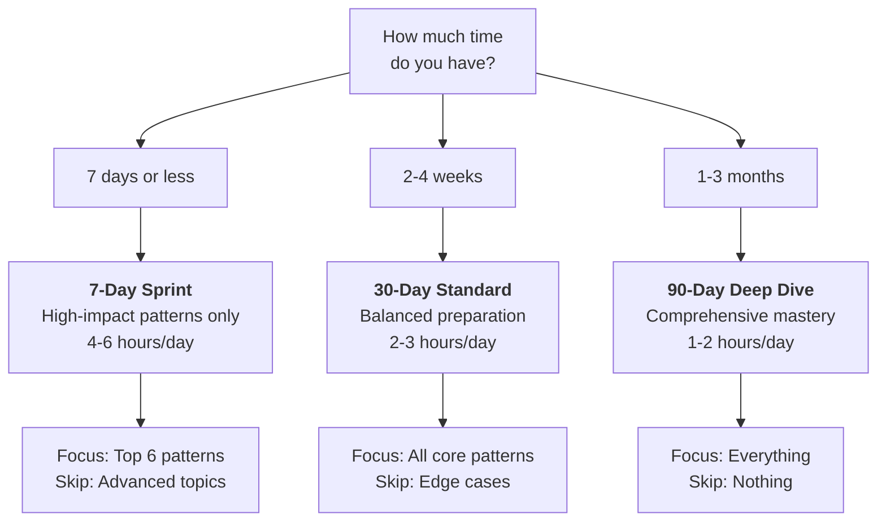

import { ConfidenceBuilder } from '@site/src/components/interview-guide';

# Study Roadmaps: Choose Your Timeline

**Time is the one resource you can't buy more of.**

Whether you have a week or three months, these roadmaps maximize your preparation ROI. Each plan is battle-tested by engineers who've landed offers at top companies.

---

## Choose Your Path

---

## Roadmap Comparison

| Aspect | 7-Day Sprint | 30-Day Standard | 90-Day Deep Dive |
|--------|--------------|-----------------|------------------|
| **Daily commitment** | 4-6 hours | 2-3 hours | 1-2 hours |
| **Total hours** | ~35 hours | ~75 hours | ~120 hours |
| **Patterns covered** | 6 core | 15 essential | 25+ comprehensive |
| **System design** | Skip | Fundamentals | Full depth |
| **Behavioral** | 3-5 stories | 8-10 stories | 15+ stories |
| **Best for** | Urgent interviews | Standard prep | Career changers |
| **Risk level** | High (gaps remain) | Medium | Low |

---

## The Three Roadmaps

### [7-Day Sprint](/docs/interview-guide/roadmaps/one-week-sprint)

**For:** Interview in a week or less

**Philosophy:** Focus ruthlessly on high-frequency patterns. Skip everything else.

**Daily breakdown:**
- Day 1-2: Arrays (Two Pointers, Sliding Window)
- Day 3-4: Trees & Graphs (BFS/DFS)
- Day 5: Binary Search + Dynamic Programming basics
- Day 6: Mock interviews + Behavioral prep
- Day 7: Review + Rest

**What you'll skip:** Advanced DP, Graph algorithms, System design depth

---

### [30-Day Standard](/docs/interview-guide/roadmaps/one-month-standard)

**For:** Typical interview timeline

**Philosophy:** Cover all essential patterns with enough depth to solve variations.

**Weekly breakdown:**
- Week 1: Data Structures + Array patterns
- Week 2: Trees, Graphs, Binary Search
- Week 3: Dynamic Programming + Advanced patterns
- Week 4: System Design + Behavioral + Mocks

**What you'll skip:** Edge cases, rare patterns, deep system design

---

### [90-Day Deep Dive](/docs/interview-guide/roadmaps/three-month-deep-dive)

**For:** Career changers, targeting senior roles, or maximizing success rate

**Philosophy:** Comprehensive coverage with deliberate practice and spaced repetition.

**Monthly breakdown:**
- Month 1: Foundations (Data Structures, Core Patterns)
- Month 2: Advanced (DP, Graphs, System Design)
- Month 3: Mastery (Mocks, Behavioral, Company-specific)

**What you'll skip:** Nothing. This is the complete preparation.

---

## Which Roadmap Should I Choose?

### Choose 7-Day Sprint if:
- Interview is in less than 2 weeks
- You have strong fundamentals but need refresher
- You can dedicate 4-6 hours daily
- You're okay with some risk of unfamiliar problems

### Choose 30-Day Standard if:
- Interview is in 2-6 weeks
- You want balanced preparation
- You have 2-3 hours daily
- You want good coverage with manageable effort

### Choose 90-Day Deep Dive if:
- Interview is 6+ weeks away
- You're changing careers or returning after a break
- You're targeting senior/staff roles
- You want to maximize your success rate

---

## Universal Principles (All Roadmaps)

### 1. Active Practice Over Passive Reading
Don't just read solutions. Solve problems yourself first. Struggle is learning.

### 2. Explain Out Loud
Practice explaining your thought process. Interviews test communication, not just code.

### 3. Time Yourself
Most interviews are 45 minutes. Practice under time pressure.

### 4. Review Mistakes
Keep a log of problems you got wrong. Review them weekly.

### 5. Mock Interviews
Nothing prepares you for interviews like interviews. Do at least 2-3 mocks.

---

## Adapting the Roadmaps

### Already strong in some areas?
Skip those sections and allocate time to weak areas.

### Targeting a specific company?
Add company-specific preparation in the final week:
- [Amazon](/docs/interview-guide/company-guides/amazon) — Add LP deep dive
- [Google](/docs/interview-guide/company-guides/google) — Add more algorithm practice
- [Meta](/docs/interview-guide/company-guides/meta) — Add practical problem practice

### Senior/Staff role?
Shift time toward:
- System design (50% of prep time)
- Leadership behavioral (more depth)
- Architecture discussions

---

## Getting Started

  

    

      

        <h3>7-Day Sprint</h3>
      

      

        
Maximum impact in minimum time. For urgent interviews.

      

      

        <a className="button button--primary button--block" href="/docs/interview-guide/roadmaps/one-week-sprint">Start Sprint →</a>
      

    

  

  

    

      

        <h3>30-Day Standard</h3>
      

      

        
Balanced prep for typical timelines. Most popular choice.

      

      

        <a className="button button--primary button--block" href="/docs/interview-guide/roadmaps/one-month-standard">Start Standard →</a>
      

    

  

  

    

      

        <h3>90-Day Deep Dive</h3>
      

      

        
Comprehensive mastery. Leave nothing to chance.

      

      

        <a className="button button--primary button--block" href="/docs/interview-guide/roadmaps/three-month-deep-dive">Start Deep Dive →</a>
      

    

  

---

<ConfidenceBuilder type="youve-got-this">

**Consistency beats intensity.**

It's better to study 2 hours daily for 30 days than 12 hours daily for 5 days. Your brain needs time to consolidate learning. Trust the process.

</ConfidenceBuilder>
