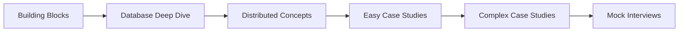

# System Design: Where Senior Roles Are Won

In my first senior engineer interview at Google, I spent 45 minutes whiteboarding a URL shortener. I knew all the algorithms. I could code it in my sleep.

I didn't get the offer.

The feedback: "Strong coding, but struggled to think about scale, reliability, and trade-offs."

**System design isn't about knowing the right answer. It's about demonstrating how you think about complex problems.**

---

## What Interviewers Actually Evaluate

| Skill | What They Look For |
|-------|-------------------|
| **Requirements gathering** | Do you ask clarifying questions? |
| **High-level design** | Can you break down a complex system? |
| **Trade-off discussions** | Do you understand pros and cons? |
| **Scalability thinking** | Can you handle 10x, 100x growth? |
| **Technical depth** | Do you understand how components work? |
| **Communication** | Can you explain clearly? |

**The interview is a conversation, not a test.**

---

## What You'll Learn

### Building Blocks

The components that make up distributed systems:

- Load balancers and reverse proxies
- Caching strategies (Redis, Memcached)
- Message queues (Kafka, RabbitMQ)
- CDNs and blob storage
- API gateways

### Databases

How to choose and use databases:

- SQL vs NoSQL decision framework
- Sharding and replication strategies
- 14 database types and when to use each
- CAP theorem in practice

### Distributed Concepts

The theory behind scalable systems:

- Consistency patterns (strong, eventual, causal)
- Consensus algorithms (Raft, Paxos)
- Distributed transactions (2PC, Saga)
- Consistent hashing

### Case Studies

Real system designs:

- URL shortener (starter problem)
- Twitter, Instagram, Facebook
- WhatsApp, Slack, Discord
- Netflix, YouTube, Twitch
- Uber, Google Maps
- And 25+ more

---

## The Interview Framework

Every system design interview follows a similar structure:

```
┌─────────────────────────────────────────────────────────────┐
│  PHASE 1: REQUIREMENTS (5 minutes)                          │
│  - Clarify functional requirements                          │
│  - Identify non-functional requirements                     │
│  - Establish constraints and scale                          │
├─────────────────────────────────────────────────────────────┤
│  PHASE 2: ESTIMATION (5 minutes)                            │
│  - Calculate QPS, storage, bandwidth                        │
│  - Back-of-envelope math                                    │
├─────────────────────────────────────────────────────────────┤
│  PHASE 3: HIGH-LEVEL DESIGN (15 minutes)                    │
│  - Draw main components                                     │
│  - Show data flow                                           │
│  - Identify APIs                                            │
├─────────────────────────────────────────────────────────────┤
│  PHASE 4: DEEP DIVE (15 minutes)                            │
│  - Discuss specific components                              │
│  - Handle edge cases                                        │
│  - Address bottlenecks                                      │
├─────────────────────────────────────────────────────────────┤
│  PHASE 5: WRAP UP (5 minutes)                               │
│  - Summarize trade-offs                                     │
│  - Discuss improvements                                     │
│  - Answer questions                                         │
└─────────────────────────────────────────────────────────────┘
```

---

## Common Mistakes

### 1. Diving Into Details Too Fast

**Wrong:** "Let me start with the database schema..."

**Right:** "Before diving in, let me clarify the requirements..."

### 2. Not Discussing Trade-offs

**Wrong:** "We'll use MongoDB."

**Right:** "We could use SQL for strong consistency or NoSQL for better horizontal scaling. Given our read-heavy workload, I'd lean toward..."

### 3. Ignoring Scale

**Wrong:** Design works for 1000 users

**Right:** "At 1M DAU, we'll need to consider caching, CDN, and database sharding..."

### 4. Monologue Instead of Conversation

**Wrong:** Talking for 30 minutes straight

**Right:** "Does this approach make sense? Should I dive deeper into any component?"

---

## Preparation Strategy

### 1. Learn the Building Blocks

You can't design systems without understanding the components. Start here:

- How load balancers work
- Caching strategies and invalidation
- Database types and trade-offs
- Message queue patterns

### 2. Study Case Studies

Learn 10-15 common system designs:

- **Start with:** URL shortener, paste bin, rate limiter
- **Then:** Twitter, Instagram, chat systems
- **Advanced:** YouTube, Uber, distributed cache

### 3. Practice the Framework

For each case study:

1. Define requirements
2. Do capacity estimation
3. Design high-level architecture
4. Deep dive on 2-3 components
5. Discuss trade-offs

### 4. Mock Interviews

Practice with a timer. System design is as much about time management as technical knowledge.

---

## Recommended Order



---

## What's Next?

Learn the framework for approaching any system design problem:

👉 [Interview Framework →](./interview-framework)
