---
# Required
sidebar_position: 5
title: "Alerting Best Practices — Reduce Alert Fatigue"
description: >-
  Design alerts that wake you up for the right reasons. Learn SLO-based alerting, 
  reduce alert fatigue, and build effective on-call practices with runbooks.

# SEO
keywords:
  - alerting
  - monitoring
  - on-call
  - pagerduty
  - alert fatigue
  - SLO
  - runbooks
  - incident response
  - burn rate alerting

# Social sharing
og_title: "Alerting Best Practices: Get Woken Up for the Right Reasons"
og_description: "Bad alerting trains your team to ignore alerts. Learn how to fix that."
og_image: "/img/observability-fundamentals.svg"

# Content management
date_published: 2025-01-22
date_modified: 2025-01-24
author: shivam
reading_time: 22
content_type: explanation
---

# Alerting Best Practices: The Art of Getting Woken Up for the Right Reasons

Here's a scenario that's probably too familiar.

It's 3 AM. Your phone buzzes. Then buzzes again. And again. You drag yourself awake, squint at the screen, and see seventeen alerts from your monitoring system. Your heart races as you scramble to find your laptop.

Fifteen minutes later, you've determined that fourteen of those alerts were noise—a brief CPU spike on a non-critical service, a single failed health check that immediately recovered, log volume slightly above a threshold that was set arbitrarily two years ago.

The other three alerts? They were all symptoms of the same root cause: a database failover that resolved itself in 90 seconds, exactly as designed.

You're now wide awake with adrenaline coursing through your veins. Sleep isn't coming back. And tomorrow's important meeting? That's going to be rough.

**This is alert fatigue, and it's killing your team.**

Bad alerting doesn't just ruin sleep—it trains your team to ignore alerts. When every page is noise, real incidents get lost in the chaos. The goal isn't to alert on everything that *could* be wrong. It's to alert on things that *require human action*.

---

## What Makes a Good Alert?

Let me share the mental framework that transformed how I think about alerting.

:::tip The Golden Rule of Alerting
A good alert has exactly one purpose: **to notify a human that their intervention is required to prevent or mitigate customer impact.**
:::

That's it. Not "something interesting happened." Not "a metric crossed a threshold." Not "this might become a problem someday." Those are observations, not alerts.

### The Alert Quality Checklist

Before creating any alert, ask these questions:

| Question | If No... |
|----------|----------|
| Does this require immediate human action? | Don't page; maybe log it |
| Is the impact clear and significant? | Reconsider the threshold |
| Can the responder actually do something? | Add automation or remove alert |
| Is this actionable right now, not "maybe later"? | Make it a ticket, not a page |
| Would I be okay being woken up for this? | Be honest with yourself |

If you can't answer "yes" to all of these, you don't have an alert—you have noise.

---

## The Alerting Pyramid: Severity Levels Done Right

Not every problem needs to wake someone up. A well-designed alerting system has multiple tiers:

```mermaid
flowchart TB
    subgraph p1["🚨 PAGE (P1 - Critical)"]
        p1desc["Wake someone up<br/>Customer impact NOW<br/>Response: Minutes"]
    end
    
    subgraph p2["⚠️ TICKET (P2 - Warning)"]
        p2desc["Create work item<br/>Will cause impact soon<br/>Response: Hours"]
    end
    
    subgraph p3["📝 LOG (P3 - Informational)"]
        p3desc["Record for analysis<br/>Interesting, not urgent<br/>Response: Days/Never"]
    end
    
    subgraph p4["📊 DASHBOARD (Observation)"]
        p4desc["Visualize trends<br/>Context for humans<br/>Response: Proactive"]
    end
    
    p1 --> p2
    p2 --> p3
    p3 --> p4
```



### P1 - Page (Critical)

**When to use:** Active customer impact or imminent system failure.

**Examples:**
- Error rate > 5% for 5+ minutes
- Service completely unavailable
- Data corruption detected
- Security breach indicators

**Response expectation:** Human acknowledges within 5 minutes, mitigates within 30 minutes.

### P2 - Ticket (Warning)

**When to use:** Something is degraded or will become critical without intervention.

**Examples:**
- Disk space > 85% (not 95%—that's too late)
- Certificate expiring in 7 days
- Elevated latency (not SLO-violating yet)
- Dependency deprecation warnings

**Response expectation:** Addressed within business hours, same day or next day.

### P3 - Log/Dashboard (Informational)

**When to use:** Useful context, no action required.

**Examples:**
- Successful deployment completed
- Scheduled maintenance started
- Traffic patterns (high/low)
- Feature flag changes

**Response expectation:** Reviewed during normal operations, informs future decisions.

---

## Alerting on Symptoms vs. Causes

This is perhaps the most important concept in alerting philosophy.

**Alert on symptoms, not causes.**

### What's the Difference?

| Causes (Don't Alert) | Symptoms (Do Alert) |
|---------------------|---------------------|
| CPU at 90% | Requests timing out |
| Memory at 85% | Response latency > SLO |
| 1 of 3 replicas down | Error rate elevated |
| Database failover occurred | User-facing errors |
| Deployment in progress | Checkout failures |

### Why This Matters

**Scenario:** Your database fails over to a replica (a cause). During the 30-second failover, a few requests fail.

**If you alert on causes:**
- Alert: "Database primary unavailable"
- Alert: "Database failover initiated"  
- Alert: "Database replica promoted"
- Alert: "Connection pool reconnecting"

You get four alerts for a self-healing event that required zero human intervention.

**If you alert on symptoms:**
- Error rate briefly spikes but stays under SLO threshold
- No alert fires
- You see it in the morning dashboard review
- Life goes on

The cause-based approach wakes someone up for something that fixed itself. The symptom-based approach lets the automation do its job.

### The Exception: Leading Indicators

Some "causes" are worth ticketing (not paging) because they predict future symptoms:

```mermaid
flowchart LR
    subgraph indicators["📋 LEADING INDICATOR ALERTS"]
        direction TB
        i1["💾 Disk space > 80%"]
        i2["📜 Certificate expires in 14 days"]
        i3["📉 Error budget burn rate high"]
        i4["⚠️ Dependency end-of-life"]
    end
    
    subgraph outcomes["These create TICKETS, not pages"]
        direction TB
        o1["'We'll run out in ~3 days'"]
        o2["'Renew before it's critical'"]
        o3["'Slow down or miss SLO'"]
        o4["'Upgrade before security issues'"]
    end
    
    i1 --> o1
    i2 --> o2
    i3 --> o3
    i4 --> o4
    
    subgraph benefit["✅ Benefit"]
        b["Time to act BEFORE customer impact"]
    end
    
    outcomes --> benefit
```



---

## SLO-Based Alerting: The Modern Approach

The best alerting systems don't use arbitrary thresholds. They alert based on **Service Level Objectives (SLOs)**.

### Understanding SLOs and Error Budgets

An SLO is a target for your service's reliability:

```
"99.9% of requests should complete successfully within 200ms"
```

This gives you an **error budget**—the acceptable amount of failure:

```
SLO: 99.9% availability
Error budget: 0.1% = 43.2 minutes per month of downtime

If you've used 30 minutes this month, you have 13.2 minutes left.
If you're burning budget at 10x the sustainable rate, you'll exhaust it in ~4 days.
```

### Burn Rate Alerts

Instead of alerting on instantaneous errors, alert on how fast you're consuming your error budget:

**Error Budget**: 43.2 minutes/month (99.9% SLO)  
**Sustainable burn rate**: 1x (uses exactly the budget over 30 days)

```mermaid
flowchart TB
    subgraph critical["🚨 PAGE: Burn rate > 14x for 1 hour"]
        c1["Budget exhausted in ~2 days"]
        c2["Action: Investigate immediately"]
    end
    
    subgraph warning["🚨 PAGE: Burn rate > 6x for 6 hours"]
        w1["Budget exhausted in ~5 days"]
        w2["Action: Investigate within the hour"]
    end
    
    subgraph ticket["📋 TICKET: Burn rate > 3x for 24 hours"]
        t1["Budget exhausted in ~10 days"]
        t2["Action: Address during business hours"]
    end
    
    critical --> warning
    warning --> ticket
```



### Why Burn Rates Beat Thresholds

**Traditional threshold alert:**
```yaml
# Fires constantly during traffic spikes
alert: HighErrorRate
expr: error_rate > 1%
for: 5m
```

**Burn rate alert:**
```yaml
# Only fires when we're actually at risk
alert: ErrorBudgetBurn
expr: |
  (
    sum(rate(http_requests_total{status=~"5.."}[1h]))
    /
    sum(rate(http_requests_total[1h]))
  ) > (14 * 0.001)  # 14x the 0.1% error budget
for: 1h
```

The burn rate approach:
- Tolerates brief spikes (they happen; it's fine)
- Alerts when the *trend* threatens your SLO
- Aligns engineering priorities with business impact

---

## Alert Fatigue: The Silent Killer

Alert fatigue is what happens when your team gets so many alerts that they start ignoring them. It's insidious because it happens gradually.

### The Fatigue Spiral

```mermaid
flowchart TB
    A["😩 Too many alerts"] --> B["🙈 Team ignores 'noisy' alerts"]
    B --> C["📭 Real incidents get buried"]
    C --> D["🐢 Slow response to real problems"]
    D --> E["😤 Trust in alerting erodes"]
    E --> F["➕ Team adds MORE alerts to 'catch' problems"]
    F --> A
    F --> G["🔥 Repeat until burnout"]
```



### Measuring Alert Health

Track these metrics to understand your alerting hygiene:

| Metric | Target | What It Tells You |
|--------|--------|-------------------|
| **Alerts per week** | < 2 per on-call shift | Volume sustainability |
| **Actionable rate** | > 80% | Signal vs. noise ratio |
| **Time to acknowledge** | < 5 minutes | Alert routing effectiveness |
| **Time to resolve** | Varies by severity | Process efficiency |
| **Repeat alerts** | < 10% | Automation opportunities |
| **Alerts per incident** | 1-3 | Deduplication effectiveness |

### Fixing Alert Fatigue

**Step 1: Audit your alerts**

For every alert that fired in the last month:
- Did it require human action?
- Was the action taken immediately necessary?
- Could automation have handled it?
- Was it a duplicate of another alert?

**Step 2: Delete aggressively**

The hardest part of alerting is *removing* alerts. Every alert feels important when you add it. But if it's not actionable, it's not an alert—it's noise.

**Step 3: Consolidate**

Instead of five alerts for symptoms of the same problem, create one well-tuned alert for the customer-facing impact.

---

## Anatomy of a Good Alert

A good alert tells the responder everything they need to start investigating. Here's a template:

```yaml
# Good Alert Structure
alert: CheckoutErrorRateHigh
expr: |
  sum(rate(http_requests_total{service="checkout", status=~"5.."}[5m]))
  /
  sum(rate(http_requests_total{service="checkout"}[5m]))
  > 0.01
for: 5m
labels:
  severity: critical
  team: payments
  service: checkout
annotations:
  summary: "Checkout error rate is {{ $value | humanizePercentage }}"
  description: |
    The checkout service error rate has exceeded 1% for the past 5 minutes.
    Current rate: {{ $value | humanizePercentage }}
    
    This indicates customers are failing to complete purchases.
  impact: "Customers cannot complete checkout. Revenue impact: ~$X per minute."
  dashboard: "https://grafana.internal/d/checkout-overview"
  runbook: "https://wiki.internal/runbooks/checkout-errors"
  escalation: "If not resolved in 15 minutes, escalate to payments-oncall"
```

### Required Components

| Component | Purpose |
|-----------|---------|
| **Summary** | One-line description (shows in notification) |
| **Description** | What's happening and current values |
| **Impact** | Why this matters (business terms) |
| **Dashboard** | Link to relevant visualization |
| **Runbook** | Link to troubleshooting steps |
| **Escalation** | Who to involve if initial responder is stuck |

### What NOT to Include

- Implementation details ("the Kubernetes pod...")
- Historical context ("we've seen this before when...")
- Opinions ("this is probably caused by...")

Keep alerts factual. Let the runbook provide guidance.

---

## Runbooks: The Responder's Best Friend

A runbook is a documented procedure for responding to a specific alert. Good runbooks are the difference between a 5-minute resolution and a 2-hour fumble.

### Runbook Template

```markdown
# Runbook: Checkout Error Rate High

## Overview
This alert fires when checkout errors exceed 1% for 5+ minutes.

## Severity
**Critical** - Direct revenue impact

## Impact
Customers cannot complete purchases. Estimated revenue impact: $X per minute.

## Quick Diagnosis (< 2 minutes)

1. Check if this is a known incident: [Status Page](link)
2. Open the dashboard: [Checkout Overview](link)
3. Look at the error breakdown by type:
   - Payment gateway errors → Check Stripe status
   - Database errors → Check DB health
   - Timeout errors → Check upstream dependencies

## Common Causes and Fixes

### Payment Gateway Issues
**Symptoms:** Errors concentrated in payment processing spans
**Check:** [Stripe Status](https://status.stripe.com)
**If Stripe is down:**
1. Enable payment retry queue
2. Post to status page
3. Wait for Stripe recovery

### Database Connection Exhaustion
**Symptoms:** Connection timeout errors in logs
**Check:** `SELECT count(*) FROM pg_stat_activity;`
**Fix:**
1. Identify long-running queries: [Query Dashboard](link)
2. Kill blocking queries if safe: `SELECT pg_terminate_backend(pid);`
3. Scale connection pool if needed

### Upstream Dependency Failure
**Symptoms:** Timeout errors, specific service in trace
**Check:** [Dependency Status Dashboard](link)
**Fix:**
1. Identify failing dependency from traces
2. Check if circuit breaker should be engaged
3. Escalate to owning team

## Escalation
If not resolved within 15 minutes:
- Page: payments-oncall-escalation
- Slack: #payments-incidents

## Post-Incident
- [ ] Create incident ticket
- [ ] Update this runbook if new failure mode discovered
```

### Runbook Best Practices

1. **Keep them current** — Review after every incident
2. **Include copy-paste commands** — Reduce cognitive load at 3 AM
3. **Link to dashboards** — Don't make responders search
4. **Version control them** — Runbooks are code
5. **Test them** — New team members should be able to follow them

---

## Setting Up Alerting: A Practical Guide

Let me walk through setting up alerting with common tools.

### Prometheus + Alertmanager

**Alerting rules (prometheus/alerts.yml):**

```yaml
groups:
  - name: service-health
    rules:
      # High error rate - PAGE
      - alert: HighErrorRate
        expr: |
          sum(rate(http_requests_total{status=~"5.."}[5m])) by (service)
          /
          sum(rate(http_requests_total[5m])) by (service)
          > 0.01
        for: 5m
        labels:
          severity: critical
        annotations:
          summary: "High error rate on {{ $labels.service }}"
          description: "Error rate is {{ $value | humanizePercentage }}"
          runbook: "https://wiki.internal/runbooks/high-error-rate"

      # Elevated latency - PAGE
      - alert: HighLatency
        expr: |
          histogram_quantile(0.99, 
            sum(rate(http_request_duration_seconds_bucket[5m])) by (service, le)
          ) > 2
        for: 5m
        labels:
          severity: critical
        annotations:
          summary: "P99 latency high on {{ $labels.service }}"
          description: "P99 latency is {{ $value | humanizeDuration }}"

      # Service down - PAGE
      - alert: ServiceDown
        expr: up == 0
        for: 2m
        labels:
          severity: critical
        annotations:
          summary: "{{ $labels.job }} is down"
          description: "The service has been unreachable for 2+ minutes"

  - name: capacity
    rules:
      # Disk space - TICKET (warning, not page)
      - alert: DiskSpaceWarning
        expr: |
          (node_filesystem_avail_bytes / node_filesystem_size_bytes) < 0.15
        for: 10m
        labels:
          severity: warning
        annotations:
          summary: "Disk space low on {{ $labels.instance }}"
          description: "Only {{ $value | humanizePercentage }} remaining"

      # Certificate expiry - TICKET
      - alert: CertificateExpiringSoon
        expr: |
          (probe_ssl_earliest_cert_expiry - time()) / 86400 < 14
        for: 1h
        labels:
          severity: warning
        annotations:
          summary: "Certificate expiring in {{ $value }} days"
          description: "Certificate for {{ $labels.instance }} needs renewal"
```

**Alertmanager configuration (alertmanager.yml):**

```yaml
global:
  resolve_timeout: 5m
  slack_api_url: 'https://hooks.slack.com/services/xxx/yyy/zzz'

route:
  receiver: 'default'
  group_by: ['alertname', 'service']
  group_wait: 30s
  group_interval: 5m
  repeat_interval: 4h
  
  routes:
    # Critical alerts go to PagerDuty
    - match:
        severity: critical
      receiver: 'pagerduty-critical'
      continue: true  # Also send to Slack
    
    # Warnings go to Slack only
    - match:
        severity: warning
      receiver: 'slack-warnings'
    
    # Team-specific routing
    - match:
        team: payments
      receiver: 'payments-team'

receivers:
  - name: 'default'
    slack_configs:
      - channel: '#alerts'
        title: '{{ .Status | toUpper }}: {{ .CommonLabels.alertname }}'
        text: '{{ .CommonAnnotations.description }}'

  - name: 'pagerduty-critical'
    pagerduty_configs:
      - service_key: '<your-pagerduty-key>'
        severity: critical
        description: '{{ .CommonAnnotations.summary }}'
        details:
          firing: '{{ .Alerts.Firing | len }}'
          resolved: '{{ .Alerts.Resolved | len }}'
          runbook: '{{ .CommonAnnotations.runbook }}'

  - name: 'slack-warnings'
    slack_configs:
      - channel: '#alerts-warnings'
        title: 'Warning: {{ .CommonLabels.alertname }}'
        text: '{{ .CommonAnnotations.description }}'

  - name: 'payments-team'
    slack_configs:
      - channel: '#payments-alerts'
    pagerduty_configs:
      - service_key: '<payments-team-key>'

# Inhibit rules - suppress alerts when related critical alert is firing
inhibit_rules:
  # Don't page for individual pods when the service is down
  - source_match:
      alertname: ServiceDown
    target_match_re:
      alertname: 'Pod.*'
    equal: ['service']
```

### Grafana Alerting

For teams using Grafana, you can define alerts directly on dashboard panels:

```yaml
# Grafana alert rule (via provisioning)
apiVersion: 1
groups:
  - orgId: 1
    name: Service Health
    folder: Alerts
    interval: 1m
    rules:
      - uid: high-error-rate
        title: High Error Rate
        condition: C
        data:
          - refId: A
            datasourceUid: prometheus
            model:
              expr: |
                sum(rate(http_requests_total{status=~"5.."}[5m])) by (service)
                /
                sum(rate(http_requests_total[5m])) by (service)
          - refId: B
            datasourceUid: __expr__
            model:
              type: reduce
              reducer: last
          - refId: C
            datasourceUid: __expr__
            model:
              type: threshold
              conditions:
                - evaluator:
                    type: gt
                    params: [0.01]
        for: 5m
        labels:
          severity: critical
        annotations:
          summary: "High error rate detected"
          runbook_url: "https://wiki.internal/runbooks/high-error-rate"
```

---

## Alert Routing and Escalation

Getting alerts to the right people at the right time is as important as the alerts themselves.

### Routing Strategy

```mermaid
flowchart TB
    alert["🔔 Alert Fires"] --> severity
    
    subgraph severity["Route by Severity"]
        direction LR
        critical["🚨 Critical"] --> pd["PagerDuty + Slack #incidents"]
        warning["⚠️ Warning"] --> slack["Slack #alerts-warnings + Ticket"]
        info["ℹ️ Info"] --> slackinfo["Slack #alerts-info"]
    end
    
    alert --> team
    
    subgraph team["Route by Team/Service"]
        direction LR
        payments["service=payments"] --> payoncall["payments-oncall"]
        auth["service=auth"] --> platoncall["platform-oncall"]
        default["default"] --> infraoncall["infra-oncall"]
    end
    
    alert --> escalation
    
    subgraph escalation["Escalation Path"]
        e0["⏱️ 0 min → Primary on-call"]
        e10["⏱️ 10 min → Secondary on-call"]
        e20["⏱️ 20 min → Engineering Manager"]
        e30["⏱️ 30 min → VP Engineering"]
        e0 --> e10 --> e20 --> e30
    end
```



### On-Call Best Practices

| Practice | Why It Matters |
|----------|---------------|
| **Rotate weekly** | Prevents burnout, spreads knowledge |
| **Shadow period** | New on-call learns from experienced |
| **Business hours handoff** | Brief outgoing on current state |
| **Compensate appropriately** | On-call is work; treat it that way |
| **Post-incident reviews** | Learn and improve from every incident |
| **Protected recovery time** | Day off after rough on-call shifts |

---

## Anti-Patterns to Avoid

### ❌ The Kitchen Sink

```yaml
# BAD: Alerts on every imaginable thing
alert: CPUHigh
expr: cpu_usage > 80%
# This fires constantly and means nothing without context
```

### ❌ The Hair Trigger

```yaml
# BAD: No time buffer
alert: ErrorDetected  
expr: http_errors_total > 0
for: 0s
# Single error = page. You'll get dozens of false alarms.
```

### ❌ The Vague Alert

```yaml
# BAD: No context
annotations:
  summary: "Something is wrong"
  description: "Check the system"
# Responder has no idea where to start
```

### ❌ The Duplicate Alert

```yaml
# BAD: Multiple alerts for the same problem
- alert: DatabaseConnectionsHigh
- alert: DatabasePoolExhausted  
- alert: DatabaseQueriesSlow
- alert: DatabaseTimeouts
# One underlying issue creates four pages
```

### ❌ The Forever Alert

```yaml
# BAD: Never resolved
alert: TechDebtExists
expr: codebase_age_days > 365
# This will fire forever. It's not an alert; it's a fact of life.
```

---

## Key Takeaways

1. **Alert on symptoms, not causes** — Users care about impact, not infrastructure

2. **Every alert must be actionable** — If there's nothing to do, it's not an alert

3. **Use SLO-based alerting** — Burn rates beat arbitrary thresholds

4. **Runbooks are mandatory** — No alert without a runbook

5. **Measure alert quality** — Track actionable rate and fatigue metrics

6. **Delete aggressively** — Fewer, better alerts beat comprehensive noise

7. **Route intelligently** — Right alert, right person, right urgency

8. **Protect your team** — On-call is hard; design systems that respect humans

---

## Correlation with Other Observability Pillars

Alerting is most powerful when integrated with the rest of your observability stack:

```mermaid
flowchart TB
    subgraph metrics["📊 METRICS"]
        m1["Alert fires on threshold/trend"]
        m2["Includes link to dashboard"]
    end
    
    subgraph logs["📝 LOGS"]
        l1["Filter by time window & service"]
        l2["Find error messages & context"]
        l3["Includes trace_id for correlation"]
    end
    
    subgraph traces["🔍 TRACES"]
        t1["Examine specific failing requests"]
        t2["Identify exact operation & root cause"]
    end
    
    metrics --> logs
    logs --> traces
```



See also:
- [Metrics That Matter →](./metrics) — What to measure
- [Logging Done Right →](./logging) — Correlating logs with alerts
- [Distributed Tracing →](./tracing) — Investigating from alerts
- [Single-Node Setup →](./single-node-setup) — 30+ pre-configured alerting rules included

---

## Frequently Asked Questions

### How many alerts should we have?

**As few as possible while covering critical user impact.** A good rule of thumb:

- **Per service**: 3-5 alerts maximum (error rate, latency, availability)
- **Infrastructure**: 5-10 alerts (disk, memory, network, certificates)
- **Business-critical paths**: 1-2 alerts per critical flow (checkout, login, payment)

If you have more than 50 total alerts, you probably have too many. Audit and consolidate.

### Should I alert on every error?

**No.** Errors are expected in production. Alert on **error rate trends**, not individual errors:

```yaml
# Bad: Alerts on any error
alert: AnyError
expr: errors_total > 0

# Good: Alerts on elevated error rate
alert: HighErrorRate  
expr: rate(errors_total[5m]) / rate(requests_total[5m]) > 0.01
for: 5m
```

Single errors might be user mistakes, network blips, or edge cases. Sustained elevated error rates indicate real problems.

### What's the difference between warnings and critical alerts?

| Severity | User Impact | Response Time | Example |
|----------|-------------|---------------|---------|
| **Critical** | Active impact NOW | Minutes | Error rate > 5%, service down |
| **Warning** | Will cause impact SOON | Hours | Disk 85%, cert expires in 7 days |
| **Info** | No impact | Days/Never | Deployment completed |

**Critical** pages someone immediately. **Warning** creates a ticket. **Info** goes to a Slack channel.

### How do I reduce alert fatigue?

1. **Audit existing alerts**: For each alert in the last month, ask "Did this require action?"
2. **Delete aggressively**: If an alert wasn't actionable, delete it
3. **Consolidate**: Five alerts for symptoms of one problem → one alert for the user impact
4. **Increase thresholds**: If alert fires but action isn't needed, the threshold is too low
5. **Add time requirements**: `for: 5m` prevents alerting on brief spikes

Track **actionable rate** (alerts that required human action / total alerts). Target > 80%.

### What should every alert include?

Every alert needs these components:

- **Summary**: What's wrong (one line, shown in notification)
- **Impact**: Why it matters (in business terms)
- **Dashboard link**: Where to see more data
- **Runbook link**: How to investigate and fix
- **Escalation path**: Who to involve if not resolved

Without these, responders waste time figuring out what to do instead of fixing the problem.

### How long should I wait before paging?

Use the `for` duration to prevent noise from brief spikes:

| Alert Type | Recommended `for` | Reasoning |
|------------|-------------------|-----------|
| Service down | 1-2 minutes | Fast detection, some flap tolerance |
| Error rate | 5 minutes | Filters deployment blips |
| Latency | 5 minutes | Smooths out brief spikes |
| Saturation | 10-15 minutes | Trend matters more than instant |

The goal is balancing speed of detection with noise reduction.

---

**Next**: [Logging Done Right →](./logging)
