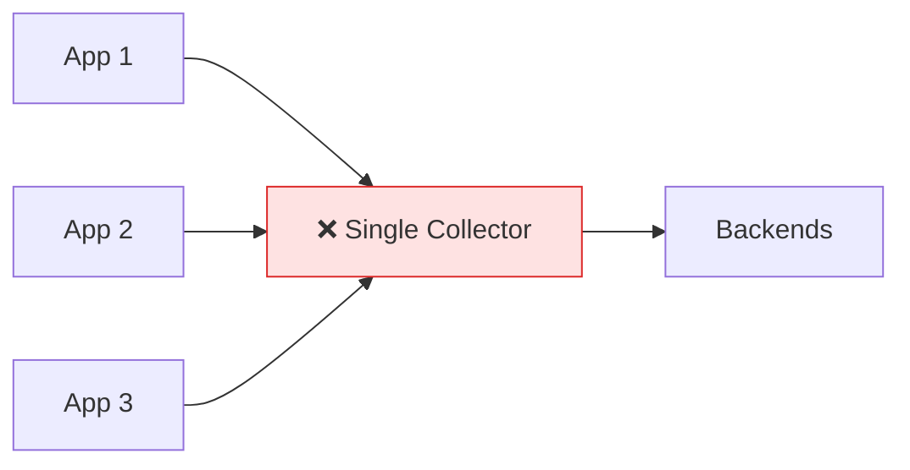
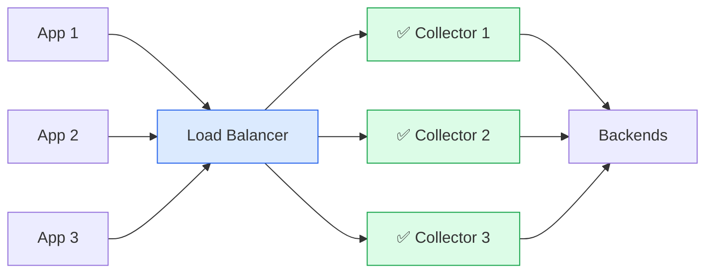

---
# Required
sidebar_position: 12
title: "Observability Anti-Patterns — What NOT to Do"
description: >-
  Learn from common observability mistakes before you make them. These anti-patterns 
  cause alert fatigue, exploding costs, and debugging nightmares.

# SEO
keywords:
  - observability anti-patterns
  - monitoring mistakes
  - alert fatigue
  - cardinality explosion
  - logging mistakes
  - tracing pitfalls

# Social sharing
og_title: "Observability Anti-Patterns: Learn What NOT to Do"
og_description: "These patterns look reasonable but cause production pain. Learn to recognize and avoid them."
og_image: "/img/observability-fundamentals.svg"

# Content management
date_published: 2025-01-24
date_modified: 2025-01-24
author: shivam
reading_time: 12
content_type: reference
---

# Observability Anti-Patterns

These patterns look reasonable when you implement them. They cause pain months later when you're debugging at 3 AM, drowning in alerts, or explaining a $50,000 observability bill. **Learn to recognize them before you ship them.**

---

## Alerting Anti-Patterns

### The Kitchen Sink

**Pattern**: Alert on every metric that *could* indicate a problem.

```yaml
# The result: 200 alerts, 95% noise
- alert: CPUHigh
  expr: cpu_usage > 80%
- alert: MemoryHigh
  expr: memory_usage > 80%
- alert: DiskIOHigh
  expr: disk_io > 1000
- alert: NetworkPacketsHigh
  expr: network_packets > 10000
# ... 196 more alerts
```

**Why it hurts**: Alert fatigue. Your team learns to ignore pages because most are noise. When the real incident happens, it's lost in the flood.

**Fix**: Alert on **symptoms** (user impact), not **causes** (resource usage). "Error rate > 1%" beats "CPU > 80%".

---

### The Hair Trigger

**Pattern**: Alert immediately on any anomaly.

```yaml
- alert: AnyError
  expr: errors_total > 0
  for: 0s  # Instant alert!
```

**Why it hurts**: Brief spikes (deploys, garbage collection, network blips) trigger pages constantly.

**Fix**: Add `for` duration to require sustained conditions:

```yaml
- alert: ElevatedErrorRate
  expr: rate(errors_total[5m]) / rate(requests_total[5m]) > 0.01
  for: 5m  # Must persist for 5 minutes
```

---

### The Vague Alert

**Pattern**: Alert title and description provide no actionable information.

```yaml
annotations:
  summary: "Something is wrong"
  description: "Check the system"
```

**Why it hurts**: Responder wastes 10 minutes figuring out what to check before they can even start fixing.

**Fix**: Include specific context:

```yaml
annotations:
  summary: "Checkout error rate {{ $value | humanizePercentage }} exceeds 1%"
  description: "The checkout service has elevated errors. Check payment-service downstream."
  dashboard: "https://grafana.internal/d/checkout"
  runbook: "https://wiki/runbooks/checkout-errors"
```

---

### The Duplicate Storm

**Pattern**: Multiple alerts fire for symptoms of the same root cause.

```yaml
- alert: DatabaseSlow
- alert: DatabaseConnectionsExhausted
- alert: DatabaseTimeouts
- alert: QueryLatencyHigh
- alert: ApplicationErrors
```

**Why it hurts**: One database issue creates five pages. The responder is overwhelmed and can't identify the root cause.

**Fix**: Use inhibition rules to suppress symptom alerts when the cause is already alerting:

```yaml
inhibit_rules:
  - source_match:
      alertname: DatabaseConnectionsExhausted
    target_match:
      alertname: QueryLatencyHigh
    equal: ['service']
```

---

## Metrics Anti-Patterns

### The Cardinality Bomb

**Pattern**: Add unbounded values as metric labels.

```go
// Looks helpful at first...
httpRequests.WithLabelValues(
    method,
    endpoint,
    userID,      // Millions of users
    requestID,   // Unique per request
).Inc()
```

**Why it hurts**: Each unique label combination creates a new time series. Millions of users × thousands of endpoints = billions of time series = dead metrics system.

**Fix**: Keep labels bounded. Move high-cardinality data to traces and logs:

```go
// Metric: bounded labels only
httpRequests.WithLabelValues(method, endpoint, statusCode).Inc()

// Trace: high-cardinality context
span.SetAttributes(
    attribute.String("user.id", userID),
    attribute.String("request.id", requestID),
)
```

---

### The Average Lie

**Pattern**: Only track averages for latency.

```promql
# "Our average latency is 50ms, we're fine!"
avg(http_request_duration_seconds)
```

**Why it hurts**: Averages hide outliers. If 99 requests take 10ms and 1 takes 10 seconds, average is 109ms—representing neither the typical experience nor the disaster.

**Fix**: Use histograms and track percentiles:

```promql
histogram_quantile(0.99, rate(http_request_duration_seconds_bucket[5m]))
# "1% of requests take > 2 seconds" — now you see the problem
```

---

### The Dashboard Wall

**Pattern**: Create dashboards with 30+ panels showing every metric.

**Why it hurts**: Nobody can find relevant information during an incident. Decision paralysis.

**Fix**: Three-tier dashboards:
1. **Overview**: 4-6 panels with golden signals
2. **Service**: RED metrics per service
3. **Deep dive**: Detailed breakdowns, only when needed

---

## Logging Anti-Patterns

### The Printf Debugger

**Pattern**: Unstructured log messages with string interpolation.

```python
logger.info(f"Processing order {order_id} for user {user_id} total ${total}")
```

**Why it hurts**: Can't query by `order_id` or filter by `total > 1000`. Parsing requires regex.

**Fix**: Structured logging with typed fields:

```python
logger.info("Processing order", extra={
    "order_id": order_id,
    "user_id": user_id,
    "total_cents": int(total * 100),
    "trace_id": span.get_span_context().trace_id,
})
```

---

### The Log Everything Approach

**Pattern**: Log at DEBUG level for everything, leave it on in production.

```python
logger.debug(f"Entering function {func_name}")
logger.debug(f"Variable x = {x}")
logger.debug(f"Loop iteration {i}")
logger.debug(f"Exiting function {func_name}")
```

**Why it hurts**: 
- Storage costs explode (10-100x more data)
- Finding relevant logs requires wading through noise
- Performance impact from I/O

**Fix**: Use appropriate log levels:
- **ERROR**: Failures requiring attention
- **WARN**: Degraded conditions
- **INFO**: Business events
- **DEBUG**: Only enable temporarily for specific issues

---

### The Secrets Logger

**Pattern**: Logging sensitive data without thinking.

```python
logger.info(f"Payment processed", extra={
    "card_number": card_number,  # PCI violation!
    "password": password,         # Security nightmare!
    "ssn": ssn,                   # GDPR/compliance fail!
})
```

**Why it hurts**: Compliance violations, security breaches, and your logs becoming a liability.

**Fix**: Create an allowlist of safe fields. Mask or exclude everything else:

```python
SAFE_FIELDS = {"user_id", "order_id", "amount_cents", "region"}

def safe_log(data):
    return {k: v for k, v in data.items() if k in SAFE_FIELDS}
```

---

### The Missing Trace ID

**Pattern**: Logs without trace correlation.

```json
{"message": "Payment failed", "error": "timeout"}
{"message": "Payment failed", "error": "timeout"}
{"message": "Payment failed", "error": "timeout"}
```

**Why it hurts**: Which trace do these belong to? Are they three different requests or retries of one? No way to know.

**Fix**: Always include `trace_id` and `span_id`:

```json
{"message": "Payment failed", "error": "timeout", "trace_id": "abc123", "span_id": "def456", "attempt": 1}
{"message": "Payment failed", "error": "timeout", "trace_id": "abc123", "span_id": "ghi789", "attempt": 2}
{"message": "Payment failed", "error": "timeout", "trace_id": "xyz999", "span_id": "jkl012", "attempt": 1}
```

Now you can see: two retries on one request, one separate failure.

---

## Tracing Anti-Patterns

### The Broken Chain

**Pattern**: Some services don't propagate trace context.

```
                API Gateway → Auth Service → Order Service → Payment Service
Trace context:     ✓              ✓              ✗              ✗
```

**Why it hurts**: Traces break at Order Service. You can't follow requests to Payment Service—the part that usually fails.

**Fix**: Every service must:
1. Extract trace context from incoming requests
2. Inject trace context into outgoing requests

Verify with end-to-end tests.

---

### The Span Explosion

**Pattern**: Create a span for every trivial operation.

```go
for i, item := range items {
    _, span := tracer.Start(ctx, "process-item")
    process(item)
    span.End()
}
```

With 10,000 items, you get 10,000 spans per request.

**Why it hurts**: Storage costs explode. Trace viewers become unusable. Performance degrades.

**Fix**: One span for the batch, events for details:

```go
ctx, span := tracer.Start(ctx, "process-items")
span.SetAttributes(attribute.Int("items.count", len(items)))
for i, item := range items {
    process(item)
    span.AddEvent("item-processed", trace.WithAttributes(
        attribute.Int("index", i),
    ))
}
span.End()
```

---

### The Attribute Hoarder

**Pattern**: Attach entire request/response bodies to spans.

```go
span.SetAttributes(
    attribute.String("request.body", string(requestJSON)),   // 50KB
    attribute.String("response.body", string(responseJSON)), // 100KB
)
```

**Why it hurts**: 
- Each span becomes huge (150KB vs typical 1KB)
- Storage costs 100x higher
- Network overhead on export
- Query performance tanks

**Fix**: Log specific fields, not entire payloads:

```go
span.SetAttributes(
    attribute.Int("request.body_bytes", len(requestJSON)),
    attribute.String("request.content_type", contentType),
    attribute.Int("response.body_bytes", len(responseJSON)),
    attribute.Int("response.status_code", statusCode),
)
```

---

## Infrastructure Anti-Patterns

### The Single Collector

**Pattern**: All applications send telemetry to one collector instance.



**Why it hurts**: Single point of failure. When the collector restarts or crashes, all telemetry is lost.

**Fix**: Multiple collectors behind a load balancer:



---

### The Unbounded Queue

**Pattern**: No limits on collector queue size or memory.

**Why it hurts**: If backends slow down, queues grow until the collector OOMs and crashes, losing all queued data.

**Fix**: Configure memory limits and queue bounds:

```yaml
processors:
  memory_limiter:
    check_interval: 1s
    limit_mib: 1500
    spike_limit_mib: 500

exporters:
  otlp:
    sending_queue:
      enabled: true
      queue_size: 5000  # Bounded!
```

---

### The Missing Retention Policy

**Pattern**: Keep all telemetry data forever.

**Why it hurts**: Storage grows without bound. Costs climb monthly. Queries slow as data accumulates.

**Fix**: Set retention based on value:
- **Metrics**: 30-90 days (trends matter)
- **Traces**: 7-30 days (debugging recent issues)
- **Logs**: 7-30 days (compliance may require more)

---

## Quick Reference: Spotting Anti-Patterns

| Symptom | Likely Anti-Pattern | Fix |
|---------|-------------------|-----|
| Alert fatigue | Kitchen Sink, Hair Trigger | Fewer alerts, longer `for` duration |
| Metrics OOM | Cardinality Bomb | Remove unbounded labels |
| Can't find logs | Printf Debugger | Structured logging |
| Huge storage bill | Span Explosion, Attribute Hoarder | Sample, reduce payload |
| Broken traces | Broken Chain | Verify propagation E2E |
| Slow queries | Dashboard Wall, Missing Retention | Curate dashboards, set retention |

---

## Related Guides

- [Alerting Best Practices →](./alerting) — How to alert correctly
- [Metrics That Matter →](./metrics) — Cardinality management
- [Logging Done Right →](./logging) — Structured logging patterns
- [Distributed Tracing →](./tracing) — Context propagation

---

**Previous**: [← Debugging Walkthrough](./debugging-walkthrough)
