---
# Required
sidebar_position: 13
title: "Observability Cost Optimization — Get Value Without Breaking the Bank"
description: >-
  Control observability costs without sacrificing visibility. Learn sampling 
  strategies, retention policies, and architecture patterns that cut costs 80%.

# SEO
keywords:
  - observability costs
  - telemetry cost optimization
  - sampling strategies
  - data retention
  - prometheus costs
  - datadog pricing
  - observability budget

# Social sharing
og_title: "Observability Cost Optimization: Cut Costs 80%"
og_description: "Strategies to reduce observability costs without losing visibility when it matters."
og_image: "/img/observability-fundamentals.svg"

# Content management
date_published: 2025-01-24
date_modified: 2025-01-24
author: shivam
reading_time: 14
content_type: how-to
---

# Observability Cost Optimization

A startup I advised went from $200/month to $47,000/month in observability costs over 18 months. They didn't notice until it showed up in their cloud bill review. **Observability costs scale with traffic—and can grow faster than revenue if you're not careful.**

This guide covers practical strategies to control costs while maintaining the visibility you need.

---

## Understanding the Cost Drivers

### Where the Money Goes

| Signal | Cost Driver | Typical % of Bill |
|--------|-------------|-------------------|
| **Metrics** | Time series cardinality, retention | 20-40% |
| **Traces** | Span count, attributes size, retention | 30-50% |
| **Logs** | Volume (GB/day), retention, indexing | 30-50% |

### The Math That Matters

```
Daily cost = Data volume × Ingestion rate + Stored data × Storage rate + Queries × Query rate
```

For a typical SaaS application with 10M daily requests:

| Unoptimized | Optimized | Savings |
|-------------|-----------|---------|
| 50GB traces/day | 5GB traces/day | 90% |
| 100GB logs/day | 20GB logs/day | 80% |
| 500K time series | 50K time series | 90% |

**The goal: 80% cost reduction without losing critical visibility.**

---

## Strategy 1: Intelligent Sampling

Not every request needs full telemetry. Sample strategically.

### Trace Sampling Strategies

**Head-based sampling**: Decide at request start.

```yaml
# Sample 10% of requests
processors:
  probabilistic_sampler:
    sampling_percentage: 10
```

**Pros**: Simple, predictable costs  
**Cons**: Might miss rare errors

**Tail-based sampling**: Decide after seeing the full trace.

```yaml
# Keep ALL errors, sample 10% of successes
processors:
  tail_sampling:
    decision_wait: 10s
    policies:
      # Always keep errors
      - name: errors
        type: status_code
        status_code:
          status_codes: [ERROR]
      # Always keep slow requests
      - name: slow
        type: latency
        latency:
          threshold_ms: 2000
      # Sample successful requests
      - name: success-sample
        type: probabilistic
        probabilistic:
          sampling_percentage: 10
```

**Pros**: Never miss important traces  
**Cons**: Requires collector buffering, higher complexity

### Recommended Sampling Rates

| Traffic Level | Error Traces | Slow Traces | Normal Traces |
|---------------|--------------|-------------|---------------|
| < 1K req/min | 100% | 100% | 100% |
| 1K-10K req/min | 100% | 100% | 25% |
| 10K-100K req/min | 100% | 100% | 10% |
| > 100K req/min | 100% | 50% | 1-5% |

**Key principle**: Always keep 100% of errors. That's what you'll need during incidents.

---

## Strategy 2: Reduce Log Volume

Logs typically generate the most data and cost.

### Log Level Optimization

```yaml
# Production logging configuration
logging:
  root: WARN           # Most libraries: warnings only
  app: INFO            # Your code: info and above
  http: WARN           # HTTP access logs: warnings only
  sql: ERROR           # SQL logs: errors only
```

**Impact**: DEBUG → INFO alone often reduces volume 80%.

### Sampling Verbose Logs

For high-volume log types, sample instead of keeping all:

```go
// Sample health check logs (1% of volume)
if rand.Float64() < 0.01 {
    logger.Info("Health check succeeded")
}

// Always log errors
logger.Error("Health check failed", "error", err)
```

### Drop Low-Value Logs

Filter out logs that rarely help debugging:

```yaml
# OTel Collector filter processor
processors:
  filter/logs:
    logs:
      exclude:
        match_type: regexp
        bodies:
          - "Health check passed"
          - "Metrics scraped successfully"
          - "Heartbeat.*"
```

### Reduce Log Size

Strip large, low-value fields:

```yaml
processors:
  transform/logs:
    log_statements:
      - context: log
        statements:
          # Remove large stack traces from warnings
          - replace_pattern(body, "\\n\\s+at .*", "") where severity_number < 17
          # Truncate oversized messages
          - truncate_all(attributes, 4096)
```

---

## Strategy 3: Control Metric Cardinality

Cardinality is the silent cost killer. See [Cardinality Management](./metrics#cardinality-the-silent-cost-explosion) for details.

### Quick Wins

**1. Remove unbounded labels:**

```yaml
# Before: 1M users × 100 endpoints = 100M series
http_requests{user_id="...", endpoint="..."}

# After: 100 endpoints × 5 methods × 10 statuses = 5K series
http_requests{endpoint="...", method="...", status="..."}
```

**2. Aggregate at the collector:**

```yaml
processors:
  metricstransform:
    transforms:
      # Reduce endpoint cardinality
      - include: http_requests_total
        action: update
        operations:
          - action: aggregate_labels
            label_set: [method, status_code]
            aggregation_type: sum
```

**3. Drop unused metrics:**

```yaml
processors:
  filter/metrics:
    metrics:
      exclude:
        match_type: regexp
        metric_names:
          - go_gc_.*            # Usually not needed
          - process_.*_fds     # Rarely useful
          - promhttp_.*        # Internal Prometheus metrics
```

---

## Strategy 4: Optimize Retention

Keep data only as long as it's useful.

### Retention Guidelines

| Signal | Short-term (Hot) | Long-term (Cold) | Total |
|--------|------------------|------------------|-------|
| **Metrics** | 15 days (full resolution) | 1 year (downsampled) | 1 year |
| **Traces** | 7 days | N/A | 7 days |
| **Logs** | 3 days (indexed) | 30 days (archived) | 30 days |

### Downsampling Metrics

Store full resolution for recent data, aggregate older data:

```yaml
# Thanos/Cortex compaction
compaction:
  retention:
    - match: '{__name__=~".+"}'
      resolution: raw
      period: 15d
    - match: '{__name__=~".+"}'
      resolution: 5m
      period: 90d
    - match: '{__name__=~".+"}'
      resolution: 1h
      period: 1y
```

### Tiered Log Storage

```yaml
# Hot tier: fast queries, indexed, expensive
logs_hot:
  retention: 3d
  storage_class: ssd

# Cold tier: slow queries, compressed, cheap
logs_cold:
  retention: 30d
  storage_class: s3-glacier
```

---

## Strategy 5: Rightsize Infrastructure

### Self-Hosted Cost Optimization

**Prometheus/Mimir:**
```yaml
# Reduce memory with WAL compression
storage:
  tsdb:
    wal_compression: true
    
# Use remote storage for long-term
remote_write:
  - url: http://mimir:9009/api/v1/push
```

**Loki:**
```yaml
# Use object storage instead of local disk
storage_config:
  boltdb_shipper:
    active_index_directory: /loki/index
    shared_store: s3
  aws:
    s3: s3://region/bucket
```

**Tempo:**
```yaml
# Backend on object storage
storage:
  trace:
    backend: s3
    s3:
      bucket: tempo-traces
      region: us-east-1
```

### Commercial Platform Optimization

**Datadog:**
- Use Custom Metrics wisely (they cost extra)
- Enable APM sampling (default is 100%)
- Review indexed log volume monthly

**New Relic:**
- Use dimensional metrics, not custom events
- Set up data dropping rules
- Review data ingest dashboard weekly

**Grafana Cloud:**
- Use Adaptive Metrics for automatic optimization
- Configure log stream selectors carefully
- Enable trace sampling

---

## Strategy 6: Architecture Patterns

### The Funnel Pattern

Wide at the edge (collect everything), narrow as it flows (filter aggressively):

```
                    Applications (Full telemetry)
                              │
                              ▼
                    Edge Collectors (Initial filtering)
                              │
                              ▼
                    Central Collectors (Sampling, aggregation)
                              │
                              ▼
                    Backends (Only what you need)
```

### Regional Pre-aggregation

For global deployments, aggregate before sending cross-region:

```mermaid
flowchart TB
    subgraph regionA["🌍 Region A"]
        appsA["Apps"] --> collA["Collector<br/>(local aggregation)"]
    end
    
    subgraph regionB["🌏 Region B"]
        appsB["Apps"] --> collB["Collector<br/>(local aggregation)"]
    end
    
    collA --> central
    collB --> central
    
    subgraph central["🏢 Central Backends"]
        cb["Reduced cross-region traffic"]
    end
    
    style regionA fill:#dbeafe,stroke:#2563eb
    style regionB fill:#dcfce7,stroke:#16a34a
    style central fill:#f3e8ff,stroke:#9333ea
```



---

## Cost Monitoring

You can't optimize what you don't measure.

### Track These Metrics

```promql
# Data ingestion rate
rate(otelcol_receiver_accepted_spans[5m])
rate(otelcol_receiver_accepted_metric_points[5m])
rate(otelcol_receiver_accepted_log_records[5m])

# Cardinality
count({__name__=~".+"})

# Dropped data (too aggressive filtering?)
rate(otelcol_processor_dropped_spans[5m])
```

### Alert on Cost Anomalies

```yaml
- alert: TelemetryVolumeSpike
  expr: rate(otelcol_receiver_accepted_spans[1h]) > 2 * avg_over_time(otelcol_receiver_accepted_spans[7d])
  for: 30m
  annotations:
    summary: "Trace volume 2x higher than normal"
    description: "Check for new instrumentation or traffic spike"
```

---

## Cost Optimization Checklist

### Quick Wins (Day 1)

- [ ] Enable trace sampling (start at 10%)
- [ ] Set log level to INFO in production
- [ ] Remove DEBUG logs from high-traffic paths
- [ ] Filter health check logs
- [ ] Review metric cardinality (`count({__name__=~".+"})`)

### Medium-term (Week 1)

- [ ] Implement tail-based sampling (keep all errors)
- [ ] Audit metrics for unused labels
- [ ] Set retention policies
- [ ] Drop unused metrics
- [ ] Aggregate high-cardinality metrics

### Long-term (Month 1)

- [ ] Implement tiered storage
- [ ] Set up cost monitoring dashboard
- [ ] Review architecture for pre-aggregation opportunities
- [ ] Automate cardinality alerts
- [ ] Document sampling and retention policies

---

## Common Questions

### "Won't sampling miss important issues?"

With tail-based sampling, you keep 100% of errors. The 90% you drop are successful, fast requests that wouldn't help debugging anyway.

### "How do I know if I'm dropping too much?"

Monitor dropped data rates. If you're getting complaints about "missing data" during incidents, your sampling is too aggressive.

### "Self-hosted vs. commercial—which is cheaper?"

Self-hosted is cheaper at scale (> 100GB/day), but requires ops investment. Commercial is simpler but costs grow linearly with data.

### "What's a reasonable observability budget?"

Industry rule of thumb: 1-5% of infrastructure costs. If you're above 5%, optimize aggressively.

---

## Related Guides

- [Metrics That Matter →](./metrics) — Cardinality management
- [Scalable Architecture →](./scalable-architecture) — High-scale patterns
- [Anti-Patterns →](./anti-patterns) — What causes cost explosions

---

**Previous**: [← Anti-Patterns](./anti-patterns)
