---
# Required
sidebar_position: 11
title: "Real-World Debugging Walkthrough — Traces, Metrics, Logs in Action"
description: >-
  Follow a complete debugging session using traces, metrics, and logs together. 
  Learn the investigation workflow that turns hours of guessing into minutes of systematic analysis.

# SEO
keywords:
  - debugging
  - observability
  - traces metrics logs
  - incident response
  - root cause analysis
  - distributed tracing
  - production debugging

# Social sharing
og_title: "Real-World Debugging: See Observability in Action"
og_description: "A complete walkthrough of debugging a production incident using traces, metrics, and logs together."
og_image: "/img/observability-fundamentals.svg"

# Content management
date_published: 2025-01-24
date_modified: 2025-01-24
author: shivam
reading_time: 15
content_type: tutorial
---

# Real-World Debugging Walkthrough

You've learned about traces, metrics, and logs individually. Now let's see how they work together in a real debugging scenario. **This is the workflow that transforms hours of guessing into minutes of systematic investigation.**

## The Scenario

It's 10:47 AM on a Tuesday. You receive a page:

```
🚨 CRITICAL: Checkout error rate > 5% for 5 minutes
   Service: order-service
   Current: 7.3%
   Threshold: 1%
   Dashboard: https://grafana.internal/d/checkout
   Runbook: https://wiki.internal/runbooks/checkout-errors
```

Your mission: find the root cause and fix it. Let's go.

---

## Phase 1: Assess Impact (2 minutes)

**Goal**: Understand scope before diving into details.

### Step 1.1: Open the Dashboard

Click the dashboard link. You see:

```
┌────────────────────────────────────────────────────────────────────────────┐
│  CHECKOUT OVERVIEW - Last 1 hour                                           │
├────────────────────────────────────────────────────────────────────────────┤
│                                                                            │
│  Error Rate                        Request Rate                            │
│  ▲ 7.3%                            ▼ 12% below normal                      │
│  ┌────────────────────┐            ┌────────────────────┐                  │
│  │          ╱╲        │            │   ╱╲               │                  │
│  │         ╱  ╲       │            │  ╱  ╲              │                  │
│  │        ╱    ╲      │            │ ╱    ╲─────        │                  │
│  │───────╱      ╲─────│            │╱                   │                  │
│  │ 10:15   10:30  NOW │            │ 10:15   10:30  NOW │                  │
│  └────────────────────┘            └────────────────────┘                  │
│                                                                            │
│  p99 Latency                       Error Breakdown                         │
│  ▲ 2.3s (normally 400ms)           │ 503: 72%                              │
│  ┌────────────────────┐            │ 500: 28%                              │
│  │            ╱───────│            │ 504: 0%                               │
│  │           ╱        │                                                    │
│  │──────────╱         │                                                    │
│  │ 10:15   10:30  NOW │                                                    │
│  └────────────────────┘                                                    │
│                                                                            │
└────────────────────────────────────────────────────────────────────────────┘
```

**What we learn from metrics:**

| Observation | Meaning |
|-------------|---------|
| Error rate spiked at ~10:30 | Problem started 17 minutes ago |
| Request rate dropped 12% | Some users are giving up (bad) |
| p99 latency spiked to 2.3s | Slow before errors (root cause?) |
| 72% are 503 errors | Service Unavailable — upstream dependency? |
| 28% are 500 errors | Internal server errors |

**Key insight**: The latency spike preceded the errors. Something is getting slow, then failing.

### Step 1.2: Check Upstream Dependencies

Scroll to the dependency panel:

```
┌────────────────────────────────────────────────────────────────────────────┐
│  UPSTREAM DEPENDENCIES                                                     │
├────────────────────────────────────────────────────────────────────────────┤
│                                                                            │
│  Service           │ Latency (p99) │ Error Rate │ Status                   │
│  ──────────────────┼───────────────┼────────────┼─────────                 │
│  auth-service      │ 45ms          │ 0.01%      │ ✓ Healthy                │
│  inventory-service │ 89ms          │ 0.02%      │ ✓ Healthy                │
│  payment-service   │ 1.8s          │ 8.2%       │ ⚠ DEGRADED               │
│  notification-svc  │ 34ms          │ 0.00%      │ ✓ Healthy                │
│                                                                            │
└────────────────────────────────────────────────────────────────────────────┘
```

**Found it**: Payment service has high latency and errors. But why?

---

## Phase 2: Find an Example (3 minutes)

**Goal**: Get a specific failing request to examine.

### Step 2.1: Query for Failing Traces

Go to your tracing UI (Jaeger/Tempo) and search:

```
Service: order-service
Operation: POST /api/checkout
Status: Error
Time: Last 30 minutes
```

Results show 847 matching traces. Pick a recent one.

### Step 2.2: Examine the Trace Waterfall

```
┌────────────────────────────────────────────────────────────────────────────┐
│  TRACE: 8f2e4a1b7c9d3e5f                                                   │
│  Status: ERROR | Duration: 2,847ms | Services: 4                           │
├────────────────────────────────────────────────────────────────────────────┤
│                                                                            │
│  TIME ───────────────────────────────────────────────────────────────────► │
│  0ms         500ms        1000ms       1500ms       2000ms       2500ms    │
│  │            │            │            │            │            │        │
│  ├─────────────────────────────────────────────────────────────────────┤   │
│  │ █████████████████████████████████████████████████████████████████ │   │
│  │ order-service: POST /api/checkout (2847ms) [ERROR]                │   │
│  ├─────────────────────────────────────────────────────────────────────┤   │
│  │   │                                                                │   │
│  │   ├────┤                                                           │   │
│  │   │ ██ │ auth-service: validate (42ms) [OK]                        │   │
│  │   ├────┤                                                           │   │
│  │   │                                                                │   │
│  │   ├───────┤                                                        │   │
│  │   │ █████ │ inventory-service: reserve (67ms) [OK]                 │   │
│  │   ├───────┤                                                        │   │
│  │   │                                                                │   │
│  │   ├──────────────────────────────────────────────────────────────┤ │   │
│  │   │ ████████████████████████████████████████████████████████████ │ │   │
│  │   │ payment-service: charge (2,650ms) [ERROR]                    │ │   │
│  │   ├──────────────────────────────────────────────────────────────┤ │   │
│  │   │   │                                                          │ │   │
│  │   │   ├────────────────────────────────────────────────────────┤ │ │   │
│  │   │   │ ██████████████████████████████████████████████████████ │ │ │   │
│  │   │   │ stripe-api: POST /v1/charges (2,620ms) [TIMEOUT]       │◄┼─┼───┤
│  │   │   ├────────────────────────────────────────────────────────┤ │ │   │
│  │                                                                        │
└────────────────────────────────────────────────────────────────────────────┘
```

**What the trace tells us:**

1. Auth and inventory are fast and healthy (42ms, 67ms)
2. Payment service is where time is spent (2,650ms of 2,847ms total)
3. The actual failure is in the Stripe API call — **TIMEOUT after 2,620ms**
4. This is an external dependency issue, not our code

**Key insight**: Stripe API is timing out. But is this Stripe's fault or ours?

### Step 2.3: Check Span Attributes

Click on the Stripe API span to see details:

```json
{
  "span_name": "stripe-api: POST /v1/charges",
  "status": "ERROR",
  "duration_ms": 2620,
  
  "attributes": {
    "http.method": "POST",
    "http.url": "https://api.stripe.com/v1/charges",
    "http.status_code": null,
    "error.type": "TimeoutError",
    "error.message": "Request timed out after 2500ms",
    "stripe.idempotency_key": "ord_8f2e4a1b_charge",
    "payment.amount_cents": 4999,
    "retry.attempt": 3,
    "retry.max_attempts": 3
  },
  
  "events": [
    { "name": "retry", "timestamp": "10:43:12.100", "attempt": 1 },
    { "name": "retry", "timestamp": "10:43:14.200", "attempt": 2 },
    { "name": "retry", "timestamp": "10:43:16.300", "attempt": 3 },
    { "name": "timeout", "timestamp": "10:43:18.920" }
  ]
}
```

**What we learn:**

- Timeout is configured at 2500ms (reasonable for payment APIs)
- We retried 3 times (good, we have retry logic)
- Each retry also timed out
- No HTTP status code received (connection timeout, not HTTP error)

---

## Phase 3: Correlate with Logs (2 minutes)

**Goal**: Get detailed context about what happened.

### Step 3.1: Search Logs by Trace ID

In Loki/your log system, query:

```logql
{service="payment-service"} |= "8f2e4a1b7c9d3e5f"
```

Results:

```json
{"timestamp":"2025-01-21T10:43:11.950Z","level":"info","service":"payment-service","trace_id":"8f2e4a1b7c9d3e5f","message":"Processing payment","user_id":"usr_123","amount_cents":4999}

{"timestamp":"2025-01-21T10:43:12.100Z","level":"warn","service":"payment-service","trace_id":"8f2e4a1b7c9d3e5f","message":"Stripe request failed, retrying","attempt":1,"error":"connection timeout"}

{"timestamp":"2025-01-21T10:43:14.200Z","level":"warn","service":"payment-service","trace_id":"8f2e4a1b7c9d3e5f","message":"Stripe request failed, retrying","attempt":2,"error":"connection timeout"}

{"timestamp":"2025-01-21T10:43:16.300Z","level":"warn","service":"payment-service","trace_id":"8f2e4a1b7c9d3e5f","message":"Stripe request failed, retrying","attempt":3,"error":"connection timeout"}

{"timestamp":"2025-01-21T10:43:18.920Z","level":"error","service":"payment-service","trace_id":"8f2e4a1b7c9d3e5f","message":"Payment failed after retries","user_id":"usr_123","error":"max retries exceeded","stripe_error":"connection timeout"}
```

**Logs confirm**: All three retries failed with connection timeouts. The issue is reaching Stripe, not Stripe rejecting our requests.

### Step 3.2: Widen the Search

Are we the only ones having Stripe issues? Search without trace_id:

```logql
{service="payment-service"} |= "stripe" |= "timeout" | count_over_time()[5m]
```

Result: **847 timeout errors in the last 5 minutes**, up from **3 in the previous hour**.

---

## Phase 4: Identify Root Cause (3 minutes)

**Goal**: Determine whether this is our problem or Stripe's.

### Step 4.1: Check Stripe Status

Open [status.stripe.com](https://status.stripe.com):

```
✓ API: Operational
✓ Webhooks: Operational  
✓ Dashboard: Operational
```

Stripe says they're fine. So it's likely our infrastructure.

### Step 4.2: Check Our Network

Look at payment-service infrastructure metrics:

```
┌────────────────────────────────────────────────────────────────────────────┐
│  PAYMENT-SERVICE INFRASTRUCTURE                                            │
├────────────────────────────────────────────────────────────────────────────┤
│                                                                            │
│  Outbound Connections            DNS Resolution Time                       │
│  ▲ 98/100 (pool exhausted!)      ▲ 2.1s (normally 5ms) ← PROBLEM          │
│  ┌────────────────────┐          ┌────────────────────┐                    │
│  │            ╱───────│          │            ╱───────│                    │
│  │           ╱        │          │           ╱        │                    │
│  │──────────╱         │          │──────────╱         │                    │
│  │ 10:15   10:30  NOW │          │ 10:15   10:30  NOW │                    │
│  └────────────────────┘          └────────────────────┘                    │
│                                                                            │
└────────────────────────────────────────────────────────────────────────────┘
```

**Found the root cause**: DNS resolution time spiked to 2.1 seconds. Connection pool is exhausted because connections are stuck waiting for DNS.

### Step 4.3: Check DNS Infrastructure

```logql
{service="coredns"} |= "error"
```

```
{"timestamp":"2025-01-21T10:29:45.000Z","level":"error","message":"upstream timeout","upstream":"10.0.0.53:53","query":"api.stripe.com"}
```

**Root cause identified**: Our internal DNS server (10.0.0.53) is not responding, causing all external DNS lookups to timeout.

---

## Phase 5: Resolve and Verify (5 minutes)

### Step 5.1: Immediate Mitigation

Check DNS server health:

```bash
kubectl get pods -n kube-system | grep coredns
```

Output:
```
coredns-5f9b9c7b8-abcd1   0/1   CrashLoopBackOff   12   47m
coredns-5f9b9c7b8-efgh2   0/1   CrashLoopBackOff   12   47m
```

Both CoreDNS pods are crashing. Check logs:

```bash
kubectl logs coredns-5f9b9c7b8-abcd1 -n kube-system
```

```
[FATAL] plugin/kubernetes: unable to connect to API server: 
        dial tcp 10.96.0.1:443: connect: no route to host
```

The CoreDNS pods can't reach the Kubernetes API. Check if there was a recent change:

```bash
kubectl get events -n kube-system --sort-by='.lastTimestamp' | head -20
```

```
47m   Warning   NetworkPolicyViolation   pod/coredns-5f9b9c7b8-abcd1   
      Egress to 10.96.0.1:443 denied by policy "restrict-coredns"
```

**Root cause confirmed**: A network policy deployed 47 minutes ago is blocking CoreDNS from reaching the Kubernetes API.

### Step 5.2: Fix the Issue

```bash
kubectl delete networkpolicy restrict-coredns -n kube-system
```

### Step 5.3: Verify Recovery

Watch the metrics dashboard. Within 2 minutes:

```
Error Rate:   7.3% → 2.1% → 0.3% → 0.1%  ✓
Latency p99:  2.3s → 890ms → 380ms        ✓
DNS Time:     2.1s → 4ms                   ✓
```

**Incident resolved**: Error rate back to normal.

---

## The Complete Timeline

```mermaid
timeline
    title Incident Timeline
    section Root Cause
        10:00 : Network policy deployed
              : (Misconfigured - blocks API server)
        10:01 : CoreDNS pods start crashing
    section Silent Period
        10:01-10:29 : DNS failover to upstream
                    : Small latency increase
                    : Not enough to alert
    section Impact Begins
        10:30 : DNS cache expires
              : Latency spikes, errors begin
        10:35 : Error rate exceeds 5%
    section Response
        10:47 : Alert fires ⚠️ YOU ARE HERE
        10:49 : Dashboard reviewed (Phase 1)
        10:52 : Trace examined (Phase 2)
        10:54 : Logs correlated (Phase 3)
        10:57 : Root cause identified (Phase 4)
        10:59 : Network policy removed (Phase 5)
    section Resolution
        11:01 : Recovery confirmed ✅
              : TOTAL: 12 minutes
```

---

## Key Takeaways

### The Investigation Flow

```mermaid
flowchart LR
    subgraph metrics["📊 METRICS"]
        m1["Where's the impact?"]
        m2["Dashboard shows:<br/>Error rate ↑<br/>Payment slow"]
    end
    
    subgraph traces["🔍 TRACES"]
        t1["What's the path?"]
        t2["Waterfall shows:<br/>Stripe timeout<br/>Retry exhaustion"]
    end
    
    subgraph logs["📝 LOGS"]
        l1["Why is it happening?"]
        l2["Structured logs:<br/>DNS errors<br/>Connection fails"]
    end
    
    subgraph fix["🔧 FIX"]
        f1["How do I fix it?"]
        f2["Action:<br/>Remove policy<br/>Restart pods"]
    end
    
    metrics --> traces --> logs --> fix
    
    style metrics fill:#dbeafe,stroke:#2563eb
    style traces fill:#f3e8ff,stroke:#9333ea
    style logs fill:#fef3c7,stroke:#d97706
    style fix fill:#dcfce7,stroke:#16a34a
```



### What Made This Fast

| Factor | Impact |
|--------|--------|
| **Alert with dashboard link** | Immediate context, no searching |
| **Trace correlation** | Found exact failure point in seconds |
| **Structured logs with trace_id** | Easy correlation across services |
| **Span attributes** | Retry count, timeout values, error types |
| **Infrastructure metrics** | DNS latency visible, connection pool state |

### Without Observability

This same incident without proper observability:

1. Alert: "Errors are high" (no context)
2. Check payment-service logs: "Stripe timeout" (misleading)
3. Blame Stripe, open support ticket
4. Stripe says "we're fine"
5. Random investigation of payment-service code
6. Eventually someone notices DNS pods crashing
7. **Time to resolution: 2-4 hours** (vs. 12 minutes)

---

## Practice This Workflow

The best way to get fast at debugging is to practice. Try these exercises:

1. **Chaos engineering**: Inject failures and practice the workflow
2. **Game days**: Simulate incidents and time your response
3. **Post-incident review**: After each incident, map how traces/metrics/logs were used

The goal: make this investigation flow instinctive, so you can execute it at 3 AM with adrenaline pumping.

---

## Related Guides

- [Distributed Tracing Explained →](./tracing) — Deep dive into traces
- [Metrics That Matter →](./metrics) — Understanding metrics
- [Logging Done Right →](./logging) — Structured logging patterns
- [Alerting Best Practices →](./alerting) — Effective alerting design

---

**Previous**: [← Scalable Architecture](./scalable-architecture)
