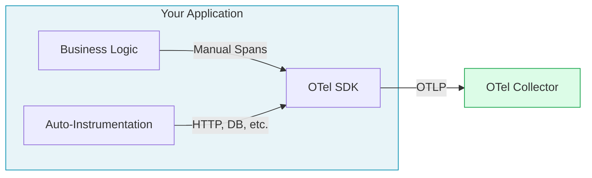
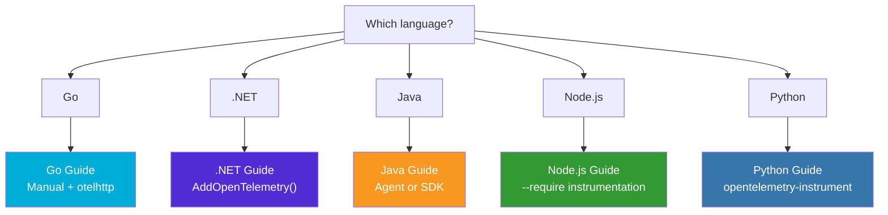

---
# Required
sidebar_position: 1
title: "OpenTelemetry Integration Overview — All Languages"
description: >-
  Overview of OpenTelemetry integration patterns for Go, Python, Java, Node.js, 
  and .NET. Choose the right approach for your applications.

# SEO
keywords:
  - opentelemetry
  - integration
  - instrumentation
  - sdk
  - auto-instrumentation
  - go python java nodejs dotnet

# Social sharing
og_title: "OpenTelemetry Integration: All Languages Guide"
og_description: "Comprehensive guides for instrumenting Go, Python, Java, Node.js, and .NET applications."
og_image: "/img/instrumenting-code.svg"

# Content management
date_published: 2025-01-22
date_modified: 2025-01-24
author: shivam
reading_time: 5
content_type: reference
---

# OpenTelemetry Integration Overview

This section provides comprehensive guides for integrating OpenTelemetry into your applications. Each guide covers the complete instrumentation journey—from basic setup to production-ready configurations.

## Supported Languages

| Language | Auto-Instrumentation | Manual Spans | Metrics | Logs | Guide |
|----------|---------------------|--------------|---------|------|-------|
| **Go** | Partial | ✅ Full | ✅ Full | ✅ Full | [Go Guide](./go) |
| **.NET** | ✅ Full | ✅ Full | ✅ Full | ✅ Full | [.NET Guide](./dotnet) |
| **Java** | ✅ Full | ✅ Full | ✅ Full | ✅ Full | [Java Guide](./java) |
| **Node.js** | ✅ Full | ✅ Full | ✅ Full | ✅ Full | [Node.js Guide](./nodejs) |
| **Python** | ✅ Full | ✅ Full | ✅ Full | ✅ Full | [Python Guide](./python) |

## Integration Patterns

### Pattern 1: Auto-Instrumentation (Fastest Start)

Auto-instrumentation automatically captures telemetry from common frameworks and libraries without code changes. Best for:
- Getting started quickly
- Instrumenting existing applications
- Capturing standard HTTP, database, and messaging telemetry

```bash
# Example: Python auto-instrumentation
opentelemetry-instrument --service_name my-service python app.py
```

### Pattern 2: SDK Integration (Recommended)

SDK integration gives you control over what's instrumented while still leveraging auto-instrumentation for common libraries.



### Pattern 3: Manual Instrumentation (Full Control)

Manual instrumentation provides complete control over what telemetry is captured. Best for:
- Custom business logic
- Performance-critical paths
- Specialized protocols

## Common Configuration

All languages share these environment variables:

```bash
# Required
OTEL_SERVICE_NAME=my-service
OTEL_EXPORTER_OTLP_ENDPOINT=http://localhost:4317

# Optional
OTEL_SERVICE_VERSION=1.0.0
OTEL_RESOURCE_ATTRIBUTES=deployment.environment=production

# Sampling (for high-traffic services)
OTEL_TRACES_SAMPLER=parentbased_traceidratio
OTEL_TRACES_SAMPLER_ARG=0.1
```

## Telemetry Collector Endpoints

| Protocol | Port | Use Case |
|----------|------|----------|
| OTLP gRPC | 4317 | Recommended for most languages |
| OTLP HTTP | 4318 | When gRPC is unavailable |

## What Each Guide Covers

Every integration guide includes:

1. **Prerequisites** — What you need before starting
2. **Installation** — Package installation commands
3. **Basic Setup** — Minimal configuration to get telemetry flowing
4. **Auto-Instrumentation** — Framework-specific automatic instrumentation
5. **Manual Spans** — Creating custom spans for business logic
6. **Custom Metrics** — Counters, histograms, and gauges
7. **Structured Logging** — Correlating logs with traces
8. **Context Propagation** — Distributed tracing across services
9. **Docker Integration** — Running in containerized environments
10. **Best Practices** — Production-ready patterns
11. **Troubleshooting** — Common issues and solutions

## Quick Start Decision Tree



---

## Setting Up Your Observability Stack

Once you've instrumented your code, you need infrastructure to receive and visualize the telemetry. Check out these guides:

| Guide | What It Covers |
|-------|---------------|
| [Single-Node Setup](../single-node-setup) | Jaeger, Prometheus, Loki, and Grafana on one machine |
| [Scalable Architecture](../scalable-architecture) | Production-grade distributed setup |

---

Choose your language guide to get started with detailed, production-ready instrumentation.
