---
# Required
sidebar_position: 1
title: "What is Observability? — Complete Guide"
description: >-
  Learn what observability is and how it differs from monitoring. Understand 
  system behavior through traces, metrics, and logs in distributed systems.

# SEO
keywords:
  - observability
  - monitoring
  - distributed systems
  - debugging
  - production
  - traces metrics logs
  - observability vs monitoring
  - system behavior

# Social sharing
og_title: "What is Observability? Beyond Traditional Monitoring"
og_description: "Learn how observability enables you to ask arbitrary questions about system behavior."
og_image: "/img/observability-fundamentals.svg"

# Content management
date_published: 2025-01-22
date_modified: 2025-01-24
author: shivam
reading_time: 8
content_type: explanation
---

# What is Observability?

**Observability is the ability to understand what's happening inside your system by examining what it outputs.**

This definition sounds simple, but the distinction from traditional monitoring is profound. Monitoring tells you *"API latency is high."* Observability lets you ask *"Why is latency high only for users on the mobile app, only when they add more than 5 items to cart, only during European business hours?"*

Monitoring answers predetermined questions: "Is the CPU above 80%?" or "Did the health check pass?" Observability enables you to ask arbitrary questions about your system's behavior—including questions you didn't anticipate when you built it.

## The Problem Observability Solves

Consider a scenario that's probably familiar if you've operated production systems.

Your e-commerce platform handles a flash sale. Traffic spikes 10x. Orders start failing. The on-call engineer sees elevated error rates but can't pinpoint the cause. Is it the database? The payment gateway? A network issue? A code bug that only manifests under load?

Without proper observability, debugging this is like trying to diagnose a car problem by only looking at the "check engine" light. You know something's wrong, but you have no idea what.

**With observability**, the engineer can:

1. See the error rate spike in metrics, narrowing down the timeframe
2. Filter logs to find the specific error messages occurring during that window
3. Click through to a distributed trace showing the exact request path that failed
4. Identify that the payment service is timing out on database connections
5. Discover that a connection pool was exhausted due to a slow query introduced in yesterday's deployment

The difference? **Hours of guessing versus minutes of systematic investigation.**

## Observability vs. Monitoring

| Aspect | Monitoring | Observability |
|--------|-----------|---------------|
| **Questions** | Predefined: "Is X within threshold?" | Ad-hoc: "Why is this happening?" |
| **Approach** | Check known failure modes | Explore unknown unknowns |
| **Data** | Aggregated metrics, simple logs | Rich context: traces, structured logs, high-cardinality metrics |
| **Debugging** | Dashboard → runbook → maybe success | Hypothesis → query → evidence → root cause |
| **Scale** | Works well for monoliths | Essential for distributed systems |

This isn't to say monitoring is obsolete—it's necessary but insufficient. You still need alerts telling you when something's wrong. Observability gives you the tools to understand why.

## When Observability Becomes Critical

For a single-service application running on one server, traditional monitoring often suffices. You can SSH in, check logs, maybe attach a debugger.

But modern systems look like this:

Observability becomes critical when:

- **Requests cross service boundaries**: A user action triggers calls to authentication, inventory, payment, and notification services. Which one is slow?
- **Failures are intermittent**: The issue only happens for 1% of requests, only for certain users, only at certain times
- **Scale makes direct inspection impossible**: You can't SSH into 500 pods to grep logs
- **Context gets lost**: Service A calls Service B which calls Service C. The error in C was caused by bad data from A, but how do you trace that?

Modern distributed systems are complex enough that no single engineer can hold the entire system state in their head. Observability provides the external memory and investigation tools needed to reason about these systems.

## The Three Pillars

Observability rests on three complementary data types, each answering different questions:

### Traces: Following a Request's Journey

A trace follows a single request as it travels through your distributed system. When a user clicks "Place Order," that request might touch your API gateway, authentication service, inventory service, payment processor, order service, and database—all before returning a response.

**Traces answer:** "What happened to this specific request? Where did it spend time? Where did it fail?"

### Metrics: Understanding Patterns Over Time

Metrics are numerical measurements collected at regular intervals. They're highly compressed (a number rather than a log line), making them efficient to store and fast to query over long time periods.

**Metrics answer:** "What's the trend? Are things getting better or worse? Should I wake someone up?"

### Logs: The Detailed Record

Logs are discrete events that describe what happened at specific moments. They're the most familiar observability signal because developers have been writing print statements since the beginning of programming.

**Logs answer:** "What exactly happened when this error occurred? What was the context?"

The real power comes from **correlation**—the ability to jump from a metric alert to related logs to the specific trace that shows the root cause. This is where modern observability platforms shine.

---

## Learning Path

New to observability? Here's the recommended reading order:

```mermaid
flowchart TB
    subgraph start["1️⃣ Start Here"]
        pillars["Three Pillars Overview"]
    end
    
    subgraph deep["2️⃣ Deep Dives"]
        tracing["Tracing"]
        metrics["Metrics"]
        logging["Logging"]
    end
    
    subgraph action["3️⃣ Take Action"]
        alerting["Alerting Best Practices"]
    end
    
    subgraph standard["4️⃣ The Standard"]
        otel["OpenTelemetry"]
    end
    
    subgraph implement["5️⃣ Implement"]
        guides["Integration Guides<br/>Go, Python, Java, .NET, Node.js"]
    end
    
    subgraph infra["6️⃣ Infrastructure"]
        single["Single-Node Setup"]
        scale["Scalable Architecture"]
    end
    
    pillars --> tracing
    pillars --> metrics
    pillars --> logging
    tracing --> alerting
    metrics --> alerting
    logging --> alerting
    alerting --> otel
    otel --> guides
    guides --> single
    single --> scale
    
    style start fill:#dcfce7,stroke:#16a34a
    style deep fill:#dbeafe,stroke:#2563eb
    style action fill:#fef3c7,stroke:#d97706
    style standard fill:#f3e8ff,stroke:#9333ea
    style implement fill:#fce7f3,stroke:#db2777
    style infra fill:#e0e7ff,stroke:#4f46e5
```

## Deep Dive Guides

| Topic | Document | What You'll Learn |
|-------|----------|-------------------|
| **Overview** | [Three Pillars →](./three-pillars) | How traces, metrics, and logs work together |
| **Tracing** | [Distributed Tracing →](./tracing) | Trace IDs, spans, context propagation, debugging microservices |
| **Metrics** | [Metrics That Matter →](./metrics) | Metric types, golden signals, dashboards |
| **Alerting** | [Alerting Best Practices →](./alerting) | Alert design, SLO-based alerting, runbooks, on-call |
| **Logging** | [Logging Done Right →](./logging) | Structured logging, log levels, canonical log lines |
| **Standard** | [OpenTelemetry →](./opentelemetry) | The vendor-neutral instrumentation standard |
| **Code** | [Integration Guides →](./integrations/overview) | Language-specific implementation guides |
| **Infrastructure** | [Single-Node Setup →](./single-node-setup) | Deploy observability stack with Docker Compose |
| **Scale** | [Scalable Architecture →](./scalable-architecture) | Enterprise patterns with Kafka and object storage |
| **Practice** | [Debugging Walkthrough →](./debugging-walkthrough) | Real-world incident investigation using all three pillars |
| **Avoid** | [Anti-Patterns →](./anti-patterns) | Common mistakes that cause production pain |
| **Save Money** | [Cost Optimization →](./cost-optimization) | Control costs without sacrificing visibility |
| **Reference** | [Glossary →](./glossary) | Terms and concepts quick reference |

---

## Frequently Asked Questions

### What's the difference between observability and monitoring?

**Monitoring** answers predetermined questions: "Is CPU above 80%?" or "Is the service responding?" You define what to check in advance.

**Observability** enables you to ask arbitrary questions about your system's behavior—including questions you didn't anticipate when you built it. When a new, unexpected issue occurs, observability gives you the tools to investigate without deploying new instrumentation.

### Do I need observability if I only have a monolith?

For a single-service application on one server, traditional monitoring often suffices. Observability becomes critical when:
- You have multiple services that communicate
- Issues are intermittent or affect only some requests
- You can't SSH into production to debug
- Your team didn't write all the code running in production

That said, even monoliths benefit from structured logging and good metrics.

### How much does observability cost?

Costs vary widely based on:
- **Data volume**: More requests = more telemetry = higher costs
- **Retention**: How long you keep data
- **Hosting**: Self-hosted vs. commercial SaaS

Self-hosted open-source stacks (Jaeger, Prometheus, Loki) cost infrastructure only—typically $200-2000/month depending on scale. Commercial solutions (Datadog, New Relic) charge per host or data volume, ranging from $500/month to $100k+/month for large deployments.

See our [Single-Node Setup](./single-node-setup) for a production-ready self-hosted option.

### What's the best observability tool?

There's no single "best" tool. The right choice depends on your needs:

| Need | Recommendation |
|------|----------------|
| **Getting started** | [OpenTelemetry](./opentelemetry) for instrumentation |
| **Self-hosted traces** | Jaeger or Grafana Tempo |
| **Self-hosted metrics** | Prometheus or Grafana Mimir |
| **Self-hosted logs** | Loki or OpenSearch |
| **All-in-one commercial** | Datadog, New Relic, Honeycomb, Grafana Cloud |

### How long does it take to implement observability?

A basic setup takes **hours to days**:
- Auto-instrumentation with OpenTelemetry: 1-2 hours per service
- Self-hosted backend (Docker Compose): 30 minutes
- Basic dashboards: 1-2 hours

A production-ready implementation takes **weeks**:
- Custom instrumentation for business logic
- Alert tuning to reduce noise
- Team training on investigation workflows
- Integration with incident management

Start simple, iterate based on actual debugging needs.

---

**Next**: [The Three Pillars Deep Dive →](./three-pillars)
