---
# Required
sidebar_position: 4
title: "Metrics That Matter — Golden Signals and Beyond"
description: >-
  Master observability metrics with this guide. Learn metric types, golden signals, 
  RED and USE methods, and how to build dashboards that help during incidents.

# SEO
keywords:
  - metrics
  - prometheus
  - golden signals
  - RED method
  - USE method
  - monitoring
  - alerting
  - SLOs
  - dashboards
  - counters histograms gauges

# Social sharing
og_title: "Metrics That Matter: Beyond the Dashboard"
og_description: "Learn what to measure, how to measure it, and how to build dashboards that help."
og_image: "/img/observability-fundamentals.svg"

# Content management
date_published: 2025-01-22
date_modified: 2025-01-24
author: shivam
reading_time: 25
content_type: explanation
---

# Metrics That Matter: Beyond the Dashboard

Here's a scene I've witnessed too many times: an engineering team proudly showing off their monitoring setup. Dozens of dashboards. Hundreds of graphs. CPU usage, memory consumption, disk I/O, network packets, JVM heap sizes, garbage collection pauses—you name it, they're graphing it.

Then an incident happens. They stare at these dashboards and... nothing. The graphs are all slightly elevated or slightly reduced, but there's no smoking gun. They end up back in the logs, grepping for errors, just like they would have without any metrics at all.

The problem isn't that they lack data. **The problem is they're measuring the wrong things.**

Metrics should answer questions like:
- "Is the system healthy *from the user's perspective*?"
- "Are we about to have a problem?"
- "Where should I look first when something's wrong?"

If your dashboards can't answer these questions within 30 seconds of an alert firing, it's time to rethink your metrics strategy.

---

## What Are Metrics, Really?

A metric is a numerical measurement of something in your system, collected at regular intervals over time. That's it. Simple concept, but the devil is in the details.

Unlike logs (which are discrete events with rich context) or traces (which follow individual requests), metrics are **aggregated measurements**. They tell you about the behavior of your system in aggregate, not about individual requests.

```mermaid
flowchart TB
    subgraph analogy["🛣️ The Highway Analogy"]
        highway["Imagine a busy highway..."]
    end
    
    subgraph logs["📝 LOGS = Dashcam footage"]
        l1["Individual car events"]
        l2["'Car ABC-123 changed lanes at mile 45 at 2:15:03 PM'"]
    end
    
    subgraph traces["🔍 TRACES = GPS tracking"]
        t1["Single vehicle's journey"]
        t2["'Car ABC-123's complete route from home to office'"]
    end
    
    subgraph metrics["📊 METRICS = Traffic sensors"]
        m1["Aggregated measurements"]
        m2["'450 vehicles/min, avg speed 65 mph'"]
    end
    
    subgraph need["✅ You need all three"]
        n1["Sensors (metrics) → know there's a jam"]
        n2["GPS (traces) → see where jam affects your route"]
        n3["Dashcam (logs) → see what caused the accident"]
    end
    
    analogy --> logs
    analogy --> traces
    analogy --> metrics
    logs --> need
    traces --> need
    metrics --> need
    
    style logs fill:#fef3c7,stroke:#d97706
    style traces fill:#f3e8ff,stroke:#9333ea
    style metrics fill:#dbeafe,stroke:#2563eb
    style need fill:#dcfce7,stroke:#16a34a
```



### The Time Series Foundation

Every metric produces a **time series**—a sequence of values over time, identified by a name and optional labels:

```
http_requests_total{service="order-api", method="POST", status="200"}

Time        │ Value
────────────┼──────────
10:00:00    │ 1,000,000
10:00:15    │ 1,000,047  (+47 requests)
10:00:30    │ 1,000,089  (+42 requests)
10:00:45    │ 1,000,156  (+67 requests)
10:01:00    │ 1,000,201  (+45 requests)
```

From this simple counter, I can derive:
- **Request rate**: ~45-67 requests per 15 seconds ≈ 3-4.5 req/s
- **Trend**: Relatively stable traffic
- **Comparison**: Is this higher or lower than yesterday at the same time?

---

## Metric Types: Choosing the Right Tool

Not all measurements are created equal. Understanding metric types is crucial for collecting meaningful data.

### Counter: Things That Only Go Up

A counter is a cumulative metric that only increases (or resets to zero on restart). Use counters for things you want to count.

```
┌─────────────────────────────────────────────────────────────────┐
│  COUNTER: http_requests_total                                   │
│                                                                 │
│  Value ▲                                                        │
│        │                              ╱                         │
│ 10,000 │                           ╱                            │
│        │                        ╱                               │
│  7,500 │                     ╱                                  │
│        │                  ╱                                     │
│  5,000 │               ╱                                        │
│        │            ╱                                           │
│  2,500 │         ╱                                              │
│        │      ╱                                                 │
│      0 │───╱─────────────────────────────────────────► Time     │
│        │                                                        │
│        Only goes UP (or resets to 0)                           │
└─────────────────────────────────────────────────────────────────┘
```

**Good counter examples:**
- `http_requests_total` — Total HTTP requests received
- `orders_processed_total` — Total orders processed
- `errors_total` — Total errors encountered
- `bytes_transferred_total` — Total bytes sent/received

**Common mistake:** Trying to use a counter for something that can decrease. If users can leave a queue, that's a gauge, not a counter.

**How to use counters:** You almost never look at the raw counter value. Instead, you calculate the **rate of change**:

```promql
# Requests per second over the last 5 minutes
rate(http_requests_total[5m])

# Errors per second
rate(errors_total[5m])

# Error percentage
rate(errors_total[5m]) / rate(http_requests_total[5m]) * 100
```

### Gauge: Things That Go Up and Down

A gauge represents a value that can increase or decrease. Use gauges for current state.

```
┌─────────────────────────────────────────────────────────────────┐
│  GAUGE: active_connections                                      │
│                                                                 │
│  Value ▲                                                        │
│        │     ╱╲                                                 │
│    100 │    ╱  ╲        ╱╲                                      │
│        │   ╱    ╲      ╱  ╲    ╱╲                               │
│     75 │  ╱      ╲    ╱    ╲  ╱  ╲                              │
│        │ ╱        ╲  ╱      ╲╱    ╲                             │
│     50 │╱          ╲╱              ╲                            │
│        │                            ╲                           │
│     25 │                             ╲╱╲                        │
│        │                                                        │
│      0 │────────────────────────────────────────────► Time      │
│        │                                                        │
│        Goes UP and DOWN                                         │
└─────────────────────────────────────────────────────────────────┘
```

**Good gauge examples:**
- `active_connections` — Current number of open connections
- `queue_depth` — Current items waiting in queue
- `memory_usage_bytes` — Current memory consumption
- `temperature_celsius` — Current temperature
- `in_progress_requests` — Requests currently being processed

**When to use gauges vs. counters:**

| Scenario | Type | Reasoning |
|----------|------|-----------|
| Total requests received | Counter | Always increases |
| Currently active requests | Gauge | Goes up and down |
| Total errors ever | Counter | Always increases |
| Current error rate | Derived | Calculate from counter |
| Queue size | Gauge | Items come and go |
| Items ever added to queue | Counter | Always increases |

### Histogram: Understanding Distributions

This is where it gets interesting. A histogram samples observations (like request durations) and counts them in configurable buckets.

```
┌─────────────────────────────────────────────────────────────────┐
│  HISTOGRAM: http_request_duration_seconds                       │
│                                                                 │
│  "How long do requests take?"                                   │
│                                                                 │
│  Bucket       │ Count │ Visualization                          │
│  ─────────────┼───────┼────────────────────────────────────────│
│  ≤ 0.01s      │   450 │ ████████████████████                   │
│  ≤ 0.025s     │   890 │ ████████████████████████████████████   │
│  ≤ 0.05s      │   970 │ ██████████████████████████████████████ │
│  ≤ 0.1s       │   995 │ ███████████████████████████████████████│
│  ≤ 0.25s      │   999 │ ███████████████████████████████████████│
│  ≤ 0.5s       │  1000 │ ███████████████████████████████████████│
│  ≤ 1.0s       │  1000 │ ███████████████████████████████████████│
│  ≤ +Inf       │  1000 │ ███████████████████████████████████████│
│                                                                 │
│  From this: p50 ≈ 15ms, p95 ≈ 50ms, p99 ≈ 100ms               │
└─────────────────────────────────────────────────────────────────┘
```

**Why histograms matter:**

Averages lie. If 99 requests take 10ms and 1 request takes 10 seconds, the average is 109ms—which represents neither the typical experience (10ms) nor the terrible one (10s).

Histograms let you calculate percentiles:
- **p50 (median):** Half of requests are faster than this
- **p95:** 95% of requests are faster than this
- **p99:** Only 1% of requests are slower than this

**Histogram instrumentation:**

```go
// Define bucket boundaries based on your SLOs
var requestDuration = prometheus.NewHistogramVec(
    prometheus.HistogramOpts{
        Name:    "http_request_duration_seconds",
        Help:    "HTTP request latency distribution",
        Buckets: []float64{.005, .01, .025, .05, .1, .25, .5, 1, 2.5, 5, 10},
    },
    []string{"service", "endpoint", "method"},
)

// Record an observation
start := time.Now()
handleRequest(w, r)
requestDuration.WithLabelValues("order-api", "/api/orders", "POST").
    Observe(time.Since(start).Seconds())
```

**Choosing bucket boundaries:**

This is crucial. Bad buckets = useless histograms.

| Scenario | Suggested Buckets |
|----------|-------------------|
| Fast API (SLO: p99 < 100ms) | 5ms, 10ms, 25ms, 50ms, 100ms, 250ms, 500ms, 1s |
| Standard API (SLO: p99 < 1s) | 10ms, 50ms, 100ms, 250ms, 500ms, 1s, 2.5s, 5s, 10s |
| Batch processing | 1s, 5s, 10s, 30s, 60s, 120s, 300s, 600s |

**Pro tip:** Your SLO threshold should fall in the middle of your buckets, not at the edge.

### Summary: Pre-Calculated Percentiles

Summaries are similar to histograms but calculate percentiles on the client side. I generally recommend histograms instead because:

| Aspect | Histogram | Summary |
|--------|-----------|---------|
| Aggregatable | ✅ Yes | ❌ No |
| Accurate percentiles | ✅ With good buckets | ✅ Always |
| Server-side calculation | ✅ Yes | ❌ No |
| Configurable after deployment | ✅ Yes | ❌ No |

Use summaries only if you need exact percentiles and don't need to aggregate across instances.

---

## The Golden Signals: What Actually Matters

Google's SRE book introduced the **Four Golden Signals**—the metrics that most directly indicate user-facing health. If you measure nothing else, measure these.

```mermaid
flowchart TB
    subgraph golden["🏆 THE FOUR GOLDEN SIGNALS"]
        direction TB
        
        subgraph row1[" "]
            direction LR
            subgraph latency["⏱️ LATENCY"]
                lat1["How long does it take?"]
                lat2["• p50, p95, p99"]
                lat3["• By endpoint"]
                lat4["• Success vs failure"]
            end
            
            subgraph traffic["📈 TRAFFIC"]
                traf1["How much demand?"]
                traf2["• req/sec"]
                traf3["• By endpoint"]
                traf4["• By customer tier"]
            end
        end
        
        subgraph row2[" "]
            direction LR
            subgraph errors["❌ ERRORS"]
                err1["How often do things fail?"]
                err2["• Error rate %"]
                err3["• By type"]
                err4["• By endpoint"]
            end
            
            subgraph saturation["🔋 SATURATION"]
                sat1["How 'full' is the system?"]
                sat2["• CPU %"]
                sat3["• Memory %"]
                sat4["• Queue depth"]
            end
        end
    end
    
    style latency fill:#dbeafe,stroke:#2563eb
    style traffic fill:#dcfce7,stroke:#16a34a
    style errors fill:#fee2e2,stroke:#dc2626
    style saturation fill:#fef3c7,stroke:#d97706
```



### 1. Latency: The User Experience Signal

Latency measures how long it takes to service requests. But here's the nuance most teams miss: **measure successful and failed requests separately**.

Why? Failed requests are often fast (immediate rejection) or very slow (timeout). Mixing them distorts your understanding of the happy path.

```promql
# Good: Separate success and failure latency
histogram_quantile(0.99, 
  rate(http_request_duration_seconds_bucket{status=~"2.."}[5m])
)

# What you learn:
# - Success p99: 150ms (good!)
# - Failure p99: 30000ms (timeouts causing errors)
```

**What to track:**
- p50 (median) — typical user experience
- p95 — most users' worst experience
- p99 — tail latency (where problems hide)
- Broken down by endpoint and method

### 2. Traffic: The Demand Signal

Traffic measures the demand on your system. For web services, this is usually requests per second.

```promql
# Requests per second by endpoint
sum(rate(http_requests_total[5m])) by (endpoint)

# Compare to yesterday (same time)
sum(rate(http_requests_total[5m])) 
  / 
sum(rate(http_requests_total[5m] offset 1d))
```

**Why traffic matters:**
- Validates that users can reach you (traffic drop = potential outage)
- Contextualizes other signals (high errors during low traffic vs. high traffic)
- Capacity planning (are we growing?)

**What to track:**
- Overall request rate
- Rate by endpoint (which features are used?)
- Rate by customer tier (are enterprise customers affected?)

### 3. Errors: The Failure Signal

Errors measure the rate of requests that fail. Always measure as a **rate or percentage**, not raw counts.

```promql
# Error rate as percentage
sum(rate(http_requests_total{status=~"5.."}[5m])) 
  / 
sum(rate(http_requests_total[5m])) 
  * 100

# Error rate by type
sum(rate(http_requests_total{status=~"5.."}[5m])) by (status)
```

**Types of errors to distinguish:**
| Type | Example | User Impact |
|------|---------|-------------|
| Client errors (4xx) | Bad request, unauthorized | User mistake, usually okay |
| Server errors (5xx) | Internal error, timeout | Our fault, investigate |
| Explicit failures | Payment declined | Expected business logic |
| Timeouts | Upstream unavailable | Often the real problem |

### 4. Saturation: The Capacity Signal

Saturation measures how "full" your service is. This is your early warning system.

```promql
# CPU saturation
avg(rate(process_cpu_seconds_total[5m])) / avg(kube_pod_container_resource_limits_cpu_cores)

# Memory saturation  
process_resident_memory_bytes / process_virtual_memory_max_bytes

# Connection pool saturation
active_connections / max_connections
```

**What to watch:**
- CPU utilization (>70% sustained = concern)
- Memory usage (watch for growth trends)
- Connection pools (exhaustion = cascading failures)
- Queue depths (growing = falling behind)
- Thread pool utilization

---

## The RED Method: Simplified for Services

For microservices, Tom Wilkie (Grafana) proposed the **RED Method**—a simplified version of the golden signals focused on what matters most for request-driven services.

```mermaid
flowchart LR
    subgraph red["🔴 THE RED METHOD<br/>(for every service)"]
        direction TB
        
        subgraph r["R — Rate"]
            r1["How many requests/sec?"]
            r2["sum(rate(http_requests_total[5m]))"]
        end
        
        subgraph e["E — Errors"]
            e1["What % are failing?"]
            e2["errors / total requests"]
        end
        
        subgraph d["D — Duration"]
            d1["How long do they take?"]
            d2["histogram_quantile(0.99, ...)"]
        end
    end
    
    r --> e --> d
    
    style r fill:#fee2e2,stroke:#dc2626
    style e fill:#fef3c7,stroke:#d97706
    style d fill:#dbeafe,stroke:#2563eb
```



The beauty of RED is consistency. Every service gets the same three metrics. You can build a single dashboard template and apply it everywhere.

---

## The USE Method: For Infrastructure

While RED is for services, the **USE Method** (by Brendan Gregg) is for infrastructure resources:

```mermaid
flowchart LR
    subgraph use["🔧 THE USE METHOD<br/>(for every resource)"]
        direction TB
        
        subgraph u["U — Utilization"]
            u1["% time resource is busy"]
            u2["CPU: rate(node_cpu_seconds_total)"]
        end
        
        subgraph s["S — Saturation"]
            s1["How much work is waiting?"]
            s2["CPU: node_load1"]
            s3["Disk: io_time_weighted"]
        end
        
        subgraph er["E — Errors"]
            er1["How many error events?"]
            er2["Network: receive_errs"]
            er3["Disk: write_errors"]
        end
    end
    
    u --> s --> er
    
    style u fill:#dcfce7,stroke:#16a34a
    style s fill:#fef3c7,stroke:#d97706
    style er fill:#fee2e2,stroke:#dc2626
```



**When to use which:**
- **RED**: Application services (APIs, workers, processors)
- **USE**: Infrastructure components (CPU, memory, disk, network)

---

## Metric Naming: Getting It Right

Good metric names are self-documenting. Bad names lead to confusion and mistakes.

### The Prometheus Naming Convention

```
<namespace>_<name>_<unit>_<suffix>
     │         │      │      │
     │         │      │      └── _total (counter), _count/_sum/_bucket (histogram)
     │         │      └── seconds, bytes, requests, etc.
     │         └── descriptive name
     └── service or subsystem prefix
```

**Good examples:**
```
http_request_duration_seconds        # Duration in seconds
http_requests_total                  # Counter of requests
order_processing_queue_depth         # Current queue size (gauge)
database_connections_active          # Current connections (gauge)
payment_amount_dollars_total         # Cumulative payment amounts
```

**Bad examples:**
```
requestLatency              # No unit, camelCase
http_requests_by_method     # Label in name (use labels instead)
errors                      # Too vague, no context
order_count                 # Is this a counter or gauge?
```

### Labels: Adding Dimensions

Labels let you slice metrics by different dimensions without creating separate metrics:

```promql
# One metric, multiple dimensions
http_requests_total{
  service="order-api",
  endpoint="/api/orders",
  method="POST",
  status="201"
}

# Query all POST requests across all services
sum(rate(http_requests_total{method="POST"}[5m])) by (service)

# Query order-api broken down by status
sum(rate(http_requests_total{service="order-api"}[5m])) by (status)
```

**Label best practices:**

| Do | Don't |
|----|-------|
| Use labels for known, bounded sets | Use labels for unbounded values |
| `method="GET"` | `user_id="12345"` |
| `status="200"` | `request_id="abc-xyz"` |
| `region="us-east-1"` | `timestamp="2024-..."` |

**Why unbounded labels are dangerous:**

Every unique label combination creates a new time series. If you add `user_id` as a label with 1 million users, you've created 1 million time series. This explodes storage costs and query performance.

---

## Building Useful Dashboards

Most dashboards I see are useless. They show dozens of metrics but don't help anyone make decisions. Here's how to build dashboards that actually help during incidents.

### The Three-Tier Dashboard Strategy

```
┌────────────────────────────────────────────────────────────────────────────┐
│  TIER 1: THE OVERVIEW (What's the current state?)                          │
├────────────────────────────────────────────────────────────────────────────┤
│                                                                            │
│  ┌─────────────┐ ┌─────────────┐ ┌─────────────┐ ┌─────────────┐           │
│  │  Requests   │ │ Error Rate  │ │    p99      │ │ Saturation  │           │
│  │   1,234/s   │ │   0.02%     │ │   145ms     │ │  CPU: 45%   │           │
│  │     ✓       │ │     ✓       │ │     ✓       │ │     ✓       │           │
│  └─────────────┘ └─────────────┘ └─────────────┘ └─────────────┘           │
│                                                                            │
│  "At a glance: everything is healthy"                                      │
└────────────────────────────────────────────────────────────────────────────┘
                                    │
                                    ▼
┌────────────────────────────────────────────────────────────────────────────┐
│  TIER 2: SERVICE HEALTH (Which service has the problem?)                   │
├────────────────────────────────────────────────────────────────────────────┤
│                                                                            │
│  Service          │ Rate    │ Errors │ p99    │ Status                     │
│  ─────────────────┼─────────┼────────┼────────┼────────                    │
│  api-gateway      │ 1,234/s │ 0.01%  │ 45ms   │   ✓                        │
│  order-service    │   892/s │ 0.03%  │ 189ms  │   ✓                        │
│  payment-service  │   445/s │ 2.1%   │ 890ms  │   ⚠ ← Problem here         │
│  inventory-service│   334/s │ 0.02%  │ 67ms   │   ✓                        │
│                                                                            │
│  "Payment service has elevated errors and latency"                         │
└────────────────────────────────────────────────────────────────────────────┘
                                    │
                                    ▼
┌────────────────────────────────────────────────────────────────────────────┐
│  TIER 3: SERVICE DEEP DIVE (What's wrong with this service?)               │
├────────────────────────────────────────────────────────────────────────────┤
│                                                                            │
│  Payment Service Detail:                                                   │
│                                                                            │
│  [Latency by Endpoint]          [Error Rate by Type]                       │
│  POST /charge    │ 890ms ⚠      │ Timeout errors: 2.0%                     │
│  GET /status     │  23ms ✓      │ Validation errors: 0.1%                  │
│  POST /refund    │  45ms ✓      │                                          │
│                                                                            │
│  [Downstream Dependencies]      [Resource Utilization]                     │
│  → Stripe API    │ 850ms ⚠      │ CPU: 34%  Memory: 67%                    │
│  → Database      │  12ms ✓      │ Connections: 45/100                      │
│                                                                            │
│  "Stripe API is slow, causing our timeouts"                                │
└────────────────────────────────────────────────────────────────────────────┘
```

### Dashboard Anti-Patterns

**1. Too many graphs**

If your dashboard has 30 panels, no one will read it. Aim for 6-10 panels that answer specific questions.

**2. No context for numbers**

A graph showing "CPU: 65%" means nothing without knowing:
- Is that high or low for this service?
- What's the threshold?
- What's the trend?

Add threshold lines, comparison to yesterday, or clear RED/GREEN indicators.

**3. Missing time correlation**

All graphs on an incident dashboard should show the same time range. If someone zooms in on one graph, all graphs should zoom together.

**4. Raw values instead of rates**

Counter values always go up. Show `rate(requests_total[5m])`, not `requests_total`.

---

## Alerting: From Metrics to Action

Metrics become powerful when they trigger alerts. But bad alerting leads to alert fatigue, and alert fatigue leads to ignored pages, and ignored pages lead to extended outages.

### Alert on Symptoms, Not Causes

```
┌────────────────────────────────────────────────────────────────────────────┐
│                        ALERTING PHILOSOPHY                                 │
├────────────────────────────────────────────────────────────────────────────┤
│                                                                            │
│  ❌ BAD: Alert on causes                                                   │
│     "CPU > 80%"                                                            │
│     "Memory > 90%"                                                         │
│     "5xx errors detected"                                                  │
│                                                                            │
│  ✓ GOOD: Alert on symptoms (user impact)                                   │
│     "Error rate > 1% for 5 minutes"                                        │
│     "p99 latency > 500ms for 5 minutes"                                    │
│     "Request rate dropped 50% from baseline"                               │
│                                                                            │
│  Why?                                                                      │
│  • High CPU doesn't always mean user impact                                │
│  • A few 5xx errors might be normal                                        │
│  • Users feel error rates and latency, not CPU usage                       │
│                                                                            │
└────────────────────────────────────────────────────────────────────────────┘
```

### SLO-Based Alerting

The most effective alerting is based on **Service Level Objectives (SLOs)**:

```yaml
# Define your SLO
SLO: 99.9% of requests complete successfully in under 500ms

# Calculate error budget
Error budget: 0.1% of requests can fail or be slow
Per month: ~43 minutes of allowed downtime

# Alert when burning budget too fast
Alert: "Burning 10x error budget"
Condition: Error rate > 1% for 5 minutes  # 10x the 0.1% SLO
Severity: Warning

Alert: "Burning 100x error budget"  
Condition: Error rate > 10% for 1 minute  # Severe incident
Severity: Critical
```

### Practical Alert Examples

```yaml
# Error rate alert (symptom-based)
- alert: HighErrorRate
  expr: |
    sum(rate(http_requests_total{status=~"5.."}[5m])) 
    / sum(rate(http_requests_total[5m])) 
    > 0.01
  for: 5m
  labels:
    severity: warning
  annotations:
    summary: "Error rate above 1%"
    description: "Service {{ $labels.service }} error rate is {{ $value | humanizePercentage }}"

# Latency alert
- alert: HighLatency
  expr: |
    histogram_quantile(0.99, 
      sum(rate(http_request_duration_seconds_bucket[5m])) by (le, service)
    ) > 0.5
  for: 5m
  labels:
    severity: warning
  annotations:
    summary: "p99 latency above 500ms"

# Saturation alert (leading indicator)
- alert: DatabaseConnectionPoolNearExhaustion
  expr: |
    active_database_connections / max_database_connections > 0.8
  for: 5m
  labels:
    severity: warning
  annotations:
    summary: "Database connection pool 80% utilized"
    description: "Consider increasing pool size or investigating connection leaks"
```

---

## Instrumenting Your Code

Here's how to add metrics to your services in practice.

### Go Example with Prometheus

```go
package metrics

import (
    "net/http"
    "time"
    
    "github.com/prometheus/client_golang/prometheus"
    "github.com/prometheus/client_golang/prometheus/promauto"
    "github.com/prometheus/client_golang/prometheus/promhttp"
)

var (
    // Counter: total requests
    httpRequestsTotal = promauto.NewCounterVec(
        prometheus.CounterOpts{
            Name: "http_requests_total",
            Help: "Total number of HTTP requests",
        },
        []string{"service", "endpoint", "method", "status"},
    )
    
    // Histogram: request duration
    httpRequestDuration = promauto.NewHistogramVec(
        prometheus.HistogramOpts{
            Name:    "http_request_duration_seconds",
            Help:    "HTTP request duration in seconds",
            Buckets: []float64{.005, .01, .025, .05, .1, .25, .5, 1, 2.5, 5, 10},
        },
        []string{"service", "endpoint", "method"},
    )
    
    // Gauge: in-flight requests
    httpRequestsInFlight = promauto.NewGaugeVec(
        prometheus.GaugeOpts{
            Name: "http_requests_in_flight",
            Help: "Current number of HTTP requests being processed",
        },
        []string{"service"},
    )
)

// Middleware to instrument HTTP handlers
func InstrumentHandler(service string, next http.Handler) http.Handler {
    return http.HandlerFunc(func(w http.ResponseWriter, r *http.Request) {
        start := time.Now()
        
        // Track in-flight requests
        httpRequestsInFlight.WithLabelValues(service).Inc()
        defer httpRequestsInFlight.WithLabelValues(service).Dec()
        
        // Wrap response writer to capture status code
        wrapped := &responseWriter{ResponseWriter: w, statusCode: 200}
        
        // Handle request
        next.ServeHTTP(wrapped, r)
        
        // Record metrics
        duration := time.Since(start).Seconds()
        status := strconv.Itoa(wrapped.statusCode)
        
        httpRequestsTotal.WithLabelValues(service, r.URL.Path, r.Method, status).Inc()
        httpRequestDuration.WithLabelValues(service, r.URL.Path, r.Method).Observe(duration)
    })
}

// Expose metrics endpoint
func MetricsHandler() http.Handler {
    return promhttp.Handler()
}
```

### Python Example

```python
from prometheus_client import Counter, Histogram, Gauge, start_http_server
import time
from functools import wraps

# Define metrics
REQUEST_COUNT = Counter(
    'http_requests_total',
    'Total HTTP requests',
    ['service', 'endpoint', 'method', 'status']
)

REQUEST_LATENCY = Histogram(
    'http_request_duration_seconds',
    'HTTP request duration in seconds',
    ['service', 'endpoint', 'method'],
    buckets=[.005, .01, .025, .05, .1, .25, .5, 1, 2.5, 5, 10]
)

REQUESTS_IN_FLIGHT = Gauge(
    'http_requests_in_flight',
    'Current HTTP requests being processed',
    ['service']
)

def instrument_endpoint(service: str, endpoint: str):
    """Decorator to instrument Flask/FastAPI endpoints"""
    def decorator(func):
        @wraps(func)
        def wrapper(*args, **kwargs):
            REQUESTS_IN_FLIGHT.labels(service=service).inc()
            start_time = time.time()
            
            try:
                result = func(*args, **kwargs)
                status = '200'
                return result
            except Exception as e:
                status = '500'
                raise
            finally:
                duration = time.time() - start_time
                REQUEST_COUNT.labels(
                    service=service,
                    endpoint=endpoint,
                    method=request.method,
                    status=status
                ).inc()
                REQUEST_LATENCY.labels(
                    service=service,
                    endpoint=endpoint,
                    method=request.method
                ).observe(duration)
                REQUESTS_IN_FLIGHT.labels(service=service).dec()
        
        return wrapper
    return decorator

# Usage
@app.route('/api/orders', methods=['POST'])
@instrument_endpoint(service='order-api', endpoint='/api/orders')
def create_order():
    # ... handle request ...
    return jsonify(order)
```

---

## Cardinality: The Silent Cost Explosion

Here's a story I've seen play out too many times: A team adds a helpful metric with a `user_id` label. "It'll help us debug individual user issues!" Three months later, their Prometheus instance is using 200GB of memory and queries take 30 seconds.

**Cardinality** is the number of unique time series created by a metric. It's the multiplication of all unique label value combinations.

### Understanding the Math

```
http_requests_total{method="GET", status="200", endpoint="/api/users"}
                    └─5 values──┘  └─50 values─┘  └─100 endpoints─┘
                    
                    5 × 50 × 100 = 25,000 time series (manageable)
```

Now add `user_id`:

```
http_requests_total{method="GET", status="200", endpoint="/api/users", user_id="usr_123"}
                    └─5 values──┘  └─50 values─┘  └─100 endpoints─┘  └─1M users──┘
                    
                    5 × 50 × 100 × 1,000,000 = 25 BILLION time series (disaster)
```

### What Causes Cardinality Explosions

| Label Type | Cardinality | Impact |
|------------|-------------|--------|
| `method` (GET, POST, etc.) | ~10 | ✅ Safe |
| `status_code` | ~50 | ✅ Safe |
| `endpoint` | ~100-1000 | ⚠️ Watch it |
| `user_id` | Millions | ❌ Explosion |
| `request_id` | Unlimited | ❌ Catastrophic |
| `error_message` | Unlimited | ❌ Catastrophic |
| `timestamp` | Unlimited | ❌ Never do this |

### Detecting Cardinality Problems

**Signs you have a problem:**

- Prometheus memory usage climbing steadily
- Query timeouts on previously-fast queries
- High CPU on metric ingestion
- "too many time series" errors

**How to investigate:**

```promql
# Top 10 metrics by cardinality
topk(10, count by (__name__)({__name__=~".+"}))

# Cardinality for a specific metric
count(http_requests_total)

# Cardinality by label
count by (endpoint) (http_requests_total)
```

### Fixing Cardinality Problems

**1. Remove unbounded labels:**

```yaml
# Bad: user_id creates millions of series
- name: http_requests_total
  labels: [method, endpoint, user_id]  # Remove user_id!

# Good: bounded labels only
- name: http_requests_total
  labels: [method, endpoint, status]
```

**2. Bucket instead of exact values:**

```go
// Bad: exact latency creates many series
histogram.WithLabelValues(method, endpoint, fmt.Sprintf("%.3f", latency))

// Good: use histogram buckets
histogram.WithLabelValues(method, endpoint).Observe(latency)
```

**3. Use label value allowlists:**

```go
// Only accept known endpoints
var knownEndpoints = map[string]bool{
    "/api/users": true,
    "/api/orders": true,
    // ...
}

func sanitizeEndpoint(endpoint string) string {
    if knownEndpoints[endpoint] {
        return endpoint
    }
    return "other"  // Catch-all for unknown
}
```

**4. Move high-cardinality data to logs/traces:**

Put `user_id`, `order_id`, `request_id` in:
- Span attributes (traces) — queryable, context-rich
- Log fields (logs) — searchable, detailed

Not in metric labels.

### The Right Way to Track Per-User Metrics

Need to know metrics per user? Use exemplars and logs:

```go
// Metric: count total orders (low cardinality)
ordersCounter.Add(1, attribute.String("region", region))

// Trace: include user context
span.SetAttributes(
    attribute.String("user.id", userID),
    attribute.String("order.id", orderID),
)

// Log: include all context
logger.Info("Order created",
    "user_id", userID,
    "order_id", orderID,
    "amount", amount,
    "trace_id", span.SpanContext().TraceID(),
)
```

Then to debug a specific user:
1. Search logs for `user_id=usr_123`
2. Get `trace_id` from log
3. View full trace with all context

### Cardinality Budgeting

Set limits before problems occur:

| Metric Type | Cardinality Budget | Notes |
|-------------|-------------------|-------|
| Request metrics | < 10,000 series | Per service |
| Business metrics | < 5,000 series | Per service |
| Infrastructure | < 50,000 series | Cluster-wide |
| **Total target** | < 1 million | Entire system |

Monitor your cardinality:
```yaml
# Alert when approaching limits
- alert: HighCardinalityMetric
  expr: count by (__name__) ({__name__=~".+"}) > 50000
  for: 5m
  annotations:
    summary: "Metric {{ $labels.__name__ }} has high cardinality"
```

---

## Correlating Metrics with Traces and Logs

Metrics tell you there's a problem. Traces and logs tell you what the problem is. Here's how to connect them.

:::tip Cross-Reference
For deep dives on the other pillars, see [Distributed Tracing →](./tracing) and [Logging Done Right →](./logging).
:::

### Exemplars: Linking Metrics to Traces

Modern metrics systems support **exemplars**—sample trace IDs attached to metric observations:

```
┌────────────────────────────────────────────────────────────────────────────┐
│  HISTOGRAM BUCKET: http_request_duration_seconds{le="1.0"}                 │
│                                                                            │
│  Count: 1,000,000                                                          │
│                                                                            │
│  Exemplars (sample trace IDs for this bucket):                             │
│    • trace_id=abc123 (0.95s) ← "Show me a slow request"                    │
│    • trace_id=def456 (0.87s)                                               │
│    • trace_id=ghi789 (0.92s)                                               │
│                                                                            │
└────────────────────────────────────────────────────────────────────────────┘
```

When you see high p99 latency in metrics, exemplars let you jump directly to example traces.

### The Investigation Flow

```
┌────────────────────────────────────────────────────────────────────────────┐
│  1. METRICS: "p99 latency spiked to 2s"                                    │
│     Dashboard shows: order-service, POST /api/orders                       │
└───────────────────────────────────────┬────────────────────────────────────┘
                                        │ Click exemplar
                                        ▼
┌────────────────────────────────────────────────────────────────────────────┐
│  2. TRACES: Example slow request (trace_id: abc123)                        │
│     Waterfall shows: 1.8s spent in payment-service → Stripe API            │
└───────────────────────────────────────┬────────────────────────────────────┘
                                        │ Click span for details
                                        ▼
┌────────────────────────────────────────────────────────────────────────────┐
│  3. LOGS: Filter by trace_id=abc123                                        │
│     See: "Stripe API timeout, retry 3 of 3 failed"                         │
│     See: "Stripe request_id: req_xyz for support ticket"                   │
└────────────────────────────────────────────────────────────────────────────┘
```

---

## Best Practices Checklist

Before you ship, verify your metrics implementation:

### Instrumentation
- [ ] All HTTP endpoints instrumented (request count, duration, status)
- [ ] Database calls instrumented (query count, duration)
- [ ] External API calls instrumented (call count, duration, errors)
- [ ] Queue operations instrumented (enqueue/dequeue count, depth)
- [ ] Critical business operations tracked (orders, payments, etc.)

### Metric Quality
- [ ] Using correct metric types (counters for totals, gauges for current state)
- [ ] Histogram buckets aligned with SLOs
- [ ] Labels are bounded (no user IDs or request IDs)
- [ ] Naming follows conventions (`service_name_unit_suffix`)

### Dashboards
- [ ] Overview dashboard with golden signals
- [ ] Service dashboards with RED metrics
- [ ] Drill-down capabilities (tier 1 → tier 2 → tier 3)
- [ ] Threshold lines and SLO targets visible

### Alerting
- [ ] Alerts based on symptoms, not causes
- [ ] SLO-based alerting configured
- [ ] Alert runbooks linked
- [ ] Appropriate severity levels

---

## Key Takeaways

1. **Metrics are aggregated measurements** — They show patterns across millions of requests, not individual request details

2. **Choose the right metric type** — Counters for totals, gauges for current state, histograms for distributions

3. **Measure the Golden Signals** — Latency, Traffic, Errors, Saturation capture user-facing health

4. **Use RED for services, USE for infrastructure** — Consistent frameworks make reasoning easier

5. **Name metrics well** — `namespace_name_unit_suffix` with bounded labels

6. **Build three-tier dashboards** — Overview → Service → Deep dive

7. **Alert on symptoms, not causes** — Users feel error rates and latency, not CPU usage. See [Alerting Best Practices →](./alerting)

8. **Connect to traces and logs** — Metrics tell you there's a problem; traces and logs tell you what it is

Metrics are your system's vital signs. Like a doctor monitoring heart rate, blood pressure, and temperature, you're monitoring request rate, error rate, and latency. Get these right, and you'll catch problems before your users do.

---

**Next**: [Alerting Best Practices →](./alerting)
