# Single-Node Observability Setup

A practical guide to deploying a complete observability stack with OpenTelemetry, Prometheus, Jaeger, Loki, and Grafana. Production-ready for small to medium workloads—get traces, metrics, and logs in minutes.

## Why Start with Single-Node?

Before you design complex distributed systems, start with something that works. A single-node deployment isn't a "demo"—it's a legitimate production architecture for many use cases.

With a single 8-CPU, 16GB RAM server running Docker Compose, you can:

- Ingest **~50,000 events per second** across traces, metrics, and logs
- Store **30 days of data** with reasonable retention policies
- Query dashboards with **sub-second response times**
- Alert on any metric or log pattern
- Survive service restarts without losing data (persistent queues)
- Auto-recover from failures (Docker restart policies)

For teams of 5-20 developers running 10-50 microservices, this is often more than enough.

## Architecture Overview

```mermaid
flowchart TB
    subgraph apps["🖥️ Your Applications"]
        app1[Service A]
        app2[Service B]
        app3[Service C]
    end
    
    apps -->|"OTLP gRPC :4317<br/>OTLP HTTP :4318"| collector
    
    subgraph collector["⚙️ OpenTelemetry Collector"]
        direction LR
        pq[Persistent<br/>Queues]
        ml[Memory<br/>Limiter]
        rp[Retry<br/>Policies]
    end
    
    collector --> jaeger
    collector --> prometheus
    collector --> loki
    
    subgraph storage["📦 Storage Backends"]
        jaeger[("🔍 Jaeger<br/>Traces")]
        prometheus[("📈 Prometheus<br/>Metrics")]
        loki[("📝 Loki<br/>Logs")]
    end
    
    storage --> grafana
    
    subgraph viz["📊 Visualization"]
        grafana[Grafana<br/>Dashboards & Alerts]
    end
    
    style apps fill:#dbeafe,stroke:#2563eb
    style collector fill:#dcfce7,stroke:#16a34a
    style storage fill:#fef3c7,stroke:#d97706
    style viz fill:#fce7f3,stroke:#db2777
```



## Quick Start (5 Minutes)

If you want to get running immediately, use the pre-built configuration:

```bash
# Clone the repository
git clone https://github.com/shivam-g-mishra/opensource-otel-setup.git
cd opensource-otel-setup

# Start the stack
make up

# Verify everything is running
make status
```

**That's it.** Your observability stack is running:

| Service | URL | Purpose |
|---------|-----|---------|
| **Grafana** | http://localhost:3000 | Dashboards (admin/admin) |
| **Jaeger** | http://localhost:16686 | Trace explorer |
| **Prometheus** | http://localhost:9090 | Metrics & alerts |

**Send telemetry to:**
- **OTLP gRPC**: `localhost:4317` (recommended)
- **OTLP HTTP**: `localhost:4318`

---

## Understanding the Components

Let's walk through what each component does and why it's configured the way it is.

```mermaid
flowchart LR
    subgraph receive["📥 Receive"]
        otlp[OTLP<br/>gRPC/HTTP]
    end
    
    subgraph process["⚙️ Process"]
        ml[Memory<br/>Limiter]
        batch[Batch<br/>Processor]
        attr[Attribute<br/>Processor]
    end
    
    subgraph export["📤 Export"]
        traces[Traces → Jaeger]
        metrics[Metrics → Prometheus]
        logs[Logs → Loki]
    end
    
    otlp --> ml --> batch --> attr
    attr --> traces
    attr --> metrics
    attr --> logs
    
    style receive fill:#dbeafe,stroke:#2563eb
    style process fill:#dcfce7,stroke:#16a34a
    style export fill:#fef3c7,stroke:#d97706
```



### The OpenTelemetry Collector

The Collector is the heart of this setup. It receives telemetry from your applications and routes it to appropriate backends.

**Key configuration points:**

```yaml
receivers:
  otlp:
    protocols:
      grpc:
        endpoint: 0.0.0.0:4317
      http:
        endpoint: 0.0.0.0:4318

processors:
  # Prevent OOM crashes under load
  memory_limiter:
    check_interval: 1s
    limit_mib: 1500
    spike_limit_mib: 500
  
  # Efficient batching for export
  batch:
    timeout: 1s
    send_batch_size: 1024

exporters:
  otlp/jaeger:
    endpoint: jaeger:4317
  prometheus:
    endpoint: "0.0.0.0:8889"
  loki:
    endpoint: http://loki:3100/loki/api/v1/push
```

**Production-ready features included:**

| Feature | Description |
|---------|-------------|
| **Persistent Queues** | Data survives collector restarts |
| **Memory Limiter** | Prevents OOM crashes, graceful degradation |
| **Retry Policies** | Exponential backoff for transient failures |
| **Health Checks** | Auto-restart unhealthy containers |

### Jaeger for Traces

Jaeger provides trace storage and visualization. In this setup, it uses Badger (embedded storage) for simplicity.

**Why Jaeger for single-node?**
- Simple deployment (single binary with embedded storage)
- Excellent UI for trace exploration
- Good performance for moderate trace volumes
- No external dependencies (unlike Cassandra/Elasticsearch)

**Capacity:** ~50,000 spans/second, 30-day retention

### Prometheus for Metrics

Prometheus scrapes metrics from the Collector's Prometheus exporter and provides the metrics storage and query engine.

**Included configuration:**
- 30-day retention
- Self-monitoring (scrapes its own metrics)
- Pre-configured alerting rules

**Capacity:** ~1 million active time series

### Loki for Logs

Loki stores logs with minimal indexing—only labels are indexed, not the log content itself. This makes it dramatically cheaper to operate than Elasticsearch while still enabling powerful queries.

**Query example:**
```logql
{service="payment-api"} |= "error" | json | rate() by (error_code)
```

### Grafana for Visualization

Grafana queries all three backends (Jaeger, Prometheus, Loki) and provides:

- Pre-built dashboards for Collector health
- Application metrics dashboards
- Explore mode for ad-hoc investigation
- Unified alerting

---

## Connecting Your Applications

Once the stack is running, configure your applications to send telemetry to the Collector.

```mermaid
flowchart LR
    subgraph apps["Your Applications"]
        go[🐹 Go]
        py[🐍 Python]
        node[💚 Node.js]
        net[🔷 .NET]
        java[☕ Java]
    end
    
    subgraph protocols["Connection Options"]
        grpc["gRPC :4317<br/>(recommended)"]
        http["HTTP :4318<br/>(fallback)"]
    end
    
    subgraph collector["OTel Collector"]
        recv[Receivers]
    end
    
    go & py & node & net & java --> grpc & http
    grpc & http --> recv
    
    style apps fill:#f8fafc,stroke:#64748b
    style protocols fill:#dbeafe,stroke:#2563eb
    style collector fill:#dcfce7,stroke:#16a34a
```



### Quick Integration Examples

**Go:**
```go
exporter, _ := otlptracegrpc.New(ctx,
    otlptracegrpc.WithEndpoint("localhost:4317"),
    otlptracegrpc.WithInsecure(),
)
```

**Python:**
```bash
opentelemetry-instrument \
    --service_name my-service \
    --exporter_otlp_endpoint http://localhost:4317 \
    python app.py
```

**Node.js:**
```javascript
const sdk = new NodeSDK({
  traceExporter: new OTLPTraceExporter({ url: 'http://localhost:4317' }),
  instrumentations: [getNodeAutoInstrumentations()],
});
sdk.start();
```

**.NET:**
```csharp
builder.Services.AddOpenTelemetry()
    .WithTracing(t => t
        .AddAspNetCoreInstrumentation()
        .AddOtlpExporter(o => o.Endpoint = new Uri("http://localhost:4317")));
```

:::tip Full Integration Guides
Need detailed setup with custom spans, metrics, and logging? See our comprehensive guides:
- [Go Integration](./integrations/go)
- [.NET Integration](./integrations/dotnet)
- [Java Integration](./integrations/java)
- [Node.js Integration](./integrations/nodejs)
- [Python Integration](./integrations/python)
:::

---

## Operational Commands

The repository includes a Makefile for common operations:

```bash
# Core commands
make up          # Start the stack
make down        # Stop the stack (data preserved)
make restart     # Restart all services
make status      # Check service health
make logs        # View all logs

# Operations
make backup      # Backup all data and configs
make restore     # Restore from backup
make deploy      # Zero-downtime deployment

# Debugging
make logs-collector  # OTel Collector logs only
make alerts          # View active alerts
make metrics         # Show collector throughput
```

---

## Resource Requirements

| Scenario | CPU | RAM | Disk | Use Case |
|----------|-----|-----|------|----------|
| **Minimum** | 4 cores | 8 GB | 20 GB | Development, testing |
| **Recommended** | 8 cores | 16 GB | 50 GB | Small production |
| **Production** | 12+ cores | 24+ GB | 100+ GB | Medium production |

**Per-service limits (pre-configured):**

| Service | CPU Limit | Memory Limit |
|---------|-----------|--------------|
| Jaeger | 2 cores | 4 GB |
| Prometheus | 2 cores | 4 GB |
| OTel Collector | 2 cores | 2 GB |
| Loki | 1 core | 2 GB |
| Grafana | 1 core | 1 GB |

## Capacity Guidelines

| Metric | Light Load | Moderate | Heavy |
|--------|------------|----------|-------|
| Spans/second | <1,000 | 1K-10K | 10K-50K |
| Metric series | <100K | 100K-500K | 500K-1M |
| Log lines/second | <1,000 | 1K-10K | 10K-50K |
| Connected apps | 1-5 | 5-20 | 20-50 |

---

## Reliability Features

This isn't a toy setup. The configuration includes production reliability features:

```mermaid
flowchart LR
    subgraph normal["✅ Normal Operation"]
        app1[App] -->|telemetry| coll1[Collector]
        coll1 --> be1[Backend]
    end
    
    subgraph failure["⚠️ Backend Failure"]
        app2[App] -->|telemetry| coll2[Collector]
        coll2 -->|queue fills| pq[Persistent<br/>Queue]
        pq -.->|"backend down"| be2[Backend]
    end
    
    subgraph recovery["🔄 Recovery"]
        app3[App] -->|telemetry| coll3[Collector]
        coll3 --> pq2[Queue<br/>Drains]
        pq2 -->|replay| be3[Backend]
    end
    
    normal ~~~ failure ~~~ recovery
    
    style normal fill:#dcfce7,stroke:#16a34a
    style failure fill:#fef3c7,stroke:#d97706
    style recovery fill:#dbeafe,stroke:#2563eb
```



### Persistent Queues

Data survives collector restarts:

```yaml
extensions:
  file_storage:
    directory: /var/lib/otelcol/file_storage

exporters:
  otlp/jaeger:
    sending_queue:
      enabled: true
      storage: file_storage
      queue_size: 10000
```

### Failure Behavior

| Component | If It Fails | Data Impact | Recovery |
|-----------|-------------|-------------|----------|
| OTel Collector | Apps get errors | Queued data persists, replays on restart | Auto (health check) |
| Jaeger | Collector queues | No trace loss | Auto (health check) |
| Prometheus | Scraping stops | Gap in metrics | Auto (health check) |
| Loki | Collector queues | No log loss | Auto (health check) |

### Backup & Restore

```bash
# Create backup
make backup
# Backups stored in ./backups/YYYYMMDD_HHMMSS/

# Restore from backup
./scripts/restore.sh ./backups/20250122_020000

# Automated backups (add to cron)
0 2 * * * /path/to/scripts/backup.sh
```

---

## Included Alerting Rules

30+ pre-configured alerts monitor the stack:

- **Collector**: Down, high memory, queue filling, dropping data
- **Prometheus**: Down, high memory, storage filling
- **Loki**: Down, request errors, high latency
- **Jaeger**: Down, storage high
- **Infrastructure**: Disk, memory, CPU, network

View alerts: `make alerts` or http://localhost:9090/alerts

---

## When to Scale Beyond Single-Node

```mermaid
flowchart TD
    start{{"📊 Current Load?"}}
    
    start -->|"< 50K events/sec"| single["✅ Single-Node<br/>is sufficient"]
    start -->|"> 50K events/sec"| scale
    
    scale{{"🎯 Requirements?"}}
    scale -->|"High Availability"| multi["🏢 Multi-Node<br/>with redundancy"]
    scale -->|"Multi-Region"| geo["🌍 Geo-Distributed<br/>collectors"]
    scale -->|"Just more throughput"| kafka["📬 Add Kafka<br/>buffer layer"]
    
    single -->|"Monitor these signals"| signals["⚠️ Queue > 5K<br/>Memory > 80%<br/>Latency increasing"]
    signals -->|"consistently hitting"| scale
    
    style single fill:#dcfce7,stroke:#16a34a
    style multi fill:#dbeafe,stroke:#2563eb
    style geo fill:#fef3c7,stroke:#d97706
    style kafka fill:#fce7f3,stroke:#db2777
```



This setup handles most workloads, but consider scaling when:

- Sustained throughput exceeds 50,000 events/second
- You need 99.9%+ uptime for observability itself
- Multi-region deployment requires low-latency collection everywhere
- Compliance mandates zero data loss

**Signs you're approaching limits:**
- Collector queue consistently > 5,000
- Memory usage > 80% of limits
- Query latency increasing
- "Dropped spans/metrics" alerts firing

The [Scalable Architecture](./scalable-architecture) guide covers the distributed setup for these scenarios.

---

## Production Checklist

Before going to production:

- [ ] Change `GRAFANA_ADMIN_PASSWORD` in `.env`
- [ ] Configure retention settings for your needs
- [ ] Set up automated backups (`make backup` in cron)
- [ ] Review and customize alerting rules
- [ ] Enable TLS for external OTLP endpoints
- [ ] Monitor disk usage (alerts pre-configured)
- [ ] Test restore procedure (`make restore`)

---

## Summary

A single-node observability stack is:

- **Sufficient** for most small-to-medium workloads
- **Production-ready** with proper configuration
- **The right starting point** before over-engineering
- **A foundation** that can be scaled when needed

Start here. Scale when you hit real limitations, not imagined ones.

---

## Resources

- **GitHub Repository**: [opensource-otel-setup](https://github.com/shivam-g-mishra/opensource-otel-setup)
- **Full Integration Guides**: [Go](./integrations/go) | [.NET](./integrations/dotnet) | [Java](./integrations/java) | [Node.js](./integrations/nodejs) | [Python](./integrations/python)

---

**Next**: [Scalable Architecture →](./scalable-architecture)
