---
# Required
sidebar_position: 2
title: "The Three Pillars of Observability — Traces, Metrics, Logs"
description: >-
  A practical guide to traces, metrics, and logs. Understand each observability 
  pillar through the questions they answer and problems they solve.

# SEO
keywords:
  - traces
  - metrics
  - logs
  - distributed tracing
  - prometheus
  - observability pillars
  - three pillars
  - telemetry

# Social sharing
og_title: "Three Pillars of Observability: Traces, Metrics, and Logs"
og_description: "Understand each pillar through the questions they answer and how they work together."
og_image: "/img/observability-fundamentals.svg"

# Content management
date_published: 2025-01-22
date_modified: 2025-01-24
author: shivam
reading_time: 12
content_type: explanation
---

# The Three Pillars: A Practical Explanation

Let me explain each pillar not in abstract terms, but in terms of the questions they help you answer and the problems they solve.

## Traces: Following a Request's Journey

Imagine you're a detective solving a crime, but you can only see isolated security camera snapshots from different locations—no timestamps, no sequence, no connection between them. That's debugging without traces.

Now imagine having a complete GPS record of the suspect: everywhere they went, in order, with exact timestamps. You see they entered the bank at 2:15 PM, spent 8 minutes at the vault, 30 seconds at the exit, and drove to the airport. That's what a trace gives you for a request in your system.

In software terms, a trace follows a single request as it travels through your distributed system. Here's what that looks like:

```
User Request: Place Order (trace_id: abc123)
│
├── API Gateway (total: 850ms)
│   ├── Request validation (15ms)
│   └── Route to order service
│       │
│       └── Order Service (450ms)
│           ├── Validate cart (25ms)
│           ├── Check inventory (180ms) ← Why so slow?
│           │   └── Database query (175ms) ← Found it!
│           ├── Process payment (200ms)
│           │   └── External API call (195ms)
│           └── Send confirmation (40ms)
│
└── Total response time: 850ms
```

With this trace, you can immediately see that the 850ms response time is primarily caused by a slow inventory database query (175ms) and the external payment API (195ms). Without tracing, you'd be guessing.

### Key Trace Concepts

| Concept | Description |
|---------|-------------|
| **Trace** | The complete journey of a request through all services |
| **Span** | A single operation within a trace (e.g., a database query) |
| **Trace ID** | Unique identifier that links all spans in a trace |
| **Span ID** | Unique identifier for each individual span |
| **Parent Span** | The span that initiated the current span |
| **Attributes** | Key-value metadata attached to spans (user_id, order_id, etc.) |

### When Traces Shine

- "Why did this specific request take so long?"
- "Where in my system did this error originate?"
- "What's the actual call path between my services?"
- "Which downstream service is causing my latency?"

**📖 Deep Dive:** [Distributed Tracing Explained →](./tracing)

### Trace Instrumentation Example

```go
// Creating a span in Go with OpenTelemetry
ctx, span := tracer.Start(ctx, "process-payment",
    trace.WithAttributes(
        attribute.String("order.id", orderID),
        attribute.Float64("payment.amount", amount),
    ),
)
defer span.End()

// The span automatically captures duration
result, err := paymentGateway.Charge(ctx, amount)
if err != nil {
    span.RecordError(err)
    span.SetStatus(codes.Error, "payment failed")
}
```

---

## Metrics: Understanding System Behavior Over Time

If traces are for investigating individual requests, metrics are for understanding patterns and trends across millions of requests.

Metrics are numerical measurements collected at regular intervals. Think of metrics like your car's dashboard—you don't need to know everything happening inside the engine, but you do need to know the speed, fuel level, and engine temperature.

### Example Metrics

```yaml
# Request throughput
http_requests_total{service="order-api", status="200"}: 1,234,567
http_requests_total{service="order-api", status="500"}: 234

# Latency percentiles
http_request_duration_seconds_p99{service="order-api"}: 0.45
http_request_duration_seconds_p95{service="order-api"}: 0.23
http_request_duration_seconds_p50{service="order-api"}: 0.08

# Resource utilization
active_database_connections{pool="primary"}: 42
order_processing_queue_depth: 127
```

From these numbers, you can understand:
- How much traffic you're serving (1.2M successful requests)
- Your error rate (234/1,234,801 ≈ 0.02%)
- Your worst-case latency (99th percentile at 450ms)
- Database connection pool utilization (42 connections in use)
- Whether you're keeping up with orders (127 in queue)

### The Golden Signals

Google's Site Reliability Engineering book defines four golden signals that capture the essential health of any service:

| Signal | Description | Example Metric |
|--------|-------------|----------------|
| **Latency** | Time to service a request | `http_request_duration_seconds` |
| **Traffic** | Demand on your system | `http_requests_total` |
| **Errors** | Rate of failed requests | `http_errors_total` |
| **Saturation** | How "full" your service is | `cpu_utilization`, `queue_depth` |

### When Metrics Shine

- "What's our error rate trending over the past week?"
- "Are we approaching capacity limits?"
- "How does today's latency compare to yesterday?"
- "Should I wake someone up?" (alerting)

**📖 Deep Dive:** [Metrics That Matter →](./metrics)

### Metric Types

| Type | Description | Use Case |
|------|-------------|----------|
| **Counter** | Monotonically increasing value | Total requests, total errors |
| **Gauge** | Value that can go up or down | Current queue size, temperature |
| **Histogram** | Distribution of values | Request duration percentiles |
| **Summary** | Similar to histogram, client-side calculation | Legacy systems |

---

## Logs: The Detailed Record

Logs are the narrative of your system—discrete events that describe what happened at specific moments. But there's a crucial distinction between logs that help you debug and logs that just fill up your disk.

### Bad vs. Good Logging

**Unhelpful log:**
```
2024-01-15 10:23:45 ERROR Payment failed
```

This tells you almost nothing. Which payment? Which user? Why did it fail?

**Helpful log:**
```json
{
  "timestamp": "2024-01-15T10:23:45.123Z",
  "level": "error",
  "service": "payment-service",
  "message": "Payment processing failed",
  "trace_id": "abc123def456",
  "user_id": "user_789",
  "order_id": "order_456",
  "payment_amount": 99.99,
  "payment_provider": "stripe",
  "error_code": "card_declined",
  "error_message": "Your card was declined.",
  "request_id": "req_xyz"
}
```

Now you can:
- Find this log entry quickly using any of these fields
- Jump to the related trace using `trace_id`
- See exactly what went wrong (`card_declined`)
- Correlate with other events for the same user or order

### Structured Logging Best Practices

1. **Use JSON format**: Machine-parseable, query-friendly
2. **Include trace context**: `trace_id` and `span_id` for correlation
3. **Add business context**: `user_id`, `order_id`, `customer_tier`
4. **Be consistent**: Same field names across all services
5. **Include the right level**: Don't log everything as ERROR

### Log Levels

| Level | When to Use |
|-------|-------------|
| **ERROR** | Something failed and needs attention |
| **WARN** | Potentially harmful situation, but system continues |
| **INFO** | Significant business events (order placed, user registered) |
| **DEBUG** | Detailed information for troubleshooting (disable in production) |

### When Logs Shine

- "What exactly happened when this error occurred?"
- "What did the user do before the failure?"
- "Are there audit requirements I need to satisfy?"
- "What was the full error message and stack trace?"

**📖 Deep Dive:** [Logging Done Right →](./logging)

---

## The Real Power: Correlation

Each pillar is useful on its own, but **the real power comes from combining them through a shared identifier: the trace ID**.

```mermaid
flowchart TB
    subgraph request["A Single Request Generates"]
        traceid["trace_id: 7b3e9f2a4c1d8e5b"]
    end
    
    traceid --> trace
    traceid --> log1
    traceid --> log2
    traceid --> log3
    traceid --> metric
    
    subgraph signals["All Telemetry Signals"]
        trace["🔍 TRACE<br/>5 spans across 3 services"]
        log1["📝 LOG 1<br/>'Request started'"]
        log2["📝 LOG 2<br/>'Query executed'"]
        log3["📝 LOG 3<br/>'Error occurred'"]
        metric["📊 METRIC<br/>with exemplar linked"]
    end
    
    subgraph power["The Power of Correlation"]
        link["All linked by trace_id<br/>Click any one → see them all"]
    end
    
    trace --> link
    log1 --> link
    log2 --> link
    log3 --> link
    metric --> link
```



When you search for `trace_id = 7b3e9f2a4c1d8e5b`:
- **In Jaeger/Tempo**: You see the complete trace with all spans
- **In Loki**: You find every log entry from that request
- **In Prometheus/Mimir**: Exemplars link metrics to example traces

This correlation is what transforms three separate data streams into a unified debugging experience. Here's a typical debugging flow:

```mermaid
flowchart TB
    subgraph step1["1️⃣ ALERT FIRES"]
        alert["📢 Error rate > 1% for order-service"]
    end
    
    subgraph step2["2️⃣ INVESTIGATE METRICS"]
        m1["Error rate spiked at 10:15 AM"]
        m2["Latency also increased"]
        m3["Database connection pool at 100%"]
    end
    
    subgraph step3["3️⃣ SEARCH LOGS"]
        l1["Filter: service=order-service, level=error"]
        l2["Found: 'Connection pool exhausted'"]
        l3["Found: 'Timeout waiting for DB connection'"]
    end
    
    subgraph step4["4️⃣ EXAMINE TRACES"]
        t1["Click trace_id from error log"]
        t2["See: 50 DB queries per request"]
        t3["See: Each query holding connection 2+ seconds"]
    end
    
    subgraph step5["5️⃣ ROOT CAUSE IDENTIFIED"]
        root["🎯 N+1 query bug in recent deployment<br/>Under high load → connection pool exhausted"]
    end
    
    step1 --> step2
    step2 --> step3
    step3 --> step4
    step4 --> step5
```



This investigation took 10 minutes with proper observability. Without it? Could easily be hours of guessing, adding debug logging, redeploying, and hoping you get lucky.

---

## Go Deeper

Now that you understand the three pillars, dive into each one:

| Pillar | Deep Dive | What You'll Learn |
|--------|-----------|-------------------|
| **Traces** | [Distributed Tracing Explained →](./tracing) | Trace IDs, spans, context propagation, debugging microservices |
| **Metrics** | [Metrics That Matter →](./metrics) | Metric types, golden signals, dashboards |
| **Alerting** | [Alerting Best Practices →](./alerting) | Alert design, SLO-based alerting, runbooks, on-call |
| **Logs** | [Logging Done Right →](./logging) | Structured logging, log levels, canonical log lines |

After exploring the pillars and alerting, learn about the standard that unifies them all.

---

## Frequently Asked Questions

### Which pillar is most important?

All three are essential, but their value differs by use case:

- **Metrics** are most important for **alerting and capacity planning**. They tell you when something's wrong.
- **Traces** are most important for **debugging distributed systems**. They show you where time is spent.
- **Logs** are most important for **detailed context**. They tell you exactly what happened.

If forced to choose one: start with **metrics** for alerting, add **traces** for debugging, then enhance with **structured logs** for detail.

### Can I use just logs instead of traces and metrics?

You can derive some metrics from logs (count errors, calculate latency from timestamps), but:

- **Logs are expensive at scale** — storing every request's log is costly
- **Aggregation is slow** — counting log lines is slower than querying pre-aggregated metrics
- **Distributed context is lost** — correlating logs across services requires trace IDs anyway

Logs complement traces and metrics; they don't replace them.

### How do I correlate traces, metrics, and logs?

The key is the **trace ID**. Include it everywhere:

1. **In traces**: Automatic (trace ID is the primary key)
2. **In logs**: Add `trace_id` as a field in every structured log entry
3. **In metrics**: Use **exemplars** to attach sample trace IDs to metric observations

Then your workflow becomes:
- Alert fires (metrics) → View dashboard → Click exemplar → See trace → Search logs by trace_id

### What's the difference between spans and logs?

| Aspect | Spans | Logs |
|--------|-------|------|
| **Structure** | Hierarchical (parent-child) | Flat (sequential) |
| **Duration** | Has start and end time | Point-in-time events |
| **Purpose** | Track operation flow | Record discrete events |
| **Cardinality** | One per operation | Multiple per operation |

Use **spans** to track the flow and timing of operations. Use **logs** to record specific events, errors, or context within those operations.

### How much data should I collect?

Start with:
- **Traces**: Sample 10-100% depending on traffic (keep 100% of errors)
- **Metrics**: All golden signals (latency, traffic, errors, saturation)
- **Logs**: INFO level and above in production

Increase collection when debugging specific issues. Decrease when costs become problematic.

---

**Next**: [Distributed Tracing Explained →](./tracing)
