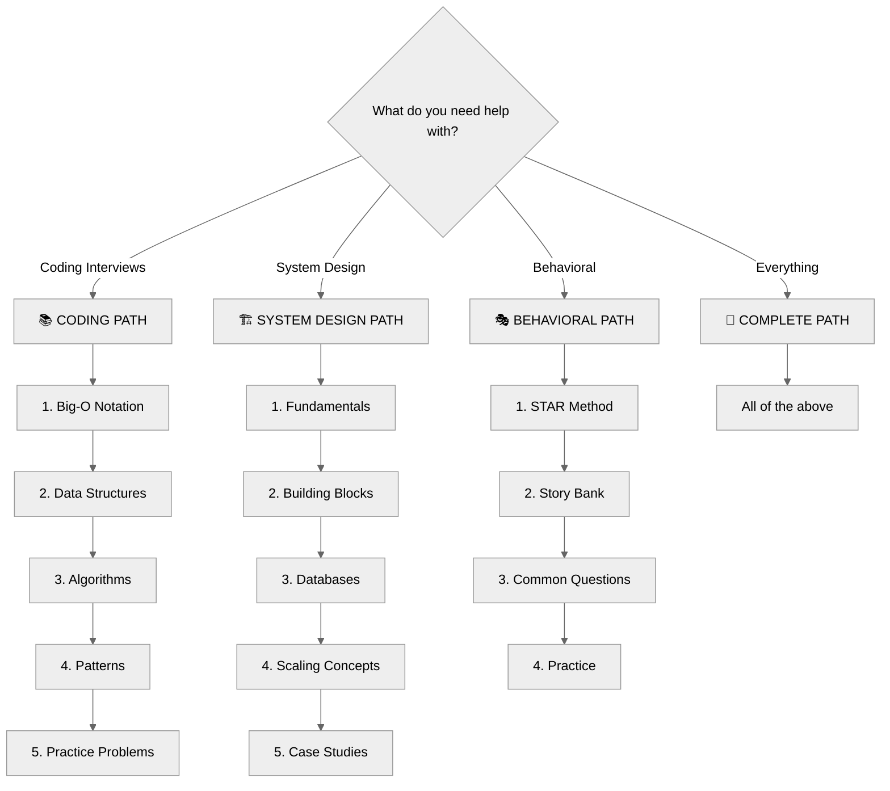
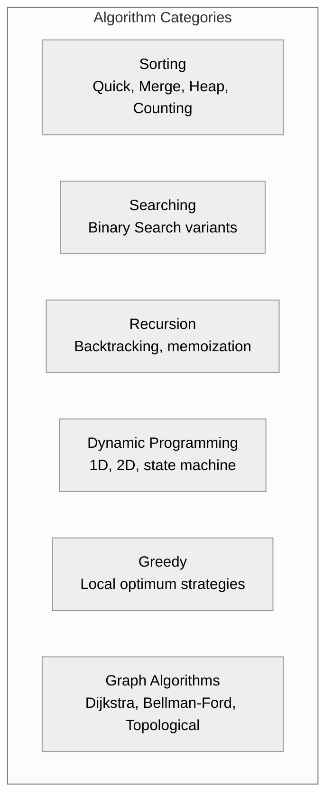
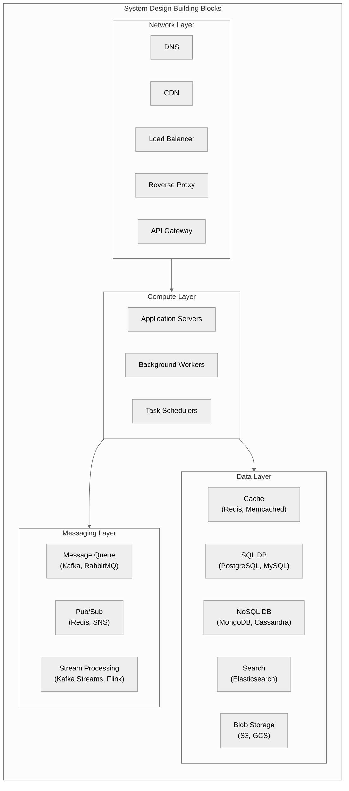
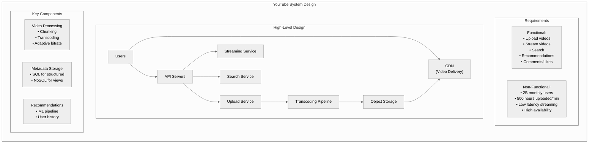
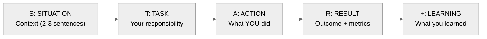
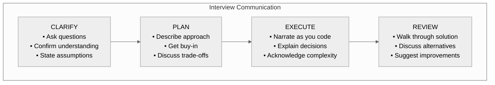
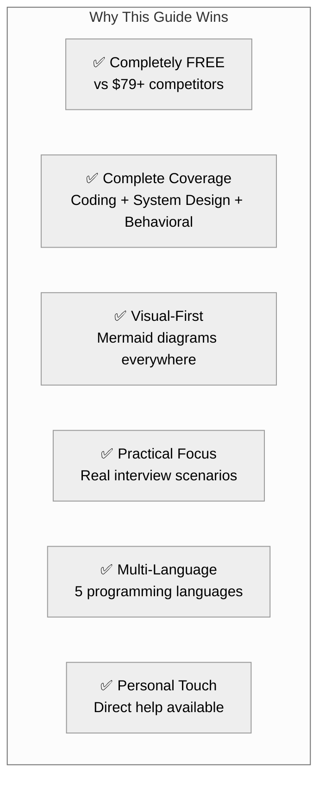

# Software Developer Interview Guide — Complete Plan

## Executive Summary

This plan outlines a **comprehensive, free Software Developer Interview Guide** covering everything engineers need to prepare for technical interviews at any company—from startups to FAANG.

### What Makes This Guide Different

```
┌────────────────────────────────────────────────────────────────────────────────┐
│              THE COMPLETE SOFTWARE DEVELOPER INTERVIEW GUIDE                    │
├────────────────────────────────────────────────────────────────────────────────┤
│                                                                                │
│  🎯 PICK YOUR PATH                                                             │
│  ────────────────                                                              │
│  "What are you preparing for?"                                                 │
│                                                                                │
│  ┌─────────────┐  ┌─────────────┐  ┌─────────────┐  ┌─────────────┐           │
│  │   CODING    │  │   SYSTEM    │  │ BEHAVIORAL  │  │    ALL      │           │
│  │  INTERVIEW  │  │   DESIGN    │  │  INTERVIEW  │  │  OF ABOVE   │           │
│  │             │  │             │  │             │  │             │           │
│  │ DS&A        │  │ Scale       │  │ STAR Method │  │ Complete    │           │
│  │ Patterns    │  │ Databases   │  │ Stories     │  │ Interview   │           │
│  │ Problems    │  │ Case Studies│  │ Questions   │  │ Prep        │           │
│  └─────────────┘  └─────────────┘  └─────────────┘  └─────────────┘           │
│                                                                                │
├────────────────────────────────────────────────────────────────────────────────┤
│                                                                                │
│  📚 SECTION 1: CODING INTERVIEWS                                               │
│  ─────────────────────────────────                                             │
│  • Data Structures (Arrays → Graphs)                                           │
│  • Algorithms (Sorting → Dynamic Programming)                                  │
│  • 15+ Coding Patterns                                                         │
│  • 200+ Practice Problems (Easy/Medium/Hard)                                   │
│  • Company-Tagged Questions                                                    │
│                                                                                │
│  🏗️ SECTION 2: SYSTEM DESIGN                                                   │
│  ─────────────────────────────                                                 │
│  • Building Blocks (Load Balancers → Message Queues)                          │
│  • Databases Deep Dive (SQL, NoSQL, NewSQL, Time-Series)                      │
│  • Scaling & Performance                                                       │
│  • 20+ Real-World Case Studies                                                 │
│  • Trade-off Analysis                                                          │
│                                                                                │
│  🎭 SECTION 3: BEHAVIORAL & SOFT SKILLS                                        │
│  ──────────────────────────────────────                                        │
│  • Communication Framework                                                     │
│  • Problem-Solving Approach                                                    │
│  • STAR Method & Story Bank                                                    │
│  • Handling Difficult Situations                                               │
│                                                                                │
└────────────────────────────────────────────────────────────────────────────────┘
```

### Competitive Comparison

| Feature | LeetCode | Grokking SD | ByteByteGo | Our Guide |
|---------|----------|-------------|------------|-----------|
| **Price** | Freemium | $79+ | $15/mo | **FREE** |
| **Coding** | ✅ Excellent | ❌ None | ❌ None | ✅ Complete |
| **System Design** | ❌ None | ✅ Good | ✅ Excellent | ✅ Complete |
| **Behavioral** | ❌ None | ❌ None | ❌ None | ✅ Complete |
| **Soft Skills** | ❌ None | ❌ None | ❌ None | ✅ Complete |
| **Visual Diagrams** | ❌ Limited | ⚠️ Some | ✅ Good | ✅ Excellent |
| **Multi-Language Code** | ✅ Yes | ❌ No | ❌ No | ✅ 5 Languages |
| **Case Studies** | ❌ None | ✅ 15+ | ✅ 20+ | ✅ 20+ |

---

## Target Audience

### Who Is This For?

1. **Software Engineers (1-5 years)** — Preparing for next role at any level
2. **Senior Engineers (5+ years)** — Brushing up on system design
3. **Career Changers** — Transitioning into software development
4. **New Graduates** — First job preparation
5. **Self-Taught Developers** — Filling knowledge gaps

### What Level Are You?

| Level | Coding Focus | System Design Focus |
|-------|--------------|---------------------|
| **Junior (0-2 years)** | Core DS&A, Easy/Medium problems | Basic concepts, smaller scale |
| **Mid-Level (2-5 years)** | Medium/Hard problems, Patterns | Full system design, trade-offs |
| **Senior (5+ years)** | Hard problems, Optimization | Complex systems, case studies |
| **Staff+ (7+ years)** | Leadership in coding rounds | Large-scale architecture |

---

## Documentation Structure

### Folder: `/docs/interview-guide/`

```
interview-guide/
├── _category_.json
├── introduction.md                    # How to use this guide
├── learning-paths.md                  # Choose your path
├── preparation-timeline.md            # 1 week to 3 month plans
│
├── coding/                            # SECTION 1: CODING INTERVIEWS
│   ├── _category_.json
│   │
│   ├── fundamentals/
│   │   ├── big-o-notation.md
│   │   ├── choosing-data-structures.md
│   │   └── problem-solving-framework.md
│   │
│   ├── data-structures/
│   │   ├── arrays-strings.md
│   │   ├── linked-lists.md
│   │   ├── stacks-queues.md
│   │   ├── hash-tables.md
│   │   ├── trees.md
│   │   ├── heaps.md
│   │   ├── graphs.md
│   │   ├── tries.md
│   │   └── advanced-structures.md
│   │
│   ├── algorithms/
│   │   ├── sorting.md
│   │   ├── searching.md
│   │   ├── recursion-backtracking.md
│   │   ├── dynamic-programming.md
│   │   ├── greedy.md
│   │   └── graph-algorithms.md
│   │
│   ├── patterns/
│   │   ├── two-pointers.md
│   │   ├── sliding-window.md
│   │   ├── fast-slow-pointers.md
│   │   ├── merge-intervals.md
│   │   ├── cyclic-sort.md
│   │   ├── in-place-reversal.md
│   │   ├── bfs-dfs.md
│   │   ├── two-heaps.md
│   │   ├── subsets.md
│   │   ├── modified-binary-search.md
│   │   ├── top-k-elements.md
│   │   ├── k-way-merge.md
│   │   ├── topological-sort.md
│   │   ├── monotonic-stack.md
│   │   └── union-find.md
│   │
│   ├── exercises/
│   │   ├── by-difficulty.md
│   │   ├── by-topic.md
│   │   ├── by-company.md
│   │   └── blind-75.md
│   │
│   └── code-quality/
│       ├── clean-code-interviews.md
│       ├── testing-edge-cases.md
│       └── complexity-analysis.md
│
├── system-design/                     # SECTION 2: SYSTEM DESIGN
│   ├── _category_.json
│   │
│   ├── fundamentals/
│   │   ├── introduction.md
│   │   ├── interview-framework.md     # Step-by-step approach
│   │   ├── requirements-gathering.md
│   │   └── capacity-estimation.md
│   │
│   ├── building-blocks/
│   │   ├── load-balancers.md
│   │   ├── api-gateway.md
│   │   ├── cdn.md
│   │   ├── dns.md
│   │   ├── reverse-proxy.md
│   │   ├── caching.md                 # Redis, Memcached, strategies
│   │   ├── message-queues.md          # Kafka, RabbitMQ, SQS
│   │   ├── search-engines.md          # Elasticsearch, Solr
│   │   ├── blob-storage.md            # S3, GCS, Azure Blob
│   │   └── rate-limiting.md
│   │
│   ├── databases/
│   │   ├── database-fundamentals.md   # ACID, indexing, normalization
│   │   ├── sql-databases.md           # PostgreSQL, MySQL
│   │   ├── nosql-overview.md          # Types and when to use
│   │   ├── document-stores.md         # MongoDB, CouchDB
│   │   ├── key-value-stores.md        # Redis, DynamoDB, Riak
│   │   ├── column-family.md           # Cassandra, HBase, ScyllaDB
│   │   ├── graph-databases.md         # Neo4j, Amazon Neptune
│   │   ├── time-series.md             # InfluxDB, TimescaleDB
│   │   ├── newsql.md                  # CockroachDB, TiDB, Spanner
│   │   ├── database-replication.md
│   │   ├── database-sharding.md
│   │   └── choosing-database.md       # Decision framework
│   │
│   ├── concepts/
│   │   ├── cap-theorem.md
│   │   ├── consistency-patterns.md
│   │   ├── availability-patterns.md
│   │   ├── partition-tolerance.md
│   │   ├── horizontal-vs-vertical.md
│   │   ├── microservices.md
│   │   ├── event-driven.md
│   │   ├── cqrs-event-sourcing.md
│   │   ├── distributed-transactions.md
│   │   ├── consensus-algorithms.md    # Paxos, Raft
│   │   ├── consistent-hashing.md
│   │   ├── bloom-filters.md
│   │   ├── leader-election.md
│   │   └── idempotency.md
│   │
│   ├── scaling/
│   │   ├── scaling-strategies.md
│   │   ├── read-vs-write-heavy.md
│   │   ├── hot-spots.md
│   │   ├── data-partitioning.md
│   │   ├── replication-strategies.md
│   │   └── global-scale.md
│   │
│   ├── reliability/
│   │   ├── fault-tolerance.md
│   │   ├── disaster-recovery.md
│   │   ├── circuit-breakers.md
│   │   ├── retry-strategies.md
│   │   ├── graceful-degradation.md
│   │   └── chaos-engineering.md
│   │
│   ├── case-studies/                  # 20+ Real Systems
│   │   ├── _category_.json
│   │   │
│   │   ├── url-shortener/             # Design TinyURL
│   │   │   └── index.md
│   │   │
│   │   ├── rate-limiter/              # Design Rate Limiter
│   │   │   └── index.md
│   │   │
│   │   ├── twitter/                   # Design Twitter
│   │   │   └── index.md
│   │   │
│   │   ├── instagram/                 # Design Instagram
│   │   │   └── index.md
│   │   │
│   │   ├── youtube/                   # Design YouTube
│   │   │   └── index.md
│   │   │
│   │   ├── netflix/                   # Design Netflix
│   │   │   └── index.md
│   │   │
│   │   ├── whatsapp/                  # Design WhatsApp
│   │   │   └── index.md
│   │   │
│   │   ├── messenger/                 # Design Facebook Messenger
│   │   │   └── index.md
│   │   │
│   │   ├── uber/                      # Design Uber
│   │   │   └── index.md
│   │   │
│   │   ├── airbnb/                    # Design Airbnb
│   │   │   └── index.md
│   │   │
│   │   ├── google-maps/               # Design Google Maps
│   │   │   └── index.md
│   │   │
│   │   ├── dropbox/                   # Design Dropbox
│   │   │   └── index.md
│   │   │
│   │   ├── google-drive/              # Design Google Drive
│   │   │   └── index.md
│   │   │
│   │   ├── web-crawler/               # Design Web Crawler
│   │   │   └── index.md
│   │   │
│   │   ├── search-engine/             # Design Search Engine
│   │   │   └── index.md
│   │   │
│   │   ├── notification-system/       # Design Notification System
│   │   │   └── index.md
│   │   │
│   │   ├── news-feed/                 # Design News Feed
│   │   │   └── index.md
│   │   │
│   │   ├── ticketmaster/              # Design Ticketmaster
│   │   │   └── index.md
│   │   │
│   │   ├── payment-system/            # Design Payment System
│   │   │   └── index.md
│   │   │
│   │   ├── chat-system/               # Design Chat System (Generic)
│   │   │   └── index.md
│   │   │
│   │   ├── typeahead/                 # Design Typeahead/Autocomplete
│   │   │   └── index.md
│   │   │
│   │   └── recommendation-engine/     # Design Recommendation System
│   │       └── index.md
│   │
│   └── exercises/
│       ├── practice-problems.md
│       └── mock-interview-guide.md
│
├── behavioral/                        # SECTION 3: BEHAVIORAL
│   ├── _category_.json
│   ├── introduction.md
│   ├── star-method.md
│   ├── story-bank.md
│   ├── common-questions.md
│   ├── leadership-questions.md
│   ├── conflict-questions.md
│   ├── failure-questions.md
│   └── company-values.md
│
├── soft-skills/                       # SECTION 4: SOFT SKILLS
│   ├── _category_.json
│   ├── communication.md
│   ├── problem-solving-approach.md
│   ├── thinking-out-loud.md
│   ├── asking-questions.md
│   ├── handling-hints.md
│   ├── managing-time.md
│   ├── when-stuck.md
│   └── code-quality-in-interviews.md
│
├── company-guides/                    # SECTION 5: COMPANY-SPECIFIC
│   ├── _category_.json
│   ├── google.md
│   ├── meta.md
│   ├── amazon.md
│   ├── apple.md
│   ├── microsoft.md
│   ├── netflix.md
│   ├── startups.md
│   └── remote-interviews.md
│
└── resources/
    ├── glossary.md
    ├── cheat-sheets.md
    ├── recommended-reading.md
    └── get-help.md                    # Contact for personalized help
```

---

## Learning Path Selector

### "What Are You Preparing For?"



### Time-Based Preparation Plans

| Time Available | Coding | System Design | Behavioral |
|----------------|--------|---------------|------------|
| **1 Week Sprint** | Patterns + 30 problems | 5 building blocks + 3 case studies | 5 stories |
| **2 Weeks** | DS&A basics + 50 problems | All building blocks + 5 case studies | 7 stories |
| **1 Month** | Complete DS&A + 100 problems | Full concepts + 10 case studies | Full prep |
| **3 Months** | Master + 200+ problems | Expert + all case studies | All scenarios |

---

## Section 1: Coding Interviews (Detailed)

### Data Structures Coverage

| Data Structure | Topics Covered | Key Patterns |
|----------------|----------------|--------------|
| **Arrays** | Static, dynamic, 2D | Two pointers, sliding window |
| **Strings** | Manipulation, matching | Pattern matching, palindromes |
| **Linked Lists** | Singly, doubly, circular | Fast/slow pointers, reversal |
| **Stacks** | LIFO, monotonic | Parentheses, next greater |
| **Queues** | FIFO, deque, priority | BFS, sliding window max |
| **Hash Tables** | Maps, sets, collision | Two sum, grouping |
| **Trees** | Binary, BST, balanced | DFS, BFS, traversals |
| **Heaps** | Min, max, priority queue | Top-K, merge K lists |
| **Graphs** | Directed, undirected, weighted | BFS, DFS, shortest path |
| **Tries** | Prefix trees | Autocomplete, word search |

### Algorithm Categories



### 15 Essential Coding Patterns

| # | Pattern | When to Use | Example Problems |
|---|---------|-------------|------------------|
| 1 | **Two Pointers** | Sorted arrays, pairs | Two Sum II, 3Sum |
| 2 | **Sliding Window** | Contiguous subarrays | Max subarray, Min window |
| 3 | **Fast & Slow Pointers** | Cycles, middle element | Linked list cycle |
| 4 | **Merge Intervals** | Overlapping ranges | Meeting rooms |
| 5 | **Cyclic Sort** | Numbers in range [0,n] | Missing number |
| 6 | **In-Place Reversal** | Linked list manipulation | Reverse k-group |
| 7 | **BFS** | Shortest path, levels | Binary tree levels |
| 8 | **DFS** | All paths, backtracking | Path sum |
| 9 | **Two Heaps** | Median, scheduling | Find median stream |
| 10 | **Subsets** | Combinations, permutations | Generate subsets |
| 11 | **Modified Binary Search** | Sorted with twist | Rotated array search |
| 12 | **Top K Elements** | K largest/smallest | Kth largest |
| 13 | **K-Way Merge** | Multiple sorted inputs | Merge K lists |
| 14 | **Topological Sort** | Dependencies | Course schedule |
| 15 | **Union Find** | Connected components | Number of islands |

---

## Section 2: System Design (Detailed)

### Building Blocks Deep Dive



### Database Decision Framework

```mermaid
%%{init: {'theme': 'neutral'}}%%
flowchart TB
    start{"What's your primary need?"}
    
    start -->|"ACID transactions"| sql["SQL Databases"]
    start -->|"Flexible schema"| doc["Document Stores"]
    start -->|"High-speed lookup"| kv["Key-Value Stores"]
    start -->|"Wide columns, analytics"| wide["Column-Family"]
    start -->|"Relationships"| graph["Graph Databases"]
    start -->|"Time-based data"| ts["Time-Series"]
    start -->|"Global scale + ACID"| newsql["NewSQL"]
    
    sql --> sqlopt["PostgreSQL, MySQL<br/>Best for: Transactions, complex queries"]
    doc --> docopt["MongoDB, CouchDB<br/>Best for: Flexible documents, rapid development"]
    kv --> kvopt["Redis, DynamoDB<br/>Best for: Sessions, caching, simple data"]
    wide --> wideopt["Cassandra, HBase<br/>Best for: Write-heavy, analytics, time-series"]
    graph --> graphopt["Neo4j, Neptune<br/>Best for: Social networks, recommendations"]
    ts --> tsopt["InfluxDB, TimescaleDB<br/>Best for: Metrics, IoT, monitoring"]
    newsql --> newsqlopt["CockroachDB, Spanner<br/>Best for: Global ACID, horizontal scale"]
```

### Database Comparison Matrix

| Database | Type | Best For | Scale | ACID | Schema |
|----------|------|----------|-------|------|--------|
| **PostgreSQL** | SQL | Complex queries | Vertical | ✅ | Strict |
| **MySQL** | SQL | Web apps | Vertical | ✅ | Strict |
| **MongoDB** | Document | Flexible data | Horizontal | ⚠️ | Flexible |
| **Redis** | Key-Value | Caching, sessions | Horizontal | ❌ | Schema-less |
| **DynamoDB** | Key-Value | AWS native, high scale | Horizontal | ⚠️ | Flexible |
| **Cassandra** | Column | Write-heavy, time-series | Horizontal | ❌ | Flexible |
| **Elasticsearch** | Search | Full-text search | Horizontal | ❌ | Flexible |
| **Neo4j** | Graph | Relationships | Vertical | ✅ | Graph |
| **CockroachDB** | NewSQL | Global ACID | Horizontal | ✅ | Strict |

### Caching Strategies

| Strategy | Description | Use Case |
|----------|-------------|----------|
| **Cache-Aside** | App manages cache | General purpose |
| **Read-Through** | Cache loads from DB | Read-heavy |
| **Write-Through** | Cache writes to DB | Strong consistency |
| **Write-Behind** | Async write to DB | Write-heavy |
| **Write-Around** | Skip cache on write | Infrequent reads |

### Message Queue Comparison

| Queue | Best For | Ordering | Persistence |
|-------|----------|----------|-------------|
| **Kafka** | Event streaming, high throughput | Partition-level | ✅ Strong |
| **RabbitMQ** | Task queues, routing | ✅ Strict | ✅ Optional |
| **SQS** | AWS native, simple queues | ❌ Best-effort | ✅ Yes |
| **Redis Pub/Sub** | Real-time, fire-and-forget | ❌ None | ❌ No |

---

## Case Studies Overview

### 20+ System Design Case Studies

Each case study follows this structure:
1. **Requirements** — Functional and non-functional
2. **Capacity Estimation** — Users, storage, bandwidth
3. **High-Level Design** — Architecture diagram
4. **Component Deep Dive** — Each major component
5. **Database Schema** — Data model
6. **API Design** — Key endpoints
7. **Scaling Considerations** — How to scale
8. **Trade-offs** — Decisions and alternatives
9. **Follow-up Questions** — Common interviewer questions

### Case Study Categories

| Category | Case Studies |
|----------|--------------|
| **Social Media** | Twitter, Instagram, Facebook News Feed |
| **Messaging** | WhatsApp, Messenger, Slack |
| **Video Streaming** | YouTube, Netflix, Twitch |
| **Ride Sharing** | Uber, Lyft |
| **E-commerce** | Amazon, Ticketmaster |
| **Storage** | Dropbox, Google Drive |
| **Search** | Web Crawler, Search Engine, Typeahead |
| **Location** | Google Maps, Yelp |
| **Hospitality** | Airbnb, Booking.com |
| **Infrastructure** | Rate Limiter, URL Shortener, Notification System |

### Sample Case Study Structure: Design YouTube



---

## Section 3: Behavioral Interviews (Detailed)

### STAR+ Framework



### Story Bank Categories

| Category | Stories to Prepare | Key Questions |
|----------|-------------------|---------------|
| **Leadership** | Led a project, mentored | "Tell me about leading a team" |
| **Conflict** | Disagreement resolved | "Conflict with colleague/manager" |
| **Failure** | Project that failed | "Tell me about a failure" |
| **Challenge** | Overcame difficulty | "Biggest technical challenge" |
| **Impact** | Made a difference | "Proudest accomplishment" |
| **Growth** | Learned something new | "How do you learn?" |
| **Pressure** | Deadline, production issue | "Working under pressure" |

### Company Values to Know

| Company | Key Values | What They Look For |
|---------|------------|-------------------|
| **Google** | Googleyness, innovation | Intellectual curiosity, collaboration |
| **Amazon** | Leadership Principles (16) | Customer obsession, bias for action |
| **Meta** | Move fast, be bold | Impact, iteration speed |
| **Apple** | Attention to detail | Passion for products |
| **Microsoft** | Growth mindset | Learning, empathy |
| **Netflix** | Freedom & responsibility | Judgment, candor |

---

## Section 4: Soft Skills (Detailed)

### Communication Framework



### What to Say When...

| Situation | Script |
|-----------|--------|
| **Starting** | "Let me make sure I understand... [restate problem]" |
| **Thinking** | "I'm considering two approaches: [A] and [B]. I think [A] is better because..." |
| **Coding** | "Now I'm handling the edge case where..." |
| **Stuck** | "I'm stuck here. Let me think about what I know..." |
| **Finished** | "Let me walk through this with an example..." |

---

## Get Help Section

### Need Personalized Guidance?

```
┌────────────────────────────────────────────────────────────────┐
│                                                                │
│   🤝 NEED HELP WITH YOUR INTERVIEW PREPARATION?                │
│                                                                │
│   This guide covers everything, but sometimes you need         │
│   personalized guidance. I'm happy to help with:               │
│                                                                │
│   • Mock interviews (coding or system design)                  │
│   • Resume review                                              │
│   • Career advice                                              │
│   • Specific company preparation                               │
│                                                                │
│   ───────────────────────────────────────────────────         │
│                                                                │
│   📧 Email: [your-email@domain.com]                           │
│   💼 LinkedIn: [your-linkedin-profile]                        │
│   💬 Twitter/X: [@your-handle]                                │
│                                                                │
│   I respond to all messages. Let's get you that offer! 🚀     │
│                                                                │
└────────────────────────────────────────────────────────────────┘
```

---

## Document Templates

### Coding Topic Template

```markdown
---
sidebar_position: N
title: "[Topic] — Complete Guide"
description: "Master [topic] for coding interviews..."
keywords: [topic interview questions, topic leetcode, etc.]
---

# [Topic]

[Opening story about this topic in interviews]

## What You'll Learn
- Concept 1
- Concept 2
- Concept 3

## Core Concepts

[Visual diagram]

### [Concept 1]
[Explanation with code]

### [Concept 2]
[Explanation with code]

## Common Patterns

[Table of patterns]

## Implementation

<CodeTabs>
  [Python, TypeScript, Go, Java, C#]
</CodeTabs>

## Interview Problems

### Easy
[Problems with hints]

### Medium
[Problems with hints]

### Hard
[Problems with hints]

## Common Mistakes
[What to avoid]

## Key Takeaways
[Summary]
```

### System Design Case Study Template

```markdown
---
sidebar_position: N
title: "Design [System] — System Design Interview"
description: "Complete guide to designing [system]..."
keywords: [design system interview, system architecture, etc.]
---

# Design [System]

[Opening: why this is asked, what it tests]

## Requirements

### Functional Requirements
- Requirement 1
- Requirement 2
- Requirement 3

### Non-Functional Requirements
- Scale: [numbers]
- Latency: [targets]
- Availability: [targets]

### Out of Scope
- Feature 1
- Feature 2

## Capacity Estimation

| Metric | Value |
|--------|-------|
| DAU | X million |
| Requests/sec | Y |
| Storage | Z TB/year |

## High-Level Design

```mermaid
[Architecture diagram]
```

## Component Deep Dive

### [Component 1]
[Detailed design]

### [Component 2]
[Detailed design]

## Database Design

### Schema
[ER diagram or schema]

### Database Choice
[Why this database]

## API Design

### [Endpoint 1]
```
POST /api/v1/resource
Request: { }
Response: { }
```

## Scaling Considerations

### Read Scaling
[Strategies]

### Write Scaling
[Strategies]

## Trade-offs

| Decision | Option A | Option B | Our Choice |
|----------|----------|----------|------------|
| [Decision] | [A] | [B] | [Choice + reasoning] |

## Follow-up Questions

1. How would you handle [scenario]?
2. What if [constraint changes]?
3. How would you [additional feature]?

## Key Takeaways
[Summary of design decisions]
```

---

## Implementation Phases

### Phase 1: Foundation & Coding (Priority: Critical)
| # | Document | Hours |
|---|----------|-------|
| 1 | Introduction & Learning Paths | 4 |
| 2 | Big-O Notation | 3 |
| 3 | Problem-Solving Framework | 3 |
| 4-10 | Data Structures (7 docs) | 28 |
| 11-16 | Algorithms (6 docs) | 24 |
| 17-31 | Coding Patterns (15 docs) | 45 |
| 32-35 | Code Quality & Exercises | 12 |

**Phase 1 Total:** ~119 hours

### Phase 2: System Design (Priority: Critical)
| # | Document | Hours |
|---|----------|-------|
| 36-39 | Fundamentals (4 docs) | 16 |
| 40-49 | Building Blocks (10 docs) | 40 |
| 50-62 | Databases (13 docs) | 52 |
| 63-76 | Concepts (14 docs) | 42 |
| 77-82 | Scaling & Reliability (6 docs) | 24 |
| 83-104 | Case Studies (22 docs) | 110 |

**Phase 2 Total:** ~284 hours

### Phase 3: Behavioral & Soft Skills (Priority: High)
| # | Document | Hours |
|---|----------|-------|
| 105-112 | Behavioral (8 docs) | 24 |
| 113-121 | Soft Skills (9 docs) | 27 |
| 122-129 | Company Guides (8 docs) | 24 |

**Phase 3 Total:** ~75 hours

### Phase 4: Polish & Resources (Priority: Medium)
| # | Document | Hours |
|---|----------|-------|
| 130-133 | Glossary, Cheat Sheets, Resources | 12 |
| 134 | Get Help page | 2 |
| 135 | Review & polish | 20 |

**Phase 4 Total:** ~34 hours

---

## Total Effort Summary

| Phase | Documents | Hours |
|-------|-----------|-------|
| Phase 1: Coding | 35 | 119 |
| Phase 2: System Design | 69 | 284 |
| Phase 3: Behavioral | 25 | 75 |
| Phase 4: Polish | 6 | 34 |
| **TOTAL** | **135** | **512 hours** |

---

## Success Metrics

### Traffic Goals
- 10,000 monthly visitors within 6 months
- Top 10 Google ranking for key terms
- 500+ GitHub stars (if open-sourced)

### Engagement Goals
- Average time on page > 5 minutes
- Return visitor rate > 30%
- Newsletter signups (if added)

### Community Goals
- 50+ help requests via contact form
- Active discussions/comments
- Social shares and backlinks

---

## Competitive Advantages



---

## Next Steps

1. **Approve restructured plan** — Review this comprehensive guide structure
2. **Rename folder** — Move from `/docs/data-structures/` to `/docs/interview-guide/`
3. **Set up contact page** — Create "Get Help" with your contact info
4. **Begin Phase 1** — Start with Introduction and Learning Paths
5. **Prioritize by demand** — Focus on most-searched topics first

---

## Questions for You

1. **Contact info:** What email/LinkedIn should go in the "Get Help" section?
2. **Case study priority:** Which 5 case studies should we write first?
3. **Focus area:** Should we start with Coding or System Design content?
4. **Timeline:** How quickly do you want to publish initial content?

---

*This guide will be the most comprehensive free resource for software developer interview preparation.*
