# Software Developer Interview Guide — Implementation Roadmap

## Quick Links

| Document | Description |
|----------|-------------|
| [COMPREHENSIVE-PLAN.md](./COMPREHENSIVE-PLAN.md) | Full guide structure with all sections |
| [DETAILED-OUTLINES.md](./DETAILED-OUTLINES.md) | Expanded outlines for key pages |
| [VISUAL-GUIDELINES.md](./VISUAL-GUIDELINES.md) | Mermaid diagrams and styling standards |

---

## Executive Summary

### What We're Building

The **most comprehensive FREE software developer interview guide** covering:

```
┌─────────────────────────────────────────────────────────────────────┐
│           COMPLETE SOFTWARE DEVELOPER INTERVIEW GUIDE               │
├─────────────────────────────────────────────────────────────────────┤
│                                                                     │
│  📚 CODING             🏗️ SYSTEM DESIGN         🎭 BEHAVIORAL      │
│  ──────────           ──────────────           ────────────        │
│  • Data Structures    • Building Blocks        • STAR Method       │
│  • Algorithms         • 13 Database Types      • Story Bank        │
│  • 15 Patterns        • Scaling Concepts       • Company Values    │
│  • 200+ Problems      • 22 Case Studies        • Soft Skills       │
│                                                                     │
│  📊 STATS: 135 documents | 512 hours of content | 100% FREE        │
│                                                                     │
└─────────────────────────────────────────────────────────────────────┘
```

### Why This Guide?

| Competitor | Price | Coding | System Design | Behavioral | Our Edge |
|------------|-------|--------|---------------|------------|----------|
| LeetCode | $35/mo | ✅ | ❌ | ❌ | We have everything |
| Grokking SD | $79 | ❌ | ✅ | ❌ | We're free |
| ByteByteGo | $15/mo | ❌ | ✅ | ❌ | We have coding too |
| Tech Interview Handbook | Free | ✅ | ⚠️ | ✅ | More system design |
| **Our Guide** | **FREE** | ✅ | ✅ | ✅ | **All-in-one** |

---

## Complete Document Inventory

### Section 1: Foundation (5 documents)
| # | Document | Est. Hours | Priority |
|---|----------|------------|----------|
| 1 | `introduction.md` | 4 | Critical |
| 2 | `learning-paths.md` | 3 | Critical |
| 3 | `preparation-timeline.md` | 2 | High |
| 4 | `glossary.md` | 4 | Medium |
| 5 | `get-help.md` | 1 | High |

### Section 2: Coding — Fundamentals (3 documents)
| # | Document | Est. Hours | Priority |
|---|----------|------------|----------|
| 6 | `coding/fundamentals/big-o-notation.md` | 4 | Critical |
| 7 | `coding/fundamentals/choosing-data-structures.md` | 3 | High |
| 8 | `coding/fundamentals/problem-solving-framework.md` | 3 | Critical |

### Section 3: Coding — Data Structures (9 documents)
| # | Document | Est. Hours | Priority |
|---|----------|------------|----------|
| 9 | `coding/data-structures/arrays-strings.md` | 5 | Critical |
| 10 | `coding/data-structures/linked-lists.md` | 4 | Critical |
| 11 | `coding/data-structures/stacks-queues.md` | 4 | Critical |
| 12 | `coding/data-structures/hash-tables.md` | 5 | Critical |
| 13 | `coding/data-structures/trees.md` | 5 | Critical |
| 14 | `coding/data-structures/heaps.md` | 4 | High |
| 15 | `coding/data-structures/graphs.md` | 5 | Critical |
| 16 | `coding/data-structures/tries.md` | 3 | Medium |
| 17 | `coding/data-structures/advanced-structures.md` | 4 | Medium |

### Section 4: Coding — Algorithms (6 documents)
| # | Document | Est. Hours | Priority |
|---|----------|------------|----------|
| 18 | `coding/algorithms/sorting.md` | 5 | High |
| 19 | `coding/algorithms/searching.md` | 4 | High |
| 20 | `coding/algorithms/recursion-backtracking.md` | 5 | High |
| 21 | `coding/algorithms/dynamic-programming.md` | 6 | Critical |
| 22 | `coding/algorithms/greedy.md` | 3 | Medium |
| 23 | `coding/algorithms/graph-algorithms.md` | 5 | High |

### Section 5: Coding — Patterns (15 documents)
| # | Document | Est. Hours | Priority |
|---|----------|------------|----------|
| 24 | `coding/patterns/two-pointers.md` | 3 | Critical |
| 25 | `coding/patterns/sliding-window.md` | 3 | Critical |
| 26 | `coding/patterns/fast-slow-pointers.md` | 3 | High |
| 27 | `coding/patterns/merge-intervals.md` | 3 | High |
| 28 | `coding/patterns/cyclic-sort.md` | 2 | Medium |
| 29 | `coding/patterns/in-place-reversal.md` | 2 | Medium |
| 30 | `coding/patterns/bfs-dfs.md` | 4 | Critical |
| 31 | `coding/patterns/two-heaps.md` | 3 | High |
| 32 | `coding/patterns/subsets.md` | 3 | High |
| 33 | `coding/patterns/modified-binary-search.md` | 3 | High |
| 34 | `coding/patterns/top-k-elements.md` | 3 | High |
| 35 | `coding/patterns/k-way-merge.md` | 3 | Medium |
| 36 | `coding/patterns/topological-sort.md` | 3 | High |
| 37 | `coding/patterns/monotonic-stack.md` | 3 | High |
| 38 | `coding/patterns/union-find.md` | 3 | High |

### Section 6: Coding — Exercises & Code Quality (4 documents)
| # | Document | Est. Hours | Priority |
|---|----------|------------|----------|
| 39 | `coding/exercises/by-difficulty.md` | 4 | High |
| 40 | `coding/exercises/by-topic.md` | 3 | High |
| 41 | `coding/exercises/by-company.md` | 3 | Medium |
| 42 | `coding/exercises/blind-75.md` | 4 | High |
| 43 | `coding/code-quality/clean-code-interviews.md` | 3 | High |
| 44 | `coding/code-quality/testing-edge-cases.md` | 2 | High |
| 45 | `coding/code-quality/complexity-analysis.md` | 2 | High |

### Section 7: System Design — Fundamentals (4 documents)
| # | Document | Est. Hours | Priority |
|---|----------|------------|----------|
| 46 | `system-design/fundamentals/introduction.md` | 4 | Critical |
| 47 | `system-design/fundamentals/interview-framework.md` | 4 | Critical |
| 48 | `system-design/fundamentals/requirements-gathering.md` | 3 | High |
| 49 | `system-design/fundamentals/capacity-estimation.md` | 4 | High |

### Section 8: System Design — Building Blocks (10 documents)
| # | Document | Est. Hours | Priority |
|---|----------|------------|----------|
| 50 | `system-design/building-blocks/load-balancers.md` | 4 | Critical |
| 51 | `system-design/building-blocks/api-gateway.md` | 3 | High |
| 52 | `system-design/building-blocks/cdn.md` | 3 | High |
| 53 | `system-design/building-blocks/dns.md` | 2 | Medium |
| 54 | `system-design/building-blocks/reverse-proxy.md` | 2 | Medium |
| 55 | `system-design/building-blocks/caching.md` | 5 | Critical |
| 56 | `system-design/building-blocks/message-queues.md` | 5 | Critical |
| 57 | `system-design/building-blocks/search-engines.md` | 3 | High |
| 58 | `system-design/building-blocks/blob-storage.md` | 3 | High |
| 59 | `system-design/building-blocks/rate-limiting.md` | 4 | High |

### Section 9: System Design — Databases (13 documents)
| # | Document | Est. Hours | Priority |
|---|----------|------------|----------|
| 60 | `system-design/databases/database-fundamentals.md` | 5 | Critical |
| 61 | `system-design/databases/sql-databases.md` | 4 | Critical |
| 62 | `system-design/databases/nosql-overview.md` | 4 | Critical |
| 63 | `system-design/databases/document-stores.md` | 4 | High |
| 64 | `system-design/databases/key-value-stores.md` | 4 | High |
| 65 | `system-design/databases/column-family.md` | 4 | High |
| 66 | `system-design/databases/graph-databases.md` | 3 | Medium |
| 67 | `system-design/databases/time-series.md` | 3 | Medium |
| 68 | `system-design/databases/newsql.md` | 3 | Medium |
| 69 | `system-design/databases/database-replication.md` | 4 | High |
| 70 | `system-design/databases/database-sharding.md` | 4 | High |
| 71 | `system-design/databases/choosing-database.md` | 5 | Critical |

### Section 10: System Design — Concepts (14 documents)
| # | Document | Est. Hours | Priority |
|---|----------|------------|----------|
| 72 | `system-design/concepts/cap-theorem.md` | 4 | Critical |
| 73 | `system-design/concepts/consistency-patterns.md` | 3 | High |
| 74 | `system-design/concepts/availability-patterns.md` | 3 | High |
| 75 | `system-design/concepts/partition-tolerance.md` | 2 | Medium |
| 76 | `system-design/concepts/horizontal-vs-vertical.md` | 3 | High |
| 77 | `system-design/concepts/microservices.md` | 4 | High |
| 78 | `system-design/concepts/event-driven.md` | 4 | High |
| 79 | `system-design/concepts/cqrs-event-sourcing.md` | 3 | Medium |
| 80 | `system-design/concepts/distributed-transactions.md` | 4 | High |
| 81 | `system-design/concepts/consensus-algorithms.md` | 3 | Medium |
| 82 | `system-design/concepts/consistent-hashing.md` | 3 | High |
| 83 | `system-design/concepts/bloom-filters.md` | 2 | Medium |
| 84 | `system-design/concepts/leader-election.md` | 3 | Medium |
| 85 | `system-design/concepts/idempotency.md` | 2 | High |

### Section 11: System Design — Scaling & Reliability (6 documents)
| # | Document | Est. Hours | Priority |
|---|----------|------------|----------|
| 86 | `system-design/scaling/scaling-strategies.md` | 4 | High |
| 87 | `system-design/scaling/read-vs-write-heavy.md` | 3 | High |
| 88 | `system-design/scaling/hot-spots.md` | 2 | Medium |
| 89 | `system-design/reliability/fault-tolerance.md` | 4 | High |
| 90 | `system-design/reliability/disaster-recovery.md` | 3 | Medium |
| 91 | `system-design/reliability/circuit-breakers.md` | 3 | High |

### Section 12: System Design — Case Studies (22 documents)
| # | Document | Est. Hours | Priority |
|---|----------|------------|----------|
| 92 | `case-studies/url-shortener/index.md` | 5 | Critical |
| 93 | `case-studies/rate-limiter/index.md` | 5 | Critical |
| 94 | `case-studies/twitter/index.md` | 6 | Critical |
| 95 | `case-studies/instagram/index.md` | 5 | High |
| 96 | `case-studies/youtube/index.md` | 6 | Critical |
| 97 | `case-studies/netflix/index.md` | 6 | Critical |
| 98 | `case-studies/whatsapp/index.md` | 5 | High |
| 99 | `case-studies/messenger/index.md` | 5 | High |
| 100 | `case-studies/uber/index.md` | 6 | High |
| 101 | `case-studies/airbnb/index.md` | 5 | Medium |
| 102 | `case-studies/google-maps/index.md` | 5 | Medium |
| 103 | `case-studies/dropbox/index.md` | 5 | High |
| 104 | `case-studies/google-drive/index.md` | 5 | Medium |
| 105 | `case-studies/web-crawler/index.md` | 5 | High |
| 106 | `case-studies/search-engine/index.md` | 5 | Medium |
| 107 | `case-studies/notification-system/index.md` | 5 | High |
| 108 | `case-studies/news-feed/index.md` | 5 | High |
| 109 | `case-studies/ticketmaster/index.md` | 5 | Medium |
| 110 | `case-studies/payment-system/index.md` | 5 | High |
| 111 | `case-studies/chat-system/index.md` | 5 | High |
| 112 | `case-studies/typeahead/index.md` | 4 | High |
| 113 | `case-studies/recommendation-engine/index.md` | 5 | Medium |

### Section 13: Behavioral (8 documents)
| # | Document | Est. Hours | Priority |
|---|----------|------------|----------|
| 114 | `behavioral/introduction.md` | 2 | High |
| 115 | `behavioral/star-method.md` | 3 | Critical |
| 116 | `behavioral/story-bank.md` | 4 | Critical |
| 117 | `behavioral/common-questions.md` | 4 | High |
| 118 | `behavioral/leadership-questions.md` | 3 | High |
| 119 | `behavioral/conflict-questions.md` | 3 | High |
| 120 | `behavioral/failure-questions.md` | 3 | High |
| 121 | `behavioral/company-values.md` | 3 | High |

### Section 14: Soft Skills (9 documents)
| # | Document | Est. Hours | Priority |
|---|----------|------------|----------|
| 122 | `soft-skills/communication.md` | 4 | Critical |
| 123 | `soft-skills/problem-solving-approach.md` | 4 | Critical |
| 124 | `soft-skills/thinking-out-loud.md` | 3 | High |
| 125 | `soft-skills/asking-questions.md` | 3 | High |
| 126 | `soft-skills/handling-hints.md` | 2 | High |
| 127 | `soft-skills/managing-time.md` | 2 | High |
| 128 | `soft-skills/when-stuck.md` | 3 | High |
| 129 | `soft-skills/code-quality-in-interviews.md` | 3 | High |

### Section 15: Company Guides (8 documents)
| # | Document | Est. Hours | Priority |
|---|----------|------------|----------|
| 130 | `company-guides/google.md` | 4 | High |
| 131 | `company-guides/meta.md` | 4 | High |
| 132 | `company-guides/amazon.md` | 4 | High |
| 133 | `company-guides/apple.md` | 3 | Medium |
| 134 | `company-guides/microsoft.md` | 3 | Medium |
| 135 | `company-guides/netflix.md` | 3 | Medium |
| 136 | `company-guides/startups.md` | 3 | High |
| 137 | `company-guides/remote-interviews.md` | 3 | High |

---

## Total Summary

| Section | Documents | Hours |
|---------|-----------|-------|
| Foundation | 5 | 14 |
| Coding — Fundamentals | 3 | 10 |
| Coding — Data Structures | 9 | 39 |
| Coding — Algorithms | 6 | 28 |
| Coding — Patterns | 15 | 44 |
| Coding — Exercises & Quality | 7 | 21 |
| System Design — Fundamentals | 4 | 15 |
| System Design — Building Blocks | 10 | 34 |
| System Design — Databases | 13 | 48 |
| System Design — Concepts | 14 | 43 |
| System Design — Scaling/Reliability | 6 | 19 |
| System Design — Case Studies | 22 | 114 |
| Behavioral | 8 | 25 |
| Soft Skills | 8 | 24 |
| Company Guides | 8 | 30 |
| **TOTAL** | **137** | **508 hours** |

---

## Recommended Implementation Order

### Sprint 1: Core Foundation (Week 1-2)
Focus: Get essential content live first

| Priority | Documents | Why First |
|----------|-----------|-----------|
| 1 | Introduction + Learning Paths | Entry point for all users |
| 2 | Big-O Notation | Foundation for everything |
| 3 | Arrays & Strings | Most common interview topic |
| 4 | Hash Tables | Second most common |
| 5 | Two Pointers + Sliding Window | Most essential patterns |

### Sprint 2: Coding Essentials (Week 3-4)
| Priority | Documents | Why |
|----------|-----------|-----|
| 1 | Trees, Graphs | Core data structures |
| 2 | Dynamic Programming | High-value topic |
| 3 | BFS/DFS pattern | Used everywhere |
| 4 | Remaining patterns | Complete coding coverage |

### Sprint 3: System Design Foundation (Week 5-6)
| Priority | Documents | Why |
|----------|-----------|-----|
| 1 | SD Introduction + Framework | Entry point |
| 2 | Load Balancers, Caching, Queues | Most used building blocks |
| 3 | Database Fundamentals + SQL/NoSQL | Core knowledge |
| 4 | CAP Theorem, Scaling | Conceptual foundation |

### Sprint 4: Case Studies (Week 7-8)
| Priority | Documents | Why |
|----------|-----------|-----|
| 1 | URL Shortener, Rate Limiter | Classic starter problems |
| 2 | Twitter, YouTube | Most commonly asked |
| 3 | WhatsApp, Netflix | High-frequency questions |
| 4 | Remaining case studies | Complete coverage |

### Sprint 5: Behavioral & Polish (Week 9-10)
| Priority | Documents | Why |
|----------|-----------|-----|
| 1 | STAR Method, Story Bank | Core behavioral prep |
| 2 | Communication, Problem-solving | Soft skills |
| 3 | Company Guides | Targeted preparation |
| 4 | Get Help page | Call to action |

---

## Key Metrics to Track

### Content Metrics
- [ ] Documents completed: 0/137
- [ ] Total words written: 0
- [ ] Diagrams created: 0
- [ ] Code examples: 0

### Traffic Metrics (Post-Launch)
- Monthly visitors
- Time on page
- Bounce rate
- Search rankings

### Engagement Metrics
- Help requests received
- Social shares
- Backlinks acquired

---

## Unique Selling Points

```mermaid
%%{init: {'theme': 'neutral'}}%%
flowchart TB
    subgraph usp["Why Choose This Guide"]
        free["💰 100% FREE<br/>No paywall, no subscription"]
        complete["📚 COMPLETE<br/>Coding + System Design + Behavioral"]
        visual["🎨 VISUAL<br/>200+ Mermaid diagrams"]
        practical["🎯 PRACTICAL<br/>Real interview scenarios"]
        code["💻 MULTI-LANGUAGE<br/>Python, TS, Go, Java, C#"]
        help["🤝 SUPPORT<br/>Direct help available"]
    end
```



---

## Next Steps

1. **Approve this plan** — Confirm the structure
2. **Provide contact info** — For "Get Help" section
3. **Choose starting point** — Coding or System Design first?
4. **Set timeline** — When to publish first batch?

Ready to build the best free interview guide on the internet! 🚀
