# Design Patterns Documentation Series — Master Plan

> **Goal:** Create the definitive, single-stop resource for developers to understand, implement, and master design patterns. This series will differentiate itself through real industry examples, multi-language idiomatic code, practical decision frameworks, and a narrative mentor-style voice that makes patterns memorable and immediately applicable.

---

## Visual Overview

### Series Architecture


### Pattern Family Relationships


---

## Expert Review: Key Gaps Identified

Before diving into the plan, here are critical gaps identified during expert review that have been addressed:


---

## Executive Summary

### The Opportunity

Design patterns content online falls into two categories: academic (dry, toy examples, no context) or superficial (definitions without depth). The dominant player—Refactoring.guru—does an excellent job with visualizations and code examples, but opportunities exist to differentiate:

1. **Real industry examples** — Most sites use "pizza" or "car factory" examples. We'll show how Netflix uses Observer, how AWS implements Circuit Breaker, how Stripe handles Strategy patterns.

2. **Multi-language idiomatic code** — Not just translated Java, but patterns written the way each language's community actually writes them (Pythonic Python, idiomatic Go, modern TypeScript).

3. **Modern patterns beyond GoF** — Cloud-native patterns, microservices patterns, frontend rendering patterns that the classic 22 don't cover.

4. **Anti-patterns alongside patterns** — Teaching what NOT to do is as valuable as what to do.

5. **Decision frameworks** — Not just "what is Factory," but "should I use Factory or Builder here?"

6. **Interview preparation** — High-value SEO target with practical applicability.

7. **Mentor-style narrative** — Our distinctive voice that makes content engaging and memorable.

### Success Metrics (Updated)

- **SEO**: Rank in top 5 for primary pattern keywords within 6 months
- **Engagement**: Average time on page > 5 minutes
- **Completeness**: Cover 23 GoF + 25 modern/specialized + 10 anti-patterns + 10 architectural
- **Utility**: Each article includes runnable code in 5 languages
- **NEW — Testing Coverage**: Every pattern includes testing guidance
- **NEW — Learning Paths**: Clear progression for 3 experience levels
- **NEW — Downloads**: 5+ downloadable resources per major section

---

## Competitive Analysis

### Primary Competitors

| Site | Strengths | Weaknesses | Our Differentiation |
|------|-----------|------------|---------------------|
| **Refactoring.guru** | Beautiful visuals, 9 languages, comprehensive GoF coverage | Toy examples, academic tone, no modern patterns, limited "when to use" guidance | Real-world examples, mentor voice, modern patterns, decision frameworks |
| **SourceMaking** | Solid explanations, organized | Same author as Refactoring.guru (less updated), dated feel | Fresh content, modern practices, better UX |
| **Patterns.dev** | Modern JS patterns, rendering patterns | JavaScript-only, no classic patterns | Multi-language, comprehensive coverage |
| **GeeksforGeeks** | SEO dominance, interview focus | Poor quality, inconsistent, ad-heavy | Quality over quantity, cohesive series |
| **TutorialsPoint** | Broad coverage | Very basic, outdated examples | Depth, modern idiomatic code |

### Content Gap Analysis (Updated After Expert Review)

| Missing from Competitors | Our Approach |
|--------------------------|--------------|
| Industry case studies | Dedicated examples from Netflix, Stripe, AWS, Kubernetes |
| Pattern selection guidance | Decision trees and "Pattern Selector" interactive guide |
| Anti-patterns | Dedicated section on what NOT to do |
| Modern patterns (cloud, microservices) | Full section on patterns emerged post-GoF |
| Interview preparation | Dedicated interview guide with common questions |
| Practical exercises | "Try it yourself" sections with exercises |
| When NOT to use patterns | Explicit "Avoid When" sections in each pattern |
| **SOLID principles connection** | Every pattern linked to SOLID principles it supports |
| **Concurrency patterns** | Dedicated section for multi-threaded patterns |
| **Architectural patterns** | MVC, MVVM, Clean Architecture coverage |
| **Testing guidance** | How to test code using each pattern |
| **Framework pattern analysis** | Show patterns in React, Spring, Django, .NET |
| **Pattern combinations** | How patterns work together in real systems |
| **Experience-based learning paths** | Curated journeys for junior → senior developers |
| **Performance considerations** | When patterns add overhead |
| **Language-specific idioms** | Not translated Java — truly idiomatic code |
| **Downloadable resources** | Cheat sheets, code templates, flashcards |

---

## SEO Strategy

### Primary Keywords (High Volume, High Competition)

| Keyword | Monthly Volume (Est.) | Current Top Ranker | Our Target |
|---------|----------------------|-------------------|------------|
| "design patterns" | 50K+ | Refactoring.guru | Top 5 |
| "factory pattern" | 10K+ | Refactoring.guru | Top 3 |
| "singleton pattern" | 8K+ | Refactoring.guru | Top 3 |
| "observer pattern" | 6K+ | Refactoring.guru | Top 3 |
| "strategy pattern" | 5K+ | Refactoring.guru | Top 3 |
| "design patterns interview questions" | 8K+ | GeeksforGeeks | Top 3 |

### Long-Tail Keywords (Lower Competition, High Intent)

| Keyword Pattern | Examples | Strategy |
|-----------------|----------|----------|
| `[pattern] [language] example` | "factory pattern python example" | Dedicated language tabs with idiomatic code |
| `[pattern] vs [pattern]` | "factory vs builder pattern" | Comparison pages and sections |
| `[pattern] real world example` | "observer pattern real world" | Industry case studies |
| `when to use [pattern]` | "when to use strategy pattern" | Decision framework sections |
| `[pattern] interview questions` | "singleton pattern interview" | FAQ sections optimized for snippets |
| `[pattern] anti-pattern` | "singleton anti-pattern" | Anti-pattern coverage |

### Featured Snippet Optimization

Every pattern page will include:

1. **Definition box** — 40-60 word definition immediately after H1 (targets definition snippets)
2. **"When to Use" list** — 5-7 bullet points (targets list snippets)
3. **Comparison tables** — Pattern vs alternatives (targets table snippets)
4. **FAQ section** — Common questions with concise answers (targets FAQ snippets)

### URL Structure

```
/docs/design-patterns/                    # Introduction
/docs/design-patterns/catalog/            # Full catalog (pillar page)
/docs/design-patterns/creational/         # Category overview
/docs/design-patterns/creational/factory-method/  # Individual pattern
/docs/design-patterns/comparisons/        # Pattern comparisons
/docs/design-patterns/interview-guide/    # Interview preparation
/docs/design-patterns/glossary/           # Quick reference
```

### Internal Linking Strategy


**Link Strategy Per Page:**
- Every pattern links to 2-3 related patterns
- Every pattern links back to its category overview
- Every pattern links to relevant comparison page
- Comparison pages link to all compared patterns
- Interview guide links to top 10 most-asked patterns

---

## Content Architecture

### Section 1: Foundations (4 documents)

#### 1.1 Introduction to Design Patterns
**URL:** `/docs/design-patterns/introduction`
**Target Keywords:** "design patterns", "what are design patterns", "design patterns tutorial"

**Content Outline:**
- Hook: A story about debugging spaghetti code that patterns would have prevented
- What design patterns actually are (and aren't)
- The history: GoF book, why patterns emerged
- Why patterns matter: vocabulary, proven solutions, maintainability
- How to learn patterns effectively (the trap of memorization)
- Criticism and when patterns hurt (over-engineering)
- Navigation guide for different readers
- The pattern mindset vs. pattern worship

**Key Differentiator:** Frame patterns as tools for communication and thinking, not recipes to blindly follow.

#### 1.2 Pattern Catalog Overview
**URL:** `/docs/design-patterns/catalog`
**Target Keywords:** "design patterns catalog", "list of design patterns", "all design patterns"

**Content Outline:**
- Visual catalog of all 23 GoF patterns + modern patterns
- Quick reference table with one-line descriptions
- Pattern relationships and families
- Complexity/frequency matrix
- "Which pattern do I need?" decision tree
- Quick links to each pattern

**Key Differentiator:** Interactive decision tree that helps readers find the right pattern.

**Example: Pattern Selection Decision Tree**


#### 1.3 Pattern Selection Framework
**URL:** `/docs/design-patterns/choosing-patterns`
**Target Keywords:** "how to choose design pattern", "when to use design patterns"

**Content Outline:**
- The cost of wrong pattern choices
- Decision framework: problem → pattern families → specific pattern
- Common problem categories and their pattern solutions
- Red flags that suggest a pattern might help
- Red flags that suggest you're over-engineering
- Team communication about patterns

**Key Differentiator:** Practical decision-making focus that competitors lack.

#### 1.4 Reading Pattern Documentation
**URL:** `/docs/design-patterns/reading-patterns`
**Target Keywords:** "design pattern structure", "how to read design patterns"

**Content Outline:**
- How patterns are documented (intent, motivation, structure, etc.)
- UML crash course for pattern diagrams
- How to read code examples effectively
- Translating patterns between languages
- Building pattern recognition skills

#### 1.5 Learning Paths by Experience Level (NEW)
**URL:** `/docs/design-patterns/learning-paths`
**Target Keywords:** "learn design patterns", "design patterns roadmap"

**Content:** Curated paths for different audiences.

```mermaid
%%{init: {'theme': 'base'}}%%
flowchart TB
    subgraph junior["🌱 Junior Developer (0-2 years)"]
        direction LR
        J1["1. Introduction"] --> J2["2. Factory Method"]
        J2 --> J3["3. Singleton"]
        J3 --> J4["4. Observer"]
        J4 --> J5["5. Strategy"]
        J5 --> J6["6. Adapter"]
        J6 --> J7["Interview Guide"]
    end
    
    subgraph mid["🌿 Mid-Level Developer (2-5 years)"]
        direction LR
        M1["All GoF Patterns"] --> M2["Anti-Patterns"]
        M2 --> M3["SOLID Principles"]
        M3 --> M4["Testing Patterns"]
        M4 --> M5["Combining Patterns"]
    end
    
    subgraph senior["🌳 Senior/Architect (5+ years)"]
        direction LR
        S1["Architectural Patterns"] --> S2["Concurrency Patterns"]
        S2 --> S3["API Patterns"]
        S3 --> S4["Modern Cloud Patterns"]
        S4 --> S5["Framework Patterns"]
    end
    
    junior --> mid
    mid --> senior
    
    style junior fill:#dcfce7,stroke:#22c55e
    style mid fill:#dbeafe,stroke:#3b82f6
    style senior fill:#fef3c7,stroke:#f59e0b
```



**Difficulty Indicators:** Every pattern page will include a difficulty badge:
- 🟢 **Beginner** — Fundamental patterns every developer should know
- 🟡 **Intermediate** — Requires understanding of OOP and basic patterns
- 🔴 **Advanced** — Complex patterns for specific scenarios

---

### Section 2: Creational Patterns (6 documents)

Category overview + 5 individual patterns.

#### 2.1 Creational Patterns Overview
**URL:** `/docs/design-patterns/creational/`
**Target Keywords:** "creational design patterns", "object creation patterns"

**Content:**
- What problems creational patterns solve
- When object creation becomes complex enough to warrant patterns
- Quick comparison of all 5 creational patterns
- Decision guide: which creational pattern for which problem?

#### 2.2 Factory Method Pattern
**URL:** `/docs/design-patterns/creational/factory-method`
**Target Keywords:** "factory method pattern", "factory pattern", "factory design pattern"

**Industry Example:** Stripe's payment processor creation — different processors for different regions/methods.

**Example Class Diagram:**


**Code Examples:**
- Python (with ABC and protocols)
- TypeScript (with generics and interfaces)
- Go (with interface satisfaction)
- Java (modern implementation)
- C# (with modern features)

#### 2.3 Abstract Factory Pattern
**URL:** `/docs/design-patterns/creational/abstract-factory`
**Target Keywords:** "abstract factory pattern", "factory of factories"

**Industry Example:** Cross-platform UI toolkit (like how React Native handles iOS vs Android components).

#### 2.4 Builder Pattern
**URL:** `/docs/design-patterns/creational/builder`
**Target Keywords:** "builder pattern", "builder design pattern"

**Industry Example:** Query builders in ORMs (SQLAlchemy, Prisma, Eloquent).

#### 2.5 Prototype Pattern
**URL:** `/docs/design-patterns/creational/prototype`
**Target Keywords:** "prototype pattern", "clone pattern"

**Industry Example:** Game development — cloning game entities with slight variations.

#### 2.6 Singleton Pattern
**URL:** `/docs/design-patterns/creational/singleton`
**Target Keywords:** "singleton pattern", "singleton design pattern", "singleton anti-pattern"

**Industry Example:** Database connection pools, logging systems, configuration managers.

**Special Content:** Extended section on why Singleton is controversial and often an anti-pattern. Modern alternatives (dependency injection, module-level instances).

---

### Section 3: Structural Patterns (8 documents)

Category overview + 7 individual patterns.

#### 3.1 Structural Patterns Overview
**URL:** `/docs/design-patterns/structural/`
**Target Keywords:** "structural design patterns", "composition patterns"

#### 3.2 Adapter Pattern
**URL:** `/docs/design-patterns/structural/adapter`
**Target Keywords:** "adapter pattern", "wrapper pattern"

**Industry Example:** Payment gateway integrations — adapting different APIs (Stripe, PayPal, Square) to a common interface.

#### 3.3 Bridge Pattern
**URL:** `/docs/design-patterns/structural/bridge`
**Target Keywords:** "bridge pattern", "abstraction implementation"

**Industry Example:** Cross-platform notification systems (same API, different implementations for push/email/SMS).

#### 3.4 Composite Pattern
**URL:** `/docs/design-patterns/structural/composite`
**Target Keywords:** "composite pattern", "tree structure pattern"

**Industry Example:** File system implementations, organizational hierarchies, React component trees.

#### 3.5 Decorator Pattern
**URL:** `/docs/design-patterns/structural/decorator`
**Target Keywords:** "decorator pattern", "wrapper pattern"

**Industry Example:** Middleware chains in Express/Koa, Python decorators, logging wrappers.

#### 3.6 Facade Pattern
**URL:** `/docs/design-patterns/structural/facade`
**Target Keywords:** "facade pattern", "simplified interface"

**Industry Example:** AWS SDK simplified clients, video encoding libraries (FFmpeg wrappers).

#### 3.7 Flyweight Pattern
**URL:** `/docs/design-patterns/structural/flyweight`
**Target Keywords:** "flyweight pattern", "memory optimization pattern"

**Industry Example:** Text editors handling millions of characters, game engines sharing textures.

#### 3.8 Proxy Pattern
**URL:** `/docs/design-patterns/structural/proxy`
**Target Keywords:** "proxy pattern", "surrogate pattern"

**Industry Example:** Image lazy loading, caching proxies, access control proxies, API rate limiting.

---

### Section 4: Behavioral Patterns (12 documents)

Category overview + 11 individual patterns.

#### 4.1 Behavioral Patterns Overview
**URL:** `/docs/design-patterns/behavioral/`
**Target Keywords:** "behavioral design patterns", "communication patterns"

#### 4.2 Chain of Responsibility Pattern
**URL:** `/docs/design-patterns/behavioral/chain-of-responsibility`
**Target Keywords:** "chain of responsibility pattern"

**Industry Example:** Middleware pipelines, event handling chains, approval workflows.

#### 4.3 Command Pattern
**URL:** `/docs/design-patterns/behavioral/command`
**Target Keywords:** "command pattern", "action pattern"

**Industry Example:** Undo/redo systems, task queues, transaction handling.

#### 4.4 Iterator Pattern
**URL:** `/docs/design-patterns/behavioral/iterator`
**Target Keywords:** "iterator pattern", "traversal pattern"

**Industry Example:** Database cursor implementations, pagination systems.

#### 4.5 Mediator Pattern
**URL:** `/docs/design-patterns/behavioral/mediator`
**Target Keywords:** "mediator pattern", "controller pattern"

**Industry Example:** Chat rooms, air traffic control, event buses.

#### 4.6 Memento Pattern
**URL:** `/docs/design-patterns/behavioral/memento`
**Target Keywords:** "memento pattern", "snapshot pattern"

**Industry Example:** Text editor undo, game save states, transaction rollbacks.

#### 4.7 Observer Pattern
**URL:** `/docs/design-patterns/behavioral/observer`
**Target Keywords:** "observer pattern", "pub-sub pattern", "event pattern"

**Industry Example:** React's state management, real-time dashboards, stock price updates.

**Note:** This will be one of our most comprehensive pages due to high search volume and practical importance.

**Example: Observer Pattern in Action (Stock Price Dashboard)**


**Real-World Code: React-like Reactivity System**

```typescript
// Simplified reactive system similar to Vue/React internals
type Subscriber<T> = (value: T) => void;

class Observable<T> {
  private subscribers = new Set<Subscriber<T>>();
  private _value: T;

  constructor(initialValue: T) {
    this._value = initialValue;
  }

  get value(): T {
    return this._value;
  }

  set value(newValue: T) {
    if (this._value !== newValue) {
      this._value = newValue;
      this.notify();
    }
  }

  subscribe(subscriber: Subscriber<T>): () => void {
    this.subscribers.add(subscriber);
    // Return unsubscribe function
    return () => this.subscribers.delete(subscriber);
  }

  private notify(): void {
    this.subscribers.forEach(sub => sub(this._value));
  }
}

// Usage - like React's useState or Vue's ref()
const stockPrice = new Observable(150.00);

// Multiple components subscribe to same data
const chartUnsubscribe = stockPrice.subscribe(price => {
  console.log(`📈 Chart updated: $${price}`);
});

const alertUnsubscribe = stockPrice.subscribe(price => {
  if (price > 180) console.log(`🚨 Price alert: $${price}!`);
});

// When price changes, all subscribers are notified
stockPrice.value = 185.50;
// Output:
// 📈 Chart updated: $185.50
// 🚨 Price alert: $185.50!
```

#### 4.8 State Pattern
**URL:** `/docs/design-patterns/behavioral/state`
**Target Keywords:** "state pattern", "finite state machine"

**Industry Example:** Order status management, TCP connection states, game character states.

#### 4.9 Strategy Pattern
**URL:** `/docs/design-patterns/behavioral/strategy`
**Target Keywords:** "strategy pattern", "policy pattern"

**Industry Example:** Payment processing selection, compression algorithms, sorting strategies.

#### 4.10 Template Method Pattern
**URL:** `/docs/design-patterns/behavioral/template-method`
**Target Keywords:** "template method pattern", "algorithm skeleton"

**Industry Example:** ETL pipelines, test frameworks, document generation.

#### 4.11 Visitor Pattern
**URL:** `/docs/design-patterns/behavioral/visitor`
**Target Keywords:** "visitor pattern", "double dispatch"

**Industry Example:** AST traversal in compilers, document export (PDF/HTML/DOCX from same structure).

#### 4.12 Interpreter Pattern
**URL:** `/docs/design-patterns/behavioral/interpreter`
**Target Keywords:** "interpreter pattern", "language pattern"

**Industry Example:** SQL parsers, regular expression engines, DSL implementations.

---

### Section 5: Modern Patterns (8 documents)

Patterns that emerged after the GoF book, relevant to modern development.

#### 5.1 Modern Patterns Overview
**URL:** `/docs/design-patterns/modern/`
**Target Keywords:** "modern design patterns", "contemporary design patterns"

#### 5.2 Repository Pattern
**URL:** `/docs/design-patterns/modern/repository`
**Target Keywords:** "repository pattern", "data access pattern"

**Industry Example:** Every ORM ever (Entity Framework, Hibernate, Prisma).

#### 5.3 Unit of Work Pattern
**URL:** `/docs/design-patterns/modern/unit-of-work`
**Target Keywords:** "unit of work pattern", "transaction pattern"

**Industry Example:** Database transactions, batch processing, atomic operations.

#### 5.4 Dependency Injection Pattern
**URL:** `/docs/design-patterns/modern/dependency-injection`
**Target Keywords:** "dependency injection pattern", "DI pattern", "IoC"

**Industry Example:** Spring Framework, Angular DI, Go wire.

#### 5.5 Circuit Breaker Pattern
**URL:** `/docs/design-patterns/modern/circuit-breaker`
**Target Keywords:** "circuit breaker pattern", "fault tolerance pattern"

**Industry Example:** Netflix Hystrix, resilience4j, AWS Step Functions.

**Example Diagram for Circuit Breaker State Machine:**


#### 5.6 Saga Pattern
**URL:** `/docs/design-patterns/modern/saga`
**Target Keywords:** "saga pattern", "distributed transaction"

**Industry Example:** E-commerce checkout flows, booking systems, financial transactions.

**Example: E-commerce Order Saga (Choreography)**

```mermaid
%%{init: {'theme': 'base'}}%%
sequenceDiagram
    participant Client
    participant Order as Order Service
    participant Inventory as Inventory Service
    participant Payment as Payment Service
    participant Shipping as Shipping Service
    
    Client->>Order: Place Order
    activate Order
    Order->>Order: Create Order (PENDING)
    Order->>Inventory: Reserve Items
    activate Inventory
    
    alt Items Available
        Inventory-->>Order: Items Reserved ✓
        deactivate Inventory
        Order->>Payment: Process Payment
        activate Payment
        
        alt Payment Successful
            Payment-->>Order: Payment Complete ✓
            deactivate Payment
            Order->>Shipping: Create Shipment
            activate Shipping
            Shipping-->>Order: Shipment Created ✓
            deactivate Shipping
            Order->>Order: Update Order (CONFIRMED)
            Order-->>Client: Order Confirmed ✓
        else Payment Failed
            Payment-->>Order: Payment Failed ✗
            deactivate Payment
            Note over Order,Inventory: COMPENSATING TRANSACTION
            Order->>Inventory: Release Reserved Items
            Order->>Order: Update Order (CANCELLED)
            Order-->>Client: Order Failed ✗
        end
    else Items Unavailable
        Inventory-->>Order: Reservation Failed ✗
        deactivate Inventory
        Order->>Order: Update Order (CANCELLED)
        Order-->>Client: Items Unavailable ✗
    end
    deactivate Order
```

#### 5.7 Event Sourcing Pattern
**URL:** `/docs/design-patterns/modern/event-sourcing`
**Target Keywords:** "event sourcing pattern", "event store"

**Industry Example:** Banking transaction logs, audit systems, CQRS implementations.

#### 5.8 CQRS Pattern
**URL:** `/docs/design-patterns/modern/cqrs`
**Target Keywords:** "CQRS pattern", "command query separation"

**Industry Example:** High-scale read systems, event-driven architectures.

---

### Section 6: Frontend & Rendering Patterns (5 documents)

Patterns specific to UI development.

#### 6.1 Frontend Patterns Overview
**URL:** `/docs/design-patterns/frontend/`
**Target Keywords:** "frontend design patterns", "UI patterns"

#### 6.2 Module Pattern
**URL:** `/docs/design-patterns/frontend/module`
**Target Keywords:** "module pattern javascript", "revealing module pattern"

#### 6.3 Container/Presentational Pattern
**URL:** `/docs/design-patterns/frontend/container-presentational`
**Target Keywords:** "container presentational pattern", "smart dumb components"

**Industry Example:** React component architecture, separation of concerns.

#### 6.4 Render Props & HOC Patterns
**URL:** `/docs/design-patterns/frontend/render-props-hoc`
**Target Keywords:** "render props pattern", "higher order component"

#### 6.5 Hooks Pattern
**URL:** `/docs/design-patterns/frontend/hooks`
**Target Keywords:** "hooks pattern react", "custom hooks pattern"

---

### Section 7: Anti-Patterns (4 documents)

What NOT to do.

#### Anti-Pattern vs Pattern Visual Comparison

```mermaid
%%{init: {'theme': 'base'}}%%
flowchart LR
    subgraph antipattern["❌ Anti-Pattern: God Object"]
        GO[GodObject]
        GO --> |"handles"| A1[User Auth]
        GO --> |"handles"| A2[Database]
        GO --> |"handles"| A3[Email]
        GO --> |"handles"| A4[Payments]
        GO --> |"handles"| A5[Logging]
        GO --> |"handles"| A6[Config]
    end
    
    subgraph pattern["✅ Pattern: Single Responsibility"]
        AUTH[AuthService]
        DB[DatabaseService]
        EMAIL[EmailService]
        PAY[PaymentService]
        LOG[LogService]
        CONF[ConfigService]
        
        FACADE[ServiceFacade]
        FACADE --> AUTH
        FACADE --> DB
        FACADE --> EMAIL
        FACADE --> PAY
    end
    
    style GO fill:#fee2e2,stroke:#dc2626
    style FACADE fill:#dcfce7,stroke:#22c55e
    style AUTH fill:#dbeafe,stroke:#3b82f6
    style DB fill:#dbeafe,stroke:#3b82f6
    style EMAIL fill:#dbeafe,stroke:#3b82f6
    style PAY fill:#dbeafe,stroke:#3b82f6
```



#### 7.1 Anti-Patterns Introduction
**URL:** `/docs/design-patterns/anti-patterns/`
**Target Keywords:** "anti-patterns", "design anti-patterns", "code smells"

**Content:**
- What makes something an anti-pattern vs. just bad code
- How anti-patterns form (well-intentioned origins)
- Recognizing anti-patterns in existing codebases
- Refactoring from anti-patterns to patterns

#### 7.2 Creational Anti-Patterns
**URL:** `/docs/design-patterns/anti-patterns/creational`
**Target Keywords:** "singleton anti-pattern", "god object anti-pattern"

**Content:**
- Singleton abuse
- God object
- Hardcoded dependencies
- Copy-paste initialization

#### 7.3 Structural Anti-Patterns
**URL:** `/docs/design-patterns/anti-patterns/structural`
**Target Keywords:** "blob anti-pattern", "spaghetti code"

**Content:**
- The Blob / God Class
- Spaghetti code
- Lava flow (dead code)
- Golden hammer (using one pattern everywhere)

#### 7.4 Behavioral Anti-Patterns
**URL:** `/docs/design-patterns/anti-patterns/behavioral`
**Target Keywords:** "callback hell", "pyramid of doom"

**Content:**
- Callback hell / Pyramid of doom
- Poltergeist classes
- Sequential coupling
- Control freak

---

### Section 8: Pattern Comparisons (4 documents)

High-value SEO pages for "X vs Y" searches.

#### Example Comparison Diagram


| Aspect | Adapter | Bridge | Decorator |
|--------|---------|--------|-----------|
| **Intent** | Convert interface | Decouple abstraction | Add behavior |
| **When decided** | After design | Before design | At runtime |
| **Structure** | Wraps one object | Two hierarchies | Recursive wrapping |
| **Example** | API wrapper | Cross-platform UI | Middleware chain |

#### 8.1 Factory Method vs Abstract Factory vs Builder
**URL:** `/docs/design-patterns/comparisons/creational`
**Target Keywords:** "factory vs builder", "abstract factory vs factory method"

**Example Comparison:**

```mermaid
%%{init: {'theme': 'base'}}%%
flowchart TB
    subgraph factory["🏭 FACTORY METHOD"]
        direction TB
        F_DESC["Creates ONE product<br/>through inheritance"]
        F_CODE["creator.createProduct()"]
        F_EX["Example:<br/>Document → PDFDocument<br/>Document → WordDocument"]
    end
    
    subgraph abstract["🏭🏭 ABSTRACT FACTORY"]
        direction TB
        A_DESC["Creates FAMILIES<br/>of related products"]
        A_CODE["factory.createButton()<br/>factory.createCheckbox()"]
        A_EX["Example:<br/>MacFactory → MacButton + MacCheckbox<br/>WinFactory → WinButton + WinCheckbox"]
    end
    
    subgraph builder["🔧 BUILDER"]
        direction TB
        B_DESC["Creates complex objects<br/>STEP BY STEP"]
        B_CODE["builder.setX().setY().build()"]
        B_EX["Example:<br/>QueryBuilder<br/>.select('*')<br/>.from('users')<br/>.where('active')<br/>.build()"]
    end
    
    style factory fill:#dbeafe,stroke:#3b82f6
    style abstract fill:#dcfce7,stroke:#22c55e
    style builder fill:#fef3c7,stroke:#f59e0b
```



| Question | Factory Method | Abstract Factory | Builder |
|----------|---------------|------------------|---------|
| **How many products?** | One | Family of related | One complex |
| **Construction steps?** | Single step | Single step | Multiple steps |
| **Return type varies?** | Yes (subclass) | Yes (product family) | No (same type) |
| **Best for?** | Frameworks, plugins | Cross-platform UI | Complex configs |

#### 8.2 Adapter vs Bridge vs Decorator
**URL:** `/docs/design-patterns/comparisons/structural-wrappers`
**Target Keywords:** "adapter vs decorator", "bridge vs adapter"

#### 8.3 Strategy vs State vs Command
**URL:** `/docs/design-patterns/comparisons/behavioral-algorithms`
**Target Keywords:** "strategy vs state pattern", "command vs strategy"

#### 8.4 Observer vs Mediator vs Event Bus
**URL:** `/docs/design-patterns/comparisons/communication`
**Target Keywords:** "observer vs mediator", "pub sub vs observer"

---

### Section 9: Practical Applications (3 documents)

#### 9.1 Design Patterns Interview Guide
**URL:** `/docs/design-patterns/interview-guide`
**Target Keywords:** "design patterns interview questions", "design patterns interview"

**Content:**
- Top 20 interview questions with model answers
- Common mistakes candidates make
- How to explain patterns clearly
- Live coding pattern implementations
- System design questions involving patterns
- Questions you should ask about patterns

**Note:** High-value SEO target. Optimized heavily for featured snippets.

#### 9.2 Patterns in Real Codebases
**URL:** `/docs/design-patterns/real-world`
**Target Keywords:** "design patterns real world examples", "patterns in production"

**Content:**
- Observer in React/Vue reactivity systems
- Strategy in payment processors
- Factory in ORM connection handling
- Command in Redux/Vuex
- Decorator in Python/TypeScript
- Links to actual open-source implementations

#### 9.3 Refactoring to Patterns
**URL:** `/docs/design-patterns/refactoring`
**Target Keywords:** "refactoring to patterns", "when to add patterns"

**Content:**
- Recognizing code that needs patterns
- Step-by-step refactoring examples
- Avoiding over-engineering
- Measuring improvement

---

### Section 10: Reference (2 documents)

#### 10.1 Pattern Quick Reference
**URL:** `/docs/design-patterns/quick-reference`
**Target Keywords:** "design patterns cheat sheet", "design patterns quick reference"

**Content:**
- One-page summary of all patterns
- When to use each (one sentence)
- UML diagrams
- Code snippet for each pattern
- Printable PDF version

#### 10.2 Glossary
**URL:** `/docs/design-patterns/glossary`
**Target Keywords:** "design patterns glossary", "design patterns terminology"

**Content:**
- All pattern-related terminology
- Cross-references
- Pronunciation guide for non-native speakers

---

### Section 11: SOLID Principles & Patterns (NEW - Expert Addition)

**Rationale:** Design patterns are deeply connected to SOLID principles. This connection is often missing from pattern tutorials, leaving readers without the foundational "why."

#### 11.1 SOLID Principles Overview
**URL:** `/docs/design-patterns/solid/`
**Target Keywords:** "SOLID principles", "SOLID design principles", "SOLID OOP"

**Content:**
- Single Responsibility Principle (SRP)
- Open/Closed Principle (OCP)
- Liskov Substitution Principle (LSP)
- Interface Segregation Principle (ISP)
- Dependency Inversion Principle (DIP)
- How each principle connects to specific patterns

**Pattern-Principle Mapping:**


#### 11.2 SOLID Violations & Fixes
**URL:** `/docs/design-patterns/solid/violations`
**Target Keywords:** "SOLID violations examples", "SOLID code smells"

**Content:**
- Code examples violating each principle
- Step-by-step refactoring to compliance
- Which pattern to apply for each violation

---

### Section 12: Concurrency Patterns (NEW - Expert Addition)

**Rationale:** Multi-threaded programming is ubiquitous. Concurrency patterns are heavily searched but poorly covered elsewhere.

#### 12.1 Concurrency Patterns Overview
**URL:** `/docs/design-patterns/concurrency/`
**Target Keywords:** "concurrency patterns", "multithreading patterns", "parallel design patterns"

#### 12.2 Thread Pool Pattern
**URL:** `/docs/design-patterns/concurrency/thread-pool`
**Target Keywords:** "thread pool pattern", "executor pattern"

**Industry Example:** Web server request handling, database connection pools.

#### 12.3 Producer-Consumer Pattern
**URL:** `/docs/design-patterns/concurrency/producer-consumer`
**Target Keywords:** "producer consumer pattern", "bounded buffer"

**Industry Example:** Message queues (RabbitMQ, Kafka), logging systems.

#### 12.4 Read-Write Lock Pattern
**URL:** `/docs/design-patterns/concurrency/read-write-lock`
**Target Keywords:** "read write lock pattern", "readers writers problem"

**Industry Example:** Caching systems, configuration managers.

#### 12.5 Active Object Pattern
**URL:** `/docs/design-patterns/concurrency/active-object`
**Target Keywords:** "active object pattern", "async method invocation"

**Industry Example:** Actor systems (Akka), async processing.

#### 12.6 Future/Promise Pattern
**URL:** `/docs/design-patterns/concurrency/future-promise`
**Target Keywords:** "future pattern", "promise pattern async"

**Industry Example:** JavaScript Promises, Java CompletableFuture, Python asyncio.


---

### Section 13: Architectural Patterns (NEW - Expert Addition)

**Rationale:** Architectural patterns are distinct from GoF patterns but frequently confused. High search volume, bridges gap to system design.

#### 13.1 Architectural Patterns Overview
**URL:** `/docs/design-patterns/architectural/`
**Target Keywords:** "architectural patterns", "software architecture patterns"

#### 13.2 MVC Pattern
**URL:** `/docs/design-patterns/architectural/mvc`
**Target Keywords:** "MVC pattern", "model view controller"

**Industry Example:** Rails, Django, Spring MVC.

#### 13.3 MVP Pattern
**URL:** `/docs/design-patterns/architectural/mvp`
**Target Keywords:** "MVP pattern", "model view presenter"

**Industry Example:** Android development (classic), GWT.

#### 13.4 MVVM Pattern
**URL:** `/docs/design-patterns/architectural/mvvm`
**Target Keywords:** "MVVM pattern", "model view viewmodel"

**Industry Example:** WPF, Knockout.js, Vue.js composition API.

#### 13.5 Clean Architecture
**URL:** `/docs/design-patterns/architectural/clean-architecture`
**Target Keywords:** "clean architecture", "onion architecture", "hexagonal architecture"

**Industry Example:** Enterprise applications, microservices boundaries.


---

### Section 14: Testing Design Patterns (NEW - Expert Addition)

**Rationale:** "How do I test this?" is the most common question after learning a pattern. Critical gap in all competitor content.

#### 14.1 Testing Patterns Overview
**URL:** `/docs/design-patterns/testing/`
**Target Keywords:** "testing design patterns", "unit testing patterns"

**Content:**
- How patterns improve testability
- Mocking strategies for each pattern type
- Integration vs unit testing patterns

#### 14.2 Test Double Patterns
**URL:** `/docs/design-patterns/testing/test-doubles`
**Target Keywords:** "test doubles", "mock vs stub vs fake"

**Content:**
- Dummy, Stub, Spy, Mock, Fake
- When to use each
- Framework-specific examples (Jest, pytest, Mockito)


#### 14.3 Testing Strategy Pattern Implementations
**URL:** `/docs/design-patterns/testing/testing-strategy`
**Target Keywords:** "testing strategy pattern", "mock strategy pattern"

#### 14.4 Testing Observer Pattern Implementations
**URL:** `/docs/design-patterns/testing/testing-observer`
**Target Keywords:** "testing observer pattern", "testing event handlers"

---

### Section 15: Patterns in Popular Frameworks (NEW - Expert Addition)

**Rationale:** Developers learn faster when they see patterns they already use unknowingly. High "aha moment" potential.

#### 15.1 Overview: Patterns You Already Use
**URL:** `/docs/design-patterns/frameworks/`
**Target Keywords:** "design patterns in frameworks", "framework design patterns"

#### 15.2 Patterns in React
**URL:** `/docs/design-patterns/frameworks/react`
**Target Keywords:** "design patterns react", "react design patterns"

**Content:**
- Observer: useState, useEffect, Context
- Strategy: Render props, children as function
- Composite: Component trees
- Decorator: Higher-Order Components
- Factory: createElement

#### 15.3 Patterns in Spring/Java
**URL:** `/docs/design-patterns/frameworks/spring`
**Target Keywords:** "design patterns spring", "spring boot patterns"

**Content:**
- Factory: BeanFactory, ApplicationContext
- Singleton: Bean scopes
- Proxy: AOP, @Transactional
- Template Method: JdbcTemplate, RestTemplate
- Strategy: @Qualifier injection

#### 15.4 Patterns in Django/Python
**URL:** `/docs/design-patterns/frameworks/django`
**Target Keywords:** "design patterns django", "python web patterns"

#### 15.5 Patterns in .NET
**URL:** `/docs/design-patterns/frameworks/dotnet`
**Target Keywords:** "design patterns .NET", "C# design patterns"

---

### Section 16: Combining Patterns (NEW - Expert Addition)

**Rationale:** Real systems use multiple patterns together. This is where junior developers struggle most.

#### 16.1 Pattern Combinations Overview
**URL:** `/docs/design-patterns/combining/`
**Target Keywords:** "combining design patterns", "design patterns together"

**Content:**
- Why patterns rarely exist in isolation
- Common pattern combinations
- Recognizing pattern opportunities

#### 16.2 Factory + Strategy + Singleton
**URL:** `/docs/design-patterns/combining/factory-strategy-singleton`
**Target Keywords:** "factory strategy pattern", "combining creational patterns"

**Industry Example:** Plugin systems, payment processing engines.


#### 16.3 Observer + Mediator + Command
**URL:** `/docs/design-patterns/combining/observer-mediator-command`
**Target Keywords:** "event-driven patterns", "messaging patterns"

**Industry Example:** Event sourcing systems, real-time collaboration tools.

#### 16.4 Decorator + Composite + Builder
**URL:** `/docs/design-patterns/combining/decorator-composite-builder`
**Target Keywords:** "structural patterns combination"

**Industry Example:** UI component libraries, document builders.

---

### Section 17: API Design Patterns (NEW - Expert Addition)

**Rationale:** API design is increasingly important. These patterns bridge design patterns to system design interviews.

#### 17.1 API Patterns Overview
**URL:** `/docs/design-patterns/api/`
**Target Keywords:** "API design patterns", "REST design patterns"

#### 17.2 Pagination Patterns
**URL:** `/docs/design-patterns/api/pagination`
**Target Keywords:** "API pagination patterns", "cursor pagination"

**Content:**
- Offset-based pagination
- Cursor-based pagination
- Keyset pagination
- Trade-offs and when to use each

#### 17.3 Rate Limiting Patterns
**URL:** `/docs/design-patterns/api/rate-limiting`
**Target Keywords:** "rate limiting patterns", "API throttling"

**Content:**
- Token bucket
- Leaky bucket
- Fixed window
- Sliding window

#### 17.4 Versioning Patterns
**URL:** `/docs/design-patterns/api/versioning`
**Target Keywords:** "API versioning patterns", "REST versioning"

---

## Individual Pattern Page Template

Each pattern page follows this consistent structure (updated with expert recommendations):

```markdown
---
sidebar_position: X
title: "[Pattern Name] Pattern — [Subtitle with key benefit]"
description: >-
  [150-160 char description with primary keyword, 
   explaining what readers will learn]
keywords:
  - [pattern name] pattern
  - [pattern name] design pattern
  - [pattern name] example
  - [language] [pattern name]
  - when to use [pattern name]
difficulty: beginner | intermediate | advanced  # NEW
category: creational | structural | behavioral | modern  # NEW
related_solid: [SRP, OCP, DIP]  # NEW - which SOLID principles this pattern supports
---

# [Pattern Name] Pattern

<PatternMeta>
  <Difficulty level="beginner" />  <!-- 🟢 🟡 🔴 -->
  <TimeToRead minutes={12} />
  <Prerequisites patterns={["Factory Method"]} />  <!-- NEW -->
</PatternMeta>

[40-60 word definition box — optimized for featured snippets]

---

## The Problem: [Relatable Story]

[Hook with a real-world problem this pattern solves.
 Written in narrative style with specific details.]

---

## What Is the [Pattern Name] Pattern?

[Clear explanation with analogy]

### Structure

[UML diagram using Mermaid]

### Key Components

[Bullet list of participants and their roles]

### SOLID Principles Connection (NEW)

[How this pattern supports SOLID principles]
- **[Principle]:** [How pattern supports it]

---

## When to Use [Pattern Name]

[5-7 bullet list — optimized for list snippets]

- Use when...
- Use when...
- Use when...

## When NOT to Use [Pattern Name]

[3-5 bullet list of anti-use-cases]

- Avoid when...
- Avoid when...

---

## Implementation

### Python

[Idiomatic Python implementation with type hints and docstrings]

### TypeScript

[Modern TypeScript with generics and interfaces]

### Go

[Idiomatic Go with interfaces]

### Java

[Modern Java implementation]

### C#

[Modern C# with .NET features]

---

## Real-World Example: [Industry Example]

[Detailed walkthrough of how a real company/system uses this pattern]

---

## Performance Considerations (NEW)

[When does this pattern add overhead? When is it negligible?]

| Aspect | Impact | Notes |
|--------|--------|-------|
| Memory | Low/Medium/High | [Details] |
| Runtime | Low/Medium/High | [Details] |
| Complexity | Low/Medium/High | [Details] |

---

## Testing This Pattern (NEW)

[How to write unit tests for code using this pattern]

```python
# Example test showing how to mock/test this pattern
def test_strategy_pattern():
    mock_strategy = MockPaymentStrategy()
    context = PaymentContext(mock_strategy)
    result = context.execute_payment(100)
    assert mock_strategy.pay_called
```

---

## Common Mistakes

[3-5 pitfalls to avoid]

---

## Related Patterns

| Pattern | Relationship |
|---------|--------------|
| [Pattern A] | [How they relate] |
| [Pattern B] | [How they relate] |

---

## Pattern Combinations (NEW)

[Common patterns this is combined with]

- **With [Pattern X]:** [Why and how]
- **With [Pattern Y]:** [Why and how]

---

## Try It Yourself

[Exercise or challenge for the reader]

<InteractivePlayground language="python">  <!-- NEW -->
  [Embedded code playground if possible]
</InteractivePlayground>

---

## Frequently Asked Questions

### [Question 1]?
[Concise answer — optimized for FAQ snippets]

### [Question 2]?
[Concise answer]

### [Question 3]?
[Concise answer]

### How do I test code using [Pattern Name]? (NEW - always include)
[Concise answer about testing]

---

## Key Takeaways

[3-5 bold, memorable points]

---

## Downloads (NEW)

- 📄 [Pattern Name] Cheat Sheet (PDF)
- 💻 Complete Code Examples (GitHub)
- 🎯 Practice Exercises

---

**Next:** [Link to related pattern] →
```

---

## Example Pattern Documentation

Below is a complete example of how a pattern page will look, demonstrating our structure, diagrams, and multi-language code examples.

### Sample: Strategy Pattern Page

---

#### UML Class Diagram


#### Sequence Diagram


#### Multi-Language Code Examples

**Python Implementation:**

```python
from abc import ABC, abstractmethod
from dataclasses import dataclass
from typing import Protocol
from decimal import Decimal


@dataclass
class PaymentResult:
    """Result of a payment transaction."""
    success: bool
    transaction_id: str | None
    message: str


class PaymentStrategy(Protocol):
    """Protocol defining the payment strategy interface."""
    
    def validate(self) -> bool:
        """Validate the payment method before processing."""
        ...
    
    def pay(self, amount: Decimal) -> PaymentResult:
        """Process the payment and return the result."""
        ...


@dataclass
class CreditCardStrategy:
    """Credit card payment implementation."""
    card_number: str
    cvv: str
    expiry: str
    
    def validate(self) -> bool:
        # Luhn algorithm validation, expiry check, etc.
        return len(self.card_number) == 16 and len(self.cvv) == 3
    
    def pay(self, amount: Decimal) -> PaymentResult:
        if not self.validate():
            return PaymentResult(False, None, "Invalid card details")
        
        # In reality: call payment gateway API
        return PaymentResult(
            success=True,
            transaction_id="cc_txn_abc123",
            message=f"Charged ${amount} to card ending {self.card_number[-4:]}"
        )


@dataclass  
class PayPalStrategy:
    """PayPal payment implementation."""
    email: str
    
    def validate(self) -> bool:
        return "@" in self.email
    
    def pay(self, amount: Decimal) -> PaymentResult:
        if not self.validate():
            return PaymentResult(False, None, "Invalid PayPal email")
        
        # In reality: OAuth flow + PayPal API
        return PaymentResult(
            success=True,
            transaction_id="pp_txn_xyz789",
            message=f"PayPal payment of ${amount} initiated for {self.email}"
        )


class PaymentContext:
    """Context that uses a payment strategy."""
    
    def __init__(self, strategy: PaymentStrategy | None = None):
        self._strategy = strategy
    
    def set_strategy(self, strategy: PaymentStrategy) -> None:
        """Change the payment strategy at runtime."""
        self._strategy = strategy
    
    def execute_payment(self, amount: Decimal) -> PaymentResult:
        """Execute payment using the current strategy."""
        if self._strategy is None:
            raise ValueError("Payment strategy not set")
        
        return self._strategy.pay(amount)


# Usage example - like Stripe's payment processing
if __name__ == "__main__":
    context = PaymentContext()
    
    # Customer chooses credit card at checkout
    context.set_strategy(CreditCardStrategy(
        card_number="4111111111111111",
        cvv="123",
        expiry="12/25"
    ))
    result = context.execute_payment(Decimal("99.99"))
    print(result)
    
    # Same customer switches to PayPal
    context.set_strategy(PayPalStrategy(email="customer@example.com"))
    result = context.execute_payment(Decimal("99.99"))
    print(result)
```

**TypeScript Implementation:**

```typescript
// Strategy Pattern - Payment Processing Example

interface PaymentResult {
  success: boolean;
  transactionId?: string;
  message: string;
}

// Strategy interface
interface PaymentStrategy {
  validate(): boolean;
  pay(amount: number): Promise<PaymentResult>;
}

// Concrete Strategy: Credit Card
class CreditCardStrategy implements PaymentStrategy {
  constructor(
    private cardNumber: string,
    private cvv: string,
    private expiry: string
  ) {}

  validate(): boolean {
    return this.cardNumber.length === 16 && this.cvv.length === 3;
  }

  async pay(amount: number): Promise<PaymentResult> {
    if (!this.validate()) {
      return { success: false, message: "Invalid card details" };
    }

    // Simulate API call to payment gateway
    await new Promise(resolve => setTimeout(resolve, 100));
    
    return {
      success: true,
      transactionId: `cc_txn_${Date.now()}`,
      message: `Charged $${amount} to card ending ${this.cardNumber.slice(-4)}`
    };
  }
}

// Concrete Strategy: PayPal
class PayPalStrategy implements PaymentStrategy {
  constructor(private email: string) {}

  validate(): boolean {
    return this.email.includes("@");
  }

  async pay(amount: number): Promise<PaymentResult> {
    if (!this.validate()) {
      return { success: false, message: "Invalid PayPal email" };
    }

    return {
      success: true,
      transactionId: `pp_txn_${Date.now()}`,
      message: `PayPal payment of $${amount} initiated for ${this.email}`
    };
  }
}

// Concrete Strategy: Cryptocurrency
class CryptoStrategy implements PaymentStrategy {
  constructor(
    private walletAddress: string,
    private currency: "BTC" | "ETH" = "ETH"
  ) {}

  validate(): boolean {
    return this.walletAddress.startsWith("0x") && 
           this.walletAddress.length === 42;
  }

  async pay(amount: number): Promise<PaymentResult> {
    if (!this.validate()) {
      return { success: false, message: "Invalid wallet address" };
    }

    return {
      success: true,
      transactionId: `crypto_${this.currency}_${Date.now()}`,
      message: `${this.currency} payment of $${amount} equivalent initiated`
    };
  }
}

// Context
class PaymentContext {
  private strategy?: PaymentStrategy;

  setStrategy(strategy: PaymentStrategy): void {
    this.strategy = strategy;
  }

  async executePayment(amount: number): Promise<PaymentResult> {
    if (!this.strategy) {
      throw new Error("Payment strategy not set");
    }
    return this.strategy.pay(amount);
  }
}

// Usage - Similar to how Stripe handles multiple payment methods
async function checkout() {
  const context = new PaymentContext();
  
  // User selects payment method from UI
  const paymentMethod = "crypto"; // From user selection
  
  switch (paymentMethod) {
    case "card":
      context.setStrategy(new CreditCardStrategy("4111111111111111", "123", "12/25"));
      break;
    case "paypal":
      context.setStrategy(new PayPalStrategy("user@example.com"));
      break;
    case "crypto":
      context.setStrategy(new CryptoStrategy("0x742d35Cc6634C0532925a3b844Bc9e7595f1dE21"));
      break;
  }
  
  const result = await context.executePayment(99.99);
  console.log(result);
}
```

**Go Implementation:**

```go
package payment

import (
	"errors"
	"fmt"
	"strings"
	"time"
)

// PaymentResult represents the outcome of a payment attempt
type PaymentResult struct {
	Success       bool
	TransactionID string
	Message       string
}

// PaymentStrategy defines the interface for payment methods
// Note: In Go, interfaces are satisfied implicitly
type PaymentStrategy interface {
	Validate() bool
	Pay(amount float64) (PaymentResult, error)
}

// CreditCardStrategy implements PaymentStrategy for credit cards
type CreditCardStrategy struct {
	CardNumber string
	CVV        string
	Expiry     string
}

func (c *CreditCardStrategy) Validate() bool {
	return len(c.CardNumber) == 16 && len(c.CVV) == 3
}

func (c *CreditCardStrategy) Pay(amount float64) (PaymentResult, error) {
	if !c.Validate() {
		return PaymentResult{
			Success: false,
			Message: "Invalid card details",
		}, errors.New("validation failed")
	}

	// In production: call payment gateway
	return PaymentResult{
		Success:       true,
		TransactionID: fmt.Sprintf("cc_txn_%d", time.Now().UnixNano()),
		Message:       fmt.Sprintf("Charged $%.2f to card ending %s", amount, c.CardNumber[12:]),
	}, nil
}

// PayPalStrategy implements PaymentStrategy for PayPal
type PayPalStrategy struct {
	Email string
}

func (p *PayPalStrategy) Validate() bool {
	return strings.Contains(p.Email, "@")
}

func (p *PayPalStrategy) Pay(amount float64) (PaymentResult, error) {
	if !p.Validate() {
		return PaymentResult{
			Success: false,
			Message: "Invalid PayPal email",
		}, errors.New("validation failed")
	}

	return PaymentResult{
		Success:       true,
		TransactionID: fmt.Sprintf("pp_txn_%d", time.Now().UnixNano()),
		Message:       fmt.Sprintf("PayPal payment of $%.2f initiated for %s", amount, p.Email),
	}, nil
}

// PaymentContext holds the current strategy
type PaymentContext struct {
	strategy PaymentStrategy
}

// NewPaymentContext creates a new payment context
func NewPaymentContext(strategy PaymentStrategy) *PaymentContext {
	return &PaymentContext{strategy: strategy}
}

// SetStrategy changes the payment strategy at runtime
func (ctx *PaymentContext) SetStrategy(strategy PaymentStrategy) {
	ctx.strategy = strategy
}

// ExecutePayment processes the payment using current strategy
func (ctx *PaymentContext) ExecutePayment(amount float64) (PaymentResult, error) {
	if ctx.strategy == nil {
		return PaymentResult{}, errors.New("payment strategy not set")
	}
	return ctx.strategy.Pay(amount)
}

// Example usage
func Example() {
	// Create context with credit card strategy
	ctx := NewPaymentContext(&CreditCardStrategy{
		CardNumber: "4111111111111111",
		CVV:        "123",
		Expiry:     "12/25",
	})

	result, err := ctx.ExecutePayment(99.99)
	if err != nil {
		fmt.Printf("Payment failed: %v\n", err)
		return
	}
	fmt.Printf("Payment result: %+v\n", result)

	// Switch to PayPal at runtime
	ctx.SetStrategy(&PayPalStrategy{Email: "user@example.com"})
	result, _ = ctx.ExecutePayment(99.99)
	fmt.Printf("PayPal result: %+v\n", result)
}
```

**Java Implementation:**

```java
package com.patterns.strategy;

import java.math.BigDecimal;
import java.util.UUID;

// Result record (Java 16+)
public record PaymentResult(
    boolean success,
    String transactionId,
    String message
) {}

// Strategy interface
public sealed interface PaymentStrategy 
    permits CreditCardStrategy, PayPalStrategy, CryptoStrategy {
    
    boolean validate();
    PaymentResult pay(BigDecimal amount);
}

// Concrete Strategy: Credit Card
public final class CreditCardStrategy implements PaymentStrategy {
    private final String cardNumber;
    private final String cvv;
    private final String expiry;
    
    public CreditCardStrategy(String cardNumber, String cvv, String expiry) {
        this.cardNumber = cardNumber;
        this.cvv = cvv;
        this.expiry = expiry;
    }
    
    @Override
    public boolean validate() {
        return cardNumber.length() == 16 && cvv.length() == 3;
    }
    
    @Override
    public PaymentResult pay(BigDecimal amount) {
        if (!validate()) {
            return new PaymentResult(false, null, "Invalid card details");
        }
        
        String lastFour = cardNumber.substring(cardNumber.length() - 4);
        return new PaymentResult(
            true,
            "cc_txn_" + UUID.randomUUID().toString().substring(0, 8),
            String.format("Charged $%s to card ending %s", amount, lastFour)
        );
    }
}

// Concrete Strategy: PayPal
public final class PayPalStrategy implements PaymentStrategy {
    private final String email;
    
    public PayPalStrategy(String email) {
        this.email = email;
    }
    
    @Override
    public boolean validate() {
        return email != null && email.contains("@");
    }
    
    @Override
    public PaymentResult pay(BigDecimal amount) {
        if (!validate()) {
            return new PaymentResult(false, null, "Invalid PayPal email");
        }
        
        return new PaymentResult(
            true,
            "pp_txn_" + UUID.randomUUID().toString().substring(0, 8),
            String.format("PayPal payment of $%s initiated for %s", amount, email)
        );
    }
}

// Context
public class PaymentContext {
    private PaymentStrategy strategy;
    
    public void setStrategy(PaymentStrategy strategy) {
        this.strategy = strategy;
    }
    
    public PaymentResult executePayment(BigDecimal amount) {
        if (strategy == null) {
            throw new IllegalStateException("Payment strategy not set");
        }
        return strategy.pay(amount);
    }
}

// Usage
public class CheckoutService {
    public static void main(String[] args) {
        var context = new PaymentContext();
        
        // Customer selects credit card
        context.setStrategy(new CreditCardStrategy(
            "4111111111111111", "123", "12/25"
        ));
        
        var result = context.executePayment(new BigDecimal("99.99"));
        System.out.println(result);
        
        // Customer switches to PayPal
        context.setStrategy(new PayPalStrategy("customer@example.com"));
        result = context.executePayment(new BigDecimal("99.99"));
        System.out.println(result);
    }
}
```

**C# Implementation:**

```csharp
using System;

namespace DesignPatterns.Strategy;

// Result record
public record PaymentResult(
    bool Success,
    string? TransactionId,
    string Message
);

// Strategy interface
public interface IPaymentStrategy
{
    bool Validate();
    PaymentResult Pay(decimal amount);
}

// Concrete Strategy: Credit Card
public class CreditCardStrategy : IPaymentStrategy
{
    private readonly string _cardNumber;
    private readonly string _cvv;
    private readonly string _expiry;

    public CreditCardStrategy(string cardNumber, string cvv, string expiry)
    {
        _cardNumber = cardNumber;
        _cvv = cvv;
        _expiry = expiry;
    }

    public bool Validate() => 
        _cardNumber.Length == 16 && _cvv.Length == 3;

    public PaymentResult Pay(decimal amount)
    {
        if (!Validate())
            return new PaymentResult(false, null, "Invalid card details");

        var lastFour = _cardNumber[^4..];
        return new PaymentResult(
            true,
            $"cc_txn_{Guid.NewGuid():N}"[..16],
            $"Charged ${amount} to card ending {lastFour}"
        );
    }
}

// Concrete Strategy: PayPal
public class PayPalStrategy : IPaymentStrategy
{
    private readonly string _email;

    public PayPalStrategy(string email) => _email = email;

    public bool Validate() => _email.Contains('@');

    public PaymentResult Pay(decimal amount)
    {
        if (!Validate())
            return new PaymentResult(false, null, "Invalid PayPal email");

        return new PaymentResult(
            true,
            $"pp_txn_{Guid.NewGuid():N}"[..16],
            $"PayPal payment of ${amount} initiated for {_email}"
        );
    }
}

// Context
public class PaymentContext
{
    private IPaymentStrategy? _strategy;

    public void SetStrategy(IPaymentStrategy strategy) => 
        _strategy = strategy;

    public PaymentResult ExecutePayment(decimal amount) =>
        _strategy?.Pay(amount) 
        ?? throw new InvalidOperationException("Payment strategy not set");
}

// Usage with modern C# features
public static class CheckoutExample
{
    public static void Run()
    {
        var context = new PaymentContext();

        // Using pattern matching with switch expression
        var paymentMethod = "card";
        
        IPaymentStrategy strategy = paymentMethod switch
        {
            "card" => new CreditCardStrategy("4111111111111111", "123", "12/25"),
            "paypal" => new PayPalStrategy("user@example.com"),
            _ => throw new ArgumentException("Unknown payment method")
        };

        context.SetStrategy(strategy);
        var result = context.ExecutePayment(99.99m);
        
        Console.WriteLine(result);
    }
}
```

---

## Language Implementation Guidelines

Each language implementation should be idiomatic, not translated Java. Here's what that means for each language:

### Python
- Use `abc.ABC` and `abstractmethod` for abstract classes
- Include type hints throughout (Python 3.10+ syntax)
- Use protocols where appropriate (structural typing > inheritance)
- Follow PEP 8 style guide
- Include docstrings
- **Pythonic idioms:** Use `@dataclass`, context managers, generators where applicable
- **Note:** Sometimes the "pattern" is just using Python's built-in features

```python
# ❌ Java-style Singleton
class Singleton:
    _instance = None
    def __new__(cls):
        if cls._instance is None:
            cls._instance = super().__new__(cls)
        return cls._instance

# ✅ Pythonic: Just use a module
# config.py - this IS the singleton
settings = {"debug": True}
```

### TypeScript
- Use generics effectively
- Leverage interface segregation
- Include strict typing (no `any`)
- Show both class-based and functional approaches where relevant
- Modern ES features (optional chaining, nullish coalescing)
- **TypeScript idioms:** Type guards, discriminated unions, const assertions

```typescript
// ✅ TypeScript-native: Use discriminated unions for State pattern
type OrderState = 
  | { status: 'pending'; createdAt: Date }
  | { status: 'paid'; paidAt: Date; amount: number }
  | { status: 'shipped'; trackingNumber: string };
```

### Go
- Idiomatic Go (not Java translated to Go)
- Use interfaces implicitly (accept interfaces, return structs)
- Show composition over inheritance
- Include proper error handling (no panic for recoverable errors)
- Follow Go naming conventions (MixedCaps, not snake_case)
- **Go idioms:** Embed interfaces, functional options pattern, constructor functions

```go
// ❌ Java-style Factory
type AnimalFactory interface {
    CreateAnimal() Animal
}

// ✅ Go idiom: Constructor functions
func NewDog(name string) *Dog {
    return &Dog{name: name}
}
```

### Java
- Modern Java features (Java 17+: records, sealed classes, pattern matching)
- Use generics properly
- Include proper exception handling
- Follow Java naming conventions
- **Java idioms:** Streams, Optional, CompletableFuture

```java
// ✅ Modern Java: Use records for immutable data objects
public record PaymentResult(
    boolean success,
    String transactionId,
    String message
) {}
```

### C#
- Modern C# features (.NET 6+, C# 10+)
- Use records, pattern matching where applicable
- LINQ where appropriate
- Follow .NET naming conventions
- **C# idioms:** Expression-bodied members, nullable reference types, async/await

```csharp
// ✅ Modern C#: Expression-bodied + records
public record PaymentResult(bool Success, string? TransactionId, string Message);

public class PaymentContext
{
    private IPaymentStrategy? _strategy;
    
    public void SetStrategy(IPaymentStrategy strategy) => _strategy = strategy;
    
    public PaymentResult Execute(decimal amount) =>
        _strategy?.Pay(amount) ?? throw new InvalidOperationException("Strategy not set");
}
```

### Language-Specific Pattern Notes (NEW)

Some patterns don't translate directly. Include these callouts:

| Pattern | Language | Note |
|---------|----------|------|
| **Singleton** | Python | Just use a module — it's already a singleton |
| **Singleton** | Go | Use package-level variables with `sync.Once` |
| **Iterator** | Python | Built-in with `__iter__` / `__next__` |
| **Iterator** | Go | Use channels or callback functions |
| **Observer** | TypeScript | Consider RxJS for complex scenarios |
| **Decorator** | Python | Use `@decorator` syntax — it's built-in! |
| **Strategy** | Go | Often just pass functions instead of objects |
| **Factory** | TypeScript | Generics + conditional types can replace |

---

## Content Differentiation Strategy

### What We Do Differently

| Aspect | Competitors | Our Approach |
|--------|-------------|--------------|
| Examples | Pizza, car, shape | Netflix, Stripe, AWS, Kubernetes |
| Tone | Academic, dry | Mentor sharing lessons learned |
| Code | Translated Java | Idiomatic to each language |
| Scope | GoF only | GoF + Modern + Frontend + Anti-patterns |
| Guidance | What patterns are | When and why to use them |
| Interactivity | Static pages | Decision trees, exercises |
| Mistakes | Not covered | Dedicated anti-pattern section |

### The "Only Here" Content

These elements will be unique to our series:

1. **Pattern Selection Flowchart** — Interactive decision tree to find the right pattern
2. **Industry Case Studies** — Real implementations from major companies
3. **Anti-Pattern Pairs** — Each pattern paired with its common misuse
4. **Interview Prep** — Dedicated section with model answers
5. **Refactoring Paths** — How to evolve from bad code to patterns
6. **Mentor Stories** — Real experiences (good and bad) with patterns

---

## Technical Implementation

### File Structure

```
docs/design-patterns/
├── _category_.json                     # Docusaurus category config
├── introduction.md                     # Main landing page
├── catalog.md                          # Full pattern catalog
├── choosing-patterns.md                # Decision framework
├── reading-patterns.md                 # How to read pattern docs
├── creational/
│   ├── _category_.json
│   ├── index.md                        # Category overview
│   ├── factory-method.md
│   ├── abstract-factory.md
│   ├── builder.md
│   ├── prototype.md
│   └── singleton.md
├── structural/
│   ├── _category_.json
│   ├── index.md
│   ├── adapter.md
│   ├── bridge.md
│   ├── composite.md
│   ├── decorator.md
│   ├── facade.md
│   ├── flyweight.md
│   └── proxy.md
├── behavioral/
│   ├── _category_.json
│   ├── index.md
│   ├── chain-of-responsibility.md
│   ├── command.md
│   ├── iterator.md
│   ├── mediator.md
│   ├── memento.md
│   ├── observer.md
│   ├── state.md
│   ├── strategy.md
│   ├── template-method.md
│   ├── visitor.md
│   └── interpreter.md
├── modern/
│   ├── _category_.json
│   ├── index.md
│   ├── repository.md
│   ├── unit-of-work.md
│   ├── dependency-injection.md
│   ├── circuit-breaker.md
│   ├── saga.md
│   ├── event-sourcing.md
│   └── cqrs.md
├── frontend/
│   ├── _category_.json
│   ├── index.md
│   ├── module.md
│   ├── container-presentational.md
│   ├── render-props-hoc.md
│   └── hooks.md
├── anti-patterns/
│   ├── _category_.json
│   ├── index.md
│   ├── creational.md
│   ├── structural.md
│   └── behavioral.md
├── comparisons/
│   ├── _category_.json
│   ├── creational.md
│   ├── structural-wrappers.md
│   ├── behavioral-algorithms.md
│   └── communication.md
├── interview-guide.md
├── real-world.md
├── refactoring.md
├── quick-reference.md
└── glossary.md
```

### Diagrams

Use Mermaid for all diagrams:
- Class diagrams for structure
- Sequence diagrams for interactions
- Flowcharts for decision trees

### Code Blocks

Use tabbed code blocks for multi-language examples:

```mdx
import Tabs from '@theme/Tabs';
import TabItem from '@theme/TabItem';

<Tabs>
  <TabItem value="python" label="Python">
    ```python
    # Python implementation
    ```
  </TabItem>
  <TabItem value="typescript" label="TypeScript">
    ```typescript
    // TypeScript implementation
    ```
  </TabItem>
  <!-- More languages -->
</Tabs>
```

---

## Phased Execution Plan

```mermaid
%%{init: {'theme': 'base', 'themeVariables': {'primaryColor': '#6366f1'}}}%%
gantt
    title Design Patterns Documentation Roadmap
    dateFormat  YYYY-MM-DD
    
    section Phase 1: Foundation
    Introduction           :p1a, 2026-02-01, 3d
    Pattern Catalog        :p1b, after p1a, 3d
    Selection Framework    :p1c, after p1b, 2d
    Reading Patterns       :p1d, after p1c, 2d
    
    section Phase 2: High-Value
    Factory Method         :p2a, after p1d, 3d
    Singleton              :p2b, after p2a, 3d
    Observer               :p2c, after p2b, 3d
    Strategy               :p2d, after p2c, 3d
    Builder                :p2e, after p2d, 2d
    Decorator              :p2f, after p2e, 2d
    Adapter                :p2g, after p2f, 2d
    Facade                 :p2h, after p2g, 2d
    
    section Phase 3: Complete GoF
    Remaining Creational   :p3a, after p2h, 5d
    Remaining Structural   :p3b, after p3a, 7d
    Remaining Behavioral   :p3c, after p3b, 10d
    
    section Phase 4: Modern
    Modern Patterns        :p4a, after p3c, 10d
    Frontend Patterns      :p4b, after p4a, 5d
    Anti-Patterns          :p4c, after p4b, 5d
    Comparisons            :p4d, after p4c, 5d
    
    section Phase 5: Practical
    Interview Guide        :p5a, after p4d, 3d
    Real-World Examples    :p5b, after p5a, 3d
    Quick Reference        :p5c, after p5b, 2d
    Glossary               :p5d, after p5c, 2d
```

### Phase 1: Foundation (Documents 1-4)
- Introduction to Design Patterns
- Pattern Catalog Overview  
- Pattern Selection Framework
- Reading Pattern Documentation

**Goal:** Establish SEO presence, create pillar content for internal linking.

### Phase 2: High-Value Patterns (Documents 5-12)
Focus on highest-search-volume patterns:
- Factory Method
- Singleton
- Observer
- Strategy
- Decorator
- Builder
- Adapter
- Facade

**Goal:** Capture traffic for most-searched patterns.

### Phase 3: Complete GoF Coverage (Documents 13-30)
- Remaining creational patterns
- Remaining structural patterns
- Remaining behavioral patterns

**Goal:** Comprehensive GoF coverage.

### Phase 4: Modern & Specialized (Documents 31-45)
- Modern patterns
- Frontend patterns
- Anti-patterns
- Comparisons

**Goal:** Differentiation from competitors, capture modern development traffic.

### Phase 5: Practical Applications (Documents 46-50)
- Interview guide
- Real-world examples
- Refactoring guide
- Quick reference
- Glossary

**Goal:** High-value practical content, interview traffic capture.

---

## Quality Checklist

### Before Publishing Each Document

#### Content Quality
- [ ] Opens with a story or problem (not a definition)
- [ ] Real-world industry example included
- [ ] Code examples in all 5+ target languages
- [ ] Code is idiomatic to each language (not translated Java)
- [ ] "When to Use" section with 5-7 clear points
- [ ] "When NOT to Use" section included
- [ ] Common mistakes documented
- [ ] Related patterns linked
- [ ] FAQ section with 3-5 questions
- [ ] Exercise or "Try It Yourself" section

#### SEO Quality
- [ ] Title under 60 characters with primary keyword
- [ ] Meta description 150-160 characters
- [ ] Primary keyword in first paragraph
- [ ] H2s include secondary keywords naturally
- [ ] Internal links to related patterns
- [ ] External links to authoritative sources
- [ ] Images have descriptive alt text
- [ ] FAQ structured for featured snippets

#### Technical Quality
- [ ] All code examples compile/run
- [ ] Mermaid diagrams render correctly
- [ ] Multi-language tabs work properly
- [ ] Links are not broken
- [ ] Frontmatter is complete

---

## Success Metrics & Tracking

### SEO Metrics
- Organic traffic to design patterns section
- Keyword rankings for primary patterns
- Featured snippet captures
- Backlinks acquired

### Engagement Metrics
- Average time on page (target: >5 minutes)
- Bounce rate (target: <50%)
- Pages per session from design patterns entry
- Return visitors

### Content Metrics
- Pattern coverage completeness
- Code language coverage
- Internal link density

---

## Appendix: Full Document List (Updated)

### Core Content (Original + Expanded)

| # | Section | Document | Priority | Difficulty |
|---|---------|----------|----------|------------|
| 1 | Foundation | Introduction to Design Patterns | P0 | 🟢 |
| 2 | Foundation | Pattern Catalog Overview | P0 | 🟢 |
| 3 | Foundation | Pattern Selection Framework | P1 | 🟢 |
| 4 | Foundation | Reading Pattern Documentation | P2 | 🟢 |
| 5 | Foundation | **Learning Paths by Experience (NEW)** | P1 | 🟢 |
| 6 | Creational | Creational Patterns Overview | P1 | 🟢 |
| 7 | Creational | Factory Method Pattern | P0 | 🟢 |
| 8 | Creational | Abstract Factory Pattern | P1 | 🟡 |
| 9 | Creational | Builder Pattern | P0 | 🟢 |
| 10 | Creational | Prototype Pattern | P2 | 🟡 |
| 11 | Creational | Singleton Pattern | P0 | 🟢 |
| 12 | Structural | Structural Patterns Overview | P1 | 🟢 |
| 13 | Structural | Adapter Pattern | P0 | 🟢 |
| 14 | Structural | Bridge Pattern | P2 | 🟡 |
| 15 | Structural | Composite Pattern | P1 | 🟡 |
| 16 | Structural | Decorator Pattern | P0 | 🟢 |
| 17 | Structural | Facade Pattern | P0 | 🟢 |
| 18 | Structural | Flyweight Pattern | P2 | 🔴 |
| 19 | Structural | Proxy Pattern | P1 | 🟡 |
| 20 | Behavioral | Behavioral Patterns Overview | P1 | 🟢 |
| 21 | Behavioral | Chain of Responsibility | P2 | 🟡 |
| 22 | Behavioral | Command Pattern | P1 | 🟡 |
| 23 | Behavioral | Iterator Pattern | P2 | 🟢 |
| 24 | Behavioral | Mediator Pattern | P2 | 🟡 |
| 25 | Behavioral | Memento Pattern | P2 | 🟡 |
| 26 | Behavioral | Observer Pattern | P0 | 🟢 |
| 27 | Behavioral | State Pattern | P1 | 🟡 |
| 28 | Behavioral | Strategy Pattern | P0 | 🟢 |
| 29 | Behavioral | Template Method Pattern | P2 | 🟡 |
| 30 | Behavioral | Visitor Pattern | P2 | 🔴 |
| 31 | Behavioral | Interpreter Pattern | P2 | 🔴 |
| 32 | Modern | Modern Patterns Overview | P1 | 🟡 |
| 33 | Modern | Repository Pattern | P1 | 🟡 |
| 34 | Modern | Unit of Work Pattern | P2 | 🟡 |
| 35 | Modern | Dependency Injection | P0 | 🟡 |
| 36 | Modern | Circuit Breaker Pattern | P1 | 🟡 |
| 37 | Modern | Saga Pattern | P1 | 🔴 |
| 38 | Modern | Event Sourcing Pattern | P2 | 🔴 |
| 39 | Modern | CQRS Pattern | P2 | 🔴 |
| 40 | Frontend | Frontend Patterns Overview | P1 | 🟢 |
| 41 | Frontend | Module Pattern | P2 | 🟢 |
| 42 | Frontend | Container/Presentational | P1 | 🟡 |
| 43 | Frontend | Render Props & HOC | P2 | 🟡 |
| 44 | Frontend | Hooks Pattern | P1 | 🟡 |
| 45 | Anti-Patterns | Anti-Patterns Introduction | P1 | 🟢 |
| 46 | Anti-Patterns | Creational Anti-Patterns | P1 | 🟡 |
| 47 | Anti-Patterns | Structural Anti-Patterns | P2 | 🟡 |
| 48 | Anti-Patterns | Behavioral Anti-Patterns | P2 | 🟡 |
| 49 | Comparisons | Creational Comparisons | P1 | 🟡 |
| 50 | Comparisons | Structural Wrappers | P1 | 🟡 |
| 51 | Comparisons | Behavioral Algorithms | P1 | 🟡 |
| 52 | Comparisons | Communication Patterns | P2 | 🟡 |
| 53 | Practical | Interview Guide | P0 | 🟢 |
| 54 | Practical | Real-World Examples | P1 | 🟡 |
| 55 | Practical | Refactoring to Patterns | P2 | 🟡 |
| 56 | Reference | Quick Reference | P1 | 🟢 |
| 57 | Reference | Glossary | P2 | 🟢 |

### NEW Sections (Expert Additions)

| # | Section | Document | Priority | Difficulty |
|---|---------|----------|----------|------------|
| 58 | **SOLID** | SOLID Principles Overview | P0 | 🟢 |
| 59 | **SOLID** | SOLID Violations & Fixes | P1 | 🟡 |
| 60 | **Concurrency** | Concurrency Patterns Overview | P1 | 🟡 |
| 61 | **Concurrency** | Thread Pool Pattern | P1 | 🟡 |
| 62 | **Concurrency** | Producer-Consumer Pattern | P1 | 🟡 |
| 63 | **Concurrency** | Read-Write Lock Pattern | P2 | 🔴 |
| 64 | **Concurrency** | Active Object Pattern | P2 | 🔴 |
| 65 | **Concurrency** | Future/Promise Pattern | P1 | 🟡 |
| 66 | **Architectural** | Architectural Patterns Overview | P1 | 🟡 |
| 67 | **Architectural** | MVC Pattern | P0 | 🟡 |
| 68 | **Architectural** | MVP Pattern | P2 | 🟡 |
| 69 | **Architectural** | MVVM Pattern | P1 | 🟡 |
| 70 | **Architectural** | Clean Architecture | P1 | 🔴 |
| 71 | **Testing** | Testing Patterns Overview | P1 | 🟡 |
| 72 | **Testing** | Test Double Patterns | P0 | 🟡 |
| 73 | **Testing** | Testing Strategy Implementations | P2 | 🟡 |
| 74 | **Testing** | Testing Observer Implementations | P2 | 🟡 |
| 75 | **Frameworks** | Patterns in Frameworks Overview | P1 | 🟡 |
| 76 | **Frameworks** | Patterns in React | P1 | 🟡 |
| 77 | **Frameworks** | Patterns in Spring | P2 | 🟡 |
| 78 | **Frameworks** | Patterns in Django | P2 | 🟡 |
| 79 | **Frameworks** | Patterns in .NET | P2 | 🟡 |
| 80 | **Combining** | Pattern Combinations Overview | P1 | 🟡 |
| 81 | **Combining** | Factory + Strategy + Singleton | P2 | 🔴 |
| 82 | **Combining** | Observer + Mediator + Command | P2 | 🔴 |
| 83 | **Combining** | Decorator + Composite + Builder | P2 | 🔴 |
| 84 | **API** | API Design Patterns Overview | P1 | 🟡 |
| 85 | **API** | Pagination Patterns | P1 | 🟡 |
| 86 | **API** | Rate Limiting Patterns | P2 | 🟡 |
| 87 | **API** | Versioning Patterns | P2 | 🟡 |

**Priority Legend:**
- **P0**: Launch-critical, highest SEO value (15 documents)
- **P1**: Important for completeness (35 documents)
- **P2**: Nice to have, lower search volume (37 documents)

**Difficulty Legend:**
- 🟢 **Beginner** — Every developer should know
- 🟡 **Intermediate** — Requires OOP foundation
- 🔴 **Advanced** — Complex, situational use

---

## Summary

### Visual Content Scope (Updated)

```mermaid
%%{init: {'theme': 'base'}}%%
pie showData
    title Content Distribution (87 Documents)
    "GoF Patterns" : 26
    "Modern Patterns" : 8
    "Frontend Patterns" : 5
    "SOLID & Principles" : 2
    "Concurrency Patterns" : 6
    "Architectural Patterns" : 5
    "Testing Patterns" : 4
    "Framework Patterns" : 5
    "Combining Patterns" : 4
    "API Patterns" : 4
    "Anti-Patterns" : 4
    "Comparisons" : 4
    "Foundation & Reference" : 10
```

### Pattern Complexity & Usage Matrix

```mermaid
%%{init: {'theme': 'base'}}%%
quadrantChart
    title Pattern Selection Guide
    x-axis Low Complexity --> High Complexity
    y-axis Rarely Used --> Frequently Used
    quadrant-1 Master These First
    quadrant-2 Advanced Essentials
    quadrant-3 Situational Use
    quadrant-4 Specialized Needs
    
    Singleton: [0.2, 0.9]
    Factory Method: [0.3, 0.85]
    Observer: [0.4, 0.9]
    Strategy: [0.35, 0.8]
    Decorator: [0.45, 0.75]
    Adapter: [0.3, 0.7]
    Builder: [0.5, 0.65]
    Facade: [0.25, 0.6]
    Command: [0.55, 0.55]
    State: [0.6, 0.5]
    Template Method: [0.4, 0.45]
    Composite: [0.65, 0.4]
    Proxy: [0.5, 0.35]
    Bridge: [0.7, 0.3]
    Chain of Resp: [0.6, 0.25]
    Mediator: [0.75, 0.35]
    Flyweight: [0.8, 0.15]
    Visitor: [0.85, 0.2]
    Interpreter: [0.9, 0.1]
    Memento: [0.55, 0.2]
    Prototype: [0.4, 0.25]
```

### What Makes Us Different

```mermaid
%%{init: {'theme': 'base', 'themeVariables': {'primaryColor': '#6366f1'}}}%%
mindmap
  root((Design Patterns<br/>Documentation))
    Real Examples
      Netflix Observer
      Stripe Strategy
      AWS Circuit Breaker
      Kubernetes Patterns
    Multi-Language
      Python
      TypeScript
      Go
      Java
      C#
    Beyond GoF
      Modern Patterns
      Cloud Native
      Frontend Patterns
      Anti-Patterns
    Practical Focus
      Decision Trees
      Interview Prep
      Refactoring Guides
      Common Mistakes
    SEO Excellence
      Featured Snippets
      Long-tail Keywords
      Internal Linking
      Rich Diagrams
```

This design patterns series will differentiate itself through:

1. **Real-world relevance** — Industry examples from Netflix, Stripe, AWS, not pizza factories
2. **Multi-language excellence** — Idiomatic code in Python, TypeScript, Go, Java, C#
3. **Practical guidance** — Decision frameworks, anti-patterns, refactoring paths
4. **Comprehensive scope** — GoF + Modern + Frontend + Architectural + Concurrency + Anti-patterns
5. **SEO excellence** — Structured for featured snippets, internal linking, long-tail keywords
6. **Engaging voice** — Mentor-style narrative that makes patterns memorable
7. **Testing focus** — Every pattern includes testing guidance (NEW)
8. **SOLID foundation** — Clear connection to underlying principles (NEW)
9. **Experience-based paths** — Learning journeys for junior to senior developers (NEW)

**Total Documents:** 78 (expanded from 56)
**Priority 0 (Must-Have):** 15 documents
**Target Languages:** 5 (Python, TypeScript, Go, Java, C#)

---

## Downloadable Resources (NEW)

To increase engagement and provide lasting value:

| Resource | Format | Content |
|----------|--------|---------|
| **Pattern Cheat Sheet** | PDF | One-page summary of all patterns with quick reference |
| **Decision Flowchart** | PDF/PNG | Print-friendly pattern selection guide |
| **Code Templates** | GitHub Repo | Starter templates for each pattern in all 5 languages |
| **Interview Prep Cards** | PDF | Flashcard-style Q&A for interview preparation |
| **UML Diagram Pack** | PNG/SVG | All pattern diagrams for presentations |

---

## Interactive Elements (NEW)

To improve engagement and learning retention:

1. **Pattern Quiz** — "Which pattern should you use?" interactive assessment
2. **Code Playgrounds** — Embedded runnable examples (using CodeSandbox/StackBlitz)
3. **Pattern Matcher Game** — Match problems to patterns (gamification)
4. **Progress Tracker** — Track which patterns reader has learned
5. **Community Examples** — User-submitted real-world implementations

---

This will be the definitive design patterns resource that developers bookmark and return to.

---

## Expert Review Summary

### Changes Made During Review

This plan was reviewed by an industry expert with 10+ years of experience in software architecture. The following enhancements were made:

#### New Sections Added (+31 documents)
1. **SOLID Principles (2 docs)** — Foundation that competitors completely miss
2. **Concurrency Patterns (6 docs)** — Critical for modern multi-threaded apps
3. **Architectural Patterns (5 docs)** — Bridges gap to system design
4. **Testing Patterns (4 docs)** — Most common question after learning patterns
5. **Framework Patterns (5 docs)** — "Aha moment" content showing patterns readers already use
6. **Combining Patterns (4 docs)** — Real systems use multiple patterns
7. **API Patterns (4 docs)** — High search volume, modern relevance
8. **Learning Paths (1 doc)** — Curated journeys by experience level

#### Template Enhancements
- Added difficulty indicators (🟢🟡🔴)
- Added SOLID principles connection to each pattern
- Added performance considerations section
- Added testing guidance section
- Added pattern combinations section
- Added downloadable resources

#### Quality Improvements
- Language-specific idiom guidance (not translated Java)
- Interactive elements specification
- Downloadable resources plan
- Experience-based learning paths

#### SEO Enhancements
- New high-value keyword targets (SOLID, concurrency, testing patterns)
- Additional comparison pages
- More FAQ opportunities

### Final Metrics

| Metric | Original | After Review | Change |
|--------|----------|--------------|--------|
| Total Documents | 56 | 87 | +55% |
| P0 (Critical) Documents | 12 | 15 | +25% |
| Unique Content Sections | 10 | 17 | +70% |
| Target Keywords | ~50 | ~120 | +140% |

### Remaining Opportunities (Future Phases)

These were identified but deferred to keep scope manageable:

1. **Mobile-specific patterns** (iOS/Android)
2. **Game development patterns**
3. **Machine learning pipeline patterns**
4. **Blockchain/Web3 patterns**
5. **Video course companion content**
6. **Community contribution system**
