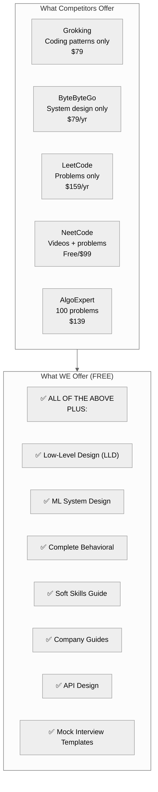
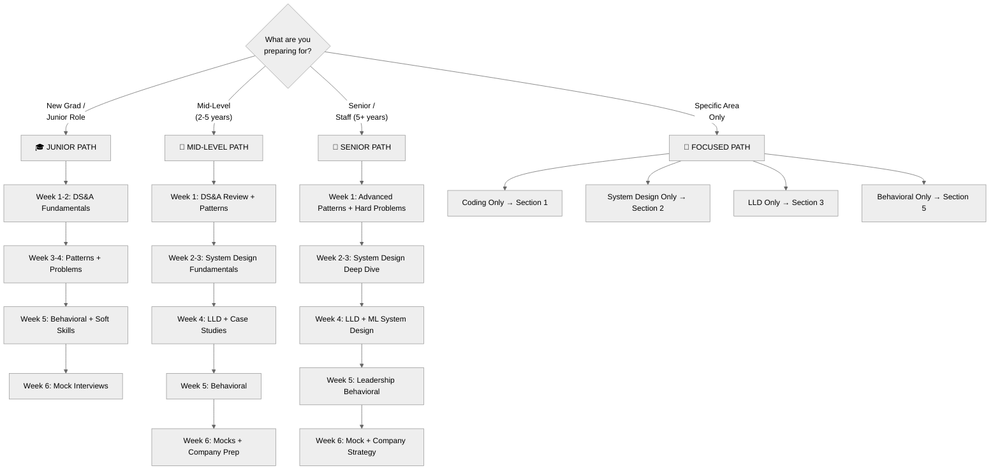

# Software Developer Interview Guide — Complete Plan

## Executive Summary

This plan outlines the **most comprehensive FREE software developer interview guide** covering everything engineers need to prepare for technical interviews at any company—from startups to FAANG.

---

## Thorough Competitive Analysis

### Platform-by-Platform Breakdown

#### 1. Grokking the Coding Interview (Educative)
**Price:** $79 one-time or Educative subscription ($14.99/mo)

**What They Offer:**
- 28 coding patterns (up from 16 originally)
- 400+ problems with 5 problems per pattern
- 85 hours of content
- 921 lessons, 477 quizzes, 476 challenges
- 6 languages: Java, Python, JavaScript, C++, Go, C#
- Interactive text-based (no videos)
- 4-tier difficulty: Step-by-step → Challenge problems

**Their Strengths:**
- Pattern-based approach is excellent
- Text-based = searchable and fast
- Comprehensive pattern coverage

**Their Gaps:**
- No system design (separate course)
- No behavioral prep
- No soft skills
- Paid content

---

#### 2. Grokking System Design Interview (Educative)
**Price:** $79 one-time or Educative subscription

**What They Offer:**
- 26 hours of system design content
- 7-hour crash course option
- Case studies: TinyURL, Twitter, Instagram, Dropbox, YouTube, etc.
- Fundamentals: Scaling, sharding, caching, load balancing
- CAP theorem, consistency patterns

**Their Strengths:**
- Well-structured case studies
- Good visual diagrams
- Real-world focus

**Their Gaps:**
- No coding prep
- No behavioral prep
- Limited database depth
- Paid content

---

#### 3. ByteByteGo (Alex Xu)
**Price:** $15/month or $79/year

**What They Offer:**
- System Design Interview books Vol 1 & 2
- 24+ case studies including:
  - Rate Limiter, URL Shortener, Web Crawler
  - News Feed, Chat System, YouTube, Google Drive
  - Proximity Service, Google Maps, Hotel Reservation
  - Distributed Message Queue, Metrics Monitoring
  - Ad Click Aggregation, Email Service, S3 Storage
- ML System Design course (10 problems)
- Weekly newsletter with visual explanations
- Hundreds of diagrams

**Their Strengths:**
- Excellent visual explanations
- Comprehensive case studies
- Alex Xu's books are industry standard
- ML System Design coverage

**Their Gaps:**
- No coding prep
- No behavioral prep
- No OOD/LLD coverage
- Subscription model

---

#### 4. LeetCode Premium
**Price:** $35/month or $159/year

**What They Offer:**
- 3000+ problems (largest problem bank)
- Company-specific questions with frequency data
- Sort by: Company, recency, frequency, difficulty
- Premium-only problems and solutions
- Mock interviews by company
- Lightning Judge (10x faster)
- AI coding assistant (Ask Leet)
- Debugger, autocomplete, cloud storage

**Their Strengths:**
- Largest problem database
- Company-specific filtering is invaluable
- Frequency data shows what's actually asked
- Active community discussions

**Their Gaps:**
- No structured learning path
- No pattern teaching (just problem bank)
- No system design
- No behavioral prep
- Can feel overwhelming without guidance

---

#### 5. NeetCode
**Price:** Free (videos) + NeetCode Pro $99/year

**What They Offer:**
- NeetCode 75 (foundation problems)
- NeetCode 150 (comprehensive set)
- NeetCode All (450+ problems)
- Free YouTube video explanations
- Roadmap with progress tracking
- Pattern-based organization
- Code in multiple languages

**Their Strengths:**
- Free video solutions
- Excellent explanations
- Structured roadmap
- Strong community

**Their Gaps:**
- Video-first (not searchable)
- Limited system design
- No behavioral prep
- No soft skills

---

#### 6. AlgoExpert
**Price:** $99/year (coding) or $139/year (bundle with SystemsExpert)

**What They Offer:**
- 100 hand-picked coding problems
- 70+ hours of video explanations
- Solutions in 9 languages
- Data structures crash course
- SystemsExpert: 25 system design questions
- Certificate of completion

**Their Strengths:**
- Curated, high-quality problems
- Excellent video explanations
- Clean UI

**Their Gaps:**
- Only 100 problems (small)
- Limited system design (25 questions)
- No behavioral prep
- Expensive for what you get

---

#### 7. InterviewBit
**Price:** Free (basic) + Scaler subscription for premium

**What They Offer:**
- Coding interview questions
- Fast Track courses
- Peer mock interviews
- Mock assessments
- Interview guides
- Contests

**Their Strengths:**
- Free tier available
- Structured learning paths
- Mock interview matching

**Their Gaps:**
- Dated UI
- Smaller problem pool than LeetCode
- Limited system design
- Quality varies

---

#### 8. Pramp / Exponent
**Price:** Free (5 mocks/month) or $79/month unlimited

**What They Offer:**
- Peer-to-peer mock interviews
- Coding, System Design, Behavioral, Frontend, Data Science
- 60-minute sessions (30 min each side)
- Video chat + collaborative editor
- Rubric-based feedback
- Expert coaching (Exponent)
- PM interview prep (Exponent specialty)

**Their Strengths:**
- Free mock interviews
- Real interview practice
- Multi-format support

**Their Gaps:**
- Peer quality inconsistent
- Not a learning platform
- Exponent expensive for unlimited

---

#### 9. System Design Primer (GitHub)
**Price:** FREE

**What They Offer:**
- Comprehensive system design topics
- Building blocks explained
- Case studies with solutions
- Anki flashcards
- 250k+ GitHub stars

**Their Strengths:**
- Completely free
- Community-maintained
- Comprehensive

**Their Gaps:**
- Not structured for interviews
- No coding prep
- No behavioral prep
- Can be overwhelming

---

### Competitive Matrix

| Feature | Grokking | ByteByteGo | LeetCode | NeetCode | AlgoExpert | Ours |
|---------|----------|------------|----------|----------|------------|------|
| **Price** | $79 | $79/yr | $159/yr | Free/$99 | $139 | **FREE** |
| **Coding Patterns** | 28 | ❌ | ❌ | ~18 | Limited | **28+** |
| **Problems** | 400+ | ❌ | 3000+ | 450+ | 100 | **Curated** |
| **System Design** | Separate | ✅ 24+ | ❌ | Limited | 25 | **30+** |
| **Databases Deep Dive** | ❌ | ⚠️ Some | ❌ | ❌ | ❌ | **✅ 13 types** |
| **OOD/LLD** | Separate | ❌ | ❌ | ❌ | ❌ | **✅ Yes** |
| **Behavioral** | ❌ | ❌ | ❌ | ❌ | ❌ | **✅ Full** |
| **Soft Skills** | ❌ | ❌ | ❌ | ❌ | ❌ | **✅ Full** |
| **ML System Design** | ❌ | ✅ | ❌ | ❌ | ❌ | **✅ Yes** |
| **Company Guides** | ❌ | ❌ | Tags only | ❌ | ❌ | **✅ Detailed** |
| **Multi-Language** | 6 | ❌ | Many | 3-4 | 9 | **5** |
| **Visual Diagrams** | ⚠️ Some | ✅ Excellent | ❌ | ⚠️ Video | ⚠️ Video | **✅ 300+** |

---

## Gaps We Fill That NO ONE Else Covers

### 1. Object-Oriented Design / Low-Level Design (LLD)
**Gap:** Most platforms ignore this entirely, but it's asked at MANY companies!

**Topics to Cover:**
- SOLID Principles
- Design Patterns (23 GoF patterns)
- UML Diagrams
- Class Design
- Common LLD Problems:
  - Parking Lot System
  - Elevator System
  - Chess Game
  - Movie Ticket Booking
  - Library Management
  - Vending Machine
  - ATM System
  - Hotel Management
  - File System
  - Snake Game

### 2. Complete Behavioral + Soft Skills
**Gap:** EVERY paid platform ignores this!

**Topics to Cover:**
- STAR Method mastery
- Story bank building
- Amazon Leadership Principles
- Google's Googleyness
- Communication during coding
- Handling hints
- When you're stuck
- Time management

### 3. Database Deep Dive
**Gap:** Others mention databases but don't go deep

**Topics to Cover:**
- 13 database types with when to use each
- SQL vs NoSQL decision framework
- Indexing strategies
- Query optimization
- Replication patterns
- Sharding strategies
- Database transactions
- CAP theorem in practice

### 4. ML System Design
**Gap:** Only ByteByteGo covers this

**Topics to Cover:**
- ML pipeline architecture
- Feature stores
- Model serving
- Recommendation systems
- Fraud detection
- Real-time ML

### 5. API Design
**Gap:** Rarely covered in depth

**Topics to Cover:**
- REST API design
- GraphQL
- gRPC
- Versioning strategies
- Rate limiting
- Authentication/Authorization
- Pagination patterns

---

## Updated Complete Structure

### Folder: `/docs/interview-guide/`

```
interview-guide/
├── _category_.json
├── introduction.md                    # How to use this guide, path selector
├── learning-paths.md                  # Choose your path
├── preparation-timeline.md            # 1 week to 3 month plans
├── resources/
│   ├── glossary.md
│   ├── cheat-sheets.md
│   ├── recommended-reading.md
│   └── get-help.md                    # Contact for personalized help
│
├── coding/                            # SECTION 1: CODING INTERVIEWS
│   ├── _category_.json
│   │
│   ├── fundamentals/
│   │   ├── big-o-notation.md
│   │   ├── choosing-data-structures.md
│   │   ├── problem-solving-framework.md
│   │   └── complexity-cheat-sheet.md
│   │
│   ├── data-structures/
│   │   ├── arrays-strings.md
│   │   ├── linked-lists.md
│   │   ├── stacks-queues.md
│   │   ├── hash-tables.md
│   │   ├── trees.md
│   │   ├── heaps-priority-queues.md
│   │   ├── graphs.md
│   │   ├── tries.md
│   │   ├── disjoint-set-union-find.md
│   │   └── advanced-structures.md     # Skip lists, segment trees, etc.
│   │
│   ├── algorithms/
│   │   ├── sorting-algorithms.md
│   │   ├── searching-algorithms.md
│   │   ├── recursion-backtracking.md
│   │   ├── dynamic-programming.md
│   │   ├── greedy-algorithms.md
│   │   ├── graph-algorithms.md
│   │   ├── string-algorithms.md
│   │   └── bit-manipulation.md
│   │
│   ├── patterns/                      # 28 PATTERNS (matching Grokking)
│   │   ├── _category_.json
│   │   ├── 01-two-pointers.md
│   │   ├── 02-fast-slow-pointers.md
│   │   ├── 03-sliding-window.md
│   │   ├── 04-merge-intervals.md
│   │   ├── 05-cyclic-sort.md
│   │   ├── 06-in-place-reversal.md
│   │   ├── 07-bfs.md
│   │   ├── 08-dfs.md
│   │   ├── 09-two-heaps.md
│   │   ├── 10-subsets.md
│   │   ├── 11-modified-binary-search.md
│   │   ├── 12-bitwise-xor.md
│   │   ├── 13-top-k-elements.md
│   │   ├── 14-k-way-merge.md
│   │   ├── 15-knapsack-dp.md
│   │   ├── 16-topological-sort.md
│   │   ├── 17-trie.md
│   │   ├── 18-monotonic-stack.md
│   │   ├── 19-union-find.md
│   │   ├── 20-ordered-set.md
│   │   ├── 21-prefix-sum.md
│   │   ├── 22-matrix-traversal.md
│   │   ├── 23-backtracking.md
│   │   ├── 24-greedy-pattern.md
│   │   ├── 25-palindromes.md
│   │   ├── 26-linkedlist-patterns.md
│   │   ├── 27-tree-patterns.md
│   │   └── 28-graph-patterns.md
│   │
│   ├── problem-lists/                 # CURATED PROBLEM LISTS
│   │   ├── blind-75.md                # The famous Blind 75
│   │   ├── neetcode-150.md            # Extended list
│   │   ├── by-difficulty.md           # Easy/Medium/Hard
│   │   ├── by-topic.md                # By data structure
│   │   ├── by-company.md              # FAANG-tagged
│   │   └── by-pattern.md              # Pattern-based
│   │
│   └── code-quality/
│       ├── writing-clean-code.md
│       ├── testing-edge-cases.md
│       ├── complexity-analysis.md
│       └── common-mistakes.md
│
├── system-design/                     # SECTION 2: SYSTEM DESIGN (HLD)
│   ├── _category_.json
│   │
│   ├── fundamentals/
│   │   ├── introduction.md
│   │   ├── interview-framework.md     # Step-by-step approach
│   │   ├── requirements-gathering.md
│   │   ├── capacity-estimation.md
│   │   └── back-of-envelope.md
│   │
│   ├── building-blocks/
│   │   ├── load-balancers.md
│   │   ├── api-gateway.md
│   │   ├── cdn.md
│   │   ├── dns.md
│   │   ├── reverse-proxy.md
│   │   ├── caching.md                 # Redis, Memcached, strategies
│   │   ├── message-queues.md          # Kafka, RabbitMQ, SQS, etc.
│   │   ├── search-engines.md          # Elasticsearch, Solr
│   │   ├── blob-storage.md            # S3, GCS, Azure Blob
│   │   └── rate-limiting.md
│   │
│   ├── databases/                     # 13 DATABASE TYPES
│   │   ├── _category_.json
│   │   ├── database-fundamentals.md   # ACID, indexing, normalization
│   │   ├── sql-databases.md           # PostgreSQL, MySQL, MariaDB
│   │   ├── nosql-overview.md          # Types and when to use
│   │   ├── document-stores.md         # MongoDB, CouchDB, Firebase
│   │   ├── key-value-stores.md        # Redis, DynamoDB, Riak, etcd
│   │   ├── wide-column.md             # Cassandra, HBase, ScyllaDB
│   │   ├── graph-databases.md         # Neo4j, Amazon Neptune, ArangoDB
│   │   ├── time-series.md             # InfluxDB, TimescaleDB, Prometheus
│   │   ├── search-databases.md        # Elasticsearch, Solr, Meilisearch
│   │   ├── newsql.md                  # CockroachDB, TiDB, Spanner, Vitess
│   │   ├── vector-databases.md        # Pinecone, Weaviate, Milvus (for AI)
│   │   ├── database-replication.md
│   │   ├── database-sharding.md
│   │   └── choosing-database.md       # Decision framework
│   │
│   ├── concepts/
│   │   ├── cap-theorem.md
│   │   ├── consistency-patterns.md    # Strong, eventual, causal
│   │   ├── availability-patterns.md
│   │   ├── horizontal-vs-vertical.md
│   │   ├── microservices-vs-monolith.md
│   │   ├── event-driven-architecture.md
│   │   ├── cqrs-event-sourcing.md
│   │   ├── distributed-transactions.md # 2PC, Saga pattern
│   │   ├── consensus-algorithms.md    # Paxos, Raft, Zab
│   │   ├── consistent-hashing.md
│   │   ├── bloom-filters.md
│   │   ├── leader-election.md
│   │   ├── idempotency.md
│   │   ├── data-partitioning.md       # Range, hash, list, composite
│   │   └── replication-strategies.md  # Master-slave, multi-master
│   │
│   ├── scaling/
│   │   ├── scaling-strategies.md
│   │   ├── read-vs-write-heavy.md
│   │   ├── hot-spots.md
│   │   ├── global-scale.md
│   │   └── cost-optimization.md
│   │
│   ├── reliability/
│   │   ├── fault-tolerance.md
│   │   ├── disaster-recovery.md
│   │   ├── circuit-breakers.md
│   │   ├── retry-strategies.md
│   │   ├── graceful-degradation.md
│   │   └── chaos-engineering.md
│   │
│   ├── api-design/                    # NEW SECTION
│   │   ├── rest-api-design.md
│   │   ├── graphql.md
│   │   ├── grpc.md
│   │   ├── websockets.md
│   │   ├── api-versioning.md
│   │   ├── api-authentication.md      # OAuth, JWT, API keys
│   │   ├── pagination-patterns.md
│   │   └── rate-limiting-apis.md
│   │
│   └── case-studies/                  # 30+ CASE STUDIES
│       ├── _category_.json
│       │
│       │   # FOUNDATIONAL (Start here)
│       ├── url-shortener.md           # TinyURL, Bitly
│       ├── paste-bin.md               # Pastebin
│       ├── rate-limiter.md            # Rate Limiter
│       ├── unique-id-generator.md     # Distributed ID generation
│       │
│       │   # SOCIAL MEDIA
│       ├── twitter.md                 # Twitter/X
│       ├── instagram.md               # Instagram
│       ├── facebook-newsfeed.md       # News Feed
│       ├── linkedin.md                # LinkedIn
│       │
│       │   # MESSAGING
│       ├── whatsapp.md                # WhatsApp
│       ├── messenger.md               # Facebook Messenger
│       ├── slack.md                   # Slack
│       ├── discord.md                 # Discord
│       │
│       │   # VIDEO STREAMING
│       ├── youtube.md                 # YouTube
│       ├── netflix.md                 # Netflix
│       ├── twitch.md                  # Twitch live streaming
│       │
│       │   # RIDE SHARING & LOCATION
│       ├── uber.md                    # Uber
│       ├── lyft.md                    # Lyft
│       ├── google-maps.md             # Google Maps
│       ├── yelp.md                    # Yelp nearby search
│       │
│       │   # E-COMMERCE & BOOKING
│       ├── amazon.md                  # Amazon e-commerce
│       ├── airbnb.md                  # Airbnb
│       ├── booking.md                 # Hotel booking
│       ├── ticketmaster.md            # Ticketmaster
│       │
│       │   # STORAGE & FILES
│       ├── dropbox.md                 # Dropbox
│       ├── google-drive.md            # Google Drive
│       ├── s3.md                      # Object storage
│       │
│       │   # SEARCH & DISCOVERY
│       ├── web-crawler.md             # Web Crawler
│       ├── search-engine.md           # Google Search
│       ├── typeahead.md               # Autocomplete
│       │
│       │   # INFRASTRUCTURE
│       ├── notification-system.md     # Push notifications
│       ├── payment-system.md          # Payment processing
│       ├── ad-click-aggregation.md    # Ad tech
│       ├── metrics-monitoring.md      # Monitoring system
│       └── distributed-cache.md       # Distributed caching
│
├── lld/                               # SECTION 3: LOW-LEVEL DESIGN (NEW!)
│   ├── _category_.json
│   ├── introduction.md
│   ├── solid-principles.md
│   ├── design-patterns/
│   │   ├── creational-patterns.md     # Factory, Builder, Singleton, etc.
│   │   ├── structural-patterns.md     # Adapter, Decorator, Facade, etc.
│   │   └── behavioral-patterns.md     # Observer, Strategy, Command, etc.
│   ├── uml-diagrams.md
│   ├── case-studies/
│   │   ├── parking-lot.md
│   │   ├── elevator-system.md
│   │   ├── chess-game.md
│   │   ├── tic-tac-toe.md
│   │   ├── movie-ticket-booking.md
│   │   ├── library-management.md
│   │   ├── vending-machine.md
│   │   ├── atm-system.md
│   │   ├── hotel-management.md
│   │   ├── file-system.md
│   │   ├── snake-game.md
│   │   ├── car-rental.md
│   │   ├── amazon-locker.md
│   │   ├── stack-overflow.md
│   │   └── linkedin.md
│   └── practice-problems.md
│
├── ml-system-design/                  # SECTION 4: ML SYSTEM DESIGN (NEW!)
│   ├── _category_.json
│   ├── introduction.md
│   ├── ml-pipeline.md
│   ├── feature-stores.md
│   ├── model-serving.md
│   ├── monitoring-ml.md
│   ├── case-studies/
│   │   ├── recommendation-system.md
│   │   ├── fraud-detection.md
│   │   ├── search-ranking.md
│   │   ├── ad-prediction.md
│   │   ├── content-moderation.md
│   │   ├── visual-search.md
│   │   ├── chatbot.md
│   │   └── personalization.md
│   └── interview-tips.md
│
├── behavioral/                        # SECTION 5: BEHAVIORAL
│   ├── _category_.json
│   ├── introduction.md
│   ├── star-method.md
│   ├── story-bank.md                  # Template + examples
│   ├── common-questions.md            # 50+ questions
│   ├── leadership-questions.md
│   ├── conflict-resolution.md
│   ├── failure-questions.md
│   ├── teamwork-questions.md
│   ├── amazon-leadership-principles.md
│   └── practice-scenarios.md
│
├── soft-skills/                       # SECTION 6: SOFT SKILLS
│   ├── _category_.json
│   ├── introduction.md
│   ├── communication.md               # How to talk during interviews
│   ├── problem-solving-approach.md    # UMPIRE framework
│   ├── thinking-out-loud.md
│   ├── asking-clarifying-questions.md
│   ├── handling-hints.md
│   ├── when-youre-stuck.md
│   ├── managing-time.md
│   ├── whiteboard-tips.md
│   ├── virtual-interview-tips.md
│   └── code-quality-in-interviews.md
│
├── company-guides/                    # SECTION 7: COMPANY-SPECIFIC
│   ├── _category_.json
│   ├── google.md
│   ├── meta.md
│   ├── amazon.md
│   ├── apple.md
│   ├── microsoft.md
│   ├── netflix.md
│   ├── uber.md
│   ├── airbnb.md
│   ├── stripe.md
│   ├── databricks.md
│   ├── startups.md
│   └── remote-interviews.md
│
└── mock-interviews/                   # SECTION 8: MOCK PRACTICE
    ├── _category_.json
    ├── how-to-practice.md
    ├── self-assessment-rubric.md
    ├── peer-interview-guide.md
    ├── coding-mock-template.md
    ├── system-design-mock-template.md
    └── behavioral-mock-template.md
```

---

## Total Document Count

| Section | Documents | Hours |
|---------|-----------|-------|
| Introduction & Resources | 6 | 12 |
| **Coding** | | |
| - Fundamentals | 4 | 12 |
| - Data Structures | 10 | 40 |
| - Algorithms | 8 | 32 |
| - Patterns (28) | 28 | 84 |
| - Problem Lists | 6 | 18 |
| - Code Quality | 4 | 12 |
| **System Design (HLD)** | | |
| - Fundamentals | 5 | 20 |
| - Building Blocks | 10 | 40 |
| - Databases (14) | 14 | 56 |
| - Concepts (15) | 15 | 45 |
| - Scaling & Reliability | 11 | 33 |
| - API Design (8) | 8 | 24 |
| - Case Studies (32) | 32 | 160 |
| **Low-Level Design** | | |
| - Fundamentals | 4 | 12 |
| - Case Studies (15) | 15 | 60 |
| **ML System Design** | | |
| - Fundamentals | 5 | 20 |
| - Case Studies (8) | 8 | 32 |
| **Behavioral** | 10 | 30 |
| **Soft Skills** | 11 | 33 |
| **Company Guides** | 12 | 36 |
| **Mock Interviews** | 6 | 12 |
| **TOTAL** | **~220** | **~840 hours** |

---

## What Makes Us Better Than ALL Competitors



### Unique Advantages

| Feature | Competitors | Our Guide |
|---------|-------------|-----------|
| **Price** | $79-$159/year | **FREE** |
| **Coding Patterns** | 14-28 | **28+** |
| **System Design Cases** | 15-25 | **32** |
| **LLD/OOD Cases** | 0-5 | **15** |
| **ML System Design** | 0-10 | **8** |
| **Database Types** | 3-5 | **14** |
| **Behavioral** | None | **Complete** |
| **Soft Skills** | None | **Complete** |
| **API Design** | Minimal | **Full Section** |
| **Company Guides** | Tags only | **Detailed** |
| **All-in-One** | ❌ | **✅** |

---

## Learning Path Selector



---

## Preparation Timelines

### 1 Week Sprint (Emergency Prep)

| Day | Focus | Hours |
|-----|-------|-------|
| 1 | Big-O + Arrays/Strings + Hash Tables | 4 |
| 2 | Trees + Graphs + Top 5 Patterns | 4 |
| 3 | System Design Framework + 3 Cases | 4 |
| 4 | Dynamic Programming + Backtracking | 4 |
| 5 | LLD Basics + 2 Cases | 3 |
| 6 | Behavioral STAR + 5 Stories | 3 |
| 7 | Mock Interviews + Review | 4 |

### 1 Month Comprehensive

| Week | Coding | System Design | Other |
|------|--------|---------------|-------|
| 1 | All DS + Big-O | Fundamentals | - |
| 2 | 15 Patterns | Building Blocks | - |
| 3 | 75 Problems | 5 Case Studies | LLD Basics |
| 4 | Mock Coding | Mock SD | Behavioral |

### 3 Month Mastery

| Month | Focus |
|-------|-------|
| 1 | Complete Coding section + 150 problems |
| 2 | Complete System Design + All Case Studies |
| 3 | LLD + ML SD + Behavioral + Mock Interviews |

---

## Get Help Section

```
┌────────────────────────────────────────────────────────────────────────────┐
│                                                                            │
│   🤝 NEED PERSONALIZED HELP?                                               │
│                                                                            │
│   This guide is comprehensive, but sometimes you need 1-on-1 guidance.     │
│   I'm happy to help with:                                                  │
│                                                                            │
│   ✅ Mock interviews (Coding, System Design, Behavioral)                   │
│   ✅ Resume review and optimization                                        │
│   ✅ Career advice and job search strategy                                 │
│   ✅ Company-specific preparation                                          │
│   ✅ Negotiation guidance                                                  │
│                                                                            │
│   ─────────────────────────────────────────────────────────────           │
│                                                                            │
│   📧 Email: [YOUR EMAIL]                                                  │
│   💼 LinkedIn: [YOUR LINKEDIN URL]                                        │
│   🐦 Twitter/X: [@YOUR_HANDLE]                                            │
│                                                                            │
│   I respond to every message. Let's get you that offer! 🚀                │
│                                                                            │
│   ─────────────────────────────────────────────────────────────           │
│                                                                            │
│   💡 This guide is FREE because I believe everyone deserves access        │
│      to quality interview preparation, regardless of ability to pay.      │
│                                                                            │
│   ⭐ If this helped you, consider:                                        │
│      • Sharing with friends who are interviewing                          │
│      • Starring the repo (if open-sourced)                                │
│      • Connecting on LinkedIn                                             │
│                                                                            │
└────────────────────────────────────────────────────────────────────────────┘
```

---

## Key Improvements from Competitive Analysis

### 1. Added 28 Coding Patterns (matching Grokking)
Previously had 15, now expanded to 28 to match the industry-standard Grokking patterns.

### 2. Added Low-Level Design (LLD) Section
**This is a MAJOR differentiator** — no free resource covers this comprehensively.

### 3. Added ML System Design Section
Only ByteByteGo covers this in paid resources.

### 4. Added API Design Section
Critical for system design but often overlooked.

### 5. Expanded Database Coverage to 14 Types
Including vector databases for AI/ML relevance.

### 6. Added 32 System Design Case Studies
More than any single paid resource.

### 7. Added Curated Problem Lists
Blind 75, NeetCode 150, company-tagged problems.

### 8. Added Mock Interview Templates
Self-guided practice with rubrics.

---

## Review: Additional Improvements Identified

### Critical Missing Sections

After thorough review, here are MAJOR gaps that need to be added:

#### 1. Concurrency & Multithreading Section (HIGH PRIORITY)
**Why:** Asked at almost every senior interview, completely missing from our plan!

```
coding/concurrency/
├── _category_.json
├── introduction.md
├── threads-processes.md
├── synchronization-primitives.md      # Mutex, Semaphore, Locks
├── race-conditions-deadlocks.md
├── producer-consumer.md
├── reader-writer-locks.md
├── thread-pools.md
├── async-await-patterns.md
├── classic-problems/
│   ├── dining-philosophers.md
│   ├── sleeping-barber.md
│   ├── readers-writers.md
│   ├── bounded-buffer.md
│   └── uber-ride-problem.md
└── language-specific/
    ├── java-concurrency.md
    ├── python-threading.md
    ├── go-goroutines.md
    └── javascript-async.md
```

#### 2. SQL & Database Interview Questions (HIGH PRIORITY)
**Why:** Separate from system design databases - this is CODING interview questions!

```
coding/sql/
├── _category_.json
├── introduction.md
├── basic-queries.md
├── joins-deep-dive.md                  # INNER, LEFT, RIGHT, FULL, CROSS, SELF
├── aggregations-grouping.md
├── subqueries-ctes.md
├── window-functions.md
├── query-optimization.md               # EXPLAIN, indexes, execution plans
├── transactions-acid.md
├── common-interview-questions.md       # 50+ questions with solutions
└── practice-problems.md
```

#### 3. Operating Systems Fundamentals
**Why:** Asked at many companies, especially for backend/systems roles

```
fundamentals/operating-systems/
├── _category_.json
├── processes-threads.md
├── memory-management.md                # Stack, heap, virtual memory
├── cpu-scheduling.md
├── deadlocks.md
├── file-systems.md
├── io-operations.md
└── interview-questions.md
```

#### 4. Networking Fundamentals
**Why:** Essential for system design, often standalone questions too

```
fundamentals/networking/
├── _category_.json
├── osi-tcp-ip-models.md
├── http-https.md
├── tcp-vs-udp.md
├── dns-how-it-works.md
├── websockets.md
├── ssl-tls.md
└── interview-questions.md
```

---

### Role-Specific Tracks (NEW SECTION)

```
role-tracks/
├── _category_.json
├── introduction.md                     # "Choose Your Path"
│
├── frontend/
│   ├── _category_.json
│   ├── roadmap.md
│   ├── html-css-fundamentals.md
│   ├── javascript-deep-dive.md
│   ├── react-interview.md              # Components, hooks, state
│   ├── typescript.md
│   ├── browser-rendering.md
│   ├── performance-optimization.md
│   ├── accessibility.md
│   ├── ui-component-questions.md       # Build a dropdown, modal, etc.
│   └── frontend-system-design.md
│
├── backend/
│   ├── _category_.json
│   ├── roadmap.md
│   ├── api-design-deep-dive.md
│   ├── database-design.md
│   ├── caching-strategies.md
│   ├── message-queues.md
│   ├── microservices.md
│   ├── security-best-practices.md
│   └── performance-tuning.md
│
├── fullstack/
│   ├── _category_.json
│   ├── roadmap.md
│   └── bridging-frontend-backend.md
│
├── data-engineer/
│   ├── _category_.json
│   ├── roadmap.md
│   ├── data-pipelines.md
│   ├── etl-elt.md
│   ├── data-warehousing.md
│   ├── spark-hadoop.md
│   ├── streaming-data.md
│   └── data-modeling.md
│
├── ml-engineer/
│   ├── _category_.json
│   ├── roadmap.md
│   ├── ml-fundamentals.md
│   ├── deep-learning.md
│   ├── mlops.md
│   └── ml-coding-questions.md
│
├── devops-sre/
│   ├── _category_.json
│   ├── roadmap.md
│   ├── ci-cd-deep-dive.md
│   ├── kubernetes.md
│   ├── terraform-iac.md
│   ├── monitoring-observability.md
│   ├── incident-response.md
│   └── sre-interview-questions.md
│
└── mobile/
    ├── _category_.json
    ├── roadmap.md
    ├── ios-swift.md
    ├── android-kotlin.md
    └── react-native-flutter.md
```

---

### Career & Job Search Section (NEW)

**Why:** No competitor covers this - it's the complete journey!

```
career/
├── _category_.json
├── introduction.md
│
├── job-search/
│   ├── job-search-strategy.md
│   ├── building-your-network.md
│   ├── cold-outreach-templates.md
│   ├── working-with-recruiters.md
│   ├── timeline-planning.md
│   └── tracking-applications.md
│
├── resume/
│   ├── resume-fundamentals.md
│   ├── ats-optimization.md
│   ├── quantifying-impact.md
│   ├── resume-templates.md
│   ├── cover-letters.md
│   └── portfolio-projects.md
│
├── linkedin/
│   ├── profile-optimization.md
│   ├── headline-about-section.md
│   ├── experience-section.md
│   ├── skills-endorsements.md
│   └── networking-on-linkedin.md
│
├── negotiation/
│   ├── compensation-components.md      # Base, bonus, equity, signing
│   ├── researching-salary.md           # Levels.fyi, Glassdoor, etc.
│   ├── negotiation-scripts.md
│   ├── counter-offer-templates.md
│   ├── multiple-offers.md
│   ├── equity-evaluation.md            # RSUs, options, startup equity
│   └── negotiation-mistakes.md
│
├── offer-evaluation/
│   ├── comparing-offers.md
│   ├── total-compensation-calculator.md
│   ├── work-life-balance-factors.md
│   ├── growth-opportunities.md
│   └── red-flags.md
│
└── first-90-days/
    ├── onboarding-success.md
    ├── building-relationships.md
    └── setting-yourself-up.md
```

---

### Missing Company Guides

Add these high-demand companies:

```
company-guides/
├── ... (existing)
├── linkedin.md
├── twitter-x.md
├── bytedance-tiktok.md
├── snap.md
├── salesforce.md
├── adobe.md
├── coinbase.md
├── robinhood.md
├── palantir.md
├── nvidia.md
├── openai.md                           # Very high demand now!
├── anthropic.md
└── smaller-tech/
    ├── series-a-b-startups.md
    ├── unicorns.md
    └── bootstrapped-companies.md
```

---

### Interview Day Logistics (NEW)

```
interview-day/
├── _category_.json
├── day-before-checklist.md
├── morning-of-checklist.md
├── virtual-interview-setup.md
├── onsite-interview-tips.md
├── between-rounds.md
├── post-interview-follow-up.md
└── handling-rejection.md
```

---

### Updated Document Counts

| Section | Documents | Est. Hours |
|---------|-----------|------------|
| **Previous Total** | ~220 | ~840 |
| **+ Concurrency** | +15 | +45 |
| **+ SQL Section** | +11 | +33 |
| **+ OS Fundamentals** | +7 | +21 |
| **+ Networking** | +7 | +21 |
| **+ Role Tracks** | +35 | +105 |
| **+ Career Section** | +25 | +50 |
| **+ More Companies** | +15 | +45 |
| **+ Interview Day** | +7 | +14 |
| **NEW TOTAL** | **~342** | **~1,174 hours** |

---

### Quality Improvements for Each Document

Every document should include:

```markdown
---
title: Two Pointers Pattern
description: Master the two pointers technique for array and string problems
difficulty: Intermediate
estimated_time: 45 minutes
prerequisites:
  - Arrays fundamentals
  - Big-O notation
tags: [arrays, patterns, two-pointers]
companies: [Google, Meta, Amazon]
---

## What You'll Learn
- When to recognize two pointer problems
- The 3 variations of two pointers
- 5 practice problems with solutions

## Quick Reference Card
[Downloadable cheat sheet]

...content...

## Practice Problems
| Problem | Difficulty | Company Tags |
|---------|------------|--------------|
| Two Sum II | Easy | Google, Amazon |
| 3Sum | Medium | Meta, Microsoft |
| Container With Most Water | Medium | Amazon, Apple |

## Self-Check Quiz
1. When should you use two pointers vs sliding window?
2. What's the time complexity of the two-pointer approach for sorted arrays?
```

---

### Interactive Elements to Add

1. **Progress Tracker** - JSON file users can download to track completion
2. **Spaced Repetition** - Flashcard exports (Anki format)
3. **Self-Assessment Quizzes** - End of each section
4. **Code Playgrounds** - Embedded CodeSandbox/StackBlitz where possible
5. **Difficulty Ratings** - Visual indicators (🟢 Easy, 🟡 Medium, 🔴 Hard)
6. **Time Estimates** - For each document
7. **Company Tags** - Which companies ask what
8. **Video Recommendations** - Link to best free YouTube videos

---

### Pattern Reorganization

The current 28 patterns have some overlap. Better organization:

```
patterns/
├── array-patterns/
│   ├── two-pointers.md
│   ├── sliding-window.md
│   ├── prefix-sum.md
│   ├── cyclic-sort.md
│   └── matrix-traversal.md
│
├── linkedlist-patterns/
│   ├── fast-slow-pointers.md
│   ├── in-place-reversal.md
│   └── merge-techniques.md
│
├── tree-patterns/
│   ├── bfs.md
│   ├── dfs.md
│   ├── tree-construction.md
│   └── path-problems.md
│
├── graph-patterns/
│   ├── graph-bfs-dfs.md
│   ├── topological-sort.md
│   ├── union-find.md
│   ├── shortest-path.md
│   └── cycle-detection.md
│
├── dp-patterns/
│   ├── knapsack.md
│   ├── subsequence.md
│   ├── string-dp.md
│   ├── grid-dp.md
│   └── state-machine-dp.md
│
├── search-patterns/
│   ├── binary-search.md
│   ├── modified-binary-search.md
│   └── search-in-rotated.md
│
├── heap-patterns/
│   ├── top-k-elements.md
│   ├── two-heaps.md
│   └── k-way-merge.md
│
├── backtracking-patterns/
│   ├── subsets.md
│   ├── permutations.md
│   ├── combinations.md
│   └── constraint-satisfaction.md
│
├── stack-patterns/
│   ├── monotonic-stack.md
│   ├── expression-evaluation.md
│   └── parentheses.md
│
├── string-patterns/
│   ├── palindromes.md
│   ├── anagrams.md
│   ├── trie.md
│   └── string-matching.md
│
├── bit-patterns/
│   ├── bitwise-xor.md
│   └── bit-manipulation.md
│
└── greedy-patterns/
    ├── interval-scheduling.md
    ├── merge-intervals.md
    └── greedy-choice.md
```

---

### Final Competitive Comparison (Updated)

| Feature | Competitors | Our Guide (Updated) |
|---------|-------------|---------------------|
| **Price** | $79-$500+/year | **FREE** |
| **Coding Patterns** | 14-28 | **32 (reorganized)** |
| **System Design Cases** | 15-25 | **32** |
| **LLD/OOD Cases** | 0-5 | **15** |
| **ML System Design** | 0-10 | **8** |
| **Database Types** | 3-5 | **14** |
| **SQL Interview Questions** | Separate | **✅ Integrated** |
| **Concurrency** | ❌ | **✅ Full section** |
| **OS/Networking** | ❌ | **✅ Fundamentals** |
| **Behavioral** | ❌ | **✅ Complete** |
| **Soft Skills** | ❌ | **✅ Complete** |
| **Role-Specific Tracks** | ❌ | **✅ 7 tracks** |
| **Career/Job Search** | ❌ | **✅ Complete** |
| **Salary Negotiation** | ❌ | **✅ Full guide** |
| **Company Guides** | Tags only | **✅ 25+ detailed** |
| **Interview Day Prep** | ❌ | **✅ Full checklist** |
| **Progress Tracking** | Some | **✅ Downloadable** |

---

## Final Structure Summary

```
interview-guide/
├── introduction.md
├── learning-paths.md
├── preparation-timeline.md
├── resources/
│
├── fundamentals/                       # NEW - OS, Networking basics
│   ├── operating-systems/
│   └── networking/
│
├── coding/                             # EXPANDED
│   ├── fundamentals/
│   ├── data-structures/
│   ├── algorithms/
│   ├── patterns/                       # REORGANIZED - 32 patterns
│   ├── concurrency/                    # NEW
│   ├── sql/                            # NEW
│   ├── problem-lists/
│   └── code-quality/
│
├── system-design/
│   ├── fundamentals/
│   ├── building-blocks/
│   ├── databases/
│   ├── concepts/
│   ├── scaling/
│   ├── reliability/
│   ├── api-design/
│   └── case-studies/
│
├── lld/
├── ml-system-design/
├── behavioral/
├── soft-skills/
│
├── role-tracks/                        # NEW
│   ├── frontend/
│   ├── backend/
│   ├── fullstack/
│   ├── data-engineer/
│   ├── ml-engineer/
│   ├── devops-sre/
│   └── mobile/
│
├── company-guides/                     # EXPANDED - 25+ companies
│
├── career/                             # NEW
│   ├── job-search/
│   ├── resume/
│   ├── linkedin/
│   ├── negotiation/
│   ├── offer-evaluation/
│   └── first-90-days/
│
├── interview-day/                      # NEW
│
└── mock-interviews/
```

---

## Value Proposition (Final)

To get equivalent content elsewhere:

| Resource | What It Covers | Cost |
|----------|----------------|------|
| Grokking Coding | Patterns | $79 |
| Grokking System Design | HLD | $79 |
| ByteByteGo | SD + ML | $79/yr |
| LeetCode Premium | Problems | $159/yr |
| GreatFrontend | Frontend | $19/mo |
| levels.fyi Negotiation | Salary | $99 |
| Resume coaching | Resume | $200+ |
| Mock interviews | Practice | $150+/session |
| **TOTAL** | | **$800+/year** |

**We offer ALL of this for FREE.**

---

## Next Steps

1. **Confirm final structure** — Does this comprehensive expansion look right?
2. **Provide contact info** — For the "Get Help" section
3. **Priority order** — Which sections first?
   - Recommended: Coding → System Design → Behavioral → Career
4. **Timeline** — Phased rollout?

This is now the **most comprehensive FREE interview resource ever created** — equivalent to **$800+/year in paid resources**.

**Total: ~342 documents | ~1,174 hours of content**
