# Detailed Document Outlines

This document provides expanded outlines for the most important pages in the Data Structures documentation.

---

## 1. Introduction Page Outline

**File:** `introduction.md`  
**Reading Time:** 12 minutes  
**Purpose:** Hook readers, explain the approach, provide navigation

### Opening Story (300 words)

The story of failing a Google interview despite "knowing" data structures. The interviewer asked about using a Trie for autocomplete. I knew what a Trie was. I could implement one from scratch. But when asked "Why not just use a hash map?", I froze.

**The lesson:** Knowing data structures isn't the same as understanding them.

This guide isn't another list of definitions. It's about building intuition—so when someone asks "why?", you have a real answer.

### What This Guide Is (And Isn't)

**What you'll find:**
- Story-driven explanations that build intuition
- Visual diagrams for every data structure
- Real code in Python, TypeScript, Go, Java, and C#
- Interview patterns that connect problems to solutions
- System design applications showing where these structures live in production
- Practice problems organized by difficulty and company

**What you won't find:**
- Pseudocode (we use real, runnable code)
- Academic proofs (we focus on practical understanding)
- Exhaustive coverage of every variant (we cover what matters)

### The Three Dimensions

Most resources teach data structures in one dimension: theory. We add two more:

```mermaid
%%{init: {'theme': 'neutral'}}%%
flowchart TB
    subgraph theory["📚 Theory"]
        t1["What is it?"]
        t2["How does it work?"]
        t3["Time/Space complexity"]
        t4["Variants and trade-offs"]
    end
    
    subgraph interview["🎯 Interview Patterns"]
        i1["Recognition: 'This is a graph problem'"]
        i2["Patterns: Two pointers, sliding window, etc."]
        i3["Company-specific trends"]
        i4["Follow-up questions"]
    end
    
    subgraph system["🏗️ System Design"]
        s1["Where is this used in real systems?"]
        s2["How do Redis, PostgreSQL, Linux use this?"]
        s3["Trade-offs at scale"]
        s4["When to use what"]
    end
    
    theory --> interview
    interview --> system
    
    style theory fill:#e0f2fe,stroke:#0284c7
    style interview fill:#fef3c7,stroke:#d97706
    style system fill:#dcfce7,stroke:#16a34a
```



### Learning Paths

**Path 1: Interview Prep Sprint (2-3 weeks)**

For experienced developers preparing for interviews:


**Path 2: Deep Dive (6-8 weeks)**

For those learning data structures thoroughly:

| Week | Topics | Focus |
|------|--------|-------|
| 1 | Introduction, Big-O | Foundation |
| 2 | Arrays, Strings | Linear structures |
| 3 | Linked Lists, Stacks, Queues | Sequential access |
| 4 | Hash Tables | Fast lookup |
| 5 | Trees, BST | Hierarchical data |
| 6 | Heaps, Priority Queues | Efficient extremes |
| 7 | Graphs | Networks and relationships |
| 8 | Dynamic Programming | Optimization |

**Path 3: System Design Focus (1-2 weeks)**

For those who know basics but need system context:

1. Database Indexes (B-trees, LSM trees)
2. Caching (LRU, LFU implementations)
3. Rate Limiting (Token bucket, sliding window)
4. Distributed Structures (Consistent hashing, Bloom filters)

### Prerequisites

Before starting, you should be comfortable with:

- **Basic programming** in at least one language (variables, functions, loops, objects)
- **Basic math** (logarithms, exponents, basic algebra)
- **Recursion basics** (helpful but we'll review)

No prior data structures knowledge required—we start from the beginning.

### How to Use Each Page

Every page follows the same structure:

1. **Problem Story** — Why does this data structure exist?
2. **Visual Explanation** — Diagrams showing how it works
3. **Core Operations** — What can you do with it?
4. **Implementation** — Code in 5 languages
5. **When to Use** — Decision guidelines
6. **Interview Patterns** — Common problem types
7. **System Design** — Real-world applications
8. **Practice Problems** — Easy, Medium, Hard
9. **FAQ** — Common questions answered

### Complete Roadmap

| # | Document | Time | What You'll Learn |
|---|----------|------|-------------------|
| 1 | Introduction (here) | 12 min | How to use this guide |
| 2 | Big-O Notation | 15 min | Complexity analysis fundamentals |
| 3 | Choosing Data Structures | 10 min | Decision flowcharts |
| **Arrays & Strings** | | | |
| 4 | Arrays | 20 min | Foundation of all structures |
| 5 | Strings | 15 min | Text manipulation patterns |
| 6 | Dynamic Arrays | 12 min | ArrayList, Vector internals |
| **Sequential Structures** | | | |
| 7 | Linked Lists | 18 min | Nodes and pointers |
| 8 | Stacks | 15 min | LIFO operations |
| 9 | Queues | 15 min | FIFO operations |
| 10 | Deques | 10 min | Double-ended operations |
| **Hash-Based** | | | |
| 11 | Hash Tables | 20 min | O(1) lookup fundamentals |
| 12 | Hash Maps | 15 min | Dictionary implementations |
| 13 | Hash Sets | 10 min | Unique collection operations |
| **Trees** | | | |
| 14 | Binary Trees | 20 min | Tree fundamentals |
| 15 | Binary Search Trees | 18 min | Ordered trees |
| 16 | Balanced Trees | 15 min | AVL, Red-Black trees |
| 17 | Heaps | 18 min | Priority queues |
| 18 | Tries | 15 min | Prefix trees |
| **Graphs** | | | |
| 19 | Graph Fundamentals | 20 min | Representation, terminology |
| 20 | Graph Traversal | 18 min | BFS, DFS |
| 21 | Shortest Paths | 20 min | Dijkstra, Bellman-Ford |
| 22 | Advanced Graphs | 20 min | Topological sort, Union-Find |
| **Algorithms** | | | |
| 23 | Sorting | 25 min | All sorting algorithms |
| 24 | Searching | 15 min | Binary search variants |
| 25 | Dynamic Programming | 30 min | DP framework and patterns |
| 26 | Greedy Algorithms | 15 min | Local to global optimization |
| **Advanced** | | | |
| 27 | Advanced Structures | 20 min | Bloom filters, Skip lists, etc. |
| 28 | System Design Applications | 25 min | Where data structures live |
| **Practice** | | | |
| 29 | Interview Patterns | 20 min | Cross-cutting patterns |
| 30 | Exercise Collection | Reference | Problems by topic |

### FAQ

**How is this different from LeetCode?**

LeetCode is a problem bank. This guide teaches you to recognize which problems need which data structures—the pattern recognition that LeetCode assumes you already have.

**Should I read in order?**

If you're learning from scratch, yes. If you're refreshing for interviews, jump to weak areas and use the interview patterns section.

**What language should I use?**

Whatever you're interviewing in. Code is provided in Python, TypeScript, Go, Java, and C#. The concepts are language-agnostic.

**How much math do I need?**

Basic algebra and understanding of logarithms. We explain the math needed as we go.

---

## 2. Big-O Notation Outline

**File:** `big-o-notation.md`  
**Reading Time:** 15 minutes  
**Purpose:** Foundation for all complexity analysis

### Opening Story

The day our "fast" algorithm brought down production. We had a feature that matched users to recommendations. In testing (100 users), it ran in milliseconds. In production (1 million users), it ran for 47 hours before we killed it.

The code was O(n²). We thought we understood Big-O. We didn't.

### What Is Big-O?

Big-O notation describes how an algorithm's runtime or space requirements grow as input size grows.

**The core idea:** We care about growth rate, not exact time.


### Why "Worst Case"?

Big-O typically describes the worst case because:
1. We plan for worst scenarios
2. It gives an upper bound guarantee
3. Average case is often the same or hard to analyze

Example: Linear search
- Best case: O(1) — found at first position
- Average case: O(n/2) = O(n) — found in middle
- Worst case: O(n) — found at end or not found

We say linear search is O(n).

### Common Complexities Visualized

```mermaid
%%{init: {'theme': 'neutral'}}%%
graph TB
    subgraph growth["Growth Rates (n=1000)"]
        direction TB
        
        o1["O(1): 1 operation"]
        olog["O(log n): ~10 operations"]
        on["O(n): 1,000 operations"]
        onlog["O(n log n): ~10,000 operations"]
        on2["O(n²): 1,000,000 operations"]
        o2n["O(2ⁿ): more than atoms in universe"]
    end
    
    subgraph speed["Speed"]
        fast["✅ Fast"]
        ok["⚠️ Okay"]
        slow["❌ Slow"]
    end
    
    o1 --> fast
    olog --> fast
    on --> fast
    onlog --> ok
    on2 --> slow
    o2n --> slow
```



### The Complete Complexity Table

| Big-O | Name | Example | n=10 | n=100 | n=1000 | n=1M |
|-------|------|---------|------|-------|--------|------|
| O(1) | Constant | Array access | 1 | 1 | 1 | 1 |
| O(log n) | Logarithmic | Binary search | 3 | 7 | 10 | 20 |
| O(n) | Linear | Linear search | 10 | 100 | 1K | 1M |
| O(n log n) | Linearithmic | Merge sort | 33 | 664 | 10K | 20M |
| O(n²) | Quadratic | Bubble sort | 100 | 10K | 1M | 1T |
| O(n³) | Cubic | Naive matrix mult | 1K | 1M | 1B | 10^18 |
| O(2ⁿ) | Exponential | Subset generation | 1K | 10^30 | 10^301 | ∞ |
| O(n!) | Factorial | Permutations | 3.6M | 10^157 | ∞ | ∞ |

### How to Analyze Code

**Rule 1: Drop constants**
```python
for i in range(n):      # O(n)
    do_something()
    do_another()        # Still O(n), not O(2n)
```

**Rule 2: Drop lower-order terms**
```python
for i in range(n):      # O(n)
    do_something()
for i in range(n):      
    for j in range(n):  # O(n²)
        do_other()
# Total: O(n² + n) = O(n²)
```

**Rule 3: Different inputs = different variables**
```python
def merge(list_a, list_b):
    for a in list_a:     # O(a)
        ...
    for b in list_b:     # O(b)
        ...
# Total: O(a + b), not O(n)
```

**Rule 4: Sequential = add, nested = multiply**
```python
for i in range(n):      # O(n)
    ...
for j in range(m):      # O(m)
    ...                 # Total: O(n + m)

for i in range(n):
    for j in range(m):  # O(n * m)
        ...
```

### Space Complexity

Space complexity measures memory usage as input grows.

**Types of space:**
1. **Input space** — Memory to store input (often excluded)
2. **Auxiliary space** — Extra memory used by algorithm
3. **Total space** — Input + Auxiliary

**Common space complexities:**

| Pattern | Space | Example |
|---------|-------|---------|
| Fixed variables | O(1) | Two pointers |
| New array same size | O(n) | Merge sort |
| Recursion depth | O(depth) | DFS |
| 2D grid | O(n*m) | DP matrix |

### Amortized Analysis

Some operations are usually fast but occasionally slow.

**Example: Dynamic Array**


The resize happens so rarely that averaged over many operations, append is still O(1).

### Practice: Analyze These

**Exercise 1:**
```python
def example1(n):
    for i in range(n):
        for j in range(n):
            print(i, j)
```
<details>
<summary>Answer</summary>
O(n²) — Nested loops, each running n times
</details>

**Exercise 2:**
```python
def example2(n):
    i = n
    while i > 0:
        print(i)
        i = i // 2
```
<details>
<summary>Answer</summary>
O(log n) — i is halved each iteration
</details>

**Exercise 3:**
```python
def example3(n):
    for i in range(n):
        j = i
        while j > 0:
            print(j)
            j = j // 2
```
<details>
<summary>Answer</summary>
O(n log n) — Outer loop is O(n), inner is O(log n)
</details>

### Key Takeaways

1. Big-O describes growth rate, not exact time
2. We focus on worst case for guarantees
3. Drop constants and lower-order terms
4. Different inputs need different variables
5. Space complexity matters too—don't forget it

---

## 3. Hash Tables Outline

**File:** `hash-tables/index.md`  
**Reading Time:** 20 minutes  
**Purpose:** Master the most-used data structure in interviews

### Opening Story

The 3-second API response that should have been 50 milliseconds.

A team had a simple lookup: given a user ID, find their permissions. The naive approach searched a list of 100,000 users sequentially. Every. Single. Request.

Switching to a hash table took that lookup from O(n) to O(1). One line of code change. The response time dropped from 3 seconds to 50ms.

Hash tables are the most important data structure you'll use. This is not an exaggeration.

### What Is a Hash Table?

A hash table is an array that uses a hash function to map keys to indices.


**The magic:** Converting a variable-length key to a fixed-range integer in O(1).

### Core Operations

| Operation | Average | Worst | Notes |
|-----------|---------|-------|-------|
| Insert | O(1) | O(n) | Worst case: all keys collide |
| Delete | O(1) | O(n) | Same reason |
| Search | O(1) | O(n) | Same reason |

The worst case is theoretical—good hash functions and proper sizing keep operations at O(1) in practice.

### The Hash Function

A good hash function:
1. **Deterministic** — Same key always gives same index
2. **Uniform** — Keys are distributed evenly across indices
3. **Fast** — Computing the hash is O(1)

**Simple example:**
```python
def simple_hash(key: str, size: int) -> int:
    total = sum(ord(c) for c in key)
    return total % size
```

**Real-world:** Languages use sophisticated hash functions like SipHash (Python 3.4+), MurmurHash, or xxHash.

### Collision Handling

When two keys hash to the same index, we have a collision.

**Method 1: Chaining**

```mermaid
%%{init: {'theme': 'neutral'}}%%
flowchart TB
    subgraph chaining["Chaining: Linked Lists at Each Bucket"]
        b0["[0] → null"]
        b1["[1] → ('bob', data)"]
        b2["[2] → ('alice', data) → ('alex', data)"]
        b3["[3] → ('charlie', data)"]
    end
```



Pros: Simple, works well even when full
Cons: Extra memory for pointers, cache unfriendly

**Method 2: Open Addressing**


Probing strategies:
- Linear probing: Try next slot
- Quadratic probing: Try i², 2², 3², ...
- Double hashing: Use second hash function

Pros: Cache friendly, no extra memory
Cons: Clustering, performance degrades when full

### Load Factor and Resizing

**Load factor** = number of items / table size

When load factor exceeds threshold (typically 0.7-0.75):
1. Create new table (usually 2x size)
2. Rehash all existing keys
3. Insert into new table

This is why amortized insert is O(1) despite occasional O(n) resize.

### Implementation

```python
class HashTable:
    def __init__(self, initial_size: int = 16):
        self._size = initial_size
        self._count = 0
        self._buckets: list[list[tuple]] = [[] for _ in range(initial_size)]
        self._load_threshold = 0.75
    
    def _hash(self, key: str) -> int:
        return hash(key) % self._size
    
    def put(self, key: str, value: any) -> None:
        if self._count / self._size >= self._load_threshold:
            self._resize()
        
        index = self._hash(key)
        bucket = self._buckets[index]
        
        for i, (k, v) in enumerate(bucket):
            if k == key:
                bucket[i] = (key, value)
                return
        
        bucket.append((key, value))
        self._count += 1
    
    def get(self, key: str) -> any:
        index = self._hash(key)
        bucket = self._buckets[index]
        
        for k, v in bucket:
            if k == key:
                return v
        
        raise KeyError(key)
    
    def delete(self, key: str) -> None:
        index = self._hash(key)
        bucket = self._buckets[index]
        
        for i, (k, v) in enumerate(bucket):
            if k == key:
                bucket.pop(i)
                self._count -= 1
                return
        
        raise KeyError(key)
    
    def _resize(self) -> None:
        old_buckets = self._buckets
        self._size *= 2
        self._buckets = [[] for _ in range(self._size)]
        self._count = 0
        
        for bucket in old_buckets:
            for key, value in bucket:
                self.put(key, value)
```

### When to Use

✅ **Use hash tables when:**
- You need O(1) lookup by key
- Keys are unique (or you're counting)
- Order doesn't matter
- You're tracking seen elements

❌ **Don't use when:**
- You need ordered iteration
- You need range queries
- Memory is extremely constrained
- You need the minimum/maximum quickly

### Interview Patterns

**Pattern 1: Two Sum (Complement lookup)**
```python
def two_sum(nums, target):
    seen = {}
    for i, num in enumerate(nums):
        complement = target - num
        if complement in seen:
            return [seen[complement], i]
        seen[num] = i
```

**Pattern 2: Frequency counting**
```python
def most_frequent(nums):
    counts = {}
    for num in nums:
        counts[num] = counts.get(num, 0) + 1
    return max(counts, key=counts.get)
```

**Pattern 3: Grouping by key**
```python
def group_anagrams(words):
    groups = {}
    for word in words:
        key = ''.join(sorted(word))
        groups.setdefault(key, []).append(word)
    return list(groups.values())
```

### Real-World Applications

| System | Use Case |
|--------|----------|
| Redis | Core key-value store |
| Python | `dict` implementation |
| Database | Hash indexes |
| Compilers | Symbol tables |
| Caching | Key-based lookup |
| De-duplication | Track seen items |

### Practice Problems

**Easy:**
| Problem | Key Insight |
|---------|-------------|
| Two Sum | Store complements |
| Contains Duplicate | Track seen |
| Valid Anagram | Character frequency |

**Medium:**
| Problem | Key Insight |
|---------|-------------|
| Group Anagrams | Sorted string as key |
| Longest Consecutive Sequence | Set for O(1) lookup |
| Top K Frequent Elements | Count then select |

**Hard:**
| Problem | Key Insight |
|---------|-------------|
| LRU Cache | Hash map + doubly linked list |
| Minimum Window Substring | Character frequency + sliding window |
| Word Ladder II | BFS with hash map for neighbors |

### Common Mistakes

1. **Mutating keys after insertion** — The hash changes, item becomes unfindable
2. **Using unhashable types as keys** — Lists can't be keys (use tuples)
3. **Assuming order** — Hash tables don't maintain insertion order (except Python 3.7+ dicts)
4. **Ignoring collisions** — Worst case still matters for security

### FAQ

**Q: HashMap vs HashTable vs Dictionary?**
- Different names in different languages
- Java: `HashMap` (not thread-safe), `Hashtable` (thread-safe, legacy)
- Python: `dict`
- C#: `Dictionary<K,V>`

**Q: When does worst case O(n) happen?**
- Adversarial inputs designed to collide
- Poor hash function
- Never resizing

**Q: HashSet vs HashMap?**
- HashSet stores only keys (checking membership)
- HashMap stores key-value pairs

---

## 4. Dynamic Programming Outline

**File:** `algorithms/dynamic-programming.md`  
**Reading Time:** 30 minutes  
**Purpose:** Demystify DP with a systematic framework

### Opening Story

I failed every DP problem for six months.

I could recognize "this is a DP problem" but couldn't solve them. I'd stare at the screen, write some code, realize it was wrong, and feel like DP was some mystical art that only geniuses understood.

Then I learned the framework. Not tricks for specific problems—a systematic way to approach any DP problem.

This changed everything.

### What Is Dynamic Programming?

Dynamic programming is a technique for solving optimization problems by:
1. Breaking them into overlapping subproblems
2. Solving each subproblem once
3. Storing results to avoid recomputation

**The two key properties:**
- **Optimal substructure:** Optimal solution contains optimal solutions to subproblems
- **Overlapping subproblems:** Same subproblems are solved multiple times

### The DP Framework

Every DP problem can be approached with these five steps:

```mermaid
%%{init: {'theme': 'neutral'}}%%
flowchart TB
    subgraph framework["The 5-Step DP Framework"]
        step1["1️⃣ Define State<br/>'What information do I need<br/>to solve a subproblem?'"]
        step2["2️⃣ Identify Recurrence<br/>'How do subproblems<br/>combine?'"]
        step3["3️⃣ Establish Base Cases<br/>'What's trivially solvable?'"]
        step4["4️⃣ Determine Order<br/>'Top-down or bottom-up?<br/>In what order?'"]
        step5["5️⃣ Extract Answer<br/>'Where is the final<br/>answer stored?'"]
    end
    
    step1 --> step2 --> step3 --> step4 --> step5
```



### Step-by-Step Example: Climbing Stairs

**Problem:** You can climb 1 or 2 stairs at a time. How many ways to reach step n?

**Step 1: Define State**
- `dp[i]` = number of ways to reach step `i`

**Step 2: Recurrence**
- To reach step `i`, you came from step `i-1` (1 step) or `i-2` (2 steps)
- `dp[i] = dp[i-1] + dp[i-2]`

**Step 3: Base Cases**
- `dp[0] = 1` (one way to stay at ground)
- `dp[1] = 1` (one way to reach step 1)

**Step 4: Order**
- Bottom-up: solve `dp[0]`, then `dp[1]`, then `dp[2]`, ...

**Step 5: Answer**
- `dp[n]` is the answer

```python
def climb_stairs(n: int) -> int:
    if n <= 1:
        return 1
    
    dp = [0] * (n + 1)
    dp[0] = 1
    dp[1] = 1
    
    for i in range(2, n + 1):
        dp[i] = dp[i-1] + dp[i-2]
    
    return dp[n]
```

### Top-Down vs Bottom-Up

**Top-Down (Memoization):**
- Start with the original problem
- Recursively solve subproblems
- Cache results

```python
def climb_stairs_top_down(n: int, memo={}) -> int:
    if n in memo:
        return memo[n]
    if n <= 1:
        return 1
    
    memo[n] = climb_stairs_top_down(n-1) + climb_stairs_top_down(n-2)
    return memo[n]
```

**Bottom-Up (Tabulation):**
- Start with smallest subproblems
- Build up to original problem
- Fill a table iteratively

| Aspect | Top-Down | Bottom-Up |
|--------|----------|-----------|
| Approach | Recursive | Iterative |
| Solves | Only needed subproblems | All subproblems |
| Stack | Can overflow for large n | No stack issues |
| Intuition | Often more natural | Often more efficient |

### DP Patterns

**Pattern 1: Linear DP**
- State: `dp[i]` depends on previous elements
- Examples: Climbing Stairs, House Robber, Maximum Subarray

**Pattern 2: Grid DP**
- State: `dp[i][j]` depends on neighboring cells
- Examples: Unique Paths, Minimum Path Sum, Dungeon Game

**Pattern 3: String DP**
- State: `dp[i][j]` for substrings `s1[0:i]` and `s2[0:j]`
- Examples: Longest Common Subsequence, Edit Distance

**Pattern 4: Knapsack**
- State: `dp[i][w]` for first `i` items with capacity `w`
- Examples: 0/1 Knapsack, Coin Change, Partition Equal Subset Sum

**Pattern 5: Interval DP**
- State: `dp[i][j]` for interval `[i, j]`
- Examples: Matrix Chain Multiplication, Burst Balloons

### Detailed Example: Longest Common Subsequence

**Problem:** Find the length of the longest subsequence common to two strings.


**Framework Application:**

1. **State:** `dp[i][j]` = LCS length for `s1[0:i]` and `s2[0:j]`

2. **Recurrence:**
   - If `s1[i-1] == s2[j-1]`: `dp[i][j] = dp[i-1][j-1] + 1`
   - Else: `dp[i][j] = max(dp[i-1][j], dp[i][j-1])`

3. **Base Case:** `dp[0][j] = dp[i][0] = 0` (empty string has LCS 0)

4. **Order:** Fill row by row, left to right

5. **Answer:** `dp[len(s1)][len(s2)]`

```python
def longest_common_subsequence(s1: str, s2: str) -> int:
    m, n = len(s1), len(s2)
    dp = [[0] * (n + 1) for _ in range(m + 1)]
    
    for i in range(1, m + 1):
        for j in range(1, n + 1):
            if s1[i-1] == s2[j-1]:
                dp[i][j] = dp[i-1][j-1] + 1
            else:
                dp[i][j] = max(dp[i-1][j], dp[i][j-1])
    
    return dp[m][n]
```

### Space Optimization

Many DP problems can reduce space from O(n²) to O(n) or O(1).

**Climbing Stairs: O(n) → O(1)**
```python
def climb_stairs_optimized(n: int) -> int:
    if n <= 1:
        return 1
    
    prev2, prev1 = 1, 1
    
    for i in range(2, n + 1):
        current = prev1 + prev2
        prev2 = prev1
        prev1 = current
    
    return prev1
```

**LCS: O(mn) → O(n)**
Only need previous row to compute current row.

### Common DP Problems by Pattern

**Linear:**
| Problem | Recurrence Insight |
|---------|-------------------|
| House Robber | Rob or skip current |
| Maximum Subarray | Extend or restart |
| Coin Change | Include coin or don't |

**Grid:**
| Problem | Recurrence Insight |
|---------|-------------------|
| Unique Paths | Sum of up and left |
| Minimum Path Sum | Min of up and left + current |

**String:**
| Problem | Recurrence Insight |
|---------|-------------------|
| Edit Distance | Insert, delete, or replace |
| Palindrome Partitioning | Expand palindromes |

**Knapsack:**
| Problem | Recurrence Insight |
|---------|-------------------|
| 0/1 Knapsack | Include or exclude item |
| Unbounded Knapsack | Can reuse items |

### Interview Tips

1. **Recognize DP:** Optimization + overlapping subproblems
2. **Start with brute force:** Understand the recursion
3. **Identify state:** What changes between subproblems?
4. **Draw the dependency graph:** Which subproblems depend on which?
5. **Look for space optimization:** After correctness

### Practice Problems

**Easy:**
- Climbing Stairs
- House Robber
- Maximum Subarray

**Medium:**
- Coin Change
- Longest Increasing Subsequence
- Unique Paths
- Word Break

**Hard:**
- Edit Distance
- Regular Expression Matching
- Burst Balloons
- Dungeon Game

---

## Interview Preparation Guide — Detailed Outlines

This section provides comprehensive outlines for the Interview Preparation content—the soft skills, communication, and behavioral aspects that complement technical knowledge.

---

## 5. Interview Prep Introduction Outline

**File:** `interview-prep/introduction.md`  
**Reading Time:** 15 minutes  
**Purpose:** Set expectations for what interviewers evaluate and how to prepare

### Opening Story

I once watched a candidate solve a medium-difficulty LeetCode problem perfectly. Optimal solution. Clean code. Correct complexity analysis. They didn't get the job.

The interviewer's feedback? "Couldn't tell what they were thinking. Didn't ask any questions. Felt like they were solving a puzzle alone, not working with a teammate."

Technical skills got them the interview. The interview itself is about so much more.

### What Interviewers Actually Evaluate


### The Five Things Interviewers Are Secretly Assessing

| Assessment | What They're Looking For | Red Flags |
|------------|-------------------------|-----------|
| **Problem Solving** | Structured approach, breaks down complexity | Jumps to coding, gets stuck easily |
| **Technical Skills** | Clean code, correct solution, knows complexity | Buggy code, wrong approach, no analysis |
| **Communication** | Clear explanations, thinks out loud | Silent coding, confusing explanations |
| **Collaboration** | Takes feedback, asks questions | Defensive, ignores hints |
| **Culture Fit** | Humble, curious, team-oriented | Arrogant, dismissive, lone wolf |

### The Interview Equation

```
Hiring Decision = Technical Skills × Soft Skills × Culture Fit

Note: It's multiplication, not addition.
Zero in any area = No offer.
```

### Preparation Timeline

**If you have 1 week:**
- Focus on patterns you already know
- Review system design fundamentals
- Practice behavioral stories (3-5 prepared)
- Do 3-5 mock interviews

**If you have 1 month:**
- Master core data structures
- Learn 10-15 key patterns
- Deep system design practice
- 10-15 mock interviews
- Refine behavioral stories

**If you have 3 months:**
- Comprehensive DS&A coverage
- 150+ practice problems
- Full system design preparation
- 30+ mock interviews
- Company-specific research

---

## 6. Communication Skills Outline

**File:** `interview-prep/communication-skills.md`  
**Reading Time:** 18 minutes  
**Purpose:** Master the art of technical communication

### Opening Story

Two candidates solve the same problem with identical approaches. Candidate A thinks out loud the entire time. Candidate B codes in silence for 20 minutes.

Result: Candidate A gets a strong hire. Candidate B gets a "no."

The code was identical. The experience was completely different.

### The Communication Framework


### What to Say When...

**Starting the problem:**
```
"Before I dive in, let me make sure I understand the problem correctly.
So we have [restate input], and we need to find [restate output].
A few clarifying questions..."
```

**Thinking:**
```
"Let me think about this for a moment...
I'm considering a few approaches:
1. [Brute force approach]
2. [Better approach]
I think option 2 is better because..."
```

**While coding:**
```
"I'm going to start by handling the base case..."
"Now I'm iterating through the array to find..."
"This part handles the edge case where..."
```

**When stuck:**
```
"I'm a bit stuck here. Let me think about what I know...
The problem requires [X], and I've tried [Y].
Let me consider a different angle..."
```

**After solving:**
```
"Let me walk through this with an example...
The time complexity is O(n) because...
The space complexity is O(1) because...
One optimization we could consider is..."
```

### Questions That Impress Interviewers

```mermaid
%%{init: {'theme': 'neutral'}}%%
flowchart TB
    subgraph good["✅ Questions That Impress"]
        g1["'What's the expected size of the input?'"]
        g2["'Should I optimize for time or space?'"]
        g3["'Can I assume the input is always valid?'"]
        g4["'Are there any constraints I should know about?'"]
        g5["'Should I handle concurrent access?'"]
    end
    
    subgraph bad["❌ Questions to Avoid"]
        b1["'What's the answer?'"]
        b2["'Can you give me a hint?'"]
        b3["'Is this right?'"]
        b4["'I don't understand the problem'"]
        b5["'What algorithm should I use?'"]
    end
```



### The Art of Receiving Hints

When an interviewer gives you a hint, they're testing:
1. Can you take feedback?
2. Can you adapt your thinking?
3. Are you coachable?

**Bad response to a hint:**
```
"I was just about to do that."
"That's what I said."
*Ignores hint and continues current approach*
```

**Good response to a hint:**
```
"Ah, that's a good point. Let me think about how
that changes my approach..."
"I see—so instead of [X], I should consider [Y]
because [understanding why the hint helps]."
```

---

## 7. Writing Code in Interviews Outline

**File:** `interview-prep/coding-in-interviews.md`  
**Reading Time:** 20 minutes  
**Purpose:** Write clean, professional code under pressure

### Opening Story

A senior engineer with 15 years of experience failed a coding interview. Their production code was excellent. But under pressure, with someone watching, their code was a mess—single-letter variables, no structure, forgotten edge cases.

Interview coding is a skill separate from daily coding. It needs practice.

### The Code Quality Spectrum

```mermaid
%%{init: {'theme': 'neutral'}}%%
flowchart LR
    subgraph spectrum["Interview Code Quality"]
        bad["❌ BAD<br/>Works but messy"]
        ok["⚠️ OKAY<br/>Works and readable"]
        good["✅ GOOD<br/>Clean and correct"]
        great["🌟 GREAT<br/>Production quality"]
    end
    
    bad --> ok --> good --> great
```



### Variable Naming Guide

| Context | Bad | Good | Why |
|---------|-----|------|-----|
| Loop counter | `i` | `i` or `index` | `i` is fine for simple loops |
| Nested loops | `i`, `j` | `row`, `col` | Clarity in 2D |
| Result | `r`, `res` | `result` or `max_sum` | Descriptive |
| Temporary | `temp` | `current_node` | What is it? |
| Collections | `arr`, `list` | `prices`, `users` | What does it hold? |
| Flags | `flag`, `bool` | `is_valid`, `has_cycle` | What does it mean? |

### Code Structure Template

```python
def solve_problem(input_data: List[int]) -> int:
    """
    Brief description of what this function does.
    
    Time: O(n)
    Space: O(1)
    """
    # 1. Handle edge cases
    if not input_data:
        return 0
    
    # 2. Initialize variables
    result = 0
    current_value = input_data[0]
    
    # 3. Main logic
    for i in range(1, len(input_data)):
        # Clear comment explaining this step if needed
        current_value = max(current_value, input_data[i])
        result = max(result, current_value)
    
    # 4. Return result
    return result
```

### The FENCE Method for Edge Cases


### Common Code Smells to Avoid

```python
# ❌ Magic numbers
if len(arr) > 10:
    ...

# ✅ Named constants
MAX_CACHE_SIZE = 10
if len(arr) > MAX_CACHE_SIZE:
    ...

# ❌ Deep nesting
for i in arr:
    if condition1:
        if condition2:
            if condition3:
                do_something()

# ✅ Early returns
for i in arr:
    if not condition1:
        continue
    if not condition2:
        continue
    if not condition3:
        continue
    do_something()

# ❌ Repeated code
if is_valid:
    result.append(calculate_value(a, b))
    log_result(calculate_value(a, b))

# ✅ Store result
if is_valid:
    value = calculate_value(a, b)
    result.append(value)
    log_result(value)
```

### Debugging in Real-Time

When you spot a bug during an interview:

```
1. Stay calm: "I think I see an issue here..."
2. Identify: "The problem is in how I'm handling [X]..."
3. Fix: "Let me correct this by..."
4. Verify: "Now let me trace through to make sure..."
```

**This shows debugging skills, not weakness.**

---

## 8. System Design Interview Outline

**File:** `interview-prep/system-design-interviews.md`  
**Reading Time:** 25 minutes  
**Purpose:** Structure and ace system design interviews

### Opening Story

A staff engineer froze in a system design interview. They could design complex distributed systems in their day job. But when asked to design Twitter in 45 minutes with someone watching, they didn't know where to start.

System design interviews aren't about designing systems. They're about demonstrating how you think about systems.

### The System Design Interview Framework


### Requirements Gathering Script

```
"Before I start designing, let me clarify the requirements.

FUNCTIONAL REQUIREMENTS:
• What are the core features users need?
• [Confirm 3-5 key features]
• What's out of scope for this discussion?

NON-FUNCTIONAL REQUIREMENTS:
• How many users? DAU? MAU?
• Read-heavy or write-heavy?
• Latency requirements? (p99 under 200ms?)
• Availability requirements? (99.9%? 99.99%?)
• Data consistency requirements? (Strong? Eventual?)

Does this scope sound right?"
```

### Back-of-Envelope Calculations

| Metric | Formula | Example (Twitter-scale) |
|--------|---------|------------------------|
| DAU | Given or estimated | 200M |
| QPS (reads) | DAU × actions/user / 86400 | 200M × 100 / 86400 ≈ 230K QPS |
| QPS (writes) | DAU × writes/user / 86400 | 200M × 5 / 86400 ≈ 11K QPS |
| Storage/day | Writes × avg_size | 1B tweets × 300 bytes = 300GB/day |
| Storage/year | Daily × 365 | 300GB × 365 ≈ 110TB/year |

### High-Level Design Components


### Trade-off Discussions

Always frame decisions as trade-offs:

```
"I'm choosing [X] over [Y] because:
• Pro: [benefit 1]
• Pro: [benefit 2]
• Con: [drawback]
• This trade-off makes sense here because [reason]"
```

| Decision | Option A | Option B | When to Choose A |
|----------|----------|----------|-----------------|
| Database | SQL | NoSQL | Need transactions, complex queries |
| Consistency | Strong | Eventual | Financial data, inventory |
| Communication | Sync | Async | User-facing, needs immediate response |
| Caching | Write-through | Write-back | Consistency > Performance |

---

## 9. Behavioral Interview Outline

**File:** `interview-prep/behavioral-interviews.md`  
**Reading Time:** 20 minutes  
**Purpose:** Prepare stories and nail behavioral questions

### Opening Story

"Tell me about a time you disagreed with your manager."

The candidate panicked. They had dozens of disagreements they could mention, but none felt safe. They stumbled through a half-remembered story, forgot the outcome, and left the interviewer confused.

Behavioral interviews reward preparation. Have your stories ready.

### The STAR+ Method


### Story Bank Template

Prepare 5-7 stories that cover multiple themes:

| Story Title | Themes It Covers | Key Details |
|-------------|-----------------|-------------|
| "The Production Outage" | Pressure, Problem-solving, Learning | 3am call, found root cause, prevented recurrence |
| "The Difficult Teammate" | Conflict, Communication, Influence | Paired programming, built trust, project succeeded |
| "The Ambitious Project" | Leadership, Technical, Impact | Led 3-person team, shipped ahead of schedule, 40% improvement |
| "The Failed Launch" | Failure, Ownership, Growth | Missed deadline, took responsibility, changed process |
| "The Cross-Team Initiative" | Collaboration, Influence, Impact | No authority, aligned 4 teams, delivered successfully |

### Common Questions and What They're Really Asking

| Question | What They're Assessing |
|----------|----------------------|
| "Tell me about yourself" | Communication, what you value |
| "Why are you leaving?" | Red flags, self-awareness |
| "Describe a conflict" | Maturity, collaboration |
| "Tell me about a failure" | Ownership, learning ability |
| "Why this company?" | Research, genuine interest |
| "Where do you see yourself in 5 years?" | Ambition, alignment |

### The "Weakness" Question Framework


**Example Answer:**
```
"One area I've been working on is delegation. Early in my lead role, 
I had trouble letting go of technical work—I'd review every PR in 
detail and sometimes just rewrite code instead of giving feedback.

This became a problem when the team grew. I was a bottleneck, and 
junior engineers weren't developing because I wasn't giving them room.

I've been addressing this by: setting explicit review time limits, 
forcing myself to give feedback instead of fixing, and creating a 
'reviewer rotation' so I'm not the only reviewer.

Last quarter, I reduced my review time by 60% while the team's code 
quality actually improved—because engineers were learning from 
feedback instead of depending on me."
```

---

## 10. Handling Difficult Situations Outline

**File:** `interview-prep/difficult-questions.md`  
**Reading Time:** 15 minutes  
**Purpose:** Stay composed when things go wrong

### Opening Story

The interview was going perfectly until minute 35. Then the interviewer asked a follow-up that I had no idea how to answer. My mind went blank. I felt my face get hot. Ten seconds of silence felt like an hour.

Everyone faces this moment. What matters is how you handle it.

### The Difficulty Spectrum


### Scripts for Difficult Moments

**When you don't know the answer:**
```
"I'm not immediately sure, but let me reason through this...
[Think out loud about what you DO know]
Based on that, I would approach it by...
[Best guess with reasoning]"
```

**When you're stuck on a problem:**
```
"I'm stuck here. Let me step back and think about what I know:
• The input is [X]
• I need to find [Y]
• I've tried [Z] but it doesn't work because...

Could you point me in the right direction?"
```

**When you realize you made a mistake:**
```
"Actually, I just realized there's an issue with my approach.
[Explain what's wrong]
Let me correct this...
[Fix it]"
```

**When you're running out of time:**
```
"I'm aware we're running low on time. Let me quickly describe
how I would complete this:
[Verbal description of remaining approach]
The key insight is...
The complexity would be..."
```

### Recovering from a Bad Interview

| Situation | Recovery Strategy |
|-----------|------------------|
| First problem went badly | Reset mentally. Each problem is separate. |
| Said something dumb | Correct it: "Actually, let me revise that..." |
| Interviewer seems unimpressed | Focus on demonstrating clear thinking |
| Running very late | Prioritize showing problem-solving process |
| Technical area you don't know | Be honest, show how you'd learn |

### The Power of "I Don't Know"

```mermaid
%%{init: {'theme': 'neutral'}}%%
flowchart TB
    subgraph idk["When to Say 'I Don't Know'"]
        honest["Honest 'I don't know'<br/>+ reasoning about what you DO know<br/>= Shows intellectual honesty"]
        
        fake["Pretending to know<br/>+ obvious BS<br/>= Destroys credibility"]
    end
    
    honest -->|"Better outcome"| respect["Earns respect"]
    fake -->|"Worse outcome"| fail["Red flag"]
```

**Good "I don't know" response:**
```
"I haven't worked with [X] directly, but based on my experience
with [related Y], I would expect it works by...
Is that roughly right, or should I think about it differently?"
```

---

*This document provides the detailed outlines for the Interview Preparation section. The actual content will be written following these structures with full examples, more scenarios, and complete guidance.*
