# Visual Guidelines & Diagram Specifications

This document defines the visual standards for all diagrams, charts, and code presentations in the Data Structures documentation.

---

## Mermaid Diagram Standards

### Theme Configuration

All diagrams MUST use one of these configurations for light/dark theme compatibility:

**Option 1: Neutral Theme (Recommended)**
```yaml
%%{init: {'theme': 'neutral'}}%%
```

**Option 2: Base Theme with Safe Variables**
```yaml
%%{init: {
  'theme': 'base',
  'themeVariables': {
    'primaryColor': '#6366f1',
    'primaryTextColor': '#1f2937',
    'primaryBorderColor': '#4f46e5',
    'lineColor': '#6b7280',
    'secondaryColor': '#f3f4f6',
    'tertiaryColor': '#ffffff',
    'background': '#ffffff',
    'mainBkg': '#ffffff',
    'nodeBorder': '#4f46e5',
    'clusterBkg': '#f3f4f6',
    'clusterBorder': '#e5e7eb',
    'titleColor': '#1f2937'
  }
}}%%
```

### Color Palette (Safe for Both Themes)

| Use Case | Light Mode | Works in Dark? | Notes |
|----------|------------|----------------|-------|
| Primary | `#6366f1` | ✅ | Indigo - main accent |
| Secondary | `#10b981` | ✅ | Emerald - success/good |
| Warning | `#f59e0b` | ✅ | Amber - caution |
| Error | `#ef4444` | ✅ | Red - bad/danger |
| Neutral | `#6b7280` | ✅ | Gray - default |

**Colors to AVOID:**
- Pure white (`#ffffff`) as background in nodes
- Pure black (`#000000`) as text
- Very light colors that disappear in light mode
- Very dark colors that disappear in dark mode

---

## Diagram Types & Templates

### 1. Data Structure Visualization

**Array:**


**Linked List:**

```mermaid
%%{init: {'theme': 'neutral'}}%%
graph LR
    head["HEAD"]
    n1["Node<br/>data: 1<br/>next: →"]
    n2["Node<br/>data: 2<br/>next: →"]
    n3["Node<br/>data: 3<br/>next: →"]
    null["null"]
    
    head --> n1 --> n2 --> n3 --> null
```


**Binary Tree:**


**Hash Table:**

```mermaid
%%{init: {'theme': 'neutral'}}%%
flowchart TB
    subgraph hashTable["Hash Table"]
        direction TB
        b0["[0] → empty"]
        b1["[1] → 'key1' : value1"]
        b2["[2] → 'key2' : value2 → 'key3' : value3"]
        b3["[3] → empty"]
        b4["[4] → 'key4' : value4"]
    end
```


**Graph (Adjacency):**


**Heap:**


### 2. Algorithm Visualization

**Binary Search Process:**


**BFS/DFS Comparison:**

```mermaid
%%{init: {'theme': 'neutral'}}%%
flowchart TB
    subgraph bfs["BFS (Level by Level)"]
        direction TB
        bfs_order["Visit Order:<br/>A → B → C → D → E → F"]
        bfs_uses["Uses: Queue<br/>Memory: O(width)"]
    end
    
    subgraph dfs["DFS (Depth First)"]
        direction TB
        dfs_order["Visit Order:<br/>A → B → D → E → C → F"]
        dfs_uses["Uses: Stack/Recursion<br/>Memory: O(height)"]
    end
    
    subgraph tree["Same Tree"]
        A((A))
        B((B))
        C((C))
        D((D))
        E((E))
        F((F))
        
        A --> B
        A --> C
        B --> D
        B --> E
        C --> F
    end
```


**Sorting Animation (Bubble Sort):**

```mermaid
%%{init: {'theme': 'neutral'}}%%
flowchart TB
    subgraph pass1["Pass 1"]
        p1["[5,2,8,1,9]<br/>↓<br/>[2,5,8,1,9]<br/>↓<br/>[2,5,1,8,9]"]
    end
    
    subgraph pass2["Pass 2"]
        p2["[2,5,1,8,9]<br/>↓<br/>[2,1,5,8,9]"]
    end
    
    subgraph pass3["Pass 3"]
        p3["[2,1,5,8,9]<br/>↓<br/>[1,2,5,8,9]"]
    end
    
    subgraph done["Sorted!"]
        p4["[1,2,5,8,9]"]
    end
    
    pass1 --> pass2 --> pass3 --> done
```


### 3. Flowcharts for Decision Making

**Choosing a Data Structure:**
```mermaid
%%{init: {'theme': 'neutral'}}%%
flowchart TB
    start{"What's your primary need?"}
    
    start -->|"Fast lookup by key"| hash["Hash Table<br/>O(1) average"]
    start -->|"Ordered data"| ordered{"Need range queries?"}
    start -->|"LIFO operations"| stack["Stack"]
    start -->|"FIFO operations"| queue["Queue"]
    start -->|"Hierarchical"| tree["Tree"]
    start -->|"Relationships"| graph["Graph"]
    
    ordered -->|"Yes"| bst["Balanced BST<br/>O(log n)"]
    ordered -->|"No"| sorted["Sorted Array<br/>Binary Search"]
    
    tree -->|"Priority?"| heap["Heap"]
    tree -->|"Prefix search?"| trie["Trie"]
    tree -->|"General"| btree["Binary Tree"]
```

**When to Use Dynamic Programming:**


### 4. Complexity Comparison Charts

**Time Complexity Visual:**

```mermaid
%%{init: {'theme': 'neutral'}}%%
graph LR
    subgraph complexity["Time Complexity Spectrum"]
        direction LR
        o1["O(1)<br/>Constant<br/>✅ Excellent"]
        olog["O(log n)<br/>Logarithmic<br/>✅ Great"]
        on["O(n)<br/>Linear<br/>✅ Good"]
        onlog["O(n log n)<br/>Linearithmic<br/>⚠️ Okay"]
        on2["O(n²)<br/>Quadratic<br/>❌ Avoid"]
        o2n["O(2ⁿ)<br/>Exponential<br/>💀 Never*"]
    end
    
    o1 --> olog --> on --> onlog --> on2 --> o2n
```


**Data Structure Comparison:**


### 5. Interview Pattern Diagrams

**Two Pointers Pattern:**

```mermaid
%%{init: {'theme': 'neutral'}}%%
flowchart LR
    subgraph twopointer["Two Pointers on Sorted Array"]
        direction TB
        
        subgraph step1["Initial"]
            s1["[1, 2, 3, 4, 6, 8, 9]<br/>L↑           R↑"]
        end
        
        subgraph step2["sum < target: move L"]
            s2["[1, 2, 3, 4, 6, 8, 9]<br/>   L↑        R↑"]
        end
        
        subgraph step3["sum > target: move R"]
            s3["[1, 2, 3, 4, 6, 8, 9]<br/>   L↑     R↑"]
        end
    end
```


**Sliding Window Pattern:**


---

## Code Block Standards

### Multi-Language Code Tabs

Use the custom `<CodeTabs>` component for showing code in multiple languages:

```jsx
<CodeTabs>
  <TabItem value="python" label="Python">
    ```python
    def example():
        pass
    ```
  </TabItem>
  <TabItem value="typescript" label="TypeScript">
    ```typescript
    function example(): void {
    }
    ```
  </TabItem>
  <TabItem value="go" label="Go">
    ```go
    func example() {
    }
    ```
  </TabItem>
  <TabItem value="java" label="Java">
    ```java
    public void example() {
    }
    ```
  </TabItem>
  <TabItem value="csharp" label="C#">
    ```csharp
    public void Example() {
    }
    ```
  </TabItem>
</CodeTabs>
```

### Code Style Guidelines

**Comments:**
- Use inline comments to explain "why", not "what"
- Add complexity comments at the start of functions
- Mark important sections

**Example:**
```python
def two_sum(nums: list[int], target: int) -> list[int]:
    """
    Find two numbers that sum to target.
    
    Time: O(n) - single pass through array
    Space: O(n) - hash map storage
    """
    seen = {}  # value -> index
    
    for i, num in enumerate(nums):
        complement = target - num  # What we're looking for
        
        if complement in seen:
            return [seen[complement], i]
        
        seen[num] = i  # Remember this number's index
    
    return []  # No solution found
```

---

## Table Standards

### Complexity Tables

Always include all relevant operations:

```markdown
| Operation | Time (Average) | Time (Worst) | Space | Notes |
|-----------|---------------|--------------|-------|-------|
| Insert    | O(1)          | O(n)         | O(1)  | Amortized O(1) |
| Delete    | O(1)          | O(n)         | O(1)  | Must find first |
| Search    | O(1)          | O(n)         | O(1)  | Hash-dependent |
| Access    | N/A           | N/A          | N/A   | Not index-based |
```

### Comparison Tables

Use for comparing related concepts:

```markdown
| Aspect | Option A | Option B | Option C |
|--------|----------|----------|----------|
| Use case | ... | ... | ... |
| Time complexity | ... | ... | ... |
| Space complexity | ... | ... | ... |
| Pros | ... | ... | ... |
| Cons | ... | ... | ... |
```

### Problem Tables

For practice problem listings:

```markdown
| Problem | Difficulty | Companies | Key Pattern | Time |
|---------|------------|-----------|-------------|------|
| [Two Sum](link) | Easy | Google, Amazon | Hash Map | 15m |
| [3Sum](link) | Medium | Meta, Apple | Two Pointers | 25m |
```

---

## Interactive Elements

### Collapsible Hints

```markdown
<details>
<summary>Hint 1: Think about the data structure</summary>

What data structure gives O(1) lookup?

</details>

<details>
<summary>Hint 2: The complement approach</summary>

For each number, what other number would complete the sum?

</details>

<details>
<summary>Solution</summary>

[Full solution with explanation]

</details>
```

### Callout Boxes

**Tip:**
```markdown
:::tip Key Insight
The complement of `x` is `target - x`. Store each number as you go.
:::
```

**Warning:**
```markdown
:::warning Common Mistake
Don't forget that you can't use the same element twice!
:::
```

**Info:**
```markdown
:::info Interview Tip
Always clarify: Are there duplicates? Can elements be negative?
:::
```

---

## Iconography Standards

Use consistent emoji/icons for:

| Concept | Icon | Usage |
|---------|------|-------|
| Good/Correct | ✅ | Correct approaches, recommended |
| Bad/Incorrect | ❌ | Anti-patterns, avoid |
| Warning | ⚠️ | Caution, edge cases |
| Tip | 💡 | Helpful hints |
| Time complexity | ⏱️ | Time-related |
| Space complexity | 💾 | Memory-related |
| Difficulty: Easy | 🟢 | Easy problems |
| Difficulty: Medium | 🟡 | Medium problems |
| Difficulty: Hard | 🔴 | Hard problems |
| Companies | 🏢 | Company tags |
| Interview | 🎯 | Interview-specific |
| System Design | 🏗️ | Architecture context |

---

## Responsive Design Considerations

### Mobile-Friendly Diagrams

- Keep diagrams simple enough to read on mobile
- Use vertical layouts for complex flows
- Avoid diagrams wider than 600px
- Test all diagrams in mobile preview

### Table Scrolling

For wide tables, enable horizontal scroll:

```markdown
<div style={{overflowX: 'auto'}}>

| Column 1 | Column 2 | Column 3 | Column 4 | Column 5 |
|----------|----------|----------|----------|----------|
| data | data | data | data | data |

</div>
```

---

## Accessibility Guidelines

1. **Alt text for diagrams:** Include text descriptions below complex diagrams
2. **Color isn't only indicator:** Use shapes/patterns in addition to colors
3. **Sufficient contrast:** All text must meet WCAG AA standards
4. **Keyboard navigation:** Interactive elements must be keyboard accessible
5. **Screen reader friendly:** Use semantic HTML, proper headings

---

## Example: Complete Section Visual Treatment

Here's how a complete section should look with all visual elements:

---

### Binary Search

**Difficulty:** Easy  
**Topics:** Arrays, Searching  
**Time:** 10 minutes

#### The Problem

Given a sorted array and a target value, find the target's index or return -1.

#### Visual Walkthrough

```mermaid
%%{init: {'theme': 'neutral'}}%%
flowchart TB
    subgraph search["Binary Search for target=7"]
        direction TB
        
        subgraph s1["Step 1: Check middle"]
            arr1["[1, 3, 5, 7, 9, 11, 13]<br/>L=0, M=3, R=6<br/>arr[3]=7 == target ✅"]
        end
    end
    
    result["Found at index 3"]
    s1 --> result
```



#### Complexity

| Case | Time | Space |
|------|------|-------|
| Best | O(1) | O(1) |
| Average | O(log n) | O(1) |
| Worst | O(log n) | O(1) |

#### Implementation

<CodeTabs>
  <TabItem value="python" label="Python">
    ```python
    def binary_search(nums: list[int], target: int) -> int:
        left, right = 0, len(nums) - 1
        
        while left <= right:
            mid = (left + right) // 2
            
            if nums[mid] == target:
                return mid
            elif nums[mid] < target:
                left = mid + 1
            else:
                right = mid - 1
        
        return -1
    ```
  </TabItem>
</CodeTabs>

#### When to Use

✅ **Use when:**
- Array is sorted
- Need O(log n) search
- Random access available

❌ **Don't use when:**
- Array is unsorted
- Linked list (no random access)
- Small arrays (linear is fine)

:::tip Interview Insight
Binary search has many variants: find first/last occurrence, find insertion point, search in rotated array. Master the basic template first.
:::

---

*This visual guidelines document ensures consistency across all documentation pages.*
