# Interview Guide Comprehensive Rewrite Plan

> **Vision:** Create the most human-centered, stress-reducing, and effective interview preparation guide on the internet—combining the visual clarity of ByteByteGo, the pattern mastery of NeetCode, the structured learning of AlgoMonster, and the empathy of a senior mentor who's been through it all.

---

## Executive Summary

**Goal:** Transform 134 interview guide documents into a world-class resource that:
1. **Teaches concepts** through intuition, not memorization
2. **Reduces anxiety** with confidence-building elements
3. **Respects time** with clear study paths and time estimates
4. **Feels human** with stories, encouragement, and realistic expectations

**Key Differentiators from Competitors:**

| Feature | ByteByteGo | NeetCode | AlgoMonster | **Our Guide** |
|---------|------------|----------|-------------|---------------|
| Visual diagrams | ✅ Excellent | ⚠️ Basic | ⚠️ Basic | ✅ Excellent |
| Pattern-based | ⚠️ System design only | ✅ Excellent | ✅ Good | ✅ Excellent |
| Multi-language code | ❌ Pseudocode | ✅ 4 languages | ✅ Multiple | ✅ **7 languages** |
| Stress reduction | ❌ | ❌ | ❌ | ✅ **Built-in** |
| Free & open | ❌ $79-149/yr | ⚠️ Partial | ❌ $119/yr | ✅ **100% free** |
| Narrative style | ⚠️ Brief | ❌ Minimal | ⚠️ Tutorial | ✅ **Story-driven** |
| Company tags | ❌ | ⚠️ Limited | ⚠️ Limited | ✅ **Comprehensive** |
| Time estimates | ❌ | ⚠️ | ✅ | ✅ **Per topic** |

---

## Part 1: User Experience Enhancements

### 1.1 Study Roadmaps by Timeline

Create visual, clickable roadmaps for different preparation timelines:

```
┌─────────────────────────────────────────────────────────────────────┐
│                    📅 CHOOSE YOUR TIMELINE                          │
├─────────────────────────────────────────────────────────────────────┤
│                                                                     │
│   ┌─────────────┐   ┌─────────────┐   ┌─────────────┐              │
│   │   1 WEEK    │   │   1 MONTH   │   │   3 MONTHS  │              │
│   │  "Sprint"   │   │ "Standard"  │   │   "Deep"    │              │
│   │             │   │             │   │             │              │
│   │ Focus on:   │   │ Focus on:   │   │ Focus on:   │              │
│   │ • Top 20    │   │ • NeetCode  │   │ • All 150   │              │
│   │   problems  │   │   75        │   │   problems  │              │
│   │ • Core      │   │ • All       │   │ • System    │              │
│   │   patterns  │   │   patterns  │   │   design    │              │
│   │             │   │ • 2 system  │   │ • LLD       │              │
│   │             │   │   designs   │   │ • Mock      │              │
│   │             │   │             │   │   interviews│              │
│   └─────────────┘   └─────────────┘   └─────────────┘              │
│                                                                     │
└─────────────────────────────────────────────────────────────────────┘
```

**Implementation:** Create `docs/interview-guide/roadmaps/` with:
- `one-week-sprint.md`
- `one-month-standard.md`
- `three-month-deep-dive.md`
- `six-month-career-change.md`

Each roadmap includes:
- Day-by-day or week-by-week schedule
- Specific problems to solve each day
- Time allocation recommendations
- "Checkpoint" self-assessments

---

### 1.2 Confidence-Building Elements

Every document should include elements that reduce anxiety:

#### "You've Got This" Callouts

```markdown
:::tip 💪 You've Got This
Most candidates overthink this problem. If you can explain the basic approach
in plain English, you're already ahead of 50% of candidates. The interviewer
wants to see your thought process, not a perfect solution.
:::
```

#### "Common Mistake" Reassurance

```markdown
:::info 🎯 Don't Worry If...
- You don't immediately see the optimal solution—that's normal
- You need to think out loud for 30 seconds—interviewers expect this
- You make a small syntax error—they're not testing your memory
- You need a hint—asking good questions is a strength
:::
```

#### "Real Talk" Sections

```markdown
## Real Talk: What Actually Happens in Interviews

I've conducted 200+ technical interviews. Here's what I actually evaluate:

1. **Can you communicate?** (40% of my evaluation)
2. **Can you problem-solve?** (40% of my evaluation)
3. **Do you know the syntax perfectly?** (0% of my evaluation)
4. **Can you recover from mistakes?** (20% of my evaluation)

Notice that "getting the optimal solution immediately" isn't even on the list.
```

---

### 1.3 Time Estimates & Difficulty Calibration

Every topic page should include a "What to Expect" box:

```markdown
## ⏱️ What to Expect

| Aspect | Details |
|--------|---------|
| **Learning time** | 30-45 minutes to understand |
| **Practice time** | 2-3 hours to be comfortable |
| **Mastery time** | 5-10 problems to feel confident |
| **Interview frequency** | Asked in ~60% of coding interviews |
| **Difficulty range** | Easy to Medium |
| **Prerequisite comfort** | Arrays, basic loops |
```

---

### 1.4 Progressive Disclosure Structure

Each document follows a "zoom in" structure:

```
Level 1: THE INTUITION (30 seconds to understand)
         └── "Two pointers is like searching for a word in a dictionary
              from both ends simultaneously"

Level 2: THE PATTERN (5 minutes to learn)
         └── Three variations: converging, same direction, fast/slow
         └── When to use each

Level 3: THE IMPLEMENTATION (15 minutes to code)
         └── Template code in your language
         └── Line-by-line explanation

Level 4: THE VARIATIONS (30+ minutes to master)
         └── Edge cases
         └── Optimizations
         └── Related problems

Level 5: THE MASTERY (hours to practice)
         └── Practice problems with solutions
         └── Company-specific variations
```

---

### 1.5 Visual Learning System

#### Mermaid Diagrams for Every Concept

Every algorithm/pattern should have:

1. **Concept diagram** - What it is
2. **Flow diagram** - How it works step-by-step
3. **Decision tree** - When to use it

Example for Two Pointers:

```mermaid
flowchart TD
    A[Array/String Problem?] --> B{Sorted or can be sorted?}
    B -->|Yes| C{Looking for pairs/triplets?}
    B -->|No| D[Consider other patterns]
    C -->|Yes| E[✅ Two Pointers - Converging]
    C -->|No| F{Subarray/substring?}
    F -->|Yes| G[✅ Two Pointers - Same Direction]
    F -->|No| H{Cycle detection?}
    H -->|Yes| I[✅ Two Pointers - Fast/Slow]
    H -->|No| D
```



#### Algorithm Visualization Descriptions

For each algorithm, include ASCII art or Mermaid showing state changes:

```
Step 1: [1, 2, 3, 4, 5, 6, 7]    target = 9
         ↑                 ↑
        left             right    sum = 8 < 9, move left →

Step 2: [1, 2, 3, 4, 5, 6, 7]    target = 9
            ↑              ↑
           left          right    sum = 9 = 9 ✓ Found!
```

---

### 1.6 Pattern Recognition Training

#### Pattern Relationship Map

Create a visual "pattern universe" showing how patterns connect:

```
                        ┌─────────────────┐
                        │  TWO POINTERS   │
                        └────────┬────────┘
                                 │
              ┌──────────────────┼──────────────────┐
              │                  │                  │
              ▼                  ▼                  ▼
    ┌─────────────────┐ ┌───────────────┐ ┌─────────────────┐
    │   FAST/SLOW     │ │   CONVERGING  │ │ SLIDING WINDOW  │
    └────────┬────────┘ └───────┬───────┘ └────────┬────────┘
             │                  │                  │
             ▼                  ▼                  ▼
    Cycle detection     Sorted arrays      Subarray problems
    Middle finding      Two sum variants   Substring problems
```

#### "Pattern Trigger" Sections

Help readers recognize when to use each pattern:

```markdown
## 🎯 Pattern Triggers

**Use Two Pointers when you see:**
- "Sorted array" + "find pair/triplet"
- "In-place" modification requirement
- "Remove duplicates"
- "Palindrome" check
- "Container" or "area" problems

**Don't use Two Pointers when:**
- Array is unsorted AND can't be sorted
- You need to track more than 2-3 positions
- The problem requires backtracking
```

---

### 1.7 Interview Simulation Elements

#### "What the Interviewer Is Thinking" Boxes

```markdown
:::note 🧠 Interviewer's Perspective

When I ask this problem, I'm evaluating:

1. **First 2 minutes:** Do they ask clarifying questions?
   - Good: "Can the array have negative numbers?"
   - Red flag: Immediately starting to code

2. **Next 5 minutes:** Can they explain their approach?
   - Good: "I'll use two pointers because the array is sorted"
   - Red flag: "I'll just try all pairs" (without mentioning it's O(n²))

3. **During coding:** Do they test as they go?
   - Good: "Let me trace through with [1,2,3,4], target=5"
   - Red flag: Writing 20 lines then saying "I think this works"
:::
```

#### "How to Communicate" Scripts

```markdown
## 💬 How to Talk Through This Problem

**Opening (30 seconds):**
> "So I need to find two numbers that sum to the target. Let me think about
> this... The array is sorted, which is helpful. My first thought is that
> I could use nested loops, but that would be O(n²). Since it's sorted,
> I think I can do better with two pointers."

**Before coding (1 minute):**
> "My approach will be: start with pointers at both ends. If the sum is
> too small, move the left pointer right. If too big, move right pointer
> left. This should be O(n) time and O(1) space. Does that approach
> sound reasonable before I start coding?"

**During coding (narrate key decisions):**
> "I'm using a while loop because I need to continue until pointers meet..."
```

---

### 1.8 "When You're Stuck" Guidance

Every problem type should include:

```markdown
## 🆘 When You're Stuck

**If you don't see the approach:**
1. Start with brute force—explain it, then optimize
2. Ask: "What property of the input can I exploit?"
3. Draw a small example and trace through manually

**If your code isn't working:**
1. Trace through with a simple example step-by-step
2. Check off-by-one errors (boundaries)
3. Say: "Let me trace through this with input X"

**It's okay to say:**
- "I'm going to think out loud for a moment..."
- "Could you give me a small hint about the approach?"
- "I see two ways to do this—can I explain both and get your preference?"
```

---

## Part 2: Technical Content Enhancements

### 2.1 Language Selection System

Users select their preferred language **once at the top of the page**, and all code examples throughout the document automatically display in that language.

```
┌─────────────────────────────────────────────────────────────────┐
│  🌐 Select your preferred language:                             │
│  ┌────────┬────────────┬──────┬──────┬───────┬─────┬──────────┐│
│  │ Python │ TypeScript │  Go  │ Java │  C++  │  C  │    C#    ││
│  └────────┴────────────┴──────┴──────┴───────┴─────┴──────────┘│
│  All code examples below will display in Python                 │
└─────────────────────────────────────────────────────────────────┘
```

### Components Created

| Component | Location | Purpose |
|-----------|----------|---------|
| `LanguageSelector` | `src/components/interview-guide/LanguageSelector.tsx` | Top-of-page language picker |
| `LanguageSelector.module.css` | `src/components/interview-guide/LanguageSelector.module.css` | Styling for selector |
| `CodeTabs` | `src/components/design-patterns/CodeTabs.tsx` | Existing - wraps code tabs |

---

### 2.2 Required Languages (7)

Every code example should be provided in all seven languages:

| Language | Tab Value | Conventions |
|----------|-----------|-------------|
| **Python** | `python` | Type hints, docstrings, snake_case |
| **TypeScript** | `typescript` | Strict types, interfaces, camelCase |
| **Go** | `go` | Idiomatic Go, error handling, PascalCase exports |
| **Java** | `java` | Standard OOP, checked exceptions, camelCase |
| **C++** | `cpp` | Modern C++ (C++17+), RAII, smart pointers |
| **C** | `c` | Standard C11, manual memory management |
| **C#** | `csharp` | .NET conventions, nullable types, PascalCase |

---

### 2.3 Template Code for Each Pattern

Every pattern should include a reusable template:

```markdown
## 📋 Template Code

This template works for 80% of two-pointer problems:

<CodeTabs>
  <TabItem value="python" label="Python">
```python
def two_pointer_template(arr: list, target: int) -> tuple | None:
    """
    Template for converging two pointers on sorted array.
    Time: O(n), Space: O(1)
    """
    left, right = 0, len(arr) - 1
    
    while left < right:
        current = arr[left] + arr[right]  # Modify based on problem
        
        if current == target:
            return (left, right)  # Found! Modify return based on problem
        elif current < target:
            left += 1  # Need larger sum
        else:
            right -= 1  # Need smaller sum
    
    return None  # Not found
```
  </TabItem>
  <!-- ... other languages ... -->
</CodeTabs>
```

---

### 2.4 Complexity Cheatsheet Integration

Every algorithm page should include a quick reference:

```markdown
## ⚡ Complexity Quick Reference

| Approach | Time | Space | When to Use |
|----------|------|-------|-------------|
| Brute force | O(n²) | O(1) | Starting point / explaining |
| Two pointers | O(n) | O(1) | Sorted arrays, pair finding |
| Hash map | O(n) | O(n) | Unsorted, need O(n) |
| Binary search | O(n log n) | O(1) | If sorting is acceptable |
```

---

### 2.5 Practice Problems Enhanced Format

```markdown
## 🏋️ Practice Problems

### Warm-Up (Start Here)
Build confidence before tackling harder problems.

| Problem | Difficulty | Time | Hint |
|---------|------------|------|------|
| [Valid Palindrome](https://leetcode.com/problems/valid-palindrome/) | 🟢 Easy | 10 min | Compare characters from both ends |
| [Two Sum II](https://leetcode.com/problems/two-sum-ii-input-array-is-sorted/) | 🟡 Medium | 15 min | Array is sorted—exploit it! |

### Core Practice (Must Do)
These problems are frequently asked and teach key variations.

| Problem | Difficulty | Companies | Time | Pattern Variation |
|---------|------------|-----------|------|-------------------|
| [3Sum](https://leetcode.com/problems/3sum/) | 🟡 Medium | Meta, Amazon, Google | 25 min | Fix one, two-pointer rest |
| [Container With Most Water](https://leetcode.com/problems/container-with-most-water/) | 🟡 Medium | Amazon, Google, Goldman Sachs | 20 min | Maximize area |

### Challenge (For Mastery)
Attempt after completing core practice.

| Problem | Difficulty | Companies | Time | Why It's Hard |
|---------|------------|-----------|------|---------------|
| [Trapping Rain Water](https://leetcode.com/problems/trapping-rain-water/) | 🔴 Hard | Amazon, Google, Meta | 30 min | Requires insight about heights |
```

---

## Part 3: Mental Preparation & Anxiety Reduction

### 3.1 Pre-Interview Checklist Pages

Create `docs/interview-guide/preparation/` with:

```markdown
# 📋 24 Hours Before Your Interview

## The Night Before

### ✅ Logistics
- [ ] Interview link/location confirmed
- [ ] Resume printed (for reference)
- [ ] Water bottle ready
- [ ] Comfortable clothes selected

### ✅ Mental Preparation
- [ ] Review 3-5 problems you CAN solve (confidence boost)
- [ ] Read through your STAR stories once
- [ ] Do ONE easy problem maximum (no new hard problems!)
- [ ] Set 2 alarms for tomorrow

### ❌ Don't
- [ ] Study new problems after 6 PM
- [ ] Drink caffeine after 3 PM
- [ ] Stay up late cramming
- [ ] Watch stressful content

## Morning Of

### ✅ Physical
- [ ] Eat a good breakfast (protein + complex carbs)
- [ ] Light stretching or walk
- [ ] Use the bathroom before interview starts

### ✅ Mental
- [ ] 5 minutes of deep breathing
- [ ] Review your "I am prepared because..." list
- [ ] Smile—it actually reduces stress hormones

### 💡 Remember
> "You've prepared. You know more than you think. The interviewer WANTS
> you to succeed—hiring is hard and they'd love to find a great candidate.
> You've got this."
```

---

### 3.2 "What If" Scenarios

```markdown
# 🆘 What If... (Interview Rescue Guide)

## What If I Go Blank?

**It happens to everyone. Here's what to do:**

1. **Breathe.** Take 3 seconds. Literally.
2. **Say this:** "Let me think about this for a moment..."
3. **Start with what you know:** "I know this involves arrays, so let me think about what operations I have available..."
4. **Ask a clarifying question** to buy time and get hints

## What If I Don't Know the Optimal Solution?

**This is normal and often expected.**

1. **Start with brute force:** "My first approach would be to check all pairs, which is O(n²)..."
2. **Identify the bottleneck:** "The nested loop is the expensive part..."
3. **Ask yourself:** "What pattern could reduce this?" (Hash map? Sorting? Two pointers?)
4. **If still stuck, say:** "I'm thinking about whether there's a way to exploit [property X]. Could you give me a small hint?"

## What If I Make a Mistake?

**Mistakes are expected. Recovery is evaluated.**

1. **Don't panic.** Interviewers expect bugs.
2. **Trace through:** "Let me trace through with input [2,7,11,15]..."
3. **Identify the bug:** "Ah, I see—I'm including the same element twice."
4. **Fix and verify:** "Let me fix that... and trace through again to verify."

## What If I Run Out of Time?

1. **Verbalize your plan:** "If I had more time, I would add X optimization..."
2. **Mention edge cases:** "I'd also want to handle empty input and single elements."
3. **Show awareness:** This demonstrates you understand completeness even if you couldn't implement it.
```

---

### 3.3 Confidence Builders

```markdown
# 💪 You've Got This: Confidence Builders

## Remember This

**Most interview problems are variations of ~20 patterns.**
If you've studied patterns (not just problems), you're more prepared than
candidates who've solved 500 random problems.

**Interviewers want to hire you.**
Empty positions cost money. They WANT you to succeed.

**Communication matters more than perfection.**
A candidate who explains a working O(n²) solution clearly often
scores higher than one who silently writes O(n) code with bugs.

## Affirmations (Read Before Your Interview)

- I have prepared systematically.
- I know patterns, not just problems.
- I can communicate my thinking clearly.
- Mistakes are normal and I can recover.
- The interviewer is on my side.
- I've solved hard problems before; I can do it again.

## Your Preparation Evidence

Before your interview, write down:

1. **3 hard problems you've solved:** ________________
2. **3 patterns you're confident in:** ________________
3. **1 time you recovered from being stuck:** ________________
4. **Your best STAR story:** ________________

**This is evidence that you are prepared.**
```

---

## Part 4: Additional Content Areas (NEW)

### 4.1 Spaced Repetition & Retention System

Research shows people forget 80% of new information within 48 hours without review. Add:

```markdown
## 🧠 Spaced Repetition Support

### Anki Flashcard Decks (Downloadable)
- Pattern recognition cards
- Complexity cheatsheet cards
- Common mistake cards
- "Pattern trigger" cards

### Review Schedule
| Day | Review Focus |
|-----|--------------|
| Day 1 | Learn pattern |
| Day 2 | Review + 2 easy problems |
| Day 4 | Review + 1 medium problem |
| Day 7 | Review + variation problem |
| Day 14 | Quick review |
| Day 30 | Final review |

### Key Cards for Each Pattern
1. **Recognition card:** "When do I use [pattern]?" → Triggers
2. **Template card:** "What's the template for [pattern]?" → Code skeleton
3. **Complexity card:** "Time/space for [pattern]?" → Big-O
4. **Gotcha card:** "Common mistakes with [pattern]?" → Edge cases
```

**New Documents:**
- `spaced-repetition-guide.md` - How to use Anki for interviews
- Downloadable Anki decks for each major topic

---

### 4.2 Interview Format Guides

Different companies use different formats. Add dedicated guides:

```
┌──────────────────────────────────────────────────────────────────────┐
│                     📋 INTERVIEW FORMATS                              │
├──────────────────────────────────────────────────────────────────────┤
│                                                                      │
│  ┌─────────────┐  ┌─────────────┐  ┌─────────────┐  ┌─────────────┐ │
│  │ WHITEBOARD  │  │  ONLINE IDE │  │  TAKE-HOME  │  │    PAIR     │ │
│  │  (Onsite)   │  │  (Remote)   │  │ (Async)     │  │ PROGRAMMING │ │
│  ├─────────────┤  ├─────────────┤  ├─────────────┤  ├─────────────┤ │
│  │ No autocomplete │ CoderPad    │ 2-4 hours    │ Collaborate  │ │
│  │ Write clearly   │ Can run code│ Real project │ Think aloud  │ │
│  │ Talk through    │ Debug live  │ Code quality │ Ask questions│ │
│  └─────────────┘  └─────────────┘  └─────────────┘  └─────────────┘ │
│                                                                      │
└──────────────────────────────────────────────────────────────────────┘
```

**New Documents:**
- `formats/whiteboard-interviews.md`
- `formats/online-ide-interviews.md`
- `formats/take-home-assignments.md`
- `formats/pair-programming.md`
- `formats/phone-screen-tips.md`

---

### 4.3 Level-Specific Expectations

Interviews differ dramatically by level:

| Level | Coding Focus | System Design | Behavioral |
|-------|-------------|---------------|------------|
| **Junior/New Grad** | 2-3 medium problems | Often skipped or basic | Growth potential |
| **Mid-Level (3-5 yrs)** | 2 medium + 1 hard | High-level design | Past projects |
| **Senior (5-8 yrs)** | 1-2 hard, optimization | Full system + trade-offs | Leadership |
| **Staff+ (8+ yrs)** | Architecture focus | Deep dives, scale | Influence, strategy |

**New Documents:**
- `levels/junior-new-grad.md` - What's expected, what to focus on
- `levels/mid-level-engineer.md` - Stepping up expectations
- `levels/senior-engineer.md` - Leadership + technical depth
- `levels/staff-principal.md` - Architectural thinking, influence

---

### 4.4 Post-Interview Content

The interview doesn't end when you leave the room:

**New Documents:**
- `post-interview/thank-you-notes.md` - Templates and timing
- `post-interview/following-up.md` - When and how to follow up
- `post-interview/offer-negotiation.md` - Salary, equity, benefits
- `post-interview/multiple-offers.md` - How to decide and communicate
- `post-interview/rejection-recovery.md` - Learning and moving forward
- `post-interview/accepting-declining.md` - Professional communication

```markdown
## 📧 Thank You Note Template

**Send within 24 hours. Keep it brief.**

> Subject: Thank you - [Role] Interview
>
> Hi [Interviewer Name],
>
> Thank you for taking the time to speak with me today about the [Role] position.
>
> I particularly enjoyed our discussion about [specific topic]. It reinforced my
> excitement about [something specific about the role/team/company].
>
> [Optional: Address anything you wish you'd said better]
>
> Please let me know if you need any additional information. I look forward to
> hearing about next steps.
>
> Best regards,
> [Your Name]
```

---

### 4.5 Remote Interview Setup Guide

70%+ of interviews are now remote. Add:

```markdown
## 🖥️ Remote Interview Setup Checklist

### Technical Setup
- [ ] Test camera and microphone (do a test call!)
- [ ] Use wired internet if possible
- [ ] Close unnecessary applications
- [ ] Have backup plan (phone hotspot, phone number)
- [ ] Test screen sharing

### Environment
- [ ] Quiet room with door closed
- [ ] Neutral background (or virtual background)
- [ ] Good lighting on your face (not behind you)
- [ ] Remove distractions from frame

### During Interview
- [ ] Look at camera, not screen (eye contact)
- [ ] Mute when not speaking (reduce noise)
- [ ] Have water within reach
- [ ] Keep notes nearby (but don't read from them)

### Backup Plan
- Interviewer's phone number: ________
- Alternative meeting link: ________
- Phone hotspot ready: ✓
```

**New Document:** `remote-interview-setup.md`

---

### 4.6 Mock Interview Guidelines

Help readers practice effectively:

```markdown
## 🎭 How to Run a Mock Interview

### As the Interviewer (for a friend)

**Setup (5 min)**
- Choose a problem they haven't seen
- Set a timer (45 min total)
- Have the solution ready

**During (35 min)**
- Let them struggle for 2-3 min before hinting
- Give hints like a real interviewer would
- Note communication, not just correctness

**Feedback (10 min)**
- What they did well (start positive!)
- One thing to improve
- Did they communicate clearly?

### As the Candidate

**Before**
- Treat it like a real interview (dress, setup)
- Don't look at the problem beforehand

**During**
- Practice thinking out loud
- Ask clarifying questions
- Write clean code

**After**
- Ask for specific feedback
- Note what felt awkward
- Practice that specific thing
```

**New Documents:**
- `practice/mock-interview-guide.md`
- `practice/finding-practice-partners.md`
- `practice/self-assessment-rubric.md`

---

### 4.7 Getting to the Interview Stage

Many candidates struggle before the interview even happens:

**New Documents:**
- `getting-interviews/resume-optimization.md` - ATS-friendly, impactful
- `getting-interviews/linkedin-profile.md` - Getting recruiter attention
- `getting-interviews/referrals.md` - How to ask for referrals professionally
- `getting-interviews/cold-outreach.md` - Messaging recruiters/hiring managers
- `getting-interviews/portfolio-github.md` - Showcasing your work

---

### 4.8 Non-Coding Interview Rounds

Many companies have additional rounds:

**New Documents:**
- `other-rounds/culture-fit.md` - Values alignment questions
- `other-rounds/product-sense.md` - For product-focused roles
- `other-rounds/design-thinking.md` - Creative problem solving
- `other-rounds/hiring-manager.md` - What they're really asking
- `other-rounds/team-matching.md` - Choosing the right team

---

### 4.9 Company Type Differences

Interview styles vary by company type:

| Company Type | Typical Style | Focus Areas |
|--------------|---------------|-------------|
| **FAANG** | Structured, multiple rounds | Algorithms, system design, leadership |
| **Startups** | Practical, take-home common | Ship fast, pragmatism, culture |
| **Finance** | Rigorous, math-heavy | Edge cases, correctness, pressure |
| **Enterprise** | Process-heavy, multiple stages | Experience, stability, teamwork |

**New Documents:**
- `company-types/big-tech-faang.md`
- `company-types/startups-early-stage.md`
- `company-types/finance-trading.md`
- `company-types/enterprise-corporate.md`

---

### 4.10 Accessibility & Accommodations

Important for inclusive preparation:

```markdown
## ♿ Requesting Accommodations

**You have the right to request accommodations.** Most companies are happy to
provide them—they want to evaluate your skills fairly.

### Common Accommodations
- Extended time
- Breaks during interview
- Screen reader compatibility
- Written questions in advance
- Sign language interpreter
- Alternative formats

### How to Request
> "I'd like to request [specific accommodation] to ensure I can demonstrate my
> skills effectively. I have [condition/situation] that affects [specific aspect].
> Could we discuss how to arrange this?"

**Request early** - Ideally when scheduling, not day-of.
```

**New Document:** `accommodations-guide.md`

---

### 4.11 Glossary & Quick Reference

For quick lookups:

**New Documents:**
- `reference/glossary.md` - Technical terms explained simply
- `reference/complexity-cheatsheet.md` - One-page Big-O reference
- `reference/pattern-cheatsheet.md` - When to use which pattern
- `reference/behavioral-question-bank.md` - 50+ questions with frameworks

---

### 4.12 Success Stories & Social Proof

Build confidence with real examples:

```markdown
## 🎉 Success Stories

### "I got my dream job at Google"
> "I was rejected twice before. This guide's pattern-based approach finally
> made things click. The confidence builders section helped me stay calm
> during my third attempt." — Sarah, Software Engineer at Google

### "From bootcamp to Meta in 6 months"
> "I didn't have a CS degree and felt like an impostor. The 'Real Talk'
> sections helped me understand what interviewers actually care about."
> — James, Frontend Engineer at Meta
```

**New Document:** `success-stories.md` (collect over time)

---

### 4.13 FAQ Section

Common questions answered:

**New Document:** `faq.md`

```markdown
## ❓ Frequently Asked Questions

### How many problems should I solve?
Quality over quantity. 75-150 well-understood problems beats 500 memorized ones.

### Should I memorize solutions?
No. Understand patterns. If you understand WHY a solution works, you can adapt it.

### What if I've never worked at a big company?
Doesn't matter. They're evaluating your problem-solving, not your resume.

### Is it okay to ask for hints?
Yes! Asking good questions shows communication skills. Just don't ask for the answer.

### What language should I use?
The one you're most comfortable with. Python is popular for its brevity.

### How long should I prepare?
1-3 months for most people. More if changing careers or targeting top companies.
```

---

## Part 5: New Components to Build

### 5.1 React Components Needed

| Component | Purpose | Priority |
|-----------|---------|----------|
| `LanguageSelector` | ✅ Created | Done |
| `DifficultyBadge` | Visual difficulty indicator | High |
| `TimeEstimate` | Shows expected time for topic | High |
| `PatternCard` | Clickable card showing pattern summary | High |
| `ProgressTracker` | Track which topics user has completed | Medium |
| `ConfidenceBuilder` | Expandable tips and reassurance | Medium |
| `ProblemTable` | Enhanced table with filtering | Medium |
| `RoadmapSelector` | Visual timeline selector | Medium |
| `ComplexityCalculator` | Interactive Big-O explorer | Low |
| `InterviewSimulator` | Timed practice mode | Low |

---

### 5.2 New Document Templates

#### Pattern Template (for data structures & algorithms)

```markdown
---
title: "[Pattern Name] — Intuitive Guide"
description: Master [pattern] for coding interviews with visual explanations and practice problems.
difficulty: [Beginner/Intermediate/Advanced]
time_to_learn: [X] minutes
time_to_master: [Y] hours
interview_frequency: [percentage]%
prerequisites: [list]
companies: [list]
---

import {LanguageSelector} from '@site/src/components/interview-guide';
import {CodeTabs} from '@site/src/components/design-patterns/CodeTabs';
import TabItem from '@theme/TabItem';

# [Pattern Name]: [Compelling One-Liner]

[Personal story / hook - 2-3 sentences]

**The key insight:** [Bold statement that captures the essence]

<LanguageSelector />

---

## ⏱️ What to Expect
[Time estimate box]

---

## 🎯 The Intuition (1 Minute)
[Analogy, visual, simple explanation]

---

## 🧠 Pattern Triggers
[When to use this pattern - bullet list]

---

## 📋 The Template
[Reusable template code in all 7 languages]

---

## 🔍 Step-by-Step Walkthrough
[Visual walkthrough of the algorithm]

---

## 💻 Implementation
[Full implementation with explanations]

---

## 🎭 Variations
[Common variations of this pattern]

---

## 💬 How to Communicate
[Scripts for talking through problems]

---

## 🆘 When You're Stuck
[Recovery strategies]

---

## 🏋️ Practice Problems

### Warm-Up (Start Here)
[Easy problems for confidence]

### Core Practice (Must Do)
[Medium problems with company tags]

### Challenge (For Mastery)
[Hard problems for extra practice]

---

## 🧠 What Interviewers Are Thinking
[Interviewer perspective box]

---

## ✅ Key Takeaways
[3-5 bullet points]

---

## 🔗 What's Next?
[Related patterns and progression]
```

---

#### System Design Template

```markdown
---
title: "Design [System] — Complete Guide"
description: System design interview guide for [system].
difficulty: Advanced
time_to_learn: 45 minutes
interview_frequency: [X]%
companies: [list]
---

# Design [System]: From Requirements to Architecture

[Personal story about the system or interview experience]

**Core challenge:** [One sentence describing the key technical challenge]

---

## ⏱️ Interview Timeline
| Phase | Time | Focus |
|-------|------|-------|
| Requirements | 5 min | Clarify scope |
| High-level design | 10 min | Draw architecture |
| Deep dive | 20 min | One component in detail |
| Wrap-up | 5 min | Trade-offs, extensions |

---

## 📋 Requirements Clarification

### Questions to Ask
[List of clarifying questions]

### Functional Requirements
[Core features]

### Non-Functional Requirements
[Scale, latency, availability]

---

## 🏗️ High-Level Architecture

[Mermaid diagram]

---

## 🔍 Component Deep Dives

### [Component 1]
[Detailed explanation with diagrams]

### [Component 2]
[Detailed explanation with diagrams]

---

## ⚖️ Trade-off Discussions

| Approach A | Approach B |
|------------|------------|
| Pros | Pros |
| Cons | Cons |

---

## 💬 How to Present This

[Scripts for presenting to interviewer]

---

## ❓ Common Follow-up Questions

[Questions and suggested responses]

---

## 🏋️ Practice Variations

[Related system design problems]
```

---

## Part 6: Document Rewrite Schedule

### Phase 1: Coding Fundamentals (Priority: Critical)

| # | Document | Narrative | Multi-Lang | Questions |
|---|----------|-----------|------------|-----------|
| 1 | `big-o-notation.md` | ✅ | ❌ | ❌ |
| 2 | `complexity-cheatsheet.md` | ❌ | ❌ | ❌ |
| 3 | `choosing-data-structures.md` | ❌ | ✅ | ✅ |
| 4 | `problem-solving-framework.md` | ❌ | ✅ | ✅ |

---

### Phase 2: Data Structures (Priority: Critical)

| # | Document | Key Topics | Company Frequency |
|---|----------|------------|-------------------|
| 5 | `arrays-strings.md` | Array operations, string manipulation | 95% |
| 6 | `linked-lists.md` | Singly/doubly linked, operations | 70% |
| 7 | `stacks-queues.md` | Stack/queue implementations | 65% |
| 8 | `hash-tables.md` | Hash functions, collision handling | 85% |
| 9 | `trees.md` | Binary trees, BST, traversals | 80% |
| 10 | `heaps-priority-queues.md` | Heap operations, heapify | 55% |
| 11 | `graphs.md` | Representations, traversals | 60% |
| 12 | `tries.md` | Trie operations | 25% |
| 13 | `union-find.md` | Union-Find with path compression | 20% |

**Practice Problems for Each:** [See existing question tables in plan]

---

### Phase 3: Array Patterns (Priority: High)

| # | Document | Pattern Type | When to Use |
|---|----------|--------------|-------------|
| 14 | `two-pointers.md` | Converging/Same-direction | Sorted arrays, pair finding |
| 15 | `sliding-window.md` | Fixed/Variable window | Contiguous subarrays |
| 16 | `kadane.md` | DP-style | Maximum subarray |
| 17 | `prefix-sum.md` | Precomputation | Range queries |

---

### Phase 4-16: [Remaining phases as before]

---

## Part 7: Landing Pages & Navigation

### 6.1 New Landing Pages

| Page | Purpose |
|------|---------|
| `/interview-guide/start-here` | Personalized starting point quiz |
| `/interview-guide/roadmaps` | Visual study plan selector |
| `/interview-guide/patterns-overview` | Pattern relationship diagram |
| `/interview-guide/confidence-zone` | Pre-interview mental preparation |
| `/interview-guide/quick-reference` | Cheatsheets and templates |

---

### 6.2 New Support Documents

| Document | Purpose |
|----------|---------|
| `24-hours-before.md` | Pre-interview checklist |
| `what-if-scenarios.md` | Recovery strategies |
| `communicating-solutions.md` | Scripts for talking through problems |
| `interviewer-perspective.md` | What evaluators look for |
| `common-mistakes.md` | Mistakes and how to avoid them |
| `post-interview.md` | What to do after (follow-up, reflection) |

---

## Part 8: Quality Standards

### Enhanced Quality Checklist

For each rewritten document, verify:

#### Narrative & UX
- [ ] Personal story or hook in opening
- [ ] "You've Got This" confidence element
- [ ] "What to Expect" time estimate box
- [ ] Pattern trigger recognition section
- [ ] "When You're Stuck" recovery guide
- [ ] "How to Communicate" scripts

#### Visual Learning
- [ ] At least one concept diagram (Mermaid)
- [ ] Step-by-step algorithm visualization
- [ ] Decision tree for when to use pattern
- [ ] Complexity comparison table

#### Multi-Language Code (7 Languages)
- [ ] Python with type hints
- [ ] TypeScript with strict types
- [ ] Go (idiomatic)
- [ ] Java
- [ ] C++ (modern C++17+)
- [ ] C (C11 standard)
- [ ] C#
- [ ] Template code section

#### Practice Problems
- [ ] Warm-up problems (2-3 easy)
- [ ] Core practice (4-6 medium)
- [ ] Challenge problems (2-3 hard)
- [ ] Company tags for each
- [ ] Difficulty indicators (🟢🟡🔴)
- [ ] Time estimates per problem
- [ ] Hints for each problem

#### Interview Simulation
- [ ] "What Interviewers Think" box
- [ ] Common follow-up questions
- [ ] How to communicate script
- [ ] Edge cases to mention

---

## Part 9: Estimated Effort (Updated)

| Document Type | Avg. Rewrite Time | Count | Total Hours |
|---------------|-------------------|-------|-------------|
| Fundamentals | 90 min | 10 | 15 |
| Data Structures | 105 min | 9 | 16 |
| Patterns | 90 min | 30 | 45 |
| DP | 105 min | 4 | 7 |
| Algorithms | 75 min | 5 | 6.25 |
| Case Studies | 90 min | 14 | 21 |
| LLD | 120 min | 10 | 20 |
| Company Guides | 60 min | 7 | 7 |
| Behavioral | 45 min | 8 | 6 |
| **NEW: Interview Formats** | 45 min | 5 | 3.75 |
| **NEW: Level-Specific** | 60 min | 4 | 4 |
| **NEW: Post-Interview** | 45 min | 6 | 4.5 |
| **NEW: Getting Interviews** | 45 min | 5 | 3.75 |
| **NEW: Other Rounds** | 45 min | 5 | 3.75 |
| **NEW: Company Types** | 45 min | 4 | 3 |
| **NEW: Practice/Mock** | 45 min | 3 | 2.25 |
| **NEW: Reference/Glossary** | 30 min | 4 | 2 |
| **NEW: Support Docs** | 45 min | 8 | 6 |
| Landing Pages | 60 min | 5 | 5 |
| Other | 45 min | 34 | 25.5 |
| **TOTAL** | - | **~180** | **~207 hours** |

*Note: Significantly expanded to include all new content areas for a complete interview prep resource*

---

## Part 10: Success Metrics

How we'll know the guide is successful:

| Metric | Target | How to Measure |
|--------|--------|----------------|
| Time on page | > 5 minutes avg | Analytics |
| Return visitors | > 30% | Analytics |
| Problem completion | Track progress | Feature to build |
| User feedback | > 4.5/5 rating | Feedback widget |
| SEO rankings | Top 10 for "coding interview patterns" | Search console |
| Social shares | Organic growth | Share tracking |

---

## Part 11: Competitive Differentiation Summary

### Why Ours Will Be Better

| Competitor Weakness | Our Solution |
|--------------------|--------------|
| ByteByteGo: Expensive ($79-149/yr) | **Free and open source** |
| NeetCode: Minimal explanations | **Story-driven, intuitive** |
| AlgoMonster: No stress reduction | **Built-in confidence builders** |
| LeetCode: No structure | **Clear roadmaps by timeline** |
| All: Limited languages | **7 languages with sync** |
| All: No interview simulation | **Scripts and interviewer perspective** |
| All: No mental preparation | **24-hour checklist, recovery guides** |

---

## Part 12: Complete Content Inventory

### Original Interview Guide (134 docs)
- Coding fundamentals, data structures, patterns
- System design, LLD
- Behavioral, company guides

### New Content Areas (~46 docs)

| Category | Documents |
|----------|-----------|
| **Interview Formats** | whiteboard, online-ide, take-home, pair-programming, phone-screen |
| **Level-Specific** | junior, mid-level, senior, staff-principal |
| **Post-Interview** | thank-you, following-up, negotiation, multiple-offers, rejection-recovery, accepting |
| **Getting Interviews** | resume, linkedin, referrals, cold-outreach, portfolio |
| **Other Rounds** | culture-fit, product-sense, design-thinking, hiring-manager, team-matching |
| **Company Types** | big-tech, startups, finance, enterprise |
| **Practice** | mock-interview-guide, finding-partners, self-assessment |
| **Reference** | glossary, complexity-cheatsheet, pattern-cheatsheet, question-bank |
| **Support** | spaced-repetition, remote-setup, accommodations, faq, success-stories |
| **Landing Pages** | start-here, roadmaps, patterns-overview, confidence-zone, quick-reference |

### Downloadable Resources
- Anki flashcard decks (per topic)
- PDF cheatsheets
- Printable checklists
- Resume templates

---

## Next Steps (Prioritized)

### Phase A: Foundation (Week 1-2)
1. **Create React components** (LanguageSelector ✅, DifficultyBadge, TimeEstimate, ConfidenceBuilder)
2. **Build landing pages** (start-here quiz, roadmap selector)
3. **Write core support docs** (24-hours-before, what-if-scenarios, remote-setup)

### Phase B: Core Content (Week 3-8)
4. **Update 4 completed docs** with full enhanced format
5. **Complete Data Structures** (Phase 2) - highest impact
6. **Complete Patterns** (Phase 3-4) - most frequently used
7. **Add level-specific guides** - helps users find relevant content

### Phase C: Extended Content (Week 9-12)
8. **Post-interview content** - full journey coverage
9. **Getting interviews section** - pre-interview support
10. **Interview formats guides** - format-specific preparation

### Phase D: Polish & Community (Ongoing)
11. **Collect success stories** - social proof
12. **Create Anki decks** - retention support
13. **Gather feedback** - continuous improvement
14. **SEO optimization** - discoverability

---

## Final Summary

| Metric | Count |
|--------|-------|
| **Original documents** | 134 |
| **New documents** | ~46 |
| **Total documents** | **~180** |
| **React components** | 10 |
| **Languages supported** | 7 |
| **Estimated effort** | **~207 hours** |

---

*Last Updated: January 28, 2026*
*Total Documents: ~180 (134 original + 46 new)*
*Estimated Effort: ~207 hours*
*Languages: Python, TypeScript, Go, Java, C++, C, C#*

---

## What Makes This Guide Different

| Feature | Competitors | **Our Guide** |
|---------|-------------|---------------|
| Price | $79-199/year | **Free forever** |
| Languages | 1-4 | **7 with sync** |
| Stress reduction | None | **Built-in throughout** |
| Interview formats | Rarely covered | **Dedicated guides** |
| Post-interview | Ignored | **Full coverage** |
| Level-specific | Generic | **Junior → Staff** |
| Retention | None | **Spaced repetition** |
| Mock interviews | Tips only | **Complete guide** |
| Getting interviews | None | **Resume to referral** |
| Accessibility | Ignored | **Accommodations guide** |

---

> **Our Promise:** This guide will be the most comprehensive, human-centered,
> and stress-reducing interview preparation resource on the internet.
>
> We cover the **entire journey**—from getting the interview, to preparing for it,
> to performing in it, to negotiating after it. Because your success matters,
> and you deserve better than a list of problems to grind.
